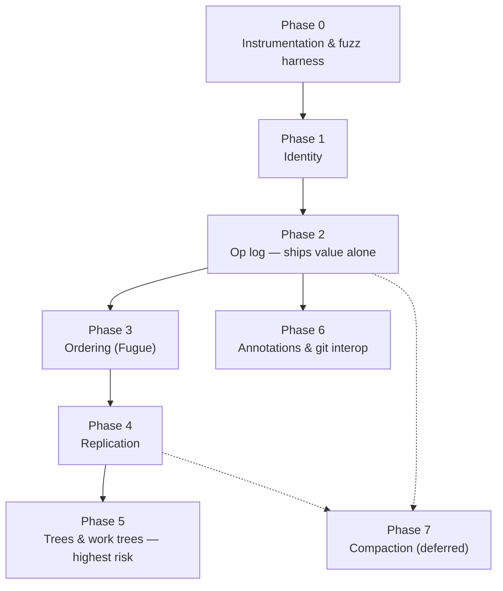
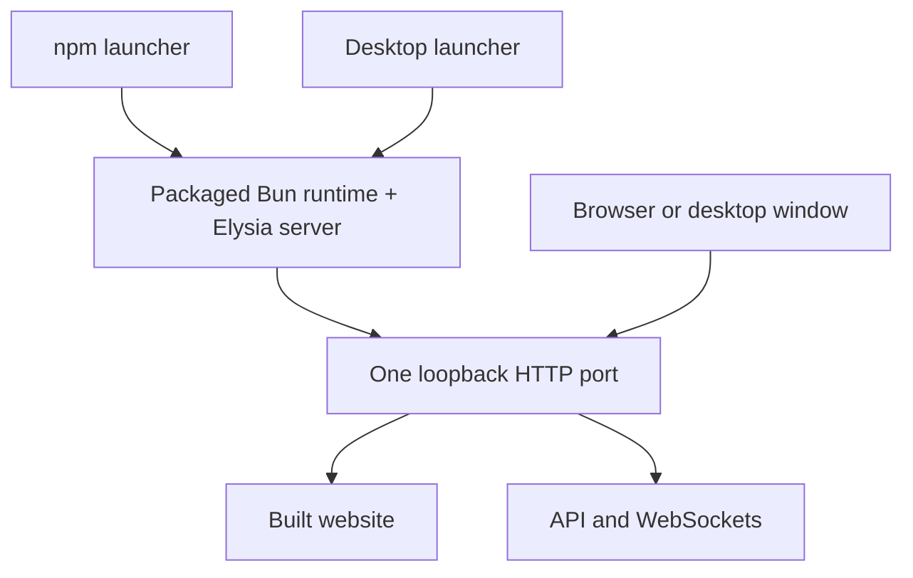

# Async operation ownership

Workspace operations retain their initiating environment, root generation, and source evidence through preparation, confirmation, persistence, and completion. Selecting another machine does not redirect an operation. Changing a workspace root invalidates work that has not committed, including a return to the same path.

This implements Plan 097 on the [document and tab model](document-and-tab-domain.md).

## Transport ownership

Reusable filesystem, Git, settings, logs, chat, picker, search, symbol, and language-server helpers require an explicit client or origin. Socket helpers also require the captured owner's lifetime signal. Query execution supplies its QueryClient's client; retained services supply their runtime's client. Application settings use the primary owner.

[The lint configuration](../.oxlintrc.json) prevents migrated helpers from importing selected-owner fallbacks. Type checks in `transport-contracts.test-d.ts` and `replacement.test-d.ts` cover missing owners and retargeted confirmation.

Terminal link validation captures its navigation intent and client before awaiting stat. A later click supersedes the earlier intent. Picker validation retains its initiating navigation callback and ignores completion after an owner change.

## Computed text changes

[WorkspaceEditService](../apps/web/src/features/editor/state/workspace-edit-service.ts) owns `applyTextChange`. Its managed callback receives `readText(path)` and returns edits against the issued source. The callback enters the preparing slot before its first read. Supersession and cancellation close the reader and settle the operation even if the planner does not finish.

The [shared interface](../apps/web/src/lib/workspace-edits/utils/types.ts), context, and hook expose the existing retained service to search. They do not construct another service or import editor implementation types.

An already-aborted request never invokes its planner. If the planner aborts during invocation, its returned promise remains observed so cancellation cannot leak an unhandled rejection.

An operation keeps its issued sources in a private WeakMap. A source from another operation, a copied source, or a substituted snapshot cannot authorize edits. Repeated reads of a path share the same source. Accepted edits are copied before preview, and duplicate targets are rejected.

Live sources retain their document stamp, buffer snapshot, and path ownership revision. Disk sources retain the version returned with the exact text. Preparation rejects source changes and open/close transitions; the server validates disk preconditions again before commit.

The language-server adapter has a separate request variant. Search does not manufacture LSP server IDs or revisions, and the optional source-version map no longer exists.

## Confirmation and completion

Preview actions require the rendered `operationId`. An older dialog cannot confirm or cancel a newer operation. Repeated confirmation submits one commit.

Origin, affected sources, root generation, and cancellation are checked before commit, including edits that only affect live documents. After disk commit dispatch or the first local mutation, cleanup finishes or compensates on the original owner. UI cancellation does not prove rollback. Undo and redo retain the existing transaction receipts.

Search replacement captures a token with the buffer incarnation, result generation, query, and replacement input. Completion settles its owning buffer, including a parked buffer, but cannot refresh or overwrite a newer search or clear a newer request.

[ConflictEditorResolutionCoordinator](../apps/web/src/features/workspace/state/conflict-editor-resolution.ts) captures the conflict record, resolution snapshot, destination stamp, path ownership history, and root before debounce. It checks them before writing and uses the write acknowledgement to reconcile the destination. A newer destination or conflict remains unresolved. If only the resolution text advances, the coordinator keeps that buffer, advances its remote base from the acknowledged write, and schedules the latest marker-free text after releasing the in-flight marker. A root change prevents that automatic retry.

Conflict writes and creates carry a mutation ID issued by the retained FileSyncService. The workspace event handler recognizes only IDs issued by that runtime. It preserves tree and Git invalidation while leaving document and conflict reconciliation to the acknowledgement. IDs remain recognizable after acknowledgement and editor unmount, so delayed events cannot invalidate a pending retry. Events from other owners remain external.

The server waits for a correlated write to finish before sampling its native watcher notifications. Content hashes on marked targets distinguish duplicate notifications from different external bytes, even when size and modification time match. Failed writes release waiting notifications. An external recreation refreshes the existing conflict for that path, so a deleted-file resolution cannot finish behind a separate conflict record.

Deleted files use exclusive creation. A recreated file cannot be overwritten. The server's create acknowledgement now returns a version bound to the submitted content, matching ordinary writes. This small server change is required for retry correctness: a later stat cannot certify an unrelated writer's bytes as the resolution's base.

[TUI replacement plans](../apps/tui/src/search/state/replacement.ts) privately retain their client, root, signal, and frozen operations. `applyReplacement(plan)` accepts no replacement owner and returns the same submission promise on repeated calls.

## LSP provenance and limits

The linked Editor package captures each lane's synchronized document catalog before code-action and rename requests. Lazy code-action resolution preserves that catalog. Producer and host checks validate the origin and affected known documents, including create/delete targets and both rename endpoints. A resource operation cannot adopt a newer host snapshot to certify an older request. Unrelated document edits do not invalidate the operation.

Two protocol limits remain:

- An unversioned LSP target absent from the request-time catalog has unknown producer revision. Eligible clean targets require preview against a captured host snapshot. Dirty targets without exact evidence are rejected. This proves preview-to-commit consistency, not the producer's original basis.
- Search results carry match locations without an exact disk revision from the original search. Replacement validates those selectors against its captured text and preserves the existing matching behavior.

## Logs and verification

Workspace-edit events carry captured environment/machine identity, root generation, operation ID, source kind, target counts, and stale/cancel outcomes. File read/tree events capture identity before awaiting; queues for separate clients cannot merge identical paths. Conflict resolution emits one completion event for persistence and reconciliation, without file text.

[`scripts/verify-operation-ownership.sh`](../scripts/verify-operation-ownership.sh) runs the focused ownership gates. Tests use real in-process servers, transport gates, actual persisted bytes, retained buffers, and log output. Coverage includes source forgery, cross-operation sources, root A to B to A, delayed confirmation, cancellation, newer UI state, two-server persistence, and the conflict's second successful write. Conflict tests drive the actual filesystem event stream through workspace reconciliation. Server controls cover Parcel and Node watchers, duplicate events, large creations, symlink aliases, unchanged-stat external edits, and failed-write cleanup.

Implementation started from Platform `b94336c2`. Fourteen recorded source hashes had drifted after the document model and layering work; current APIs were reconciled before editing. The Editor checkout's unrelated core and documentation changes were preserved. Existing focused baselines passed. New conflict, LSP, navigation, and create-acknowledgement regressions were observed failing before their fixes.

The initial verification passed the combined ownership gates, including TUI replacement and the linked Editor's 62 provenance cases. The review fixes passed 123 focused tests across the edit engine, conflict/event handling, native watchers, transaction controls, workspace integration, and the search hook. Web and server typechecks, production builds, exact-file formatting and lint, and Knip passed.

The mesh release is `20260912T182004Z-b94336c2-plan097-review-fixes` at [Platform](https://omarchy.mesh.shaulavo.dev/platform). The candidate and live browser checks report no page errors, console errors or warnings, failed HTTP responses, or loopback requests. The orchestration WebSocket receives frames, and the served entry asset matches the release hash. Build logs, focused verification logs, review reproductions, and `deployment.json` are retained in `/work/platform-production/releases/20260912T182004Z-b94336c2-plan097-review-fixes/`.

# Boot and first load

What must be on screen at first frame, how first-load JavaScript is gated, and how a page open across
a deploy keeps loading its lazy chunks. Written by Plan 109 (retired 2026-09-25; its measurements are
in git history).

## What boot is

**Boot is the first usable frame of the last layout the user left.** On screen: the titlebar, the
activity rail, the sidebar pane that was open, the editor group with the active tab's text painted
from the restored snapshot, and chat mode's session rail when chat mode is the saved mode. Panes
the user left closed are empty shells. Everything else may arrive after that frame, as long as it
is prefetched on idle or on a real signal (D4) and has a loader and an error boundary (D5, D7).

| Owner                                                        | Class             | Why                                                                               |
| ------------------------------------------------------------ | ----------------- | --------------------------------------------------------------------------------- |
| `features/workbench`                                         | boot              | The layout itself.                                                                |
| `features/editor`                                            | boot              | The active tab paints at first frame.                                             |
| `features/workspace`                                         | boot              | The file tree is the default sidebar pane.                                        |
| `features/chat-mode`                                         | boot (contested)  | Boot only when chat mode is the saved mode; a mode switch could load it.          |
| `features/chat`                                              | boot (contested)  | The session rail is boot in chat mode; the timeline and composer could follow it. |
| `features/environments`                                      | boot              | The connection gate decides whether anything renders.                             |
| `features/address`                                           | boot              | The URL is the layout's address.                                                  |
| `features/server-update`                                     | boot              | A titlebar item, tiny.                                                            |
| `lib`, `state`, `keymap`, `components`, `hooks`, `providers` | boot              | Shared layers the frame is built from.                                            |
| `features/git`                                               | first interaction | A sidebar pane; boot only when it was the open pane.                              |
| `features/search`                                            | first interaction | Opens from a chord or the rail.                                                   |
| `features/command-palette`                                   | first interaction | Opens from a chord; must answer the first keystroke.                              |
| `features/file-picker`                                       | first interaction | Opens from a chord or a dialog.                                                   |
| `features/terminal`                                          | on demand         | Behind its boundary since Phase 3 (idle prefetch).                                |
| `features/settings`                                          | on demand         | Behind its boundary since Phase 3 (idle prefetch).                                |
| `features/logs`                                              | on demand         | A tool pane opened on purpose.                                                    |
| `features/dev`                                               | on demand         | The `/dev` gallery, a separate entry.                                             |

Contested: `features/chat` and `features/chat-mode` split by the saved mode. Deferring them in
workbench mode is a product call, because a first chord into chat would then wait on a chunk.
"First interaction" rows are candidates only with a prefetch on a signal, never on click (D4).

## Loading boundaries

A boundary is a dynamic `import()` at a point where a feature is absent from the first frame, with
no static import of the same module left (Rolldown reports `[INEFFECTIVE_DYNAMIC_IMPORT]`
otherwise). It is `use()` over a cached import (`lib/retryable-import.ts`), so Retry in the
surrounding `RenderErrorBoundary` asks the network again. It prefetches on idle or on a real
signal, never on click, and a pending boundary renders a real loader. Terminal and settings are
the two boundaries today.

## The first-load gate

`bun run --cwd apps/web bundle:gate` (`apps/web/scripts/bundle-gate.ts`) builds through
`bundle-report.ts` and compares first-load script gzip ([disk]) in total and per owner against
`apps/web/scripts/first-load-pins.json`. The total may grow 1%. Each owner may grow by the larger of
5% or 2 KB; an owner new to first load counts from zero. The failure names every owner that grew.
`--write --reason=…` re-pins and appends the reason to the file's history. It runs in `verify` and
in CI's typecheck job. First pin: 1,607,295 B gz, after Plan 129 Q2 and the evlog dedupe.

Verified: a static import of `features/settings/components/page` in `main.tsx` fails the gate with
`grew: apps/web/src/features/settings 12379 -> 57583` and `packages/contracts 32403 -> 37700`
(total 1,676,329 against a limit of 1,623,368); restoring the file restores the pinned build. The
gate has no `--dir`, so it never reads a stale `bundle-stats.json`.

## Assets across deploys

`carryAssets` in `scripts/deploy/release.ts` hardlinks into each new release the served release's
hashed assets it lacks, up to a week old, so a page loaded before a deploy keeps resolving its lazy
chunks. A hash names one content, so a carried file never shadows a new one.

# Chat And Logs Wiring Notes

## Summary

The workbench sidebar now mounts the existing chat and logs panels as first-class sidebar tabs:

- `apps/web/src/features/workbench/components/sidebar-panel.tsx` renders `ChatSidePanel` for `chat` and `LogsPanel` for `logs`.
- `apps/web/src/features/workbench/utils/workbench-panels.ts` includes `chat` and `logs` in `WorkbenchSidebarTab`.
- `apps/web/src/lib/workspace-cache.ts` accepts `chat` and `logs` in cached workbench panel state.

Alternative placements considered:

- Dedicated right-hand panel: better for persistent agent context beside files, but it adds a new layout surface and panel-state model.
- Bottom tab: cheap to expose, but chat and logs both want vertical reading space and compete with the terminal.
- Sidebar tab MVP: smallest honest mount because both entry components are already panel-shaped and the sidebar/header vocabulary already had chat/logs affordances.

## Mount Requirements

Chat:

- `main.tsx` owns the application runtime, focus, hotkeys, and command bus. `components/active-environment-application.tsx` mounts the selected QueryClient, verifies server identity, and supplies the retained editor runtime and tooltip provider.
- Module state: `useChatProjectionStore` and related chat projection/detail subscription stores under `apps/web/src/features/chat/state/`.
- The environment transport registry owns one closable chat transport per confirmed environment; `useChatTransport` selects the addressed owner.
- Each transport captures its QueryClient owner's origin. Workbench switches preserve the independent connections and projections. The [federation reference](federated-environments.md) records ownership and recovery.
- Backend routes: `orchestrationWsRoutes` and `orchestrationRoutes` registered in `apps/server/src/app.ts`.

Logs:

- The active environment's QueryClient and the outer `FocusProvider` are supplied by the application.
- Queries and live subscriptions retain the HTTP client associated with that QueryClient through `lib/environments/state/query-clients.ts`. An environment switch cannot redirect an in-flight request.
- Query keys and cache invalidation: `logsKeys` from `apps/web/src/lib/query-keys.ts`.
- Backend routes: `_log/dashboard/{summary,events,event,live}` from `apps/server/src/observability/routes.ts`, registered via `observabilityRoutes()` in `apps/server/src/app.ts`.
- Log source: structured JSONL files under `logs/`, configured by the observability variables in `.env.example`.

## Runtime Findings

Browser verification used the already-running dev server at `http://localhost:5173`. The same Vite server was also reachable at `http://[::1]:5173`, but the API allowlist in `.env.example` covers `localhost` and `127.0.0.1`, not the IPv6 origin, so `localhost` is the correct verification origin.

Chat mounted without a browser console error. The first render showed the draft composer while the provider probe was settling; after the probe completed, the panel showed the draft composer, `GPT-5.5`, and `Codex ready`. Local logs showed orchestration WebSocket subscription activity and `chat.pipeline.codex_adapter.snapshot.complete`.

Logs mounted without a browser console error. The panel showed the toolbar, timeline, metrics, and live event list from the existing dashboard routes. In the verification session it read 1,836 events from the current JSONL logs.

No new provider, context, server route, or backend code was required.

## Backend Prerequisites

Chat requires the existing app server to be running with orchestration routes enabled. `apps/server/src/app.ts` registers both the orchestration routes and the default provider registry.

The default provider registry in `apps/server/src/provider/provider-adapter-registry.ts` registers `CodexProviderAdapter` from `apps/server/src/provider/adapters/codex.ts`. A fully usable chat session depends on the local `codex` binary and auth state that adapter probes. There are no Codex-specific variables in `.env.example`; the relevant environment documented there is the local app/server wiring (`VITE_SERVER_URL`, `SERVER_ALLOWED_ORIGINS`) and observability settings.

Logs need the existing `_log/dashboard` routes in `apps/server/src/observability/routes.ts` and the configured JSONL log directory from `.env.example`. No additional logs backend work was found.

## Knip Result

Command: `bunx knip --no-config-hints`

Post-mount result: no files under `apps/web/src/features/chat/` or `apps/web/src/features/logs/` are reported as unused.

Remaining unused-file entries:

- `apps/web/src/features/editor/state/editor-dirty-paths.ts`
- `apps/web/src/features/workbench/components/panel-unavailable.tsx`
- `apps/web/test/fixtures/workbench-file-server/repo/src/editor-tab-a.ts`
- `apps/web/test/fixtures/workbench-file-server/repo/src/editor-tab-b.ts`
- `apps/web/test/fixtures/workbench-file-server/repo/src/editor-tab-c.ts`

Chat/logs-related static-analysis notes:

- `@singapore-editor/diff` is still reported as an unused dependency in `apps/web/package.json`.
- `logsKeys` is still reported as an unused export from `apps/web/src/lib/query-keys.ts`, although the mounted logs files import and use it.

## Recommendation

Finish wiring rather than shelve. The existing panels mount through a small front-end change, the provider and logs routes are already registered, and both panels render against the running app. Next steps should be concrete integration work: decide whether sidebar remains the final placement, add a chat-specific focus area if chat gets pane-scoped keybindings, add cheap smoke coverage for the mounted tabs, and resolve the remaining knip findings separately instead of deleting chat/logs code.

## Verification

- `bun run --filter web typecheck` passed before and after the mount.
- `bun run --filter web lint` passed with existing warnings in `scripts/editor-scroll-benchmark.mjs`, `test/factories/chat.ts`, and `vitest.config.ts`.
- `bun run --filter web test` passed on the clean rerun: 85 files, 446 tests.
- Initial full test run failed two DOM tests by timeout while knip was running in parallel; rerunning the two failed tests alone passed, and the subsequent full run passed.

# Chat fixes and local t3code comparison

Implemented in `/work/projects/platform-chat-parity`, branch `chat-t3code-parity`, from baseline `d4e0c5f9`. The original checkout and running app were left untouched. The comparison covered native provider events, orchestration, child agents, working feedback, transcript grouping and scrolling, the composer, approvals/questions, plans, attachments, Markdown, file navigation, and session recovery.

The captured chat exposed seven child commands without parent-turn ownership, missing child lifecycle feedback, generic labels for 11 of 13 commands, and a reproducible 20px gap. The implementation preserves child identity through native ingestion and projection, exposes an agent inspector, uses the reference command parser, and reduces the gap to 6px. The wider comparison produced the additional fixes below. This report records actual differences and checks, not a percentage-parity score.

## What happened in the last chat

The affected conversation is [the session-diff question from September 12 at 11:46](https://omarchy.mesh.shaulavo.dev/platform/~platform.TtmPUppXzd85vy1E/chat/t/2b3bf54c-030f-42a5-9189-3a9985805b05). Its canonical turn is `turn-37443e90-7cb4-4f4f-86bf-f50b6a45a479`. The parent spawned `/root/explain_diff`, named Locke.

The parent ran six shell commands and one web search. Its two commentary messages plus seven tools explain the nine steps in "Worked for 1m 50s". The child's seven commands entered the projection with `turnId: null`, outside that fold, producing the separate "Ran 7 commands" group. All seven command IDs match the child's native Codex log. Native child start, completion, and interaction events were absent from the chat projection.

The baseline adapter processed child notifications through parent handlers and resolved child turns through a map containing only parent turns. Unsupported subagent items were dropped at ingestion. T3code registers child threads, retains their launching parent turn, intercepts their notifications, and emits child task activity before ordinary parent processing. Its runtime also isolates child status, errors, and token totals.

The baseline command parser rejected compound shell syntax. T3code's actual parser identified an executable for all 13 captured commands. For the four red rows it returned `rg`, `rg`, `nl`, and `rg`. Those labels identify the first meaningful executable, not necessarily the failing stage of a compound command.

| Time, local | Exit code | Actual result                                                                                                        |
| ----------- | --------- | -------------------------------------------------------------------------------------------------------------------- |
| 11:47:32    | 0         | `rg` searched nonexistent `apps/web/src/server`. A later command succeeded, so the shell exited zero.                |
| 11:47:48    | 2         | Searches used nonexistent paths including `packages/client-core/src/navigation*` and `apps/web/src/lib/navigation*`. |
| 11:47:58    | 1         | The final `rg` found no matches. Earlier file reads produced output.                                                 |
| 11:48:14    | 0         | `rg` searched nonexistent `apps/server/src/worktree*`. The pipeline still exited zero.                               |

Both applications inspect output diagnostics as well as exit codes. That explains the two red rows with shell exit zero. The agent selected incorrect paths; a search of current prompt and instruction sources found no template containing those stale paths. The repair makes the command, child owner, exit code, and diagnostic visible. It cannot prevent arbitrary invalid commands chosen by the model.

The 20px gap came from 6px wrapper padding on each adjoining row plus an 8px divider margin. It appeared in both the running app and the replay. The corrected transcript uses row-owned spacing following the reference: 6px after folds, 8px after work groups, and 16px around message boundaries. No larger intermittent virtualization gap was reproduced.

Baseline evidence remains local because it includes private conversation data:

- [Native command correlation](/work/tmp/platform-chat-review/routing-evidence.json)
- [Original command labels compared with t3code](/work/tmp/platform-chat-review/command-comparison.json)
- [Measured source replay](/work/tmp/platform-chat-review/before-replay.json)
- [Running app, collapsed](/work/tmp/platform-chat-review/last-chat-top.png) and [expanded](/work/tmp/platform-chat-review/last-chat-expanded.png)

## Provider and child-agent fixes

The comparison used the local reference's `apps/server/src/provider/Layers/CodexSessionRuntime.ts`, `CodexAdapter.ts`, and generated native schemas. Platform changes live in `apps/server/src/provider/adapters/codex.ts`, `state/codex-child-agents.ts`, adapter utilities, `orchestration/provider-runtime-ingestion.ts`, and `packages/contracts/src/chat-agent.ts`.

| Finding                                                    | Implemented behavior                                                                                                                                                                                                    |
| ---------------------------------------------------------- | ----------------------------------------------------------------------------------------------------------------------------------------------------------------------------------------------------------------------- |
| Missing child registration and ownership                   | Register from native thread/spawn/subagent/collaboration events. Exclude root self-activity. Retain the original canonical parent turn across resume and later metadata.                                                |
| Child traffic reaching parent handlers                     | Route recognized child notifications first. Buffer pre-registration traffic. Explicit unknown native parent IDs remain unattributed instead of adopting whichever parent is active.                                     |
| Commands overwriting child state/history                   | Separate task-state and per-tool activity IDs. Preserve every tool's native command, output, exit code, and canonical item type.                                                                                        |
| Child status/tokens/errors modifying the parent            | Keep running/waiting/idle/interrupted/failed/closed state, usage, settings, model reroutes, and warnings scoped to the child. Do not apply child plans or compaction to the parent. Idle children remain resumable.     |
| Stop only interrupting the parent                          | Start parent and all known live child interrupt requests concurrently. A failed child interrupt cannot prevent the parent signal. Track live children before registration.                                              |
| Approval/question IDs losing ownership                     | Retain original native RPC IDs and correlate canonical UI request IDs for opening, replying, and resolving. Preserve child identity and parent-turn ownership.                                                          |
| UI question answers violating the native schema            | Convert strings and arrays to native `{ answers: string[] }` values. Validate before removing the pending request.                                                                                                      |
| Native status and verdicts flattened                       | Read the status discriminant and retain failed/declined tool outcomes.                                                                                                                                                  |
| Duplicate or missing turn completion                       | Guard duplicate completion from racing native responses. Emit a terminal event for interrupted turns. Keep canonical mappings needed by late events.                                                                    |
| Late old completion taking ownership of a new pending turn | Check native turn ownership in the shared attachment path. A known native ID cannot claim another canonical turn. A combined correction, Stop, next-turn, and duplicate-completion test reproduces and guards the race. |
| Completed assistant item overtaking its text delta         | Handle dedicated native notifications before awaiting the manual fallback. Preserve wire order and avoid duplicating final text. Streaming, buffered, and final-item-only delivery retain their intended behavior.      |
| Pre-registration output retained without bounds            | Cap pending storage at 128 threads, 512 events, and 2 MiB serialized data. Drop oversized events; evict oldest pending thread batches under pressure. Registered history and live Stop targets survive.                 |
| Routing failures hard to diagnose                          | Enrich existing wide message/operation logs with native and canonical turn IDs, child scope, routing outcome, pending counters/drops, and interruption targets.                                                         |

Unmatched `serverRequest/resolved` acknowledgements do not invent UI resolutions. A response already emitted its canonical resolution before removing the pending mapping. An unknown native ID has no safe canonical request to resolve. Unknown notification methods still reach the ordinary fallback and existing message log.

The removed untyped `textElements` passthrough had no typed API or callers. Text inputs now send the protocol-required empty text-elements list. No compatibility shim was added.

## Working feedback, history, and scrolling

The reference sources were `packages/client-runtime/src/work-log/commandLabel.ts`, `presentation.ts`, and `apps/web/src/components/chat/MessagesTimeline.tsx` and `MessagesTimeline.logic.ts`. Platform changes live under `apps/web/src/features/chat`.

| Finding                                                   | Implemented behavior                                                                                                                                                                                              |
| --------------------------------------------------------- | ----------------------------------------------------------------------------------------------------------------------------------------------------------------------------------------------------------------- |
| Child work absent from working feedback                   | Keep an agent summary visible after its launching parent turn completes. Remove child tools from the parent work log. A nonmodal inspector shows identity, status, elapsed time, tokens, and expandable commands. |
| Virtualization losing inspector state                     | Keep selection and expansion outside virtual rows. Clicking the transcript does not dismiss the inspector. Narrow windows contain the panel within the viewport.                                                  |
| Old projected tool rows resurrecting a completed child    | Select the current snapshot by `agent.updatedAt`, then revision for timestamp ties. Preserve tool placement separately. A provider restart may reset revisions, so revision alone cannot determine freshness.     |
| Early approvals separated from their eventual child group | Correlate only by later explicit ownership of the same native child thread. Do not infer ownership from the currently active parent. Stored history remains unchanged.                                            |
| Generic compound-command labels                           | Port t3code's parser and 317-case corpus with its MIT notice. Show the executable in live feedback and full commands in history. All 13 captured labels now match the reference.                                  |
| Failures obscuring what actually happened                 | Show exact exit code and diagnostic alongside retained stdout/stderr. Inspect raw output before truncation. Suppress synthetic command echoes before diagnostic matching.                                         |
| A no-match search presented as an unexplained failure     | Recognize a single static `rg`/`grep` exiting 1 without diagnostics as no matches. Preserve exact outcomes for compound commands without guessing which stage failed.                                             |
| Accumulated spacing around completion                     | Remove divider margins and generic row padding. Use the reference's row-specific spacing and matching collapsed estimates.                                                                                        |
| Completed folds flattening large tool histories           | Keep nested expandable groups bounded to half the viewport, up to 18rem. Follow new calls rather than every output update.                                                                                        |
| Reopening a group jumps to a different command            | Save command ID and local offset instead of only scrollTop. Output-only drawers retain horizontal and vertical pixel offsets.                                                                                     |
| Context compaction folded inconsistently                  | Keep a lone compaction visible; let compaction join an existing work fold, including after the final answer.                                                                                                      |
| Same-turn correction resets the working timer             | Place feedback after the latest user correction, but measure from the first user message of that canonical turn.                                                                                                  |

Browser checks falsified the broader suspicion that growing output always breaks reading position. While a group stayed mounted, native browser anchoring retained the visible command. Closing and reopening reproduced the defect: command 17 became command 8. The corrected restoration keeps command 17 within 0.5px without adding another live scroll controller.

The inspector floats at the right edge. It does not add t3code's docked workbench agent control system.

## Composer, requests, plans, and Markdown

The comparison checked t3code's `ChatView.tsx`, `chat/ChatComposer.tsx`, `ComposerPrimaryActions.tsx`, `composerSubmission.ts`, `composerPromptHistory.ts`, `composerDraftStore.ts`, server decider, `ChatMarkdown.tsx`, `markdownImages.ts`, and `codexMarkdownDirectives.ts`.

| Finding                                                        | Implemented behavior                                                                                                                                                                                                                  |
| -------------------------------------------------------------- | ------------------------------------------------------------------------------------------------------------------------------------------------------------------------------------------------------------------------------------- |
| No follow-up while an agent runs                               | Add `session.turn.steer` targeting the active canonical turn and native Codex `turn/steer` with `expectedTurnId`. Send correction and Stop are separate controls. No second parent run starts.                                        |
| A rejected correction could lose the draft or obscure delivery | Command rejection retains the editor and draft. A correction accepted into history whose provider delivery fails displays "Correction was not delivered" while the original turn continues. Duplicate command receipts do not resend. |
| Plan actions bypass composer availability                      | Share connection, worktree, pending-request, dispatch, and image-preparation gates. Show control loaders.                                                                                                                             |
| Plan validation accepts arbitrary or superseded IDs            | Require the newest actual plan row, matching requested ID, same project, and unimplemented state. Check before attachment preparation and again at serialized commit. Client selection uses the same timestamp/ID ordering.           |
| Concurrent image drops exceed the limit                        | Serialize preparation batches and apply an atomic live-draft limit of eight images.                                                                                                                                                   |
| Send runs before image preparation finishes                    | Publish preparation immediately through shared per-draft state. Block Send and plan actions until all batches finish. Preserve the destination across session switches.                                                               |
| Draft-save errors invisible                                    | Display persistence failures and avoid promising that a failed save succeeded.                                                                                                                                                        |
| Unsent image lifetime                                          | Images remain memory-only; base64 stays out of localStorage. The review follow-up removes the permanent composer instruction to keep routine attachment staging compact.                                                              |
| Approval/question UI stuck after an accepted response          | Schedule session projection recovery and correlate failures with the current command. Failed replies remain retryable.                                                                                                                |
| Prompt limit checked after optimistic submission               | Validate the complete serialized provider input against Platform's existing limit before dispatch; retain the draft with an explanation.                                                                                              |
| Prompt history recall missing                                  | Use real session user messages for ArrowUp/ArrowDown recall with empty-draft, menu, and caret guards. Strip terminal context.                                                                                                         |
| Local Markdown images fail to load                             | Resolve within the session workspace and use the existing filesystem blob route and lightbox. Retain remote images and show missing-image fallback.                                                                                   |
| Worktree file links use the selected editor root               | Provide the session's canonical root and API path through a narrow context. Validate a reference's relative suffix and map it under that API path for file navigation and image loading.                                              |
| Markdown processor cache keeps the previous workspace          | Pass explicit plugin options so Streamdown's cached processor distinguishes workspace and environment origin.                                                                                                                         |
| Workspace images fail native browser authentication            | Use anonymous CORS for workspace blob requests so the browser supplies Origin. Remote images without CORS headers still work, including in the lightbox. Unknown image size is omitted.                                               |
| Codex file directives render as raw text                       | Convert supported citations using Markdown AST source ranges, including `line_range_start`. Preserve escaped directives and directives inside code, links, images, HTML, and definitions.                                             |

Native steering deliberately differs from the reference's queued `turn/start` architecture. Busy non-Codex sends remain unavailable with an explanation; the adapter API does not pretend those providers support steering. Stale or unsupported requests are rejected before history changes.

The final combined protocol check found a stopped turn's delayed completion could claim the next pending turn before its native start arrived. The native-ID history guard now lives in the shared attachment path. The test sends duplicate old completions before and after the next start, verifies both turns' steering IDs and child/parent Stop targets, and confirms only one interrupted completion per canonical turn. The external process fixture now issues unique native IDs for successive turns; reusing the same ID had hidden this failure.

The managed-worktree check reproduced two independent mistakes: file references used the selected base editor workspace, and Streamdown reused the first image plugin closure. The fix carries the actual chat workspace and explicit plugin options. A real in-process file route test verifies a managed-worktree citation and PNG while the editor remains at the base workspace.

## Existing behavior checked and preserved

Model and effort choices, project defaults, per-session provider identity, runtime mode, and plan/build mode reach their existing commands. Image MIME validation/compression, file mentions, slash and skill menus, IME Enter protection, Shift+Enter, terminal capture, stash, scoped text drafts, and failed-send recovery remain reachable.

The transcript already supports GFM, math, Mermaid, highlighted code, file links, external link previews/context menus, Markdown selection copying, collapsed user messages, plan copy/download/expand, changed-file trees, and checkpoint diff/revert. Revert confirms and refuses while busy. Earlier history has loading/retry states; missing sessions have a separate state. Session detail recovery and connection feedback are wired. Earlier parity reports claiming these were absent are historical, not evidence of current gaps.

## Fresh review corrections

A subsequent review of `d4e0c5f9..bb8bf4fe` reproduced six defects that the earlier checks missed. The earlier clean-review checkpoint does not apply to these paths. All six are corrected in the same integration worktree; the failing reproductions remain in [the review report](/work/tmp/platform-chat-parity/review-findings.md).

| Reproduced defect                                                                                                                          | Correction                                                                                                                                                                                        | Evidence                                                                                                |
| ------------------------------------------------------------------------------------------------------------------------------------------ | ------------------------------------------------------------------------------------------------------------------------------------------------------------------------------------------------- | ------------------------------------------------------------------------------------------------------- |
| Stop waited behind a pending provider correction acknowledgement.                                                                          | Track steering as an independent provider action, preserving error handling and drain behavior while the serialized command worker handles Stop immediately.                                      | `bae9d924`; same-session and other-session Stop checks.                                                 |
| A delayed old child completion/error cleared the current child turn and its Stop target.                                                   | Retain the latest native child turn ID after completion; apply status changes only to that turn. Historical tool events do not replace its current summary.                                       | `bae9d924`; old completion/error and duplicate-start cases.                                             |
| Child tool completion without final output discarded previously streamed output.                                                           | Preserve streamed detail when the final item omits it; honor explicit final strings, including an empty string.                                                                                   | `bae9d924`; command and file-change output cases.                                                       |
| An accepted correction reset model, effort, runtime mode, and interaction mode even though those choices belong to the next ordinary turn. | Consume prompt and attachment content separately from next-turn choices. Ordinary sends still clear the complete draft.                                                                           | `539d1cae`; rejection, accepted retry, next-turn dispatch, and final cleanup through the real ChatView. |
| Copying rendered Markdown lost images wrapped in the lightbox Button.                                                                      | Serialize and unwrap the marked image wrapper before excluding ordinary controls. Preserve plain Markdown and rich HTML images, including empty alt text.                                         | `539d1cae`; exact copied Markdown and sanitized HTML assertions.                                        |
| A no-match search was classified as neutral but still displayed a red failure.                                                             | Use that verdict in both lifecycle selection and work-log tone. Native `failed` status no longer overrides a confirmed no-match result. Diagnostic and compound-command failures remain failures. | `82f8c2dd`; real ActivityRow rendering and command-classification controls.                             |

The runtime additions failed before the changes and then passed with the complete focused runtime set: [55 checks across three files](/work/tmp/platform-chat-parity/fix-runtime-after.log). The composer and clipboard additions also failed first, then passed with [34 checks across four files](/work/tmp/platform-chat-parity/fix-composer-after.log). No-match verification passed [40 logic checks](/work/tmp/platform-chat-parity/fix-no-match-logic.log) and [nine component checks](/work/tmp/platform-chat-parity/fix-no-match-dom.log). These counts describe separate runs, not a unique-test total.

Independent review of these fixes caught one further regression: an idle child could retain the transient **Retrying child** summary because the new guard excluded legitimate late tool completions from the same successful turn. Commit `12f50f37` allows those idle updates while preserving the native-turn ownership check and failed/interrupted/closed summaries. Explicit final-summary assertions failed in all three native projection modes before the fix; [58 focused runtime checks now pass](/work/tmp/platform-chat-parity/fix-runtime-summary-after.log).

The integrated [native snapshot](/work/tmp/platform-chat-parity/fix-native-session.json) was regenerated through all three delivery modes after that correction. The [rerun browser proof](/work/tmp/platform-chat-parity/fix-browser/proof.json) confirms the final idle summary is `pwd`, both native commands survive, and the retry warning is absent. The existing child inspector, narrow layout, and real filesystem image checks also pass with no page errors. [Final native-agent screenshot](/work/tmp/platform-chat-parity/fix-browser/native-agent-projection.png).

## Connection errors and the shaul-mac notice

The running server's September 12 log lives in `/work/platform-production/logs`. At 09:13:21 UTC, `machines.ssh.connect` reached `shaul-mac` but failed the Platform installation probe. The client event at 09:13:23 UTC contains the expanded diagnostic with duplicated installation instructions. The generic opening sentence made this sound like an unreachable SSH host, although the underlying failure was missing server setup.

The UI problem was independent of that connection failure: `MachineConnectionRows` rendered every saved machine's complete error in the chat rail, regardless of the selected environment, with no dismissal. Settings already owned the machine's status and recovery controls.

The local t3code reference keeps saved connection errors in the affected settings row: `references/t3code/apps/web/src/components/settings/ConnectionsSettings.tsx`, particularly `SavedBackendListRow`. Its `ConnectionStatusDot.tsx` and `cloud/cloudEnvironmentConnectionPresentation.ts` also keep routine status compact. Platform now follows that contextual placement; its new X and Details controls are Platform-specific additions.

Commit `14040e75` makes the chat notice a compact row with the machine name, short status, Details, Retry/Connect, and an accessible X. This specific failure reads **Server setup needed**. The full diagnostic is available in an opaque Details popover. Settings → Machines keeps the error discoverable even when it is dismissed from chat.

Only a machine owning the selected environment appears in the chat rail. The primary server may still show a notice because it owns machine management and SSH forwarding. Dismissal belongs to the existing connection owner in memory. The same error, a new timestamp, automatic pending transitions, and component remounts do not reopen it. A different error appears; recovery, explicit Retry, disconnect, or a configuration change clears dismissal for the next incident. No new setting or browser-storage key was added.

[Seven focused component checks](/work/tmp/platform-chat-parity/fix-machines-tests.log) cover notice scope, Settings discovery, Details, X, repeat/remount behavior, real retry dispatch against an injected external HTTP boundary, and in-process connection loss/recovery. No connection or installation was attempted on the real `shaul-mac`; its underlying setup remains unchanged.

## Verification and reproducible evidence

The focused checks targeted plausible failures in changed paths. Counts below describe separate runs with overlapping coverage; they are not a unique-test total.

| Check                                                                               | Result and evidence                                                                                                                                                                                                                                                                                                                                          |
| ----------------------------------------------------------------------------------- | ------------------------------------------------------------------------------------------------------------------------------------------------------------------------------------------------------------------------------------------------------------------------------------------------------------------------------------------------------------ |
| Reference parser and presentation logic                                             | 399 tests passed, including all 317 reference parser cases. Follow-up diagnostic checks passed 22 cases.                                                                                                                                                                                                                                                     |
| Presentation components and scrolling                                               | 28 DOM cases passed; reopening/output restoration follow-up passed 10.                                                                                                                                                                                                                                                                                       |
| Integrated provider, ingestion, steering, and plan checks                           | 75 cases across five files passed. [Saved log](/work/tmp/platform-chat-parity/integration-runtime-tests.log).                                                                                                                                                                                                                                                |
| Final bounded child-buffer integration                                              | Eight cases passed after the final runtime commit. [Saved log](/work/tmp/platform-chat-parity/integration-buffer-tests.log).                                                                                                                                                                                                                                 |
| Integrated agent/timeline/work-log/composer logic                                   | 52 cases across four files passed. This supersedes earlier 41/46-case checkpoints. [Saved log](/work/tmp/platform-chat-parity/integration-timeline-tests.log).                                                                                                                                                                                               |
| Integrated Markdown, composer, request, plan, preparation, and scrolling DOM checks | 59 cases across eight files passed. [Saved log](/work/tmp/platform-chat-parity/integration-dom-tests.log).                                                                                                                                                                                                                                                   |
| Managed-worktree follow-up                                                          | 23 focused cases passed, including the real file route, Markdown cache, and retained-draft retry.                                                                                                                                                                                                                                                            |
| Native adapter through real projection                                              | Exact final text, idle child snapshot, both command results, scoped requests, and canonical ownership verified. [Generated session](/work/tmp/platform-chat-parity/native-session.json).                                                                                                                                                                     |
| Browser replay                                                                      | 6px divider gap at 1100px and 420px, no horizontal overflow, retained command reading position, and no page errors. [Presentation measurements](/work/tmp/platform-chat-parity/presentation-browser-check.json), [captured-chat measurements](/work/tmp/platform-chat-parity/presentation-replay.json).                                                      |
| Final integrated browser proof                                                      | Live-to-idle agent details survive; clicking the parent leaves inspection open; panel fits 390×844. Native projected child shows two commands and no orphan parent work group. Real local PNG returns 200, matches all 68 bytes, and decodes; missing fallback and local/remote lightboxes work. [Proof](/work/tmp/platform-chat-parity/browser/proof.json). |
| Final correction/Stop/late-completion sequence                                      | All 35 adapter cases passed after the fix; the focused combined case also passed in the integration worktree. [Saved integration log](/work/tmp/platform-chat-parity/integration-steer-stop-tests.log).                                                                                                                                                      |
| Static checks                                                                       | Changed-file formatting/lint and required workspace typechecks passed through commit hooks.                                                                                                                                                                                                                                                                  |

The final browser script bundles actual worktree source and the existing app test-provider stack, then intercepts its proof bundle under the already-running app origin. It does not start a server. Only the remote external image is fulfilled as a network fixture; local image bytes come from the real running filesystem route.

Generate the native snapshot from `apps/server`:

```sh
PLATFORM_CHAT_PARITY_SNAPSHOT=/work/tmp/platform-chat-parity/native-session.json bun --bun vitest run src/provider/adapters/tests/codex.test.ts -t 'projects a native Codex child session'
```

This runs the actual Codex adapter, ingestion, production decider, SQLite event store, projection, and session query. Only the external Codex JSON-RPC process is injected. The test covers streaming, buffered, and final-item-only output; the generated reply is exactly `Hello from app-server`.

Run the browser proof from `apps/web`:

```sh
PLAYWRIGHT_BROWSERS_PATH=/work/cache/ms-playwright \
CHAT_PROOF_URL=https://omarchy.mesh.shaulavo.dev \
CHAT_PROOF_SERVER=https://omarchy.mesh.shaulavo.dev/platform-api \
CHAT_PROOF_NATIVE_SNAPSHOT=/work/tmp/platform-chat-parity/native-session.json \
CHAT_PROOF_SNAPSHOT=/work/tmp/platform-chat-review/session.json \
node scripts/chat-parity-proof.mjs
```

The optional captured-session input contains private local history and is not committed. This machine's proof uses the configured filesystem root `/`, root-relative API paths, and an approved browser Origin. The production mapping uses the session's explicit canonical/API root pair rather than assuming that root.

Inspect [the native projected agent](/work/tmp/platform-chat-parity/browser/native-agent-projection.png), [the narrow inspector](/work/tmp/platform-chat-parity/browser/agents-narrow.png), and [the original session after presentation repairs](/work/tmp/platform-chat-parity/browser/last-chat-replay.png).

The connection-notice and fresh-review browser check bundles the actual components and connection owner under the same running app origin. Its synthetic remote machine and image are external network fixtures. The check confirms a 34px notice at both desktop and 390px width, Details, dismissal across repeated and pending updates, a newly visible changed failure, neutral no-match rendering, and exact plain/rich image copying, with no page errors. Browser Retry coverage is control availability and dismissal reset; the component test above proves the real request. [Proof](/work/tmp/platform-chat-parity/review-fix-browser/proof.json), [compact notice](/work/tmp/platform-chat-parity/review-fix-browser/compact-notice.png), [Details](/work/tmp/platform-chat-parity/review-fix-browser/notice-details.png), [narrow notice](/work/tmp/platform-chat-parity/review-fix-browser/narrow-notice.png).

Run this additional browser check from `apps/web`:

```sh
PLAYWRIGHT_BROWSERS_PATH=/work/cache/ms-playwright \
CHAT_PROOF_URL=https://omarchy.mesh.shaulavo.dev \
CHAT_PROOF_SERVER=https://omarchy.mesh.shaulavo.dev/platform-api \
node scripts/chat-review-proof.mjs
```

## CI review and baseline repairs

PR #24 initially stopped at Format, so that CI run supplied no lint, typecheck, or unit-test evidence. The user's clean-worktree review confirmed those static checks separately and found one new density browser failure. The user then explicitly expanded the repair to unrelated failures already present on main. The earlier focused-check results above remain historical evidence; they do not establish that the original whole-repository gates passed.

The formatter failure came from `oxfmt` 0.64.0 producing output that changed on a second formatting pass. Both repository-root and web-directory checks rejected the first output; `oxlint --fix` was not responsible. The call is now formatted, and the pre-commit hook verifies final staged formatting after its mutating jobs. [Reproduction and controls](/work/tmp/platform-chat-parity/ci-format-review.md).

The density assertion walked two DOM ancestors and landed on a newly introduced unpadded row. The attachment strip now has an accessible **Image attachments** group, which the test selects directly. The permanent unsent-image instruction and its redundant wrapper were removed. The existing density suite passed all five browser cases after reproducing the reported failure. Images still remain memory-only.

The broader repair found several application defects:

- Provider history import treated omitted `enabled` as disabled, contrary to the registry's default-on contract. It now excludes only explicit `false`; the test covers all three configurations.
- A draft opened from a missing checkout correctly fell back to the available project root for the editor, but incorrectly adopted that root as its execution target. Navigation now carries the requested draft identity separately from the root opened by the editor.
- A new file-tree reveal targeting an already-visible row left the previous smooth reveal running. The tree now cancels that older scroll request.
- Theme previews could cache incomplete syntax colors when Shiki's default tokenization time budget expired under load. The fixed nine-line preview disables that budget, with a failing-before/passing-after clock-boundary regression.
- New clangd token names lacked presentation policy: `label` now uses the existing cross-server label policy, and `bracket` explicitly falls back to grammar coloring. Conformance tests compare exact recorded legends and use the application's bundled TypeScript runtime, including its initialization options. The existing absent-server skips were retained; no new skip was added.
- The linked Editor started with a zero-sized viewport and deferred its first text rows to a later animation frame. [Editor PR #14](https://github.com/ShaulLavo/singapor/pull/14) measures the initial viewport before ready/prepared document installation. Platform CI pins its published commit `6244aca93381bf02e0124e9467415cc9ec04d01c`; the shared local Editor checkout was not changed. Existing first-frame and duplicate-work assertions were retained.
- Recovery read persisted events in pages but committed every event separately. Catch-up now commits a page in one transaction, with event/cursor writes still atomic. A real SQLite failure in the second page verifies rollback and retry without discarding the first committed page. On the same `/work/tmp` fixture, replaying 1,105 events fell from 13,502 ms to 278 ms. [Measurements and crash checks](/work/tmp/platform-chat-parity/ci-recovery-findings.md).

Other failures came from stale test setup and inventories: native-provider protocol fields, code-theme settings widgets, TUI synchronization, settings search/scope leakage, selection of duplicate palette text, retained query clients bound to disposed test servers, and fixtures that supplied a workspace different from the one owned by application navigation. The fixes use actual application, navigation, settings, transport, and workspace owners. Editor DOM tests supply viewport measurements at the DOM boundary; the late-theme-load test delays external theme modules while running the real internal registration code. Recovery checks stop the old application before appending simulated crash records and import real adapter history through the current explicit import flow. No failing assertion was skipped to make these checks pass.

Independent review reopened the draft correction: changing the rail after opening a missing-checkout draft reset its target to the fallback root. Same-root panel navigation now preserves the current scoped draft, while explicit draft/workspace navigation chooses the requested checkout. All 92 address and session checks pass, including the failing-before panel mutation. Review also caught a new-origin test cleanup leak; the real-module proof now confirms both the direct client and retained query owner are restored.

The first upstream Editor revision inferred an unmeasured viewport from zero width and overwrote explicitly supplied geometry in DOM tests. Its correction uses the virtualizer's existing measurement flag. The complete core suite passed 2,585 tests, and both upstream GitHub checks passed at `6244aca`. [Upstream correction evidence](/work/tmp/platform-chat-parity/ci-editor-core-findings.md).

Main advanced to `f1fcf3b3` during verification, bringing the document/tab domain and layering refactor. Merge `0b88ec84` preserves that model and these chat changes; the related owner/navigation checks passed after resolving the conflicts. Workspace-edit assertions now use typed document keys and file resources, including absence checks that would otherwise silently pass with obsolete path keys. All 15 workspace-edit cases pass. The merged gate also exposed a hardcoded `/work/tmp` assumption. Provider temporary work and affected fixtures now use the configured OS temporary directory; local verification sets `TMPDIR=/work/tmp`. No server installation or drive mutation is required on GitHub runners.

Main then advanced to `61452ebb`, adding the unused-code gate and final cache/layering cleanup. The second merge keeps those changes; its engine conflict only reconciles imports and preserves source-plan validation and page transactions. Knip now recognizes the standalone verification scripts and their injected fixture, and an uncalled turn-ID parser was removed. Post-merge checks passed all 19 cache tests, eight script tests, six recovery tests, and 13 plan/steering tests.

The remaining native tree race was a queued compositor step after cancellation, not density: the row and model heights both remained 20px. The existing focus hook now corrects that late event once, unless a newer request, user input, or changed row identity invalidates it. Independent review caught the first version retaining a stale row index; reorder, removal, and missing-row regressions now pass. The related GitHub command-bus failure came from a fixture supplying `activeTabContent` while the new command policy reads `activeDocument`. Its original claim/rejection/focus assertions remain intact. [Scroll evidence](/work/tmp/platform-chat-parity/ci-browser-tree-settlement-findings.md), [identity correction](/work/tmp/platform-chat-parity/ci-browser-tree-identity-findings.md).

Two TUI send checks now await actual session creation and provider completion before asserting the started turn. Notice tests bind a real in-process remote client for settings and inject only the failed HTTP boundary for Retry, eliminating their stray network requests. The Linux PTY failure reproduced on one CPU: Bun queues descriptor closure on its native worker pool after disposal returns. The tests now poll exact descriptor equality, preserving exit, signal, output, and natural/disposed lifecycle assertions. [PTY reproduction and source evidence](/work/tmp/platform-chat-parity/ci-pty-cleanup-findings.md).

Detailed baseline and focused evidence is preserved in the [unit repair report](/work/tmp/platform-chat-parity/ci-unit-findings.md), [browser repair report](/work/tmp/platform-chat-parity/ci-browser-findings.md), [UI fixture report](/work/tmp/platform-chat-parity/ci-navigation-ui-findings.md), and [language-server report](/work/tmp/platform-chat-parity/ci-lsp-findings.md). The first integrated browser rerun passed 47 of 48 web checks and all 14 tree checks, exposing a remaining app tree-scroll failure; that result is an intermediate checkpoint, not the final gate verdict. The first full unit run passed the server and packages but exposed two additional assertions ahead of file loading and remote projection; those now wait for the actual result without changing their expectations.

The integrated full unit run after merging main passed 5,720 tests across 762 files, with seven existing optional-environment skips. Subsequent focused checks cover the final tree identity, TUI completion, notice-client, and PTY changes. The final complete browser reruns passed all 48 web checks and all 20 tree checks, using the isolated built Editor revision pinned by CI without changing shared Bun links. Final workspace lint, typechecks, formatting, generated-file checks, and the development graph check passed locally. An independent review of the final source and evidence found no remaining defect in the changed paths; GitHub verification of the published head remains the final gate. GitHub's result for the current PR head is available in [PR #24 checks](https://github.com/ShaulLavo/platform/pull/24/checks); earlier failed or cancelled runs remain historical evidence.

The first published run after the baseline repairs, at `e5879950`, passed every static gate plus all 48 web and 20 tree browser tests. Its unit job exposed three remaining fixture defects: the isolated-provider assertion still hardcoded `/work/tmp`; the terminal selection assertion ran before renderer input consumption; and the theme race test mocked a dependency through an undeclared web-package link. The provider assertion now verifies the configured temporary directory and isolated basename, with a custom-directory failing-before control and all 19 file tests passing. Terminal selection waits for the original selected text before sending it to the durable inbox. The theme test resolves and delays the external theme modules from their actual client-core owner; an isolated clean dependency layout reproduces the old failure. These are corrections to the earlier local-green conclusion, not skipped assertions.

The same CI log revealed two errors in passing tests. The observability fixture now keeps its PostHog HTTP recorder installed until app shutdown and logger reset have flushed their events. The DOM environment no longer advertises transferable offscreen canvases: a real happy-dom canvas fails Bun's transfer boundary with `DataCloneError`. A real Editor/minimap regression proves the unsupported worker path is avoided while editor text remains usable. Observability passed all 12 checks; the minimap control and the two previously noisy web files passed all 17 checks; explicit offscreen-canvas image-compression fixtures passed all 19 checks. The real-browser environment is separate.

## Scope and remaining differences

No paid/live Codex prompt was submitted. Deterministic protocol checks and the real running filesystem route supply the execution evidence. The original app has not been switched to this branch.

The stored old chat still has its original missing child IDs. Its replay proves presentation repairs; the new native adapter-to-projection artifact proves correct attribution for newly ingested events. No migration or healing code rewrites buggy dev history.

T3code still has product capabilities outside these repairs: arbitrary file uploads, per-question attachments, browser/review annotations, artifact-template cards, general app/MCP elicitation forms, and docked side-agent controls. Platform's unsent images remain memory-only. These differences prevent a claim of complete t3code feature equivalence.

The reference's opportunistic `thread/read` metadata lookup was not copied. Native thread/spawn/settings/reroute metadata is retained; a child without nickname/model metadata uses known path/role or an Agent fallback.

Pending notification bodies are bounded. The separate native live-turn registry deliberately retains potentially running targets until terminal or closed events arrive, so Stop can still reach unregistered children. A malformed provider stream that starts unlimited turns without terminating them can still grow that registry and Stop fan-out. This is a remaining low-severity resilience limit.

The initial independent review used `gpt-5.6-sol`. It found snapshot-version ordering, native text duplication, late completion ownership, stale plan validation, citation escaping, workspace/cache boundaries, and unbounded pending payloads; each has a focused reproduction and an implemented correction. The fresh review above then found six additional defects and reopened the earlier clean-review conclusion. The append-only [decision trail](chat-t3code-decisions.tsv) records both rounds, their corrections, and verification checkpoints.

The final independent `gpt-5.6-sol` pass reviewed the six fixes, connection-notice lifecycle, additional idle-summary correction, generated artifacts, browser scripts, report, and decision trail against the working transcript. It found no remaining defects in those changed paths. Commit `0ae3cea5` passed formatting, lint, and all workspace typechecks. This conclusion is bounded by the execution and resilience limits above.

> [!IMPORTANT]
> Historical parity backlog. The current selection policy below was implemented on 2026-09-09. The older baseline and proposals record the original comparison, not a list of remaining work.

# Command Palette VS Code Parity Backlog

## Current command and settings policy

Settings own saved preferences. The command palette offers actions, navigation, and quick pickers for common choices. Both entry points write through the same settings actions.

- **Light / dark mode**, **App colors**, and per-mode **Code theme** choices appear in Settings. Each has a command palette picker with preview and cancellation.
- Code themes share one native and imported theme catalog. The picker offers themes for the current light or dark mode. The registry stores each mode's choice separately.
- Basic cursor movement, single-character deletion, and transient input handlers remain configurable as shortcuts but do not appear in the palette.
- Palette visibility follows the invocation's context. An editor action requires an editor target; a relevant but unavailable action can remain disabled with a reason.
- The palette exposes one **Go to definition** and one **Focus editor** action. Numbered editor-group shortcuts do not imply additional groups in the palette.
- **Run project script**, **Switch session**, and **Go to line** open the existing pickers. **New file** and **New folder** use the Files pane's creation flow.
- **Open font settings** and **Open transparency settings** open Settings filtered to the relevant controls.
- The TUI's App colors picker uses the same setting. Its unsupported code-theme command is absent.

The focused checks live in `apps/web/src/features/command-palette/tests/`, `apps/web/src/keymap/tests/palette-visibility.test.tsx`, and `apps/web/src/features/settings/tests/code-theme.test.tsx`.

This tracks the gap between the first command palette pass and VS Code's Quick Access / Command Palette model. The reference points are:

- `references/vscode/src/vs/platform/quickinput/common/quickAccess.ts`
- `references/vscode/src/vs/platform/quickinput/browser/quickAccess.ts`
- `references/vscode/src/vs/platform/quickinput/browser/commandsQuickAccess.ts`
- `references/vscode/src/vs/workbench/contrib/quickaccess/browser/commandsQuickAccess.ts`
- `references/vscode/src/vs/workbench/browser/actions/quickAccessActions.ts`

## Original baseline

- Opens default Quick Access with `Mod+P`.
- Opens command mode with `Mod+Shift+P` and `F1`, prefilling `>`.
- Switches to command mode when the user types `>`.
- Default Quick Access shows loaded workspace files plus quick actions.
- Uses the shared command registry as the item source.
- Shows workspace and editor commands with default shortcuts.
- Runs workspace commands through the app command dispatcher.
- Runs editor commands through the active editor controller when an editor is mounted.
- Uses the shadcn `Command` pattern over `cmdk` for filtering, keyboard movement, empty state, and grouped results.

## Provider Architecture

- Add a Quick Access provider registry with prefixes instead of a single command-only picker.
- Support VS Code-style modes:
  - empty / file picker mode
  - `>` command mode
  - `?` help mode
  - view, symbol, line, terminal, and future extension-defined modes
- Preserve and rewrite typed text when switching providers by prefix.
- Add provider-specific placeholders and context flags.
- Add a `show(value, options)` and `pick(value, options)` API so callers can either execute or request selected items.

## Filtering And Ranking

- Replace plain `cmdk` ranking with VS Code-like matching:
  - word matching
  - contiguous substring matching
  - exact command id matching
  - duplicate-label disambiguation by command id
- Add MRU ranking for accepted commands.
- Add suggested and commonly-used command sections.
- Add optional TF-IDF / natural-language fallback results for long queries.
- Add async fast-and-slow result merging to avoid flicker when slow providers return later.
- Add cancellation tokens for provider work when input changes or the palette closes.

## Command Metadata

- Expand `CommandSpec` with:
  - alias
  - category label separate from grouping
  - command id visibility
  - enablement / precondition expression
  - argument metadata
  - source / extension owner
  - icon
- Surface disabled commands only when useful, with correct reason metadata.
- Add duplicate command label handling.
- Include command descriptions in search indexing, not only display.

## Keybindings

- Show platform-rendered keybinding labels from the actual active keymap.
- Support secondary keybindings and chords.
- Add command item action to configure a keybinding.
- Add keybinding conflict awareness once user keymaps exist.
- Add quick-navigation behavior when the opener chord is held or repeated.

## History And Persistence

- Persist command MRU history with a configurable limit.
- Add a clear command history action.
- Add setting parity for:
  - `workbench.commandPalette.history`
  - `workbench.commandPalette.preserveInput`
- Store accepted input per provider when preserve-input mode is enabled.

## Acceptance Behavior

- Add modifier-aware accept actions:
  - normal accept
  - alternative accept
  - background accept where supported
  - attach / multi-pick style accept for future providers
- Add item buttons with trigger behavior.
- Add remove-from-recently-used button for MRU items.
- Add consistent command error handling for failed executions.
- Preserve editor focus and state when transient picks preview files.

## UI And Accessibility

- Add full quick input state support:
  - busy
  - validation messages
  - buttons
  - title / step metadata
  - back button
  - multi-select
- Add screen-reader labels that include keybindings.
- Add aria state parity for disabled, selected, and grouped items.
- Match VS Code's top-aligned command center positioning across narrow and wide viewports.
- Add command palette context key so Escape, Enter, and navigation can be scoped precisely.
- Add virtualization before the command list grows large.

## Integration Points

- Register menu contributions that can open the command palette.
- Add command center / titlebar entry once that UI exists.
- Add a help provider that lists available prefixes and modes.
- Add extension/plugin command contribution support.
- Add telemetry hooks for command execution source.
- Add tests for provider switching, ranking, history, disabled states, keybinding labels, and editor-command dispatch.

# Completion wave

Started 2026-09-25. Goal: finish every executable plan in Platform and Editor, using parallel
agents in separate git worktrees. Each **lane** is one long-running agent that owns a set of
files and works through an ordered queue. Lanes are chosen so that two of them rarely edit the
same file.

Evidence for every status below is in `/work/tmp/completion-wave-audit/` (one report per plan
group, with commit hashes). Read the report for your plans before starting; the plan files'
own status lines are often stale.

## Owner decisions for this wave (2026-09-25)

- **Open D-numbers:** take the plan's written recommendation. Write
  `Decided 2026-09-25: recommendation (completion wave)` next to it in the plan, then proceed.
  Stop only for the hard stops listed below.
- **Scope:** finish everything executable now. The plans listed under Parked get one line
  saying why, and are not worked on.
- **Plan 148 D3 is replaced.** A `--server` deploy never restarts on a timer. It stages the
  release, and the app shows "Update available" with a Restart button. If turns are running,
  Restart first asks for confirmation and names the sessions it will interrupt. Nothing restarts
  until someone clicks.
- **Plan 126 definition of done:** a row closes when our `agent:browser` scenario proves the
  behaviour. The paired run against upstream T3 Code is dropped from every row.

## Hard stops (ask the owner, do not guess)

- Anything that spends money or account credit (Plan 141 P5 reset credits, 126 RUNTIME-08).
- Checks that only the owner can run: the phone (142 spike, 143), the Mac (151 live install).
  Land the code and record the check as "owner check pending". Do not block on it.
- Deleting user data outside fixtures, or editing the real `~/.codex` / `~/.claude` config
  without restoring it byte for byte.
- A decision the plan has no recommendation for.

## Lane protocol (L1–L9)

Every lane works in its own worktree and branch and delivers **one pull request**. Lanes never
push to `main` and never deploy. The owner merges the PRs, then deploys from the main checkout.
All lanes start at once; nobody waits for another lane or for Plan 165.

**Setup**

```bash
cd /work/projects/platform && git fetch origin
git worktree add /work/worktrees/platform/<lane> -b lane/<lane> origin/main
cd /work/worktrees/platform/<lane>
ln -s /work/projects/platform/references references
bun install
```

`/work/worktrees/platform/Editor -> /work/projects/Editor` already exists. The
`packages/editor-*` symlinks resolve through it. Never delete it.

After the first commit, open a draft PR and keep pushing to it:

```bash
git push -u origin lane/<lane>
gh pr create --draft --base main --title "Lane <lane>: <short name>" --body "<queue, progress checklist>"
```

**Working**

- Run your own Vite on your lane's port: `cd apps/web && WEB_PORT=<port> bun ../../scripts/run-with-env.ts vite --port <port> --strictPort`.
  Drive it with `WEB_PORT=<port> bun run agent:browser …`, which spawns a throwaway API server
  from your worktree. The shared dev server on 5173 serves `main`'s code, not yours. Never use
  `--shared-dev` or `--url …/platform/` from a lane.
- Run tests with `TMPDIR=/work/tmp`, because `/tmp` is tmpfs and the LSP tests fail there.
- Commit with `LEFTHOOK_EXCLUDE="typecheck repo"`, because that job deadlocks in a fresh
  worktree. Typecheck `apps/server` and `apps/web` by hand before committing.
- One commit or more per plan phase, pushed as soon as it passes. After each plan, rebase so
  the final merge stays small:

```bash
git fetch origin && git rebase origin/main
bun run settings:schema && bun run settings:reference   # regenerate, never hand-merge
bun run gates                                           # plus your narrow tests and typecheck
git push --force-with-lease
```

- Keep the PR body's checklist current: done, skipped (why), owner questions, owner checks.
  Keep CI green (`gh pr checks`).

**Shared files.** In `plans/README.md` and `PLAN.md`, edit only your own plans' rows. Delete a
plan file in the same commit as its last phase. If you add a database migration, say so in
the PR body; whoever merges second renumbers it. L6's 132 P4 removes migrations altogether,
and its PR body says which other lanes' migrations it must absorb.

**Plan 165 (fonts)** is being implemented, uncommitted, in the main checkout by another session.
Stay out of `apps/server/src/fonts/`, `lib/fonts`, `boot-appearance.ts` and `apply-appearance.ts`
until it is on `main`. The settings registry is fine to add keys to; regenerate on rebase.

**Editor** (lane L7 only). This is the only lane that edits the Editor repo:

```bash
git -C /work/projects/Editor worktree add /work/worktrees/Editor/L7 -b lane/L7 origin/main
cd /work/worktrees/Editor/L7 && bun install && bun run build
```

- Test inside the Editor worktree: `test`, `bench:check`, `health`, `check:full-text`, and
  `format:check` with `packages/*/node_modules/.bin/oxfmt`.
- Never `bun link` from a worktree. It repoints every session's links. For the Platform half,
  point only L7's Platform worktree `node_modules/@singapore-editor/*` links at the Editor
  worktree (`bun install` restores them).
- L7 opens two PRs, one per repo. The Platform PR body says the Editor PR merges first,
  followed by `bun run build` in `/work/projects/Editor`, because Platform CI builds Editor
  `main`.

**Finish.** When the queue is empty: final rebase, gates, push, `gh pr ready`, then
`git worktree remove /work/worktrees/platform/<lane>` (the branch stays for the PR).

**After merging** (owner, or a session asked to): from `/work/projects/platform`, `git pull`,
then `bun run deploy --server --slug=<lane>`, then `GET /platform/release`.

## Every run of a lane

A lane may run under `/loop`, so every run starts by finding its place:

1. Check that your worktree `/work/worktrees/platform/<lane>` exists; create it per the protocol
   if not. Read your branch's `git log` and your PR's checklist (`gh pr view`) for what is done.
2. Take the next unfinished item in your queue. Read the plan and its audit report, then
   reconcile the plan against current source.
3. Implement, then verify: narrow tests with `TMPDIR=/work/tmp`, `bun run gates`, and
   `agent:browser` on your port for anything visible (read the screenshot back).
4. Commit, push to your PR, tick the checklist, and update or delete the plan file.
5. Open decision with a recommendation: apply it and write
   `Decided 2026-09-25: recommendation (completion wave)` in the plan. Hard stop: write the
   question under "Owner questions" in the plan and the PR body, skip the item, and continue.
6. Queue empty: finish per the protocol, report the PR link, what was done, what was skipped
   and why, and the pending owner checks. Then end the loop.

## Lanes

Port = the lane's `WEB_PORT`. "Owns" lists the files the lane may change freely. Anything else,
touch only in small commits and say so in the PR body.

### W0 — bookkeeping (main checkout, no worktree, no PR)

Done 2026-09-25. Plan 168 is the old Editor E030; Editor E055 is the `commandDocumentText` entry.

Works directly in `/work/projects/platform` and `/work/projects/Editor` and pushes to `main`.
Other sessions have uncommitted work there: commit only your own paths with
`git commit -- <paths>`, never `git add -A`, stash or reset. Lanes pick W0 up on their next rebase.

- Delete completed plan files: 101, 103, 106, 107, 113, 115, 116, 118, 119, 123, 127, 133, 136,
  137, 138, 146, and `145-harness-controls/approval-rules.md`. Close 125 (move its three
  deferred items to 147) and 105 (Phase 4 needs a mesh feature, so park it). Remove README row 073. Rewrite 075 down to its U1.
- Fix stale rows: 091–095 (partly done in `becdf722`), 126 (23 of 57 groups done), 130, 131,
  132, 141 (P1–3 done), 164 (first pass done). Fix PLAN.md's workaround-removal and React
  compiler lanes, its 2421 KB figure, and add 114 and 165.
- Editor: close E018, E033, E047 and E049 (a short reference doc each, plan deleted, backlog
  Completed); fix E051's links; add a backlog entry for the whole-document `commandDocumentText`
  copy; move E030 to Platform as a parked plan. Run `node scripts/check-editor-backlog.mjs` until it passes.
- `git worktree remove /work/worktrees/platform/plan-145-approval-rules` (merged in `89c58188`).

### L0 — font catalog (already running in the main checkout)

Plan 165, by another session. See the protocol's Plan 165 note.

### L1 — UI base and polish · port 5211

Owns `packages/ui/**`, `globals.css`, `virtual-list.tsx`, the design census, `features/file-picker/**`.

1. **157** base components, all five units plus the scenario. Fold **102 P2** (one scrollbar)
   into 157's scroll-fade unit.
2. **102 P1** overscroll containment, then **P3** Kbd chip (take the D7 recommendation).
3. **158**: StatusFrame, ValueGrid and branch lanes, then tail-follow "N new" and checkpoint
   restore (these two need 157's dot).
4. **164** close-out: metadata font sweep, then delete the plan.
5. **159** file picker, P1–P6 in order (P3 and P4 may go early).
6. **124** theme studio, once Plan 165 is on `main` (otherwise skip it and note it in the PR). Fold the `bundle ` scope into `theme ` (D12).
7. **154** physical mode last (take the D6 recommendation). P7 haptics is parked with 143.

### L2 — honest chat states · port 5212

Owns `apps/server/src/orchestration/{decider,provider-command-reactor,pending-requests,ingestion,projection}*`,
`packages/contracts/src/chat-model.ts`, `features/chat` timeline and approval components.

1. **131 P2**: `REQUEST_GONE` / `NOT_INSTALLED` codes replace the string matchers.
2. **161** honest states: reproductions first, then approvals, end reasons, markdown hold,
   folding, and the hostile-state scenarios.
3. **160** chat turn anatomy (after 161; they share `timeline-items`).
4. **163** screenshot in the composer (update its `OrbitLoader` mention to `Spinner`).
5. **131 P3**: tool identity, minimum CLI version, opaque stderr, PWD.
6. **126 stream C**, composer residues: INTERACTION-14 favourites, -13 background start, -11
   rich composer, -10 artifact templates, -09 source context, -08 multi-model send.

### L3 — harness controls and cost · port 5213

Owns `apps/server/src/provider/adapters/codex-protocol/**`, `provider/usage-*`, `features/chat`
message and session menus, `agents-panel`, Settings › Usage. It shares `claude.ts` and
`codex.ts` with L2: L2 owns approval and turn-end paths, L3 everything else. Keep your edits
there small and list them in the PR body.

1. **145** Codex schema refresh (once, first), then export, fork, background-tasks, hooks,
   mcp-status and custom-agents, each with its recommendation.
2. **162** context and cost.
3. **126 stream B**: compaction (INTERACTION-06 + RUNTIME-05) and provider updates
   (RUNTIME-10). RUNTIME-02's new drivers are parked (they need accounts).
4. **141 P4** backfill.

### L4 — server operations and boot · port 5214

Owns `apps/server/src/observability/**`, `scripts/deploy/**`, `apps/server/src/{index,app}.ts`,
`terminal/service.ts`, `terminal-host/`, `apps/web/scripts/bundle-*`, `vite.config.ts`.

1. **147** log hygiene: P1 server ‖ P2 client, then P3 gate (with 125's deferred items).
2. **148** in its redesigned form (see the decisions above): stage instead of swap, server
   drain, an "Update available" status item with a Restart button and a confirmation that names
   running sessions. Replace the plan's D3 text and delete the max-wait timer.
3. **149** terminal host (D2: quitting the desktop app kills its terminals, as recommended).
4. **132 P2 and P3** dev plumbing; fold **076** B (a full-process restart in dev) into it, and
   file the Bun `--watch` issue upstream.
5. **109 P4** first-load gate, plus the hashed-asset carry-forward; **109 P1** doc.
6. **129 Q2–Q4** (shiki in entry, evlog, minimatch); drop Q5.
7. **075 U1**: log the terminal renderer tier and show it.

### L5 — machines, rail and lifecycle · port 5215

Owns `apps/server/src/machines/**`, `installation/**`, `features/environments`, `features/chat-mode`
rail, the client-core rail, the TUI rail.

1. **150 P1** remainder, then **151**, taking D2/D4 as recommended (the live Mac install is an
   owner check), then **152**.
2. **126 stream D**: LIFE-13 (Undo + mod+z, precedence per 080), LIFE-14 badge, LIFE-12, LIFE-11,
   LIFE-09. The two-machine runs go last, once 151 lands.
3. **142** web push: code P1–P2 with the recommendations. The phone spike is an owner check.

### L6 — helpers, plumbing and React rules · port 5216

Owns `packages/{utils,observability,contracts/src/*uri*}`, `apps/web/src/lib/*error*`,
`apps/server/src/{utils,db}/**`, `scripts/lint/**`.

1. Live bugs first: **095 U6** (registry stream abort), **U4**, **U9**; **093 U1 + U2**;
   **091 U1–U3**.
2. **091** rest (U4, U5, U7; U6 optional), then **093** rest, then **092** (U1 first; D
   backslash → the recommendation), then **095** U1–U3, U5, U7, U8.
3. **132 P4**: one schema, no migrations. After it lands, tell the other lanes, because it
   ends the migration-renumbering rule.
4. **094** in S slices; drop U8.
5. **128** rewritten small: A1.3 and B2, plus the AGENTS.md section. Delete the rest as obsolete.
6. **135**: P0 deprecated-API sweep and its gate. It touches files everywhere, so run it when
   the other lanes are between landings and land it in one push. Then P1–P5 and P8. P6 and P7
   (high risk) go last.

### L7 — Editor · port 5217 (Platform half)

Owns the Editor repo. On the Platform side it owns `features/editor/**`,
`features/git/utils/diff-*`, and `hooks/use-diff-panes.ts`.

1. **E050** rows, cheapest first: 2, 11 (with **071**'s retry in `syntaxController.ts`), 9, 7,
   5-rest, 8 (with **130** P5 item 8 `onDidScroll`), 4 (with 130 item 10 theme keys), 10.
2. **130 P3** `getStackedRows`.
3. The whole-document `commandDocumentText` copy (new backlog entry from W0).
4. **E020** cursor jump history, then **E021** unit 1 (multi-selection copy).
5. **153** P1 (exit notification), then P2–P3 with D1–D3 as recommended.
6. **099** diff-source fix only.
7. **E053** fade, then **E006** step 7 (position metadata). E006's deleted-anchor behaviour
   change has no recommendation, so it is a hard stop: ask before building it.

### L8 — workbench and agent advantage · port 5218

Owns `apps/web/src/keymap/**`, `client-core/src/commands/**`, `features/workbench`, the markdown
preview, `use-attach-to-composer.ts` (moved to `lib/`).

1. **080** U1–U5 (VS Code mode needs a binding for `Mod+1–3` now that groups exist; take VS
   Code's).
2. **139/140 P1**: move the attach hook to `lib/`, once.
3. **140** P2 and P3. P4 and P5 wait on 087, so park them.
4. **139** research, then P2–P6 with D1–D4 as recommended.
5. **108 Phase 1** markdown preview (1a → 1b → 1c ‖ 1d). Phase 2 needs 111, so park it.

### L9 — 126 git and worktree stream · port 5219

Owns `apps/server/src/git/**`, the worktree lifecycle, `features/git/**` (except the diff files L7 owns).

EXT-15 submodules, EXT-14 fast-forward pull, EXT-18 branch drift, LIFE-14 (server side), EXT-01
forges, EXT-03 clone/publish, EXT-04 setup scripts (trust model as recommended), EXT-02 PR
workspace (only if 139's research is on `main`; otherwise skip it and note it in the PR), LIFE-06 auto-settle, EXT-12 with the LIFE-12 cleanup,
INTERACTION-13 worktree prep. Each row closes with its scenario.

## Parked (not in this wave)

| Plan                                                | Why                                                                                                                                                                                                                                                                                 |
| --------------------------------------------------- | ----------------------------------------------------------------------------------------------------------------------------------------------------------------------------------------------------------------------------------------------------------------------------------- |
| 087, 088                                            | MCP and native code intelligence: XL and security-sensitive. Decided 2026-09-25: owner — approve 087 milestone M0 only; M1+ is discussed with the owner before anything else. 088 waits on 087 M0–M4                                                                                |
| 140 P4–P5                                           | P4 waits on research Q3–Q5, which may route it through `/ide` without 087. Decided 2026-09-25: owner — run research Q3–Q5 now. P5 waits on 088                                                                                                                                      |
| 099 runtime, 122                                    | Plugin/document runtime touches every package; needs its own wave. Neither waits on 087: 122 Phase 0 waits on nothing. Decided 2026-09-25: owner — 099 units 0–1 approved to start; units 2–7 stay gated                                                                            |
| E025, E028                                          | E028 waits on E026 + E027, then E025. E026 and E027 left this table: Decided 2026-09-25: owner — E026 and E027 are unparked; rebase both on the E050 host contracts first                                                                                                           |
| 110, 111, 112, E015, 108 P2–3                       | Research with no scope yet. Decided 2026-09-25: owner — 111 research authorized with the composer as its first consumer, done before the next wave; 110's language census split out as [Plan 170](../plans/170-language-census.md); 112 runs before E015 as one lane                |
| 114 Polaron                                         | Needs a go/no-go; conflicts with desktop work in 132/149                                                                                                                                                                                                                            |
| 143                                                 | Direction approved 2026-09-25; research phase next. 154 P7 phone haptics is now a 143 follow-up                                                                                                                                                                                     |
| 144                                                 | Waits on PRs #32 (148) and #35 (145); 087 only for Q2. Decided 2026-09-25: owner — Q1–Q3 as recommended; the research phase runs after #32 and #35 merge                                                                                                                            |
| 155, 156                                            | Placeholders                                                                                                                                                                                                                                                                        |
| 141 P5, 126 RUNTIME-08                              | Spends account credit. Decided 2026-09-25: owner — build with fixtures only; nothing is spent until the owner does one live redemption                                                                                                                                              |
| 126 EXT-07, EXT-09, EXT-10, INTERACTION-12          | XL, research, or 144                                                                                                                                                                                                                                                                |
| 105 P4                                              | Needs a mesh feature                                                                                                                                                                                                                                                                |
| E014, E016, E011, E023, E024, E029, E052, E021 rest | E014 waits on 099; E016 and E011 sit under 112/E015; E021 steps 3–5 are kept as queued future work; E023 parked; E024 kept; E052 absorbed E022. Decided 2026-09-25: owner — SAB transport deleted (Editor E057 queued), E010/E012/E013 closed as no-go, E009 folded into 099 unit 6 |

126 RUNTIME-02 left this table on 2026-09-25. Decided 2026-09-25: owner — build all four drivers; smoke-test
where an account exists, otherwise ship marked "untested". Plan 168 was dropped the same day (the file
tree's search covers it).

126 EXT-08 and EXT-16 left this table on 2026-09-25: 143 is approved (pairing URL now, relay later) and
machines already connect, so neither waits on 143 or 144. EXT-16's scope is decided in the 126 ledger.

## Running it

Start W0 and L1–L9 together, one session each, all in `/work/projects/platform`. Each lane's
prompt names its lane and points back here. Merge order suggestion: W0 is already on `main`;
then L6 (helpers and 132 P4), L7 Editor PR then its Platform PR, then the rest in any order.

# Composable plugins: Phase 0 comparison and controls (Plan 122 research, 2026-09-26)

Evidence behind [Plan 122](../../plans/122-composable-plugins.md). The plan carries the decisions,
the proposed phases and the owner questions; this file carries the teardown and the numbers.

## Pinned sources

| Source                         | Where                                         | Version or commit                                     |
| ------------------------------ | --------------------------------------------- | ----------------------------------------------------- |
| Platform                       | origin/main                                   | `c130dd35a`                                           |
| Editor (`@singapore-editor/*`) | `/work/projects/Editor` main                  | `74e76bef` (dist rebuilt after its last `src` commit) |
| `codemirror/state`, `view`     | `references/codemirror-state`, `-view`        | `9c801279`, `fbff59ba` (read)                         |
| `codemirror/commands`          | `references/codemirror-commands`              | `5b9bac97` (read)                                     |
| CodeMirror, measured           | npm                                           | `@codemirror/state` 6.7.6, `@codemirror/view` 6.43.13 |
| Monaco source                  | `references/vscode` (`src/vs/editor`)         | `90da9001` (read, pulled 2026-09-26)                  |
| Monaco, measured               | npm `monaco-editor`, `editor/editor.api.js`   | 0.57.0                                                |
| Editor hook inventory          | Editor `docs/architecture/extension-hooks.md` | E027 draft from `e2fd299`                             |

Monaco's editor lives in the VS Code repository; the `monaco-editor` repo only packages it, so no
separate clone was added. Paths below are relative to each clone root. Editor paths are relative to
`/work/projects/Editor/packages/`.

## Method

The probes are throwaway and live in `/work/tmp/research2/122/`: one entry per engine (`src/sg.ts`,
`src/cm.ts`, `src/monaco.ts`) bundled with Bun 1.4.0, driven by `run.mjs` (per-operation matrix),
`tight.mjs` (back-to-back dispatch) and `real.mjs` (first-party Editor contributions under timing).
Headless Chromium 153 through playwright-core 1.63.0, i7-14700K, a machine shared with about nine
other research agents. The server sets COOP/COEP so `performance.now()` resolves 5 µs.

- Fixture: 20,000 lines of about 60 characters, one editor, 1000×700 host.
- Each engine gets N inert pieces of one kind, N ∈ {0, 10, 100, 1000}. A piece increments a counter
  and returns.
  - **view**: the broadest per-update hook. Singapore view contribution, CM `ViewPlugin`, Monaco
    listeners on selection, content and scroll.
  - **selection**: the narrowest selection hook each engine has. Singapore has none, so it is a view
    contribution that filters on `kind`; CM `facet.compute(['selection'])`; Monaco
    `onDidChangeCursorSelection`.
  - **decoration**: Singapore decoration contribution, CM `StateField` providing decorations, Monaco
    `createDecorationsCollection`.
  - **command**: Singapore command contribution (capped at 2: IDs are a closed union and one handler per
    ID), CM `keymap.of`, Monaco `addAction`.
- Operations: `select` (move the caret one line), `type` (one character through the normal edit path),
  `scrollSmall` (60 px, inside mounted rows), `scrollPage` (20,000 px).
- 150 measured operations after 20 warm-ups, one animation frame between operations, two full runs
  (a and b). During run a the bundles were rebuilt once to add the back-to-back entry points; the
  measured operations' code did not change.

**Calibration.** The first Singapore run cost 19 ms per selection and 84 ms per keystroke. A profile
showed every row mounted: the host lacked `display:flex`, so the scroller never constrained height.
With the stress harness's host style the same probe costs 0.3 ms per selection and the profile is
idle-dominated. Counters were checked the same way: N inert view contributions produce exactly N
calls per broadcast.

## Comparison

| Concern                        | CodeMirror 6                                                                                                                                                                                             | Monaco                                                                                                                                                                           | Singapore today                                                                                                                                                              |
| ------------------------------ | -------------------------------------------------------------------------------------------------------------------------------------------------------------------------------------------------------- | -------------------------------------------------------------------------------------------------------------------------------------------------------------------------------- | ---------------------------------------------------------------------------------------------------------------------------------------------------------------------------- |
| Unit of extension              | `Extension`: nested arrays of values (`state/src/facet.ts:373`). A bundle is an array.                                                                                                                   | No bundle. Global contribution registry (`editorExtensions.ts:552`), per-editor API calls, global language registries.                                                           | `EditorPlugin` object with five lifecycle hooks and a context of 13 `register*` methods (`editor/src/plugins.ts:995`).                                                       |
| Composition and dedup          | `flatten` dedupes by object identity; a repeat at higher precedence moves (`facet.ts:519-555`).                                                                                                          | None; each call registers again.                                                                                                                                                 | Plugin identity per editor (`installedPlugins` map). No nested plugins.                                                                                                      |
| Precedence                     | Five `Prec` buckets, then flatten order (`facet.ts:375`).                                                                                                                                                | Keybinding weight 0–400, last override wins (`keybindingsRegistry.ts:62-69`); provider score, then newest (`languageFeatureRegistry.ts:199-223`).                                | Language features: selector score, priority, registration. Capabilities: one owner, a second throws. Commands: one handler per ID.                                           |
| Library-defined channels       | `Facet.define({ combine, compare })`, inputs from `of`, `compute(deps)`, `from(field)`.                                                                                                                  | None for third parties; `LanguageFeatureRegistry` is core-only.                                                                                                                  | `createEditorCapabilityToken`, `createEditorLanguageFeatureToken`. No public change subscription, no combine.                                                                |
| Notification model             | Every `ViewPlugin.update` on every non-empty view update, including viewport and focus (`view/src/editorview.ts:396-398, 460-466`); every `StateField.update` on every transaction (`facet.ts:329-331`). | One `Emitter` per event (`codeEditorWidget.ts:84-200`); a listener hears only its event. Internal view parts get every batch and switch (`viewModelEventDispatcher.ts:149-152`). | Every view contribution gets every kind except intra-mount scroll (`editor/src/editor/viewContributions.ts:297-312`); decoration and feature contributions get every change. |
| Selective primitive            | `facet.compute(deps)`: getter runs only when a dependency reports changed (`facet.ts:164-172`).                                                                                                          | Separate emitters; `fire()` with no listener allocates nothing (`event.ts:1419`), though callers build payloads first.                                                           | Only `updateViewport`, a separate subscriber set (`viewContributions.ts:61`).                                                                                                |
| Per-view lifecycle             | `ViewPlugin` instance per view, created eagerly, `destroy` (`view/src/extension.ts:219-268`).                                                                                                            | Contributions per editor, five instantiation timings (`codeEditorContributions.ts`); disposed with the widget.                                                                   | Contribution per editor per provider; phase-scoped registrations (E027 inventory).                                                                                           |
| Cleanup                        | Plugin `destroy` must undo its own effects; no scoped store.                                                                                                                                             | `IDisposable` everywhere. `addAction` returns a store not tied to the editor; `addCommand` returns no disposable at all (`standaloneCodeEditor.ts:307-397`).                     | Late registrations leak until editor disposal; contribution registrations are only collected on a failed factory; `onDidType` never (E027 ambiguities 2 and 3).              |
| Errors                         | A throwing plugin is deactivated for that view (`extension.ts:236-252`).                                                                                                                                 | Each listener in its own try/catch (`event.ts:1384-1394`).                                                                                                                       | A throwing contribution is removed and logged.                                                                                                                               |
| Reconfiguration                | Compartment effect; whole config re-resolved, unchanged values reused (`state/src/state.ts:98-124`).                                                                                                     | Not a concept; add and dispose.                                                                                                                                                  | `setPlugins` diffs by object identity; stable definitions keep their state.                                                                                                  |
| Typing takeover                | `EditorView.inputHandler` facet, first `true` suppresses insertion, also during composition (`domchange.ts:216-221`).                                                                                    | Override the `type` command, call `default:type` to delegate; IME bypasses it (`coreCommands.ts:2130-2178`).                                                                     | None. E027 proposes a key participant and a text gate; E028 proves them.                                                                                                     |
| Decorations                    | `decorations` facet; every function source called per update, sets diffed by shared chunk (`docview.ts:489-512`).                                                                                        | Owner-scoped interval trees per model, O(log n + k) per edit (`intervalTree.ts:306-333`).                                                                                        | Six channels with separate position models; Plan 111 proposes one `registerDecorationSource`.                                                                                |
| Undo grouping for a batch edit | One transaction, one history event.                                                                                                                                                                      | `executeEdits` joins the open stack element until `pushUndoStop` (`editStack.ts:394-429`).                                                                                       | `applyEdits` is one batch and one undo entry, one result selection.                                                                                                          |

Two lessons carry into the API. CodeMirror's composition (identity dedup, precedence, typed channels
with `combine` and `compare`) is the right model for extensibility, but its per-update fan-out is not
selective: a plugin that cares about the selection still runs on every scroll that changes the
viewport. Monaco's per-event emitters are the right model for selectivity, but it has no bundles and
no third-party channels. Singapore already has CodeMirror-like channels (tokens) and one Monaco-like
selective lane (`updateViewport`); Plan 122 extends both rather than adopting either wholesale.

## Measurements

### 1. The notification itself costs nanoseconds per piece

Back-to-back synchronous dispatch, no frame between, 400 operations per batch, median of 10 batches.
Singapore is a direct `notify('selection')` (one snapshot plus every contribution's `update`); CM is a
selection transaction; Monaco is `setPosition`. Three independent runs (a, b, c), µs per dispatch:

| Engine, piece                      | N=0            | N=10           | N=100         | N=1,000          | N=2,000 | N=4,000 |
| ---------------------------------- | -------------- | -------------- | ------------- | ---------------- | ------- | ------- |
| Singapore, view                    | 0 (no pass)    | 6.4, 8.0, 6.4  | 7.6, 8.7, 7.7 | 38.1, 38.4, 39.4 | 110.5   | 372.4   |
| Singapore, snapshot alone          | 6.4, 6.1, 6.4  | —              | —             | —                | —       | —       |
| CM, `ViewPlugin`                   | 6.9, 13.4, 6.1 | 5.6, 12.0, 6.1 | 6.2, 8.6, 6.5 | 11.3, 11.6, 12.1 | 17.8    | 27.6    |
| CM, `facet.compute(['selection'])` | 5.9, 7.1, 7.9  | 5.7, 6.8, 10.9 | 7.6, 8.5, 8.5 | 22.9, 23.8, 28.0 | —       | —       |
| Monaco, selection listener         | 2.3, 3.6, 5.5  | 2.5, 3.9, 3.4  | 2.9, 3.0, 6.5 | 6.7, 7.0, 6.9    | —       | —       |

- Marginal cost per piece: CM `ViewPlugin` about 5 ns, Monaco listener about 4 ns, CM facet provider
  about 17 ns (it recomputes and recombines). Singapore is 13 ns per piece up to 100, then grows
  quadratically: 1,000 → 2,000 → 4,000 pieces cost 38 → 110 → 372 µs.
- The quadratic term is `this.contributions.includes(contribution)` inside the per-contribution loop
  (`editor/src/editor/viewContributions.ts:379`), plus `Array.from` on every pass (`:307`).
- A Singapore pass with one contribution costs about 6 µs, most of it the snapshot: `createViewSnapshot`
  maps every mounted row and chunk (`editor/src/editor/Editor.ts:3385`) whether or not anyone reads
  them. With no contribution at all there is no pass.
- Control spread between runs at small N is about ±2 µs, and up to 2× on single cells when another
  agent's job lands on the same cores (CM N=0 run b).

### 2. Who gets called, per operation, with 1,000 inert pieces

Counts are exact and identical across runs.

| Piece kind | Engine    | select | type  | scrollSmall | scrollPage |
| ---------- | --------- | ------ | ----- | ----------- | ---------- |
| view       | Singapore | 1,000  | 2,000 | 0           | 1,000      |
| view       | CM        | 1,000  | 1,587 | 0           | 1,000      |
| view       | Monaco    | 1,000  | 3,220 | 1,000       | 1,000      |
| selection  | Singapore | 1,000  | 2,000 | 0           | 1,000      |
| selection  | CM        | 1,000  | 1,000 | 0           | 0          |
| selection  | Monaco    | 1,000  | 1,000 | 0           | 0          |
| decoration | Singapore | 1,000  | 1,000 | 0           | 0          |
| decoration | CM        | 1,000  | 1,000 | 0           | 0          |
| command    | all       | 0      | 0     | 0           | 0          |

- Singapore has no way to ask for selection only. A selection piece is called twice per keystroke and
  once per page scroll; CM and Monaco call it once per keystroke and never on scroll.
- Singapore's page scroll is a full `viewport` broadcast (`Editor.ts:3782`, `handleViewportChange`)
  whenever the mounted range moves; only scrolls inside the mounted rows use the selective
  `updateViewport` lane.
- A Singapore decoration contribution hears selection-only changes (1,000 calls per `select`).
- CM's `view` count of 1,587 per keystroke is its transaction update plus a measure-cycle update on
  about 59% of keystrokes. Monaco's 3,220 is the piece's three listeners (selection, content, scroll)
  each firing, with scroll firing slightly more than once because the growing line changes the
  scroll width.

### 3. Per-operation timing cannot see per-piece cost

At the operation level (one frame between operations) the difference between 0 and 1,000 inert
pieces is inside the noise for every engine. Singapore `select`, mean of runs a and b: 289 and 378 µs
at N=0, 300 and 458 µs at N=1,000; keystroke 930 and 1,221 µs at N=0, 957 and 1,107 µs at N=1,000.
The clearest calibration is the Singapore `command` row: N=0 and N=1,000 are the same configuration
(the cap leaves 2 command plugins), yet the `select` mean was 189 and 362 µs in run a and 363 and 353
µs in run b. The same cell moves up to 1.9× between runs. All 192 call counts matched exactly between
the runs. Gates on op-level timing therefore need the E002 calibrated envelope; per-piece claims need
counters and the back-to-back dispatch bench.

Construction and reconfiguration are not a concern at these sizes: `new Editor` with the 20,000-line
fixture takes 27 ms with 0 plugins and 30 ms with 1,000 view-contribution plugins (median of 5), and
`setPlugins` adding one plugin to 1,000 costs 0.14 ms.

### 4. Singapore first-party contributions: where the real work is

`real.mjs` wraps each view contribution's `update` with a timer. Plugins: line gutter, fold gutter,
find, merge conflicts, bracket match, occurrence highlight, document links, scope lines (the Platform
critical set without syntax and minimap, which need workers). Built `dist`, plain text, 150
operations. µs per operation:

| Contribution          | select | type (selection + content + layout) | scrollPage | Acts on                      |
| --------------------- | ------ | ----------------------------------- | ---------- | ---------------------------- |
| occurrence highlight  | 65.3   | 59.0 (49.8 + 8.4 + 0.8)             | 49.0       | selection, content, viewport |
| scope lines           | 12.5   | 31.2 (19.9 + 3.6 + 7.7)             | 19.0       | selection, content, viewport |
| merge conflicts       | 5.4    | 14.5 (3.6 + 2.6 + 8.3)              | 6.5        | content, document            |
| document links        | 0.6    | 5.7 (0.7 + 4.0 + 1.0)               | 4.5        | content, viewport            |
| find (closed)         | 1.8    | 5.6 (1.9 + 0.5 + 3.2)               | 2.0        | nothing until opened         |
| bracket match         | 2.2    | 3.1 (1.6 + 0.5 + 1.0)               | 0.7        | selection, content, tokens   |
| **Sum**               | **88** | **119**                             | **82**     |                              |
| Whole operation, sync | 534    | 1,497                               | 3,023      |                              |

- Contribution `update` work is 6–16% of the operation. Work on kinds a contribution does not act on
  (the right column) is about 8 µs per selection and about 21 µs per keystroke on this fixture.
  Selective routing will not buy a visible latency win for today's first-party set; its value is the
  scaling guarantee and the fixes below.
- **One keystroke is two full passes, then a third.** `InputSelectionController.syncDomSelection`
  notifies `selection` (`inputSelectionController.ts:195`, reached from `Editor.flushViewOperation`),
  then the flush notifies `content` (`Editor.ts:4035`), each with a fresh snapshot. One frame later
  scope lines renders its deferred content and calls `requestViewUpdate()`
  (`scope-lines/src/index.ts:176-184`), which broadcasts `layout` to every contribution. Occurrence
  highlight does its 50 µs of work on the first pass, when the text has already changed but the kind
  says `selection`.
- **`requestViewUpdate` is global.** One contribution refreshing its own paint re-runs every other
  contribution with a new snapshot.

### 5. Other gaps found on the way

- The public `Editor` class cannot read multiple selections: `getState()` exposes one cursor
  (`editor/src/editor/types.ts:84`), and `getSelections` exists only on plugin edit contexts. "Full
  access to the actual editor" needs this read for the alignment proof.
- Custom command IDs are impossible (`EditorCommandId` is a closed union,
  `editor/src/editor/commands.ts:10`) and a second handler for an ID throws. 1,000 command-only
  plugins cannot be installed today; E026 fixes both.
- Platform's command table is a static const (`apps/web/src/keymap/command-registry.ts:13`,
  `PlatformCommandId` union). Plugin commands need a runtime segment in the palette, keybinding table
  and recorder.
- The Singapore hook inventory is complete and current in E027's
  [extension-hooks.md](../../../Editor/docs/architecture/extension-hooks.md); this research reuses it
  and does not repeat it. First-party consumers per contribution kind: Editor has 15 view, 4 command,
  2 capability, 2 edit, 1 decoration and 1 internal feature registration across 15 files; Platform adds 9
  view contributions (diff scroll bridge, diff language, diagnostic peek, diff presentation, unicode
  hover, scroll persistence, markdown scroll sync, visible snapshot, settings diagnostics).

## Candidate APIs

Both candidates were written as type stubs and the same four examples (alignment command, caret-word
decoration, bounded modal input, annotation channel with two contributors) were type-checked against
them with TypeScript 6 in strict mode (`/work/tmp/research2/122/api/`, both pass).

**A, composition-first.** Every capability is a piece value; a plugin is a named array of pieces.

```ts
const mode = viewState<Mode>(() => ({ kind: 'normal', count: 0 }))
export const modal = createPlugin({
  name: 'acme.modal',
  extensions: [
    mode,
    handler(enterInsert, (view) => mode.set(view, { kind: 'insert' })),
    keyParticipant((view, event, context) =>
      mode.get(view).kind === 'insert' ? 'delegate' : 'consume',
    ),
  ],
})
```

**B, scoped setup with static declarations.** Commands are data on the definition (E026 needs their
metadata before any editor exists); everything per view is registered on one scope.

```ts
export const modal = createPlugin({
  name: 'acme.modal',
  commands: [enterInsert],
  view(scope) {
    const mode = scope.state<Mode>({ kind: 'normal', count: 0 })
    scope.handle(enterInsert, () => mode.set({ kind: 'insert' }))
    scope.keyParticipant((event, context) =>
      mode.get().kind === 'insert' ? 'delegate' : 'consume',
    )
  },
})
```

| Measure                         | A                                                                                                                                                                | B                                                                                              |
| ------------------------------- | ---------------------------------------------------------------------------------------------------------------------------------------------------------------- | ---------------------------------------------------------------------------------------------- |
| Imports for the four examples   | 10 constructors (`createPlugin`, `command`, `handler`, `derive`, `decorations`, `provide`, `keyParticipant`, `viewState`, `effect`, `createChannel`) plus inputs | 4 (`createPlugin`, `command`, `derive`, `createChannel`) plus inputs; the rest is on the scope |
| Per-view state                  | A module-level piece keyed by view; every callback threads `view`                                                                                                | A closure in `view()`; two splits cannot share it by accident                                  |
| Where E027 ambiguity 1 goes     | Still possible: pieces are module values                                                                                                                         | Gone: there is no factory closure outside `view()`                                             |
| Dynamic subscriptions           | Impossible (static)                                                                                                                                              | Allowed; rules below                                                                           |
| When the routing index is built | At install, before any view                                                                                                                                      | At activation, per view; still outside the hot path                                            |
| Library-defined helpers         | Export pieces                                                                                                                                                    | Export `(scope) => void` functions or plugins in `uses`                                        |
| Lines for the four examples     | 62                                                                                                                                                               | 77                                                                                             |
| Runtime cost at dispatch        | Same: both lower onto per-input subscriber sets                                                                                                                  | Same                                                                                           |

**Selected: B.** It has fewer public concepts, per-view state has one obvious home, and it matches
E027's recommendation to make the combined per-view context public. A's one advantage, static
interests, does not change dispatch cost: both resolve subscriptions at activation.

Rejected alternatives:

- CodeMirror-style `ViewPlugin` broadcast as the default: measured above, a selection plugin runs on
  every viewport change.
- Monaco-style global contribution registry: every editor instantiates every contribution; Singapore's
  per-editor plugin list is already better.
- Replacing the input loop (VS Code's `type` override): rejected in the E027 inventory; the key
  participant and text gate cover the E028 grammar.
- A family of `createXPlugin` constructors: requirement 1 of the plan.

## Proposed contract

Names are proposals; plan phase 3 fixes them.

```ts
// @singapore-editor/core/extensions, experimental until E028 returns its verdict
createPlugin({
  name: 'acme.annotations',            // namespace for commands, channels and logs; identity for dedup
  uses: [otherPlugin],                 // bundles; deduped by identity, ref-counted, precedence by order
  commands: [alignDeclaration],        // E026 declarations: data, listed before any editor exists
  view(scope) { … },                   // once per matching editor view
  document(scope) { … },               // once per document incarnation, after Plan 099 unit 2
})

type ViewScope = {
  readonly editor: Editor              // the live editor, labelled unstable
  read<T>(input: Input<T>): T          // pull, no subscription
  watch<T>(input: Input<T>, listener: (value: T) => void): void
  handle(declaration, run): void       // E026 command handler for this view
  decorations(id, input): void         // Plan 111 decoration source, driven by an input
  provide<T>(channel: Channel<T>, value: Input<T> | T): void
  keyParticipant(participant): void    // E027/E028, experimental
  textGate(gate): void                 // E027/E028, experimental
  applyEdits(edits, selections?): boolean // one batch, one undo entry, E027's selection list
  state<T>(initial: T): { get(): T; set(value: T): void; readonly input: Input<T> }
  onDispose(cleanup: () => void): void // explicit cleanup for raw DOM listeners, timers
  own(disposable: EditorDisposable): void
}
```

- **Inputs** are the editor's published values: `selection`, `text` (the edit transition from Plan
  099 unit 1, with revision and sync point on the frame), `viewport`, `tokens`, `theme`, `document`.
  Each input keeps its own subscriber set in the editor. No subscriber means the payload is never
  built. The existing `update(snapshot, kind)` survives only as an explicit `watch(anyChange, …)` whose
  cost is the whole pass.
- **`derive(inputs, compute, equals)`** recomputes when an input changes and stops propagation when
  `equals` holds, as `facet.compute` does. One operation publishes all its changed inputs together and
  each dependent runs once per phase, which removes today's selection-then-content double pass.
- **Channels** are the existing tokens plus two things E027 already recommends: a public change
  subscription per token, and a policy of `one` (today's capability), `many` (today's language
  feature, ordered by selector, priority, registration) or `combine`. A library defines a channel;
  other libraries `provide` to it and `watch` it; core adds nothing.
- **Commands** are E026 declarations. A contributed ID must start with its plugin's `name` and a dot,
  so `acme.align` belongs to `acme`; built-in IDs stay a closed union.
- **Dynamic subscriptions**: a `watch` registered during dispatch starts with the next operation; one
  disposed during dispatch receives nothing after the current listener returns. A `derive` cycle
  throws at registration. A throwing listener is logged, removed and its scope disposed, as a
  throwing contribution is today.
- **Lowering**: `createPlugin` produces the existing `EditorPlugin`; `view(scope)` becomes one combined
  contribution per editor whose registrations belong to its scope (E027 phase 1). No second lifecycle.

What a third-party library can extend without asking core for a method: define a channel and its
merge policy, contribute to another library's channel, derive values from any inputs and channels,
add commands with metadata, add decoration sources, and read or drive the live editor.

## Harnesses, and what each can measure today

| Gate family                                        | Harness                                                                                     | Today                                                                                                                                       |
| -------------------------------------------------- | ------------------------------------------------------------------------------------------- | ------------------------------------------------------------------------------------------------------------------------------------------- |
| Exact call and payload counters                    | This probe (`run.mjs`, `tight.mjs`, `real.mjs`)                                             | Yes, throwaway. Plan phase 2 moves the counter matrix into an Editor browser test.                                                          |
| Back-to-back dispatch cost per piece               | `tight.mjs`                                                                                 | Yes, throwaway. Plan phase 2 adds it to `examples/stress` as its own suite.                                                                 |
| Native input latency (108 blocking groups)         | Editor E002, `bun run bench:input` + `input-compare.mjs`                                    | Yes, but only with no plugins. Needs plugin configurations in the workload identity: the same extension Plan 099 unit 1 adds for consumers. |
| Contribution attribution in the running app        | `__EDITOR_PERFORMANCE_DIAGNOSTICS__` (`editor.notifyViewContributions` is already measured) | Yes; per-contribution attribution needs the opt-in counter added in plan phase 2.                                                           |
| Platform open, typing, scroll                      | `bench:editor-open:gate`, `bench:editor-typing:gate`, `bench:editor-scroll:gate`            | Yes, with the real plugin set.                                                                                                              |
| Platform UI proofs (commands, palette, two splits) | `agent:browser` scenarios                                                                   | Yes once plugins attach; scenarios added with plan phase 6.                                                                                 |
| Allocations and GC                                 | none                                                                                        | Unavailable. Snapshot and payload construction counters stand in until a heap-sampling mode exists.                                         |
| Reload retention                                   | none                                                                                        | Unavailable until the loader exists (plan phase 8).                                                                                         |

# Delta DB — Implementation Plan

Sub-commit, conflict-free, provenance-carrying version control for the platform.

The goal: every version of the code has an address, every change knows what caused
it, annotations survive edits and rebases, and two writers (human or agent) can work
the same file without a coordinator.

---

## 1. Ground truth — what already exists

This is not a greenfield build. Four of the load-bearing pieces are already in the
repo, and they are the ones that are painful to retrofit.

### The editor is already CRDT-shaped

`packages/editor-core/src/pieceTable/` has the structural preconditions:

| Property              | Where                                                                    | Why it matters                                                                      |
| --------------------- | ------------------------------------------------------------------------ | ----------------------------------------------------------------------------------- |
| Tombstones            | `edits.ts` — `markTreeInvisible` flips `visible: false`, never removes   | Hardest precondition to retrofit. Present.                                          |
| Append-only buffers   | `buffers.ts` — content is never mutated                                  | Character identity is stable for the document's life. This _is_ the CRDT substrate. |
| Persistent snapshots  | `tree.ts` — treap `split`/`merge`, structural sharing                    | Local time-travel already works.                                                    |
| Anchors with liveness | `anchors.ts` — `RealAnchor{buffer, offset, bias}` → `{offset, liveness}` | A Yjs `RelativePosition` in all but name. Survives deletion and reports it.         |

### The server is already event-sourced

`apps/server/src/orchestration/` + `apps/server/src/db/schema.ts`:

- `orchestration_events` carries `eventId`, `aggregateKind`, `aggregateId`,
  `streamVersion`, `causationEventId`, `correlationId`, `commandId`, `actorKind`.
  That is a textbook event store with causation tracking already wired.
- `OrchestrationEventStore.append` computes `streamVersion` inside the INSERT under
  the write lock — safe concurrent appends.
- `projection-pipeline.ts` / `projector.ts` — an established read-model pattern.
- `ws-rpc.ts` + `streams.ts` — live subscription transport.

**We do not need to build an op log. We need a new aggregate kind on the one that
exists.**

### Git checkpointing per turn already exists

`checkpoint-reactor.ts`, `git/checkpoint-store.ts`, `checkpoint-refs.ts` capture the
worktree to hidden refs (`refs/t3/checkpoints/<thread>/turn/N`) at turn boundaries,
with a baseline capture before the agent's first edit. Turn-granularity version
control is done. Delta DB is the same idea pushed below the turn.

### Worktrees exist

`git/worktrees.ts` (388 lines) — real git worktrees per thread. Phase 5 gets to ask
whether virtualization beats this, rather than starting from nothing.

---

## 2. The three real gaps

**G1 — `PieceBufferId` is locally scoped.** Minted from `nextBufferSequence`, a
per-document counter. Two replicas both mint buffer #7, so `{buffer: 'b7', offset: 3}`
denotes different characters on different machines. Make it `(replicaId, sequence)`
and every existing anchor becomes a globally-unique character ID.

**G2 — `order` is a fractional index.** `orders.ts` allocates midpoints and, when the
gap collapses below `PIECE_ORDER_MIN_GAP`, sets `normalizeOrders: true` → global
renumber. Two failures, one fatal:

- Concurrent inserts into the same gap allocate overlapping values, so two replicas
  holding the _identical op set_ can derive _different sequences_. That is divergence,
  not merely bad interleaving.
- A global renumber is non-commutative and non-idempotent. It invalidates order
  comparisons against any concurrent remote op.

Ordering must become a deterministic function of op identity and origin neighbours.

**G3 — Edits are expressed in document offsets.** `applyBatchToPieceTable` takes
`{from, to, text}`, meaningful only against one snapshot. Remote ops need ID space
(`insert after character X`, `delete span Y`) plus causal metadata.

---

## 3. The architectural spine

> **The op log is the source of truth. The live document stays a plain piece table.
> CRDT machinery is materialized transiently at merge time, then discarded.**

This is the eg-walker / diamond-types design, and it is the opposite of "make the
piece table a CRDT". Rationale:

- **The typing hot path stays untouched.** No per-character IDs, no origin pointers,
  no widened `Piece`. The 90ms → 5.8ms typing work is not put at risk to serve a case
  that is rare.
- **Merge cost is proportional to divergence,** not to document size.
- **The op log _is_ the product.** Model blame, every-version-has-an-address,
  sub-commit comments, "why does this line exist" — all fall out of the log. The CRDT
  is only what makes concurrent branches merge without a coordinator.

Character ID = `(replicaId, bufferSeq, offset)` — which is exactly today's `RealAnchor`
once G1 is fixed. The existing anchor type becomes the CRDT position type with a
one-field change.

---

## 4. Phases



### Phase 0 — Instrumentation and ground truth

Prerequisite for evaluating everything after it.

- Wide evlog events on edit application: `editor.edit.applied` carrying `pieceCount`,
  `tombstoneRatio`, `coalesced`, `cause`, `durationMs`. Enrich the existing event
  rather than adding narrow lines.
- Benchmark baseline: typing latency p50/p99, snapshot memory, anchor resolution p99,
  piece count growth over a long session. **No phase 3–5 change is acceptable without
  a before/after against this.**
- Property/fuzz harness for the piece table: random edit sequences asserted against a
  naive string model; anchors asserted to resolve monotonically and never cross. This
  is the safety net for every phase after, and it pays for itself immediately.

**Exit:** a committed benchmark run and a fuzz suite that fails loudly on divergence.

### Phase 1 — Identity

Small, strictly additive, unblocks everything.

- `PieceBufferId` → `${replicaId}:${seq}`. `replicaId` minted per device+document
  session and persisted.
- Anchor wire format + valibot schema in `packages/contracts`.
- **Gate `tryCoalesceInsert` on cause identity.** Today it extends the tail chunk and
  grows a piece in place, welding two causally distinct inserts into one attributable
  span — which silently destroys per-turn provenance. Refuse to coalesce across a
  cause boundary.
- **Preserve replace-intent** in `applyBatchToPieceTable`. It currently decomposes each
  edit into delete-then-insert; a remote replica would see two independent ops and
  could legally insert into the middle of what was meant as one atomic replacement.

**Exit:** an anchor serialized in one process resolves correctly in another against the
same document. No CRDT yet.

### Phase 2 — Op log

The phase that ships user-visible value on its own. If everything after is cancelled,
this was still worth building.

- New aggregate kind `document` on `orchestration_events` (schema change: widen the
  `aggregateKind` enum). Op events ride the existing store, replay, projection
  pipeline and WS transport unchanged.
- `DocumentOp` union in contracts: `insert{afterId, text}`, `delete{spans}`,
  `replace{spans, text}` as an atomic unit.
- Transform layer at the `documentSession` boundary: `PieceTableEdit[]` (offsets) →
  `DocumentOp[]` (IDs).
- Rehydration: replay ops → piece table snapshot, property-tested for equality with
  the live snapshot.
- **Wire causation.** An edit op caused by a provider tool call carries that event's
  `causationEventId`; `correlationId` carries the turn. The plumbing already exists.
- Projection `projection_document_blame`: span → (turnId, actorKind, model, prompt).

**Exit:** model blame per span. "Why is this line here" jumps to the turn that wrote
it. Time travel to any op, not just any commit.

### Phase 3 — Ordering

The actual CRDT. New package `packages/crdt`, runtime-neutral, plain vitest.

- Implement **Fugue** (Weidner), not RGA. Same difficulty, and it fixes the
  interleaving pathology. That pathology is not academic here: two agents editing the
  same function concurrently is the core use case, and RGA will shuffle their lines
  into garbage.
- Fractional `order` demoted to a local materialization cache for the treap index.
  It is never the cross-replica ordering authority, and `normalizeOrders` must not
  appear on any path that crosses a replica.
- Merge = find the LCA in version-vector space, replay the diverged suffix on both
  sides.
- Property tests: N replicas × random concurrent op sets → convergence; plus explicit
  non-interleaving assertions for the two-agents-one-function case.

**Exit:** convergence fuzz green at N=5 replicas; typing benchmark unregressed vs
phase 0.

### Phase 4 — Replication

- Op sync over the existing WS RPC. Version vectors; delta sync sends only ops after
  the peer's VV.
- Server is the hub. No P2P — it buys nothing here and doubles the work.
- Presence and remote cursors ride the same anchors.
- Awareness UX: there is nothing to resolve, but _whose ops_ must be visible.

**Exit:** two clients edit one file concurrently, converge, and both see attribution.

### Phase 5 — Trees and work trees

Highest risk in the project. Budget accordingly and do not start it early.

- Tree CRDT for create/rename/delete/move — Kleppmann's highly-available move
  operation for replicated trees. Do not re-derive it.
- **Materialization and reconciliation with the real filesystem.** Agents, formatters,
  compilers and `bun install` write behind the model. This collides directly with
  `fs/watch.ts` and `fs/workspace-index.ts`. Atomic-rename saves, gitignore,
  `node_modules`, large binaries. This is where projects of this shape die.
- Virtualized work trees (O(1) clone) — **only if measured against the existing
  `git/worktrees.ts`.** Decision point D2 below.

**Exit:** an agent branch clones, diverges, and merges without touching the user's
working tree unexpectedly.

### Phase 6 — Annotations and git interop

Can run in parallel with 3–4; depends only on phase 2.

- Comments/annotations anchored to spans, resolvable in any version where the span
  survives. The anchor machinery already handles the hard half.
- Map document versions ↔ git commits; extend the existing checkpoint refs from
  per-turn to per-op addressing.
- **Rewrite policy.** Rebase, amend, force-push destroy the characters anchors point
  at. Policy: degrade to `liveness: 'deleted'` plus a best-effort content-match
  re-anchor, surfaced honestly in the UI rather than silently relocated.

### Phase 7 — Compaction

Deliberately deferred. It is a scaling problem, not a correctness one, and premature
compaction destroys the provenance that is the entire point.

- Op log growth: keystroke granularity × agents rewriting whole files dwarfs the
  content.
- Snapshotting + shallow history + causal-stability-based tombstone GC. A tombstone
  cannot be dropped until every replica has seen the delete.

---

## 5. Risk register

| #   | Risk                                                    | Phase | Mitigation                                                                                                        |
| --- | ------------------------------------------------------- | ----- | ----------------------------------------------------------------------------------------------------------------- |
| R1  | FS reconciliation swamp — external writers vs the model | 5     | Sequenced last; existing `fs/watch.ts` reused rather than replaced; fall back to real git worktrees if D2 says so |
| R2  | Op log / tombstone growth                               | 7     | Deferred by design; phase 0 instrumentation makes the growth curve visible early                                  |
| R3  | Typing hot-path regression                              | 3     | Architectural: CRDT stays out of the live structure. Verified against phase 0 benchmarks                          |
| R4  | Coalescing destroys provenance                          | 1     | Fixed in phase 1 (cause-gated coalescing)                                                                         |
| R5  | Binary files have no CRDT                               | 5     | Content-address + last-writer-wins on a separate path                                                             |
| R6  | Divergence bugs found late                              | 0     | Fuzz harness before any semantic change                                                                           |

---

## 6. Explicit non-goals

- No P2P / coordinator-free topology. The server is the hub.
- No custom B-tree or KV store. SQLite + drizzle already carries this.
- No WASM/web client.
- No custom text CRDT **if** D1 shows an existing library fits.

---

## 7. Decision points

**D1 — own Fugue implementation vs. an existing library (Loro).** Before phase 3.
Criterion: can Loro accept our existing anchors and piece table, or does it insist on
owning the buffer? If it demands ownership, the integration cost exceeds the
implementation cost, because our anchor layer is already built. Timebox: 2-day spike.

**D2 — virtualized work trees vs. plain git worktrees.** Before phase 5. Criterion:
measured clone cost and agent-branch spawn latency against `git/worktrees.ts` under a
realistic repo. Only go virtual if the measurement demands it.

---

## 8. Sequencing rationale

Value ships at **phase 2**, before any CRDT exists. Risk concentrates at **phase 5**,
last. Phases 0–2 are strictly additive and reversible; nothing before phase 3 changes
existing edit semantics.

The tempting order — build the DB first, then the features — inverts both the risk and
the value curves.

# Dependency licences and weight

Research round 2, 2026-09-26. Scope: Platform (`ShaulLavo/fregat`), the linked Editor
(`ShaulLavo/singapore`) and `ghostty-webgpu`, as they ship today.

## Headline

**Not clean, but nothing in the linked npm tree forces a licence on our code.** Of 337 packages that
reach a shipped artifact, 330 are MIT, ISC, Apache-2.0, BSD, 0BSD or BlueOak. The problems are
elsewhere:

1. **The web bundle ships GPL grammar files.** Shiki's full grammar set is emitted as lazy chunks.
   Five grammars are GPL-3.0 (ada, gnuplot, nginx, org, racket), one is LGPL-3.0 (ahk2), one
   registered theme is GPL-3.0 (aurora-x), three are MPL-2.0 (bird2, hcl, terraform), and 33 have
   no stated licence. They are on the mesh now, for example `assets/nginx-*.js`.
2. **Artwork with no confirmed licence sits in the public repo and in every release.** That is 12
   Omarchy wallpapers (16 MB), the Last Horizon workbench wallpaper, and two site images. The
   repo's own README says "Artwork redistribution remains unverified". The comment in
   `bundle-wallpapers.ts` says "Omarchy artwork is not redistributed", which stopped being true on
   09-20.
3. **We ship other people's MIT and Apache code without their notices.** There is no third-party
   notices file in any artifact except two t3code texts.
4. **Three runtime dependencies carry weak copyleft or proprietary terms.**
   - `web-push`, bundled into the server: MPL-2.0.
   - `sharp`'s libvips, a runtime external: LGPL-3.0.
   - `@anthropic-ai/claude-agent-sdk` and its 237 MB Claude binary, a runtime external: Anthropic's
     proprietary terms.

   All three are compliant as they are used today. Each can be removed or isolated.

None of the repos has a LICENSE file except `ghostty-webgpu`, which is MIT. See §2.

## Method

- **Web.** Every module id in the deployed release's `bundle-stats.json`: release
  `20260926T084449Z-bfc48ef1`, clean tree, Editor at `74e76bef`. That is 4,685 modules, which
  resolve to 252 packages from the Platform, Editor and ghostty `node_modules`.
- **Server.** The `// node_modules/...` path comments in the deployed `server/index.js` give 64
  bundled packages. The rest is the closure of `server/runtime/package.json` (sharp, the Claude
  Agent SDK, typescript, typescript-language-server): 14 more packages.
- **TUI.** The closure of `apps/tui` runtime dependencies (it runs from source under Bun): 65
  packages.
- **Desktop.** `electrobun`.
- **Licence evidence.** For each package I read the `package.json` licence field and classified
  every `LICENSE*`/`COPYING*`/`NOTICE*` file by its text, without trusting the field alone.
- **Dev-only check.** I scanned all 1,201 installed packages across the three repos the same way.
- **Shiki grammar and theme licences.** From `tm-grammars@1.32.3` and `tm-themes` metadata,
  matched against the 327 Shiki chunks in the build. Flagged repos were re-checked with the GitHub
  API.
- **Language servers.** Licences from the GitHub API for each repo in
  `apps/server/src/lsp/registry.ts`.
- **Scripts.** Everything is in `/work/tmp/research2/licences/`: `audit.ts`, `all.ts`, `tm.mjs`,
  `weight.ts`, `sweight.ts`, `attrib.ts`, `closure-size.ts`, `first.ts`, `dup.ts`, plus the
  outputs `audit.json` and `weight-web.txt`.

## 1. Licence audit

### 1a. Flags that need a decision or an action

Each flag gives what it is, where it ships, why that matters, and the options.

**Shiki grammars and a theme under GPL, LGPL, MPL or no licence**

- **What:** `@shikijs/langs` and `@shikijs/themes` 4.4.3.
  - `packages/markdown/src/utils/shiki-highlighter.ts` imports `bundledLanguages` from
    `shiki/langs`, so every grammar becomes a chunk.
  - `packages/client-core/src/themes/registration.ts` registers `aurora-x`.
  - The TUI imports `bundledLanguages` and `bundledThemes` in `apps/tui/src/viewer/state/syntax.ts`.
- **Where it ships:** bundled. The files are lazy web chunks, served to every browser that asks
  and present in every release. The TUI loads the same grammars from `node_modules`.
- **The grammars:**
  - GPL-3.0: ada, gnuplot, nginx, org, racket, and the theme aurora-x.
  - LGPL-3.0: ahk2.
  - MPL-2.0: bird2, hcl, terraform.
  - No licence (21) or NOASSERTION (12), 33 in all: abap, apache, apex, apl, applescript,
    asciidoc, cue, dax, dream-maker, elixir, erb, glsl, hurl, kusto, llvm, logo, luau, matlab,
    mipsasm, nim, nsis, po, purescript, rel, sass, sparql, ssh-config, tcl, toml, ts-tags, turtle,
    wolfram, yaml.
- **Why it matters:** a GPL grammar is data loaded at runtime, so the usual reading is
  aggregation, not a combined work. But shipping it still means distributing GPL files, and that
  is what a permissive-only policy exists to avoid. MPL is file-level: the files are unmodified
  and public, so the only duty is the notice. "No licence" means all rights reserved by the
  grammar's author. The textmate/* bundles (yaml, toml, erb and others) are in this group.
- **Options:**
  - Generate an explicit grammar and theme map, filtered by licence, in place of
    `bundledLanguages`/`bundledThemes`, and gate it. This also cuts 8.4 MB of lazy JS (§3).
  - Drop only the copyleft ones.
  - Keep everything.

**Wallpapers and site art without a verified licence**

- **What:**
  - The 12 images in `apps/server/src/themes/wallpapers/assets/`, copied into `server/assets/`
    in every release.
  - `apps/web/public/workbench/wallpaper.jpg`. Its source file says "The original image artist is
    not identified".
  - `apps/site/src/assets/eyes-wide.jpg` and `garden.jpeg`.
- **Where it ships:** committed to a public repo, and bundled into the server and web releases.
- **Why it matters:** the Omarchy repo is MIT, but it does not document where each image came
  from. Several are third-party art that Omarchy cannot relicense. Redistributing art we don't
  have rights to is plain copyright exposure, not a licence-compatibility question.
- **Options:**
  - Go back to seeding from `/usr/share/omarchy/themes/*/backgrounds` at boot when present.
    `BUNDLED_WALLPAPERS` already names images by hash, so they resolve after the seed.
  - Replace the images with ones we own or CC0 images.
  - Keep them and chase a licence for each image.
  - In every case the comment in `packages/contracts/src/themes/bundle-wallpapers.ts` has to
    change.

**Missing attribution for code and assets we ship**

- **What:**
  - `packages/tree` is a fork of Pierre's trees and path-store (Apache-2.0, see
    `packages/tree/UPSTREAM.md`). There is no copy of the licence, and the modified files have no
    change notices.
  - `apps/web/src/lib/vscode-icon-glyphs.ts` (58 KB of glyphs) and the favicon
    `apps/web/public/vscode-icons/code.svg` are Pierre VS Code Icons (MIT). I confirmed this by
    matching paths in `references/pierre-vscode-icons/svgs`.
  - There are t3code ports (MIT), for example `features/chat/utils/artifact-templates.ts` and
    several "Ported from upstream" server modules. Only `command-label.LICENSE` and the
    notification sounds carry the t3code notice.
  - `packages/ui/src/styles/shadcn-tailwind.css` (shadcn, MIT).
  - Inter and JetBrains Mono (OFL-1.1) woff2 files are in `web/assets`. OFL requires the licence
    text to go with the font.
  - Every bundled npm package loses its licence text when minified.
- **Where it ships:** bundled into web and server.
- **Why it matters:** MIT and Apache ask for one thing, keep the notice. Apache §4 also wants a
  copy of the licence and "prominent notices" on files we changed. This duty exists today
  whatever licence we choose for our own code.
- **Options:** generate `THIRD_PARTY_NOTICES` at build time from the same inputs this audit used
  (`bundle-stats.json`, the server path comments, the runtime lock), and serve it at
  `/licenses/`. Add `packages/tree/LICENSE-pierre` plus a header line on the forked files, and
  `OFL.txt` for the fonts.

**`web-push` 3.6.7 (MPL-2.0)**

- **What:** VAPID key generation and request encryption, used in `apps/server/src/push/vapid.ts`
  and `delivery.ts`.
- **Where it ships:** bundled into `server/index.js`: 219 KB exclusive, 17 packages including
  `bn.js`, `asn1.js`, `jws` and `http_ece`.
- **Why it matters:** MPL is file-level copyleft. We use it unmodified, so shipping the server
  bundle (Plan 151 ships releases to other machines) only needs the notice and a pointer to the
  source. It becomes a problem only if someone edits those files.
- **Options:**
  - Replace it with WebCrypto: an ES256 VAPID JWT plus RFC 8291 `aes128gcm`, about 150 lines.
    This drops MPL and 17 packages.
  - Keep it and list it in the notices file.

**`sharp` 0.35.4 with `@img/sharp-libvips-*` 1.3.3 (LGPL-3.0-or-later)**

- **What:** wallpaper decode and thumbnails, one site: `apps/server/src/themes/wallpapers/decode.ts`.
- **Where it ships:** a runtime external, installed from npm on each host by
  `runtime/package.json`. libvips is a separate shared library in its own package.
- **Why it matters:** LGPL with dynamic linking to an unmodified, replaceable library is
  compliant. The cost is 38.5 MB, a per-platform binary install, and a copyleft entry in the tree.
- **Options:**
  - Replace it with `Bun.Image`, built into Bun 1.4.0. A probe here decoded a 6001×4001 JPEG,
    read its metadata and wrote WebP in 33 ms. Parity needs checking for `limitInputPixels`, the
    timeout and the multi-page check.
  - Keep it.

**`@anthropic-ai/claude-agent-sdk` 0.3.281 (proprietary)**

- **What:** "© Anthropic PBC. All rights reserved", governed by Anthropic's legal agreements. The
  `-linux-x64` and `-linux-x64-musl` packages each hold a 237 MB `claude` binary. Install size is
  451 MB, both libc variants included.
- **Where it ships:** a runtime external, installed from npm on each host. We never copy it
  ourselves. It runs as a separate process.
- **Why it matters:** it is the Claude provider itself. No permissive alternative exists for a
  proprietary service.
- **Options:**
  - Keep it as a named exception.
  - Drive the user-installed `claude` CLI directly and drop the SDK dependency. The server already
    has an installed-CLI resolver.

**`intelephense` (proprietary, "SEE LICENSE IN LICENSE.txt")**

- **What:** the PHP language server. `apps/server/src/lsp/registry.ts` `php intelephense` runs
  `bun add intelephense` into the tool root on first use.
- **Where it ships:** spawned as a separate process, downloaded by the user's server from npm.
- **Why it matters:** we auto-install proprietary software for the user without showing its
  terms.
- **Options:**
  - Only use it when it is already on PATH, with no auto-download.
  - Switch to phpactor (MIT, needs PHP).
  - Keep it.

### 1b. Checked and fine, noted for the record

| Item                                                                                                                                                                             | Licence                                              | Why it is fine                                                                                                                                                                                                                                                                 |
| -------------------------------------------------------------------------------------------------------------------------------------------------------------------------------- | ---------------------------------------------------- | ------------------------------------------------------------------------------------------------------------------------------------------------------------------------------------------------------------------------------------------------------------------------------ |
| `dompurify` 3.4.13 (web, via mermaid)                                                                                                                                            | MPL-2.0 OR Apache-2.0                                | Dual licence; take Apache-2.0                                                                                                                                                                                                                                                  |
| `jszip` 3.10.2 (server)                                                                                                                                                          | MIT OR GPL-3.0-or-later                              | Dual licence; take MIT                                                                                                                                                                                                                                                         |
| `minimatch` 10.2.6 (web first-load, server)                                                                                                                                      | BlueOak-1.0.0                                        | Permissive                                                                                                                                                                                                                                                                     |
| `khroma` 2.1.0 (web, via mermaid)                                                                                                                                                | no field; `license` file is MIT                      | MIT                                                                                                                                                                                                                                                                            |
| `boolbase`, `drizzle-orm`, `http_ece`, `react-remove-scroll-bar`, `rehype-katex`, `remark-math`                                                                                  | field ISC/Apache/MIT, no LICENSE file in the tarball | Field is the only evidence; upstream repos match                                                                                                                                                                                                                               |
| `typescript` 7.0.2 NOTICE mentions LGPL                                                                                                                                          | Apache-2.0                                           | Microsoft's standard reverse-engineering boilerplate; the listed components are DefinitelyTyped, Unicode, WebGL                                                                                                                                                                |
| Tree-sitter grammars (Editor `tree-sitter-languages`, ~24 grammars, 23 MB lazy JS)                                                                                               | all MIT                                              | `NOTICE` plus `notices/{sql,mdx,astro}.txt` ship with the package. Queries come from the grammar repos or are our own. `discovery/helix.json` is catalog metadata and is not shipped                                                                                           |
| `ghostty-webgpu` and `ghostty-vt.wasm`                                                                                                                                           | MIT                                                  | `THIRD_PARTY_NOTICES.md` covers Ghostty (MIT), the xterm.js stylesheet (MIT) and iTerm2-Color-Schemes (MIT). No third-party library names in the wasm                                                                                                                          |
| Inter, JetBrains Mono (`@fontsource-variable/*`)                                                                                                                                 | OFL-1.1                                              | Fine to ship; needs `OFL.txt` (see attribution above)                                                                                                                                                                                                                          |
| Fontsource / Nerd Fonts downloads (`apps/server/src/fonts/`)                                                                                                                     | mostly OFL, some Apache/UFL                          | Fetched on the user's request for their own use. Subsetting is an OFL "modification", accepted practice for web delivery                                                                                                                                                       |
| Notification sounds                                                                                                                                                              | MIT (t3code)                                         | `web/licenses/t3code-notifications.txt` ships                                                                                                                                                                                                                                  |
| Other spawned LSPs: texlab (GPL-3.0, downloaded), nixd (LGPL-3.0, user-installed), terraform-ls (MPL-2.0, downloaded), jdtls (EPL-2.0, downloaded), plus ~30 MIT/Apache/BSD ones | various                                              | Separate processes over stdio, fetched from upstream by the user's server. No obligation reaches our code. The Kotlin LSP binary comes from JetBrains' CDN; its repo is Apache-2.0, but check the distributed build before relying on that                                     |
| Desktop shell (`electrobun` 2.0.1)                                                                                                                                               | MIT                                                  | Not distributed yet. When a build is handed to anyone it carries CEF (BSD-3 plus Chromium's credits, including LGPL ffmpeg) and a Bun binary (MIT, statically links JavaScriptCore, LGPL-2). Both then need a credits file and the LGPL relink/source offer that Bun documents |
| TUI (`@opentui/*` 0.5.10 including the native zig libs, `bun-ffi-structs`)                                                                                                       | MIT                                                  | Plus the Shiki grammars above                                                                                                                                                                                                                                                  |
| `apps/mac`                                                                                                                                                                       | none                                                 | `Package.swift` has no package dependencies                                                                                                                                                                                                                                    |

**Dev-only, never shipped:**

- lightningcss (MPL-2.0, CSS build).
- `@img/sharp-libvips` 1.2.4 (site build).
- pako (MIT AND Zlib).
- zod-to-ts (no field).

Reference clones under `references/` include:

- FSL: crush.
- GPL-3.0: cspell-dicts, vscode-spell-checker.
- Mixed GPL/AGPL crates: zed.
- No licence at all: agentui, ellie, retronav-ixora, creative-tim-ui-r.

Reading them is fine; copying code from them is not. The only "borrowed" item I found is a hue
value from ellie in `packages/contracts/src/themes/bundled.ts`, which is not copyrightable.

## 2. No LICENSE file

`fregat` (Platform) and `singapore` (Editor) are both **public with no licence**. `ghostty-webgpu`
has an MIT LICENSE tracked, and it is published to npm as `ghostty-webgpu@0.1.0` MIT.

What no licence means: copyright defaults to "all rights reserved". GitHub's terms let anyone view
and fork the repo on GitHub. Nobody may lawfully use, copy, modify or redistribute the code outside
that. It also means:

- Outside contributions arrive without a stated licence.
- The Editor's `publish:packages` script would publish npm packages with no licence field.
- It does not relieve us of the notice duties in §1a for code we took from others.

Options (the choice is the owner's):

- **(a) Keep no licence.** Source-visible, all rights reserved.
- **(b) MIT.** Shortest. No patent clause.
- **(c) Apache-2.0.** Explicit patent grant. Needs a NOTICE file and change notices on modified
  files. This matches the Pierre fork we already carry.
- **(d) MIT OR Apache-2.0 dual.** The Rust-ecosystem convention; users pick.
- **(e) Source-available:** FSL (converts to MIT/Apache after two years, as Charm's crush does),
  BSL or PolyForm. These restrict commercial or competing use.
- **(f) Copyleft (GPL/AGPL/MPL) for our own code.** This is separate from the permissive-only rule
  for dependencies.
- **(g) Make the repos private.**

Platform and Editor can differ, for example a permissive Editor and a more restrictive Platform.
If (b), (c) or (d) is chosen, the copyleft grammar files in §1a are the only shipped items that
would need handling to keep the distribution permissive end to end.

## 3. Dependency weight

**Baseline:**

- **Web:** 57.2 MB of JS in 610 chunks. First load is 18 chunks, 5.48 MB raw / 1.66 MB gzip.
- **Web lazy payload:** mostly grammars (tree-sitter 23 MB, Shiki 8.4 MB plus 1.4 MB of themes)
  and mermaid (~5 MB).
- **Server:** a 4.7 MB bundle, plus 16 MB of wallpapers, plus runtime externals.
- **Install:** 1,201 installed packages across the three repos.

**Two duplicates in the web bundle, no package dropped:**

- The unified/micromark/mdast stack is bundled twice, once from Platform's and once from Editor's
  `node_modules`. Same versions, about 240 KB.
- `@tanstack/hotkeys` is bundled three times (Platform, Editor, ghostty) and `evlog` twice
  (57 KB, two peer hashes).
- A `resolve.dedupe` list in `apps/web/vite.config.ts` removes both. Size S.

**Top drop candidates** (bundle bytes are from the deployed build):

| #   | Package (workspace)                                                       | Call sites                                                                                                                                                            | Weight                                                                                                                                           | Replacement                                                                                                        | Size |
| --- | ------------------------------------------------------------------------- | --------------------------------------------------------------------------------------------------------------------------------------------------------------------- | ------------------------------------------------------------------------------------------------------------------------------------------------ | ------------------------------------------------------------------------------------------------------------------ | ---- |
| 1   | `cheerio` (server)                                                        | 1: `fonts/nerd.ts` scrapes nerdfonts.com                                                                                                                              | 21 pkgs, 12.0 MB install, **1,046 KB = 22 % of the server bundle**                                                                               | GitHub releases API JSON for `ryanoasis/nerd-fonts`                                                                | S    |
| 2   | `web-push` (server)                                                       | 2                                                                                                                                                                     | 17 pkgs, 1.5 MB, 219 KB bundled, MPL-2.0                                                                                                         | WebCrypto VAPID + RFC 8291                                                                                         | M    |
| 3   | `sharp` (server external)                                                 | 1                                                                                                                                                                     | 8 pkgs, 38.5 MB, LGPL libvips, per-platform install                                                                                              | `Bun.Image`                                                                                                        | M    |
| 4   | `jszip` (server)                                                          | 1                                                                                                                                                                     | 13 pkgs, 2.7 MB                                                                                                                                  | Nerd Fonts' `.tar.xz` asset plus system `tar` (`Bun.Archive` reads tar.gz only, no zip or xz), or `fflate` (1 pkg) | S    |
| 5   | `typescript-language-service` = `typescript@6.0.3` (server)               | 0 in production. Only `src/lsp/typescript/{session,handlers,shared}` (1,866 lines) imports it, and nothing outside that folder imports those files except their tests | 24.1 MB                                                                                                                                          | Delete it with that code once it is confirmed dead. `runtime.ts` spawns TS 7 or typescript-language-server instead | S    |
| 6   | Shiki `bundledLanguages`/`bundledThemes` (markdown, TUI)                  | 2                                                                                                                                                                     | ~262 grammars, 8.4 MB lazy; 65 themes, 1.4 MB                                                                                                    | Curated map (also the licence fix)                                                                                 | S–M  |
| 7   | `cmdk` (ui)                                                               | 1                                                                                                                                                                     | 26 pkgs; brings Radix Dialog/Portal/Presence, `react-remove-scroll`, `aria-hidden` (~70 KB first-load), a second primitive system beside Base UI | Base UI Dialog plus the existing `useListbox`, or Base UI Combobox                                                 | L    |
| 8   | `react-animated-counter` (web)                                            | 1 (`ticker-number.tsx`)                                                                                                                                               | pulls lodash 4 plus tslib, 9.7 MB install, 12 KB first-load                                                                                      | Own digit roll inside `TickerNumber`                                                                               | S–M  |
| 9   | `minimatch` (contracts)                                                   | 1 (`workspace-search-match.ts`)                                                                                                                                       | 40 KB web first-load plus 52 KB server                                                                                                           | Small glob-to-RegExp in contracts, with parity tests                                                               | M    |
| 10  | `@foresightjs/react` (web)                                                | 2                                                                                                                                                                     | Thin wrapper; `js.foresight` stays                                                                                                               | 20-line hook over `ForesightManager`                                                                               | S    |
| 11  | `@tanstack/pacer` (server)                                                | 1 (`AsyncThrottler`)                                                                                                                                                  | 3 pkgs, 34 KB bundled                                                                                                                            | Inline throttle. The web keeps `react-pacer` (14 sites)                                                            | S    |
| 12  | `remark-cjk-friendly`, `remark-cjk-friendly-gfm-strikethrough` (markdown) | 1                                                                                                                                                                     | 2 direct plus 3 micromark extensions, ~17 KB first-load                                                                                          | Drop, unless CJK emphasis parsing matters                                                                          | S    |
| 13  | `culori` (contracts)                                                      | 1 (`themes/color.ts`)                                                                                                                                                 | 2.2 MB install, 14 KB first-load                                                                                                                 | Inline the OKLCH/sRGB conversions it uses                                                                          | M    |
| 14  | `nanoid` (server)                                                         | 1                                                                                                                                                                     | 1 pkg                                                                                                                                            | `crypto.randomUUID()`                                                                                              | S    |
| 15  | `html-void-elements` (markdown)                                           | 1                                                                                                                                                                     | 1 pkg                                                                                                                                            | Inline the constant list                                                                                           | S    |

Looked at and kept:

- `mermaid`: 104 pkgs, 187 MB install, ~5 MB lazy, zero first-load. See Q4.
- `drizzle-orm`: 27 call sites.
- `jsonc-parser`: comment-preserving `modify`/`applyEdits`, which `Bun.JSONC` does not do.
- `subset-font`: needed by the font pipeline.
- `clsx`: `class-variance-authority` depends on it anyway.
- `react-error-boundary`: AGENTS.md standardises on it.
- `@dnd-kit/*`.
- `@elysia/eden` in `apps/web` is only used by tests and could be a devDependency.

### Side findings (not licence, but they change what gets built)

- **Likely live bug on remote releases.** `jszip` (`fonts/nerd.ts`) and `subset-font`
  (`fonts/fetcher.ts`) are loaded with `createRequire(...)` at runtime, so `bun build` leaves them
  out of the bundle. They are also missing from `RUNTIME_PACKAGES` in
  `apps/server/src/installation/release-files.ts`.
  - On the mesh host this works only because `server/node_modules` is a symlink to the checkout.
  - A release installed from `runtime/package.json` alone (Plan 151, the Mac) should fail both
    Nerd Font install and font subsetting with "Cannot find module".
  - `release-files.test.ts` checks only `--external` and `import.meta.resolve` targets. Not yet
    reproduced on the Mac.
- **The wallpaper comment is wrong.** `bundle-wallpapers.ts` says the artwork is not
  redistributed. It is.

## Where the owner stands (2026-09-26)

Written down so we are aware; nothing here is scheduled because of licences alone.

- **Our own dependencies:** permissive only (MIT, Apache, BSD, ISC and the like) for anything new, and
  as few dependencies as possible. The removals in §3 are [Plan 184](../plans/184-dependency-diet.md).
- **Shiki grammars:** no action yet. The copyleft and unlicensed grammars stay on this list. For
  comparison, VS Code ships only grammars it can redistribute, lists them in its
  `ThirdPartyNotices.txt`, and leaves every other language to extensions the user installs. That
  user-brings-it route is the likely answer if this ever matters.
- **Wallpapers:** kept as they are. Omarchy ships the same images.
- **Project licence (§2):** not decided; the repos stay without a LICENSE for now.
- **Spawned tools and Mermaid:** unchanged.

# Desktop and one-command web deployment

Status: proposed design, implementation not started. Based on Platform `548cebdf`, inspected on 2026-09-11. This document does not change execution order in `PLAN.md`. The "One server owns the application" section is promoted into plan 105 together with the mesh deploy procedure; the npm and desktop packaging sections remain proposed here.

## The launch experience

Platform ships as a desktop application and as a local web application. Both run the same server and built React frontend on the user's machine.

The intended web command is:

```sh
npx <published-package>@latest
```

It obtains the release, starts Platform, prints the local URL, and opens the browser once the server is ready. There is no source checkout, build step, separate frontend process, or Bun installation for the user. Node and npm are prerequisites for the npm entry point. Agent providers still need their own installation and authentication, but missing providers must not prevent the application from opening.

The desktop installer contains the same runtime bundle. Opening Platform starts that runtime and opens its URL in the existing Electrobun window, with the native bridge available. Desktop does not require Node, npm, or a separately installed Bun.

T3 Code provides the reference experience: its documented `npx t3@latest` command starts the local server and opens the web app, while its desktop application includes its runtime. This proposal adopts that launch experience, not its backend implementation. [T3 Code installation](https://github.com/pingdotgg/t3code/blob/main/docs/user/install.md)

The npm package name is undecided. `platform` already names an unrelated platform-detection library. A scoped package can still install a command named `platform`. All command names and options here describe the proposed release. [Existing npm package](https://registry.npmjs.org/platform/latest)

## One server owns the application



The launchers are alternative entry points. The runtime owns HTTP serving, application state, orchestration, watchers, terminals, and language servers. Provider and language-server subprocesses still exist. “One server” means one application listener, not one operating-system process for every feature.

Use Elysia's static-file support for the release's `web/` directory. Keep Vite for frontend development and builds. Production does not run Vite or `vite preview`. The static plugin supports an asset directory and URL prefix; verify the package version against our pinned Elysia release during implementation. [Elysia static plugin](https://elysiajs.com/plugins/static)

The production frontend derives its primary backend address from the page's origin. One build then works on any selected local port. Development can retain its explicit backend address. Remote environment selection and forwarded endpoints remain explicit through the existing client-core transport.

Keep the current API paths. The frontend currently owns `/`, workspace URLs starting with `/~`, and remote workspace URLs starting with `/@`. These are already distinct from backend routes, so adding an `/api` prefix and changing every transport caller is unnecessary for this release.

Static serving has a narrow contract:

- Serve only packaged public files, never the runtime directory, project directory, dependencies, or application data.
- Serve `index.html` for document navigation to known frontend route shapes, including refreshed deep links.
- Return ordinary backend errors for unknown API routes. A missing script, stylesheet, worker, or WASM file stays a 404.
- Serve fingerprinted assets with long-lived immutable caching. Revalidate HTML and unversioned public files.
- Preserve correct content types, including WASM. Verify editor and terminal workers through the actual production build.

Do not enable an unrestricted SPA catch-all. Elysia's documented `indexHTML` fallback can answer any unmatched request, which is broader than this contract. Keep fallback ownership in the web-serving module. [Elysia fallback behavior](https://elysiajs.com/plugins/static)

Public document and asset requests must work without an `Origin` header. Existing API and WebSocket origin checks remain inside the API boundary. The current guard already handles same-origin GET requests through fetch metadata and the referrer; verify the packaged browser behavior before changing that policy. Validate the local host for the whole listener and preserve loopback binding. Public internet hosting and pairing remain part of the existing remote-access work, outside this release.

## Ship a complete runtime directory

The selected initial artifact is a directory containing a pinned Bun executable, built JavaScript, web assets, and the runtime dependencies that cannot be reduced to bundled JavaScript:

```text
release/<target>/
  manifest.json
  bin/bun
  server/index.js
  server/claude-discovery-worker.ts
  node_modules/...
  web/index.html
  web/assets/...
  web/<other public files>
```

The actual dependency closure is generated and checked during packaging. This layout is a contract to prove, not a claim that the current build already creates it.

Repository constraints make this important:

| Current code                                                                           | Packaging implication                                                                      |
| -------------------------------------------------------------------------------------- | ------------------------------------------------------------------------------------------ |
| `scripts/prod.ts` starts Bun and Vite preview separately                               | Replace the production launch path with one application server.                            |
| `apps/desktop/src/bun/index.ts` launches source files and Vite from a checkout         | Packaged desktop needs a release-relative runtime path.                                    |
| `apps/server/package.json` externalizes the Claude SDK                                 | Include their required files and platform-specific native payloads.                        |
| `provider/claude-discovery.ts` launches a separate file using `process.execPath`       | Package that worker and preserve interpreter execution.                                    |
| `lsp/typescript/runtime.ts` resolves package metadata and executable files             | Include runtime-resolved packages, not only statically imported code.                      |
| `lsp/installers.ts` invokes Bun to install optional language servers                   | Keep a usable Bun CLI available without a global installation.                             |
| `packages/pty/src/process.ts` uses Bun Terminal and rejects other runtimes and Windows | A Node-only launcher cannot run the application server directly.                           |
| Root dependency overrides use local editor and Ghostty links                           | Release builds resolve them in CI; installed releases contain no links back to a checkout. |
| `installation/descriptor.ts` and remote scripts describe a source checkout             | Update remote installation discovery to describe the packaged runtime.                     |

Bun can compile an executable and expose its CLI with `BUN_BE_BUN=1`. Compilation is therefore possible, but it does not eliminate the need to account for workers, dynamically located packages, and native files. Start with a directory because it preserves current execution semantics and makes missing files observable. Reconsider compilation only after that artifact passes the release checks. [Bun executable and CLI behavior](https://bun.com/docs/bundler/executables)

Include the search tools required by the shipped search experience, or explicitly document and verify the supported fallback. Do not accidentally inherit `rg`, `fd`, or language-server dependencies from the build machine. Git, a usable shell, and provider accounts are host prerequisites where their features need them. Optional language-server downloads continue through the existing managed installation path.

## npm and desktop distribute the same artifact

Two delivery designs were considered:

| Design                                                                         | Benefit                                                                    | Cost                                                                                                  | Decision                                                            |
| ------------------------------------------------------------------------------ | -------------------------------------------------------------------------- | ----------------------------------------------------------------------------------------------------- | ------------------------------------------------------------------- |
| A small Node launcher with exact-version optional npm packages for each target | npm acquires the matching payload; no separate downloader or release cache | Larger npm artifacts and a package for each supported target                                          | Select for the first release.                                       |
| A small Node launcher downloads and caches a release archive on first launch   | Small npm package; archive also suits remote installs                      | We own checksums, staging, retries, proxies, cache cleanup, and an additional availability dependency | Defer unless artifact limits or measured download costs justify it. |

Use npm's `bin`, `optionalDependencies`, and platform metadata for the first design. Check OS, CPU, and Linux libc before dispatch. Optional packages can be omitted or fail installation, so the launcher must explain a missing payload rather than throwing a module-resolution error. It must not silently fall back to an arbitrary global Bun. [npm package metadata](https://docs.npmjs.com/cli/v11/configuring-npm/package-json/)

The launcher only selects the installed release, starts its Bun entry point, and forwards signals and exit status. The server owns browser opening and readiness. Desktop suppresses browser opening, receives a structured readiness message through a dedicated child channel, and opens the returned URL. Readiness must not depend on parsing human logs or guessing a port.

Release files are immutable. Application data stays under the existing Platform home, outside npm caches and desktop installation directories. Keep logs and managed downloads out of the release directory and launch working directory. On this development machine, staging and release caches belong under `/work`, following `AGENTS.md`.

Resolve code and public assets relative to the installed release. Carry the user's invocation directory separately as the initial project context. Do not automatically load a cloned project's `.env` or Bun configuration as Platform startup configuration.

Updates select a complete new release. The npm launcher and target packages use identical versions, and the desktop installer contains a matching server/frontend pair. First delivery can use manual desktop replacement; an automatic updater is a separate feature. Restarting a previously installed release does not need a second runtime download. npm cache availability still determines whether an offline `npx` invocation can resolve that package.

## Startup and shutdown behavior

The CLI runs in the foreground by default. It prints the actual URL and opens it after readiness. A headless launch prints the URL without opening a browser. Ctrl+C shuts down a runtime owned by that invocation through the existing cleanup path.

Choose a preferred local port and retry binding if another application occupies it. An explicitly requested port fails clearly when unavailable. Retry the actual bind instead of relying on a port probe, and initialize provider/watch resources only after the attempt is known to own the listener. Never kill another process to claim a port.

Derive both the API origin allowlist and the machine service's local web origin from the actual bound URL. `app.ts` currently snapshots the first allowed origin when constructing the machine service, so changing only the frontend URL is insufficient. Initialize these consumers with the selected port before declaring readiness; preserve additional explicitly trusted client origins. A non-default port must pass HTTP, WebSocket, and remote-proxy checks.

Only one runtime may own a Platform data home. Enforce this independently of the listening port, before initializing orchestration or watchers. A second invocation can reopen the existing compatible runtime after validating its identity, release version, and live ownership record. A stale record does not authorize killing an unrelated PID. An incompatible running version produces a clear request to close it before starting the selected version.

Desktop stops a runtime it started. If it attaches to a runtime owned by another launcher, closing the window does not stop that runtime. Attachment does not transfer ownership: Ctrl+C in the owning CLI still stops the server, and an attached desktop shows the resulting disconnection. Record this ownership explicitly. Do not add daemon installation, service managers, or profile management to the initial launcher.

Port and browser-opening preferences must be registry entries with working consumers. Startup reads application or machine settings directly before binding, without depending on its own HTTP endpoint. CLI overrides for registered preferences apply to that invocation. Workspace settings never select a listening address, executable, or environment. Add no ad-hoc localStorage keys or environment variables.

## Implementation boundaries

The proposed module map is deliberately small:

| Owner                                      | Responsibility                                                                             |
| ------------------------------------------ | ------------------------------------------------------------------------------------------ |
| `packages/cli/`                            | Published Node-compatible executable and installed target selection. No application logic. |
| `apps/server/src/runtime/`                 | Launch options, installed paths, instance ownership, listen/readiness, and shutdown.       |
| `apps/server/src/web/`                     | Asset serving, caching, and constrained frontend navigation fallback.                      |
| Existing `apps/server/src/app.ts`          | Domain services, routes, and testable application construction.                            |
| Existing web client transport              | Same-origin production default and existing remote endpoint behavior.                      |
| `scripts/release.ts`                       | Assemble and audit target artifacts and generate npm package metadata.                     |
| Existing Electrobun entry point and config | Include the artifact, launch it, and open its ready URL with native preload.               |
| Existing installation and machine modules  | Describe and invoke the release for managed remote servers.                                |

The launch boundary can be expressed without exposing Elysia or raw child-process objects to desktop:

```ts
type ListenPort =
  | { readonly kind: 'automatic'; readonly preferred: number }
  | { readonly kind: 'fixed'; readonly value: number }

type LaunchRequest = Readonly<{
  port: ListenPort
  presentation: 'browser' | 'headless' | 'desktop'
  initialDirectory: string
}>

type RunningApplication =
  | { readonly kind: 'owned'; readonly url: URL; stop(): Promise<void> }
  | { readonly kind: 'attached'; readonly url: URL }

declare function startApplication(request: LaunchRequest): Promise<RunningApplication>
```

This is a signature sketch, not a new shared framework. Keep the Node dispatch shim small. Extract a shared launcher package only if the implementation actually needs meaningful behavior in both Node and Electrobun. Readiness and installation metadata must be validated at their process boundaries and include the existing environment identity and release version.

## Delivery sequence and proof

1. **Serve the production website through Elysia.** Add constrained static serving, preserve the API guard boundary, switch the built client to same-origin addressing, and make the root production command start one listener. Prove initial navigation, a refreshed workspace route, API requests, a real WebSocket, missing assets, and unknown endpoints. Keep development HMR working.
2. **Create a relocatable runtime artifact.** Include Bun, workers, native payloads, runtime package metadata, and all frontend assets. Launch it from an unrelated directory without the source checkout, global Bun, development dependencies, or linked sibling repositories. Prove terminal input/output, file watching, search, TypeScript startup, provider-worker startup, and shutdown. Test missing provider configuration as a usable onboarding state.
3. **Add npm launch and runtime ownership.** Pack the real publishable packages, install them in an isolated test environment, and run their executable. Verify port contention, duplicate invocation, release mismatch, browser-open failure, signals, restart, and persistence outside the install directory. The application stays usable if opening the browser fails; its URL remains printed.
4. **Package desktop from the same artifact.** Replace source/Vite spawning only in the packaged path. Verify native file picking, preload delivery, editor/terminal rendering, launch without npm/Bun, and quit cleanup. Produce installation artifacts and validate platform signing requirements for advertised distribution targets.
5. **Unify remote installation and release automation.** Replace source-only installation descriptors and checkout imports in remote launch scripts, updating all callers together. Keep managed servers headless and loopback-bound. CI builds tested target artifacts, verifies their file inventory and linked-dependency closure, then packs desktop and npm outputs from the same release. Publish only after those artifacts pass.

Run the narrow checks for each failure listed above. No package-wide or repository-wide test suite is required merely for editing this design. Future release checks must exercise the packed artifact in a disposable CI environment. During development, reuse the already running dev server rather than starting a competing one.

## Scope still to settle

The working assumption is macOS and Linux first. Start certification with the developer targets, Linux x64 glibc and macOS arm64; add macOS x64 and Linux arm64 only with passing target runs. Windows requires terminal support before it can claim the same experience. Alpine/musl is not automatically covered by a Linux release.

Use the existing Electrobun desktop shell for this plan. The separate native macOS client is not substituted for the React desktop product.

The remaining product choices are the public package name, advertised OS/architecture matrix, and desktop distribution channels. They do not block the first two implementation units. Public hosting, pairing, automatic desktop updates, and daemon management remain separate work.

# development

how the repo is put together. the [readme](../README.md) covers what fregat is and how to run it

## what's where

- `apps/web`, the editor shell, workspace tree, git views, file picker, client state
- `apps/server`, elysia rpc for filesystem, git, file watching, auth, provider adapters, and the typescript lsp websockets
- `apps/desktop`, the electrobun shell, a bun main process and a preload bridge
- `apps/mac`, the native swift client
- `apps/tui`, the terminal client
- `packages/contracts`, shared dtos, runtime schemas, the settings registry
- `packages/ui`, react components, styles, primitives
- `packages/tree`, the file tree, its hooks and its path store
- `packages/observability`, structured logging and telemetry config

the rough rule: anything with side effects lives on the server, product workflows and ui state live in web. web reaches the server through `apps/web/src/lib` helpers or feature-local api modules, never by redeclaring a dto inside a component. the ui package stays app-agnostic and keeps react as a peer dependency

every user-facing knob is a registry entry in `packages/contracts/src/settings/keys.ts`, never a loose localStorage key. `docs/settings-reference.md` is generated, so rerun `bun run settings:reference` after touching the registry

[filesystem boundaries](filesystem-boundaries.md) covers ordinary editor access, the optional server root restriction, and the separate permissions agents run under

## checks

```bash
bun run verify
```

typecheck, lint, format:check, test. lint is oxlint, formatting is oxfmt. narrow it with `bun --filter web test` or `bun --filter server typecheck`

commit hooks are opt-in. `bun run hooks:install` gets you oxfmt and oxlint over staged files, then a repo typecheck

## the linked checkouts

singapore and ghostty-webgpu are not vendored, and not published under the names used here. you need both as siblings, at `../Editor` and `../ghostty-webgpu`, registered once with `bun link` inside each package. the root `overrides` map then points every `@singapore-editor/*` and `ghostty-webgpu` at those checkouts through bun's `link:` protocol. ci does the same thing, cloning both repos as siblings and linking each package

they are deliberately not bun workspaces. turbo skips any workspace package whose realpath falls outside the repo root, so a `"../Editor/packages/*"` glob breaks `bun run dev` outright. `overrides` plus `link:` gets live source without workspace membership

`dev` and `dev:web` serve both libraries from their linked typescript. no second demo server, no build watcher. startup prints every source package with the directory it resolved to, and a missing source file stops startup rather than quietly falling back to `dist`

editing fregat's own ui hot-reloads. editing singapore or ghostty reloads the page, so mounted instances pick up the new code. `bun run --cwd apps/web typecheck:dev` runs the source typecheck once against the same module map vite uses

two things still need a build step. ghostty's `ghostty-vt.wasm` and `bridge.wasm` are compiled artifacts, so run `bun run build:wasm` or `bun run build:bridge` in that checkout after changing their native inputs. and production builds read `dist`, which source development never updates

restart dev after changing a package's export map or relinking a checkout

## shipping it

`bun run deploy` builds the web app, verifies the candidate, swaps a symlink and runs a headless check against the live url. nothing restarts, so open terminals and agent sessions survive it. server changes need `bun run deploy --server`, which restarts the unit and drops every live session, so do not reach for it on web-only work

`bun run deploy --rollback` moves back one release. `GET /platform/release` answers whether a change actually landed, reporting the served release, its commit, and the dirty-file count it was built from

the route still says `platform`. renaming it costs a restart, and a restart costs every open session, so it waits for a moment when that is free

# Fix diagnostics with AI

Status: the shared handoff, the Problems list and the keyboard popup are implemented (Plan 140 P3, 2026-09-25); the hover entry is open and needs the Editor change below. Cover every error and warning in diagnostic hover messages, the keyboard diagnostic popup, and the Problems list.

Clicking **Fix with AI** opens a chat draft containing the diagnostic and its source context. The user reviews and sends it through the existing agent workflow. Keep native language-server quick fixes alongside it. This action must work even when the server offers no code actions.

## Implement the host action

1. Add a shared diagnostic request model under `apps/web/src/lib/diagnostic-ai/`. Both `editor` and `workbench` consume it. Carry the environment, workspace root, document identity, range, severity, source, code, message, and document version. Derive protocol fields from the existing LSP types.
2. Add a narrow provider that exposes `requestDiagnosticFix(request)`. Wire its implementation in the app composition layer, where chat and editor can meet. Do not import chat features into editor or workbench, and do not copy the existing cross-feature import in `features/git/components/diff-line-comment-action.tsx`.
3. Reuse `features/chat/hooks/use-attach-to-composer.ts` and the existing chat navigation and draft machinery behind the provider. Preserve existing draft text. Prefer a fresh draft tied to the diagnostic's environment and workspace, with the editor still visible.
4. Make draft selection explicit before attaching text. The existing `attachTextToNewChat` falls back to a global inbox, and `composer-inbox-store.ts` text entries contain no environment or root. A diagnostic from one workspace must never enter a different workspace's composer.
5. Execute shared-state changes through a keyed TanStack mutation. Expose its pending and failure state to the action. Log the source surface, diagnostic code, severity, destination identity, and outcome on one operation event. Keep diagnostic messages, source excerpts, and prompt text out of logs.

Acceptance: clicking from a second workspace opens the correct draft without changing an existing draft in the first workspace. Reveal failure leaves a recoverable request and a visible retry.

## Capture the context the user sees

1. Build one prompt formatter shared by all three entry points. Include the path, one-based line and column, diagnostic source and code, full message, and a bounded excerpt around the affected range.
2. Read the current editor document for unsaved content. Do not silently substitute the file on disk. Mark the excerpt as unsaved when appropriate so the agent understands why its filesystem may differ.
3. Resolve the diagnostic against its document version when the user clicks. If edits invalidate the diagnostic, request fresh diagnostics or explain that the diagnostic changed. Do not reuse stale offsets in a different document.
4. For Problems entries without an open document, use the existing document-loading path in the selected environment. Carry the document identity through any await and validate it before filling the draft.
5. Include related locations as references. Do not attach entire projects or unrelated file contents.
6. Frame the request as investigating and fixing the cause. Treat diagnostic messages and source excerpts as quoted context, not instructions. Do not imply that a diagnostic's suggested workaround, such as adding an ambient `any` module, is necessarily correct.

Acceptance: error and warning prompts retain the exact message and range. Unsaved changes appear in the prompt. Deleted ranges cannot produce a prompt pointing at unrelated code.

## Add all three entry points

The paths below are relative to `/work/projects/platform` unless marked as Editor paths.

| Entry point               | Existing code                                                                                                    | Required change                                                                                                                              |
| ------------------------- | ---------------------------------------------------------------------------------------------------------------- | -------------------------------------------------------------------------------------------------------------------------------------------- |
| Hover message             | Editor: `packages/lsp-plugin/src/diagnosticNotes.ts`, `hoverParticipant.ts`; `packages/plugin-ui/src/tooltip.ts` | Add an optional, generic per-note action supplied by the host. Preserve diagnostic identity when multiple notes share a hover.               |
| Keyboard diagnostic popup | `apps/web/src/features/editor/components/diagnostic-peek.tsx`; `state/diagnostic-peek-source.ts`                 | Add the action and retain the original diagnostic range and version in the model. Geometry offsets and severity text alone are insufficient. |
| Problems list             | `apps/web/src/features/workbench/components/diagnostic-list.tsx`                                                 | Add an action per diagnostic outside the existing row button. Preserve list navigation and provide keyboard access to the action.            |

Pass the host callback through `features/editor/hooks/use-lsp-plugin.ts` and `features/editor/utils/language-server-plugin.ts`. Update the linked Editor package declarations and every consumer together. The Editor package owns generic diagnostic actions, while Platform supplies the AI label and behavior.

Use shared `Button` and loader primitives in React. Keep hover actions reachable by keyboard and pointer without the hover closing during activation. Always offer the action for errors and warnings, including diagnostics without a source, code, related information, or native fix. Hint and information diagnostics can use the same action.

Acceptance: each diagnostic in a combined hover has its own working action. Clicking a Problems action does not also trigger the row's navigation action. Closing the popup preserves its existing focus behavior.

## Verify before shipping

1. Test prompt formatting with errors, warnings, missing metadata, multiline messages, related locations, and unsaved text.
2. Test destination selection across environments and workspaces, preservation of existing drafts, duplicate clicks, navigation failure, and stale diagnostics.
3. Add an Editor browser test for per-note actions and keyboard activation. Keep the AI behavior out of Editor tests.
4. Extend `scripts/agent/scenarios/editor-lsp-hover.ts` and add a diagnostic AI scenario. Drive the hover, keyboard popup, and Problems list through the real app. Inspect the resulting composer text and workspace before sending anything to an agent.
5. Run the touched packages' typechecks and tests, Platform boundary lint, design census, and compiler census. Follow `verify-fregat` for screenshots and log evidence.

Ship the shared handoff first, then the three entry points together. This is a change across two repositories, not a label-only UI addition. No new agent execution backend is needed.

## Separate investigation: TS7016 on diffRows.ts

Confirmed on 2026-09-21:

- The workspace uses TypeScript 6.0.3. Its compiler check and a fresh standalone language server both report no errors in `packages/diff/src/diffRows.ts`.
- The deployed, shared language-server process returned the exact TS7016 error through `typescript.tsserverRequest` with `semanticDiagnosticsSync`. Its `projectInfo` named the correct `packages/diff/tsconfig.json`.
- Clearing browser storage does not reset that shared backend process.
- A fresh browser on the full reported route received no `publishDiagnostics` notification. The displayed zero count was not evidence that the backend considered the document clean. The earlier browser screenshot must not be used as a clean-diagnostics assertion.
- Sending `reloadProjects` to the existing server cleared the incorrect result. A subsequent `geterr` published an empty diagnostic array to connected clients. The application was not restarted.
- A disposable linked-package fixture reproduced the stale result under both Node and Bun: start with a declaration, delete its output directory, recreate JavaScript without the declaration, request diagnostics, restore the declaration, and request diagnostics again. Both runtimes retained TS7016 after restoration.
- Editor's `scripts/build-package.ts` uses that output lifecycle: delete `dist`, build JavaScript, then emit declarations. The reproduction establishes that this sequence can leave TypeScript's module resolution stale. The original build timing was not captured.

Platform also had a separate replay defect. The proxy suppresses duplicate `didOpen` notifications for shared documents but did not replay their diagnostics to new owners. The local fix retains the latest publication per open document, replays it to an owner attaching with identical text, and discards it after document changes or closure. Explicitly outdated publications are not retained. Session logs now count diagnostic publications and replays.

The regression test failed before the proxy fix. All 71 proxy tests and the server typecheck passed afterward. The proxy change is local and has not been deployed. It fixes missing diagnostics on reconnect, not TypeScript's declaration-rebuild invalidation.

A durable fix for the declaration issue remains separate. Evaluate resolving workspace imports against source during development or changing Editor's build publication so consumers never observe JavaScript without its declarations. Prove the chosen change against the linked-package reproduction. Do not hide TS7016 or add an ambient declaration that erases the module's types.

# Document and tab domain

Plan 098 is implemented in the web client. Document identity, filesystem resources, and tab
instances have separate types. The existing workspace document service still owns live buffers,
revisions, views, synchronization, and recovery.

## Identity and composition

The pure model lives in `apps/web/src/lib/documents/utils/`:

| Module             | Contract                                                                                                                              |
| ------------------ | ------------------------------------------------------------------------------------------------------------------------------------- |
| `types.ts`         | `DocumentRef`, `TabContent`, `GitComparison`, `FileResource`, and branded `DocumentKey`, `TabId`, `FilesystemPath`, and `ConflictId`. |
| `identity.ts`      | Validated path and restored-ID constructors, canonical `documentKey`, file keys, and rename identity.                                 |
| `tabs.ts`          | Fixed settings membership, active-document selection, tab equality, and backing-document retention.                                   |
| `capabilities.ts`  | Save destinations, filesystem resources, source navigation, and workspace durability.                                                 |
| `labels.ts`        | Labels, titles, icons, copy paths, and the palette's distinct fallback presentation.                                                  |
| `comparisons.ts`   | Snapshot construction and snapshot/checkpoint request adapters.                                                                       |
| `codec.ts`         | Reserved-format decoding with distinct tab, internal-member, and invalid results.                                                     |
| `storage-codec.ts` | Validated stored descriptors and filesystem namespace restoration.                                                                    |

A `DocumentKey` is private canonical identity. Consumers keep the target beside the key and do
not decode the key. A `FilesystemPath` identifies an actual filesystem resource, including the
valid empty workspace root. Explicit file construction never interprets a filename as a
synthetic document. Wire paths are converted at filesystem, picker, LSP, address, and storage
boundaries. The `f/` URL token already declares the filesystem namespace and round-trips
real filenames that happen to start with a reserved prefix.

An editor tab is `{ id: TabId, content: TabContent }`. Multiple tabs can share a document key
and buffer while keeping independent view sessions and scroll positions.

| Content             | Ordinary save                                              | Tab members and retention                                                         |
| ------------------- | ---------------------------------------------------------- | --------------------------------------------------------------------------------- |
| File                | File destination, subject to live eligibility              | Its file document.                                                                |
| Settings            | The selected JSON scope; form mode has no active text save | Exactly user JSON and workspace JSON. Final close covers both.                    |
| Git reference       | None                                                       | Its editable, unsynced buffer. Dirty references survive retention.                |
| Git comparison      | None                                                       | Its comparison target. Session and turn comparisons have no single file resource. |
| Compare with saved  | None                                                       | Its comparison target is a close member; the working file is retained separately. |
| Filesystem conflict | Separate resolution workflow                               | Its unsynced resolution buffer. The conflict record supplies file resources.      |
| Search              | None                                                       | Search owns its state; file overlays include actual file documents only.          |

Static capability does not authorize a command. Save, editing, and close still consult live
sync state, dirty state, recovery, leases, and command availability. Constructors derive live
keys and sync destinations from their target; they cannot accept a contradictory save path.

## Runtime and navigation

`WorkspaceDocumentService` owns live records with `key` and `target`. The document store exposes
`liveDocumentsByKey`, `dirtyDocumentKeys`, and views keyed by `TabId`. `EditorSaveService.save`
accepts a `DocumentKey`. Settings scope selection belongs to `features/settings/state/selection.ts`.

The workspace store holds `openTabContents`, `selectedTabContent`, `editorHistory`, and
`recentlyClosedTabs`. Reopen scroll entries contain typed content and a position. File rename
rekeys the file document while preserving its buffer and tab IDs, including parked workspace
slices. Derived comparison and reference targets retain their previous rename behavior.

Navigation exposes `openTabContent` and `selectContent` for generic content. File-only commands
such as `openFileSurface` and `selectFile` accept `FilesystemPath`. Native rendering receives a
document key and a separate `paintKey`; visual cache identity is not document identity.

`lib/language-server-document.ts` derives a separate LSP URI from the typed target. Native
editor IDs remain document keys. The linked Editor LSP plugin accepts `documentSync.uriForDocument`
for synchronization and rename projection; semantic-token requests use that same target URI.
Settings schema associations match these URIs. File preparation checks actual file tabs, so a
Git reference or comparison does not suppress preparation of its working file. Focused tests
cover URI encoding, TSX language IDs, settings completion, and preparation from derived views.

Checkpoint comparisons carry an explicit owning workspace. `checkpoint-file` also carries a
file resource. Session and turn comparison labels are presentation strings, never ownership
or filesystem evidence. The Git and checkpoint query adapters remain separate.

## Storage and addresses

Workspace cache version **21** stores typed tab descriptors, tab IDs, selection, histories,
and reopen scroll positions. Version 20 development caches are dropped. This resets cached
layouts and reopened tabs; there is no migration reader and no persisted unsaved text.

Files are stored relative to their owning workspace. Derived views retain their existing
resource namespace. The existing external URL grammar is unchanged. Address adapters convert
directly between URL tokens and typed content, preserving additive boot restoration and
Back/Forward selection semantics.

The migration includes five separately verified corrections:

1. Invalid ambiguous raw identifiers and internal settings JSON members cannot become file URLs,
   including at root `''`.
2. Session and turn checkpoint tabs persist under their explicit workspace owner. Their labels
   no longer cause nested-root cache rejection.
3. A conflicted or newly stale settings scope returns a failed save acknowledgement. Save-close
   keeps unresolved text open, while independent scopes can save. Resolution followed by save
   can close the tab.
4. Switching root `''` to another root and back preserves its tabs, histories, and scroll.
5. At root `''`, search excludes dirty settings and Git-reference buffers from filesystem
   results. The previous overlay treated their synthetic identifiers as paths.

File auto-save scope, editable Git references, comparison rename behavior, and transaction
semantics remain as characterized. The [async operation ownership reference](async-operation-ownership.md) describes the subsequent ownership changes.

## Enforcement and verification

The configured Oxlint plugin, `scripts/lint/web-boundaries.mjs`, enforces production shared-layer
imports, pure document dependencies, and reserved-prefix codec boundaries. Pure dependencies
include the two protected path helpers. Test exceptions use file suffixes. Tailwind named
container variants such as `@max-3xl/settings:grid` are recognized as CSS syntax; a separate
synthetic prefix in the same string is still rejected.

`src/lib/documents/tests/contracts.test-d.ts` checks actual filesystem/save helpers and prepared
request fields with invalid identity types. The `.test-d.ts` suffix gives the negative probe
an exact test-file exception for its intentional feature imports. An unused `@ts-expect-error`
fails the normal web typecheck.

Verification on 2026-09-12 used baseline commit `3c935f6a` before production migration. Focused
checks cover domain classification and codecs, labels and membership, settings multi-scope
lifecycle, save acknowledgement, auto-save, shared buffers and views, rename, recovery,
retention, filesystem conflicts, search overlays, cache restoration, address/history,
environment isolation, and editor preparation. The moved coalesced-log test preserves queue
behavior. Actual CLI calibration checks rule identifiers and source locations.

The final web typecheck, web build, configured web lint, and rule calibration pass. The build
retains its existing large-chunk warning. Expanded tests have these confirmed baseline failures:

| Suite                                              | Baseline and final result | Existing failure                                                  |
| -------------------------------------------------- | ------------------------- | ----------------------------------------------------------------- |
| `keymap/tests/command-dispatch.test.tsx`           | Two failures              | New-file/new-folder fixture has no attached navigation.           |
| `command-palette/tests/palette-scope.test.tsx`     | One failure               | Duplicate Monokai match.                                          |
| `terminal/hooks/tests/use-terminal-links.test.tsx` | Two failures              | Selection probe observes a different workspace owner.             |
| `git/components/tests/diff-line-comment.test.tsx`  | Four failures             | DOM tests expect rows from the canvas renderer.                   |
| `editor/tests/prepared-open.browser.tsx`           | One pass, six failures    | Fixture query owner and direct root state differ from navigation. |

The seven expanded DOM failures and six browser failures were rerun unchanged in a detached
checkout of `3c935f6a` and matched the final failure signatures. The two command failures were
recorded during initial characterization. Tests were not weakened to make these failures pass.
The existing preview at port 3300 serves the built artifact, but its backend rejects that
origin with `FORBIDDEN_ORIGIN`; live UI smoke verification is limited by that configuration.

The [async operation ownership implementation](async-operation-ownership.md) consumes these completed APIs.
Its later runtime changes and verification are recorded separately.

# Plan 099 unit 0: baseline and consumer inventory

Research record for [Plan 099](../../plans/099-document-contributions.md) unit 0, taken 2026-09-25.
It covers the inventory, the baseline identity, and the measurements that run without changing
product code. The harness extension the plan puts first in unit 0 is Editor code, so it is listed
under [Not done](#not-done).

Probe scripts and raw output live in `/work/tmp/research/099/`: `scan.ts` (inventory scan) and
`inventory.tsv` (its 296 rows), `publication.ts` and `publication.json`, `head-read.ts`, and
`probe/` (browser probe) with `consumers-baseline.json`.

## Baseline identity

| Item               | Value                                                                                                                                                                                                                                                      |
| ------------------ | ---------------------------------------------------------------------------------------------------------------------------------------------------------------------------------------------------------------------------------------------------------- |
| Platform           | `origin/main` `9f343825858b10a3b70b86250946e562956fbf13`, clean worktree                                                                                                                                                                                   |
| Editor             | `origin/main` `e2fd299`. The shared checkout `/work/projects/Editor` is at `c23cd306`, clean, 5 commits behind; `git diff c23cd30 origin/main -- packages examples` is empty, so every probe that imports the checkout measures `e2fd299` code             |
| Link resolution    | `packages/editor-*` in Platform are relative symlinks to `../../Editor/packages/*`, which resolves to `/work/projects/Editor`. `apps/web/node_modules/@singapore-editor/*` → `/work/cache/bun/global/node_modules/@singapore-editor/*` → the same checkout |
| What Platform runs | Dev: Editor `src/` through `platform-dev-sources` (`apps/web/vite.config.ts:103`). Build: each package's `dist/`. `packages/editor/dist` was built 18:51, before the 20:19 source commit, so a Platform build today would not match source                 |
| Package versions   | `@singapore-editor/core` 0.1.2, `diff` 0.2.0, `find`/`gutters`/`lsp`/`lsp-plugin`/`minimap`/`react`/`scope-lines`/`tree-sitter`/`tree-sitter-languages` 0.1.1, `decode`/`markdown`/`plugin-ui`/`textbuffer` 0.1.0 (`apps/web/package.json:49`)             |
| Tools              | Bun 1.4.0, Node 26.7.0, Vite 8.0.16, Playwright 1.63.0 (Chromium headless)                                                                                                                                                                                 |
| Hardware           | Intel Core i7-14700K, 31 GB RAM, shared with other agents (runs went through the 3-slot memory wrapper)                                                                                                                                                    |
| Capability flags   | The browser probe records `crossOriginIsolated` and `SharedArrayBuffer` per run. Platform passes no `useSharedBuffers`; E057 (delete the SAB text arm) is proposed and not landed                                                                          |

Platform's enabled contributions for an ordinary file (`features/editor/utils/plugins.ts:35`):
Tree-sitter syntax always, plus Shiki when the selected theme is not a built-in
(`state/syntax-highlighting.ts:47`); line and fold gutters; minimap (default on,
`editor.minimap.enabled`); find; merge conflicts; bracket match; occurrence highlight; document
links; scope lines when guides are on; Markdown preview for Markdown; logging; the language-server
set; unicode highlights; diagnostic peek; decode when requested.

## Measurements

### Publication cost per mutation path

`publication.ts` imports the buffer source headless under Bun, one no-op subscriber, 300 operations
per row after 50 warm-up edits, median and p95 of the call. Document is a repeated 62-character
line.

| Path                               | 64 KiB median / p95 µs | 4 MiB       | 32 MiB        |
| ---------------------------------- | ---------------------- | ----------- | ------------- |
| `applyEdits`, one insert           | 9.4 / 19.5             | 5.4 / 8.4   | 4.7 / 6.5     |
| `applyEdits`, two sparse inserts   | 13.7 / 88.3            | 7.4 / 30.4  | 6.7 / 15.2    |
| `undo`                             | 3.5 / 6.3              | 1.5 / 4.3   | 3.2 / 4.4     |
| `redo`                             | 2.8 / 5.2              | 1.9 / 5.3   | 3.9 / 5.3     |
| `checkoutHistoryState`, root ↔ tip | 211 / 1150             | 2167 / 3597 | 17047 / 20786 |
| `commitPrepared`, text             | 4.8 / 11.0             | 3.1 / 5.9   | 4.5 / 6.1     |
| `commitPrepared`, logical-only     | 1.4 / 3.2              | 0.7 / 1.8   | 0.6 / 1.5     |
| `reverseReceipt`                   | 1.3 / 3.6              | 0.9 / 2.6   | 0.8 / 2.3     |
| `rotateSyncSegment` (no event)     | 0.7 / 1.9              | 0.2 / 2.5   | 0.2 / 2.5     |
| `clearHistory` (one sample)        | 42                     | 13          | 7             |

Every path except history checkout is flat in document size, so publication today does no
size-dependent work. Checkout grows with the size because `checkoutHistoryState`
(`documentSession.ts:911`) turns the move into one replacement with `diffPieceTableSnapshots`, and
the root ↔ tip span covers nearly the whole document. That cost is mutation work, and unit 1 keeps
it visible as a separate timing.

Undo and redo changed text on 200 of their 300 calls; the other 100 were no-ops and are in the
samples, which pulls those two medians down.

### Nested publication and head reads

A listener that commits during dispatch (`publication.ts`, reentrancy block) shows the queue in
`emitChange` (`documentSession.ts:1717`) already delivers revision R to every observer before R+1:

```
A frame=5 head=5 rev=1
B frame=5 head=7 edits=[{"from":4,"to":4,"text":"x"}]
A frame=7 head=7 rev=2
B frame=7 head=7 edits=[{"from":0,"to":0,"text":"NN"}]
```

Observer B receives R's edits while `buffer.getTextSnapshot()` already returns R+1. The published
`DocumentSessionChange` (`documentSession.ts:80`) carries a text snapshot but no revision and no
sync point, so a listener that needs either reads the mutable head. Platform's
`acceptBufferChange` (`features/editor/state/workspace-document-service.ts:1417`) does:
`head-read.ts` replays its logic against a logical-only commit whose listener commits a text edit,
and the text revision is never accepted (`synchronize: localRevision=2, text NOT accepted`, then
`edit: skipped`). No production listener was found that commits during a `synchronize` dispatch,
so this is latent, but it is the failure class unit 1 must close.

### Skipped-edit composition

`changesSinceDocumentSyncPoint` over 1, 10 and 100 skipped edits on a 4 MiB buffer took
0.19, 0.04 and 0.28 ms and returned 1, 10 and 100 edits. At 1,000 it returned `null`: the chain keeps
128 entries (`editor/editChain.ts:47`), and a gap falls back to each consumer's own recovery.

### Source delivery per consumer and view count

`probe/` builds a page against Editor source with Vite and drives it in headless Chromium 153
(Playwright 1.63). One buffer, one or two visible views (640×600 each), each view an `Editor`
with the named consumers registered the way Platform registers them: one shared Tree-sitter
backend and provider with the bundled grammars, one shared Shiki worker owner (a one-rule grammar,
enough to tokenize), minimap per view. It wraps `Worker.prototype.postMessage` and counts
main-to-worker messages and the UTF-16 code units of every string in them. Each phase ends when
the syntax workers pass their idle fences, every view has left `loading`, and no message was
posted for 500 ms. Phases: open; 20 characters typed 30 ms apart; one undo; ten 400 px scrolls.
Fixtures are a four-line TypeScript function repeated 700 and 8,000 times. All 16 rows painted
(`plain` for minimap alone) with no page errors; `crossOriginIsolated` and `SharedArrayBuffer`
were both false, so every text payload was a string. Raw rows: `/work/tmp/research/099/consumers-baseline.json`.

Cells are messages / string code units sent to that consumer's worker. The last column is the
main thread's `TextSnapshot` reads during open, as reads / code units, from the `textSnapshot.read`
diagnostic. A control read of 1,000 units before each run registered as exactly 1 read of 1,000
units. The table is the fourth run; the third, without the read column, matched it within four
messages per cell.

| Fixture (chars)  | Consumer     | Views | Open           | Type 20 chars | Undo       | Scroll     | Open reads         |
| ---------------- | ------------ | ----- | -------------- | ------------- | ---------- | ---------- | ------------------ |
| small (54,600)   | Tree-sitter  | 1     | 6 / 60,034     | 5 / 309       | 3 / 118    | 3 / 91     | 43 / 799           |
| small            | Tree-sitter  | 2     | 10 / 120,055   | 13 / 884      | 5 / 227    | 6 / 214    | 86 / 1,598         |
| small            | Shiki        | 1     | 5 / 54,961     | 3 / 317       | 2 / 153    | 1 / 9      | 44 / 55,399        |
| small            | Shiki        | 2     | 7 / 109,812    | 5 / 625       | 3 / 297    | 1 / 9      | 88 / 110,798       |
| small            | minimap      | 1     | 13 / 52,069    | 10 / 180      | 5 / 64     | 20 / 200   | 2,845 / 52,599     |
| small            | minimap      | 2     | 26 / 104,138   | 20 / 360      | 10 / 128   | 40 / 400   | 5,690 / 105,198    |
| small            | Platform set | 1     | 22 / 167,125   | 18 / 804      | 11 / 347   | 26 / 312   | 2,846 / 107,199    |
| small            | Platform set | 2     | 40 / 334,136   | 39 / 1,820    | 20 / 676   | 50 / 606   | 5,692 / 214,398    |
| medium (624,000) | Tree-sitter  | 1     | 11 / 630,371   | 5 / 863       | 8 / 600    | 11 / 419   | 43 / 799           |
| medium           | Tree-sitter  | 2     | 18 / 1,260,711 | 15 / 4,432    | 15 / 1,191 | 21 / 829   | 86 / 1,598         |
| medium           | Shiki        | 1     | 5 / 624,361    | 3 / 317       | 2 / 153    | 1 / 9      | 44 / 624,799       |
| medium           | Shiki        | 2     | 7 / 1,248,612  | 5 / 625       | 3 / 297    | 1 / 9      | 88 / 1,249,598     |
| medium           | minimap      | 1     | 13 / 592,269   | 13 / 242      | 5 / 64     | 20 / 200   | 32,045 / 592,799   |
| medium           | minimap      | 2     | 26 / 1,184,538 | 23 / 422      | 10 / 128   | 40 / 400   | 64,090 / 1,185,598 |
| medium           | Platform set | 1     | 27 / 1,847,059 | 22 / 1,431    | 11 / 624   | 41 / 892   | 32,046 / 1,216,799 |
| medium           | Platform set | 2     | 58 / 3,694,072 | 43 / 5,506    | 20 / 1,230 | 82 / 1,778 | 64,092 / 2,433,598 |

"Platform set" is Tree-sitter, Shiki and minimap together, Platform's configuration under a
non-built-in theme.

- **Each consumer takes the whole document once per view.** Opening a second view on the same
  buffer doubles every consumer's open payload: Tree-sitter 630,371 → 1,260,711 units, Shiki
  624,361 → 1,248,612, minimap 592,269 → 1,184,538. Tree-sitter and Shiki run one worker for both
  views and still hold two mirrors, one per `runtimeSessionId`; minimap starts a second worker. The
  Platform set sends about three times the document for one view and six times for two.
- **A peer view does not coalesce typing.** For 20 keystrokes Tree-sitter got 5 messages from one
  view and 15 from two. `shouldDeferSecondarySessionWork` (`Editor.ts:4399`) defers syntax only for
  the input timing names of the view that took the input; the peer receives
  `editor.bufferChange` and refreshes on every keystroke. Typing payloads stay small (hundreds to
  a few thousand units), so the added cost is in message and parse count.
- **Scrolling sends no document text.** Scroll phases carry Tree-sitter `queryRange` requests and
  minimap viewport updates, under 2,000 units in every row.
- **Main-thread reads at open differ per consumer.** Shiki materializes the whole text once per
  view (`materializeFullText`, 624,000 units). Minimap reads the whole document line by line:
  32,045 reads and 592,799 units for one view on the medium file without materializing it, the
  pattern [E031](../../../Editor/docs/performance/e031-projection.md) warns a full-read counter
  hides. Tree-sitter shows 43 reads because it builds chunks from the piece table's buffers
  (`treeSitter/source.ts:172`), below the `TextSnapshot` counter; its cost appears only in the
  message column. Typing costs the view about 900 reads and 16,000 units per 20 keystrokes in
  every configuration, doubled with two views.
- A first attempt with a 1.7 MB fixture was killed at the 7 GB memory cap during the two-view
  Tree-sitter row; the one-view row completed. It was not investigated and the fixture was
  reduced to 624,000 characters.

## Inventory

`scan.ts` runs seven patterns over non-test sources in all Editor packages and examples and in
Platform `apps/*` and the non-linked `packages/*`: buffer publishers, raw buffer subscriptions,
provider session creation, worker document messages, source materialization and range reads, sync
cursors, and private cross-package imports. Every hit is classified below. Range reads in
synchronous view code (`readRange` over a line, a word, a selection) are listed by package, not
line by line; `inventory.tsv` has every line.

### Core mutation: the ten publishers

All in `PieceTableEditorTextBuffer` (`packages/editor/src/documentSession.ts:567`).

| Method (line)                   | Revision | Edit chain                     | Event kind    | Origin   | Platform caller                                           |
| ------------------------------- | -------- | ------------------------------ | ------------- | -------- | --------------------------------------------------------- |
| `commitEdit` (1579)             | +1       | edits                          | `edit`        | view     | typing, paste, IME, delete, indent, `applyEdits`          |
| `undo` (778) / `redo` (811)     | +1       | inverse / forward edits        | `undo`/`redo` | view     | editor commands                                           |
| `checkoutHistoryState` (911)    | +1       | one diffed replacement         | `checkout`    | view     | `history-mutations.ts:11`                                 |
| `clearHistory` (962)            | none     | none                           | `checkout`    | view     | `history-mutations.ts:20`                                 |
| `restoreHistory` (982)          | none     | none                           | `checkout`    | external | `history-persistence.ts:133`                              |
| `commitPrepared` (1111), text   | +1       | prepared edits, scope, count   | `edit`        | external | WorkspaceEdit segments (`workspace-edit-service.ts:2881`) |
| `commitLogicalOnly` (1372)      | +1       | no edits, `textChanged: false` | `synchronize` | external | same, when a segment has no text change                   |
| `reverseReceipt` (1171)         | +1       | inverse edits                  | `edit`        | external | compensation (`workspace-edit-service.ts:3066`, `:3411`)  |
| `reverseSequenceSegment` (1240) | +1       | inverse edits                  | `edit`        | external | multi-segment compensation                                |
| `rotateSyncSegment` (1350)      | none     | new segment                    | no event      | —        | `workspace-edit-service.ts:2991`                          |

Eight of them repeat the same block: replace `textSnapshot`, bump `revision`, `editChain.record`,
`createChange`, `acceptBufferSelections`, `emitChange`. `completeReverseSequence`, `sealReceipt`,
`releaseReceipt` and lease changes publish nothing through this channel (leases use their own
`leaseChanges` source). `StaticDocumentSession` (`:2003`) never publishes.

Platform replaces a document by creating a new buffer, not by publishing a replacement:
`resetDocumentText` (`workspace-document-service.ts:983`) and four other `createHistoryBuffer`
sites build a fresh buffer and rebind views. Editor's `setText` path is `applyEdits` with
`history: 'skip'` (`editor/Editor.ts:1482`), which publishes an ordinary `edit`. No "reset
boundary" publication exists today.

### Per-view dispatch: where secondary consumers are fed

Each `Editor` subscribes to the buffer (`Editor.ts:3284`) and runs the fan-out for its own view:
`handleBufferChange` (3292) → `flushViewOperation` (3984) → per change
`scheduleSecondarySessionChangeWork` (4344: `refreshSyntax` and feature/decoration
`handleEditorChange`, deferred under rapid input), then `onChange`, view contributions
(`notify`, 3634) and `notifyChangeWithTiming`. The syntax controller is per view
(`Editor.ts:562`) and owns two dispatch cursors, `structuralDispatchPoint` and
`highlightDispatchPoint` (`editor/syntaxController.ts:201`), composed by `composeSkippedChanges`
(2245). So N views on one buffer run N syntax pipelines.

### Classification

| Class                   | Occurrences                                                                                                                                                                                                                                                                                                                                                                                                                                                                                                                                                                                                                                                                                                                                                                                                                                                                                                                                                               |
| ----------------------- | ------------------------------------------------------------------------------------------------------------------------------------------------------------------------------------------------------------------------------------------------------------------------------------------------------------------------------------------------------------------------------------------------------------------------------------------------------------------------------------------------------------------------------------------------------------------------------------------------------------------------------------------------------------------------------------------------------------------------------------------------------------------------------------------------------------------------------------------------------------------------------------------------------------------------------------------------------------------------- |
| Core mutation           | The ten publishers above; `emitChange` (1717); `DocumentEditChain` (`editChain.ts:57`); `changesSinceDocumentSyncPoint`/`getDocumentSyncPoint` (860–868); `diffPieceTableSnapshots` in checkout (930) and prepared reversal (2599); `historySerialization.ts:124`                                                                                                                                                                                                                                                                                                                                                                                                                                                                                                                                                                                                                                                                                                         |
| Document contribution   | Tree-sitter session (`tree-sitter/src/session.ts:56`, own `runtimeSessionId` per session at :80, piece-table diff fallback :569); Shiki client (`shiki/workerClient.ts`: own `snapshot` baseline, full-text `open` :397, diff fallback :534); syntax controller cursors (above); LSP document (`lsp-plugin/src/document.ts:92`, buffer subscription :98, per-lane `syncPoint` in `documentSync.ts:54`, compose :380); live diff overlay (`diff/src/editorDiffPlugin.ts:422`, full text + whole-document diff per rebuild :480); merge conflicts (`mergeConflictPlugin.ts:159`, own `parsedPoint`); find's `elsewhereSyncPoint` (`find/src/plugin.ts:413`)                                                                                                                                                                                                                                                                                                                 |
| View presentation       | Minimap (`minimap/src/plugin.ts:99`: a `MinimapWorkerClient` and worker per view, `workerClient.ts:250`; own `workerDocumentState` baseline :235; clipped `readRange` :1072); history viewer (`historyViewer.ts:137`); view snapshot serialization (`viewSnapshot.ts:125`, allowlisted full read); React `createFullTextSelector` (`react/src/index.tsx:1095`) and Solid `readWholeRevision` (`solid/src/index.ts:204`), both allowlisted; `fixedRowVirtualizer` and `inputSelectionController` `emitChange`/`notifyChangeWithTiming` (view events, not buffer publishers); synchronous range reads in `editor/src/editor/*` (occurrences, folds, ghost text, line map, row window, token projection, text cursor, selection ranges, navigation targets, edit actions), `find/`, `scope-lines/`, `markdown/`, `plugin-ui/`, bracket match, document links; Platform `unicode-hover-plugin.ts:48`, `utils/text-snapshot.ts:26`, `search/utils/result-syntax-plugin.ts:192` |
| Domain adapter          | Tree-sitter worker client (`treeSitter/workerClient.ts`: `parse`/`edit`/`queryRange`/`disposeDocument`), source descriptors and chunk retention (`source.ts`, `sourceChunkRetention.ts`); Shiki worker protocol (`workerTypes.ts:35`); minimap worker protocol (`types.ts:177`); LSP client (`lsp/src/client.ts:203`–`240`, full read for `didOpen`/full sync :572, `positions.ts:306`); semantic token layer (`semanticTokenLayer.ts:194`, own 128-entry point map); `lsp-plugin` range reads (formatting, code actions, completion, rename, source text); `workspaceTextEdits.ts` (prepared transactions from LSP edits); browser TypeScript LSP (`typescript-lsp/`, used only by `examples/app`); Platform server LSP (`apps/server/src/lsp/proxy-session.ts:955`, `lsp/typescript/session.ts:148`); Platform `semantic-token-controller.ts:760`                                                                                                                       |
| Headless or prepared    | `editor/preparedDocument.ts:375`, `:420` (prepared highlighter and structural sessions); `diff/src/diffSyntax.ts:173`, `:327`, `:347`; `editor/snippetTokensFeature.ts:83`, `:101` (hover and snippet code); Platform `utils/prepared-document.ts:57` (file-open preparer); Platform `search/state/result-syntax-cache.ts:77` (Tree-sitter session per search excerpt)                                                                                                                                                                                                                                                                                                                                                                                                                                                                                                                                                                                                    |
| Host transaction policy | Platform `workspace-document-service.ts:1392` (dirty and content revision tracking), `workspace-edit-service.ts:2990` (segment rotation), `use-editor-visible-snapshot.ts:133` (snapshot cache invalidation), `file-sync-service.ts:217` (save), settings `sync-service.ts:117` and `raw-conflict-banner.tsx:27`, `conflict-editor-resolution.ts:103`, `event-conflict-adapter.ts:319`, `use-events.ts:743`, `search/state/dirty-documents.ts:19` (dirty text for server search), `editor-surface-tab-body.tsx:166` (conflict resolution through the view `onChange`)                                                                                                                                                                                                                                                                                                                                                                                                     |

Resolved at first sight unclassified:

- **Platform document symbols** (`lib/document-symbols.ts:181`, callers `command-palette/hooks/use-symbols.ts:58`
  and `workbench/hooks/use-document-symbol-tree.ts:35`): a dirty document is materialized and sent
  as `didOpen` version 1 over a separate socket, outside the retained language-server lane. It is
  an external-LSP source path the plan does not list; it belongs to unit 4.
- **Platform saved-state diffs** (`compare-saved-view.tsx:48`, `use-diff-language-context.ts:27`,
  `utils/history-compare.ts:26`, which reads the piece table through
  `materializePieceTableFullText` from `@singapore-editor/textbuffer`): whole-text diff consumers.
  They sit with the diff/headless callers in units 2 and 5.
- **Platform demo `orchestration.ts:85`** and **`demo-entry.ts:60`**: agent sessions and iframe
  messages, not document consumers.
- **`apps/tui/src/viewer/state/lsp.ts:103`**: the terminal viewer's own LSP client over its own
  text. It has no Editor buffer and is outside this plan.

Private imports: no package outside `packages/editor` imports `@singapore-editor/textbuffer/internal/*`
(36 files inside core do). Piece-tree types are used outside core by `tree-sitter/src` (session,
source descriptors, chunk retention, structural selection, worker client),
`lsp-plugin/src/workspaceTextEdits.ts` and `diff/src/diffSyntax.ts`. `examples/stress` imports
`dist/` files directly in its reclamation scripts; those are benchmarks.

### Deletion list for later units

Generic source bookkeeping each consumer owns today, which the runtime replaces:

| Unit | Delete or move                                                                                                                                                                               |
| ---- | -------------------------------------------------------------------------------------------------------------------------------------------------------------------------------------------- |
| 2    | Syntax controller dispatch cursors and `composeSkippedChanges`; per-view syntax session creation for a shared buffer                                                                         |
| 2    | Tree-sitter per-session `runtimeSessionId` source mirror, piece descriptors from piece-table internals, `diffPieceTableSnapshots` fallback in `session.ts`; chunk retention keyed by session |
| 2    | Shiki client `snapshot` baseline, `pieceTableSnapshotsHaveSameText` check and `diffPieceTableSnapshots` fallback                                                                             |
| 2    | SAB text arm, if E057 has not landed first                                                                                                                                                   |
| 2    | Direct `createSession` callers: prepared document, diff syntax, snippet tokens, Platform file-open preparer and search excerpt cache                                                         |
| 3    | Minimap `workerDocumentState` baseline and per-view worker ownership for one document                                                                                                        |
| 4    | LSP document buffer subscription and per-lane sync points; Platform document-symbols `didOpen` path                                                                                          |
| 5    | Find, merge conflict and semantic-token private sync points, if they still need generic progress after unit 4; live diff full rebuild                                                        |

### Anchor drift since the plan's inspected baseline

| Plan anchor                         | Now                                                  |
| ----------------------------------- | ---------------------------------------------------- |
| `documentSession.ts` ~488, ~1320    | class at 567, `emitChange` at 1717                   |
| `documentTextSnapshot.ts:20`        | `TextSnapshot` at 46                                 |
| `editChain.ts:103`                  | `DocumentEditChain` at 57                            |
| `plugins.ts:618`, `:950`            | view contribution at 669, plugin context at 995      |
| `secondaryViews.ts:70`              | unchanged, `EditorSecondaryViewTextProjection` at 70 |
| Shiki `workerClient.ts:394`, `:465` | `refresh` 380, `applyChange` 414, fallback 534       |
| minimap `workerClient.ts:210`       | `MinimapWorkerClient` 211                            |
| `documentSync.ts:45`, `:388`        | `syncPoint` 54, `changesSinceLastSync` 380           |

## Not done

- **Harness extension.** The plan puts consumer configurations, readiness assertions and frozen
  fixture files into `examples/stress` before any baseline. That is Editor code, which this research
  pass may not change.
- **Calibrated controls.** Three unchanged `bench:input` controls, a holdout and the 20 ms negative
  control need the extended harness to cover consumer configurations, and at about three slots
  shared across agents the existing matrix alone would hold one slot for a long time. No new
  control was recorded.
- **Worker and WASM memory.** The browser probe counts messages and payload units, not heaps.
- **Time to visible syntax.** The probe settles on idle fences; it does not time paint.

# Document formats: library survey

Research for [Plan 156](../../plans/156-documents-in-the-editor.md), 2026-09-25. Probes and raw
output live in `/work/tmp/research/156/` (disposable).

## How the numbers were taken

- **Metadata:** `npm view <pkg> version license dist.unpackedSize time.modified` and
  `gh repo view` on 2026-09-25.
- **Shipped weight:** each library bundled alone with esbuild 0.25.10
  (`--bundle --minify --format=esm --platform=browser`, React external), then `gzip -9`. Runtime
  wasm files are loaded with `new URL(...)` and are not in the JS bundle, so they are listed
  separately as `gzip -9` of the shipped `.wasm`. Weight here is what a lazy chunk would download,
  not the unpacked npm size the extend-ui survey quoted.
- **Server conversion:** LibreOffice 26.2.5.2 headless, one `soffice --convert-to` process per
  file with a warm user profile, wall time on this machine (28 cores). Poppler `pdftoppm` and
  `pdftotext` for rasters and text.
- **Samples:** extend-ui's `demo.docx`, `demo.pptx`, `crazy-chart-zoo.xlsx` and `attention.pdf`
  (`references/extend-ui/apps/v4/public/samples/`), mischief-ui's
  `master-services-agreement.docx`, and two Codex template files (`business-review.pptx`,
  `forecast.xlsx`, 15 sheets, 3,807 cells).

## PDF

| Library              | Licence                    | View / edit                                                                                              | Shipped weight (gz)                                    | Notes                                                                                             |
| -------------------- | -------------------------- | -------------------------------------------------------------------------------------------------------- | ------------------------------------------------------ | ------------------------------------------------------------------------------------------------- |
| `pdfjs-dist` 6.3.289 | Apache-2.0                 | View, text layer, search. Annotation editor (highlight, free text, ink, stamp) lives in the viewer layer | 128 KB main + 365 KB worker = **493 KB**               | Firefox's engine. 54k stars, pushed 2026-09-25. We would use the core API and draw our own chrome |
| EmbedPDF 2.15.1      | MIT (PDFium is Apache-2.0) | View, annotate, true redaction, forms, signatures, as headless plugins                                   | 195 KB engine JS + 2,086 KB `pdfium.wasm` = **2.3 MB** | PDFium is Chrome's engine. Headless React hooks fit our primitives best. Extend-ui's choice       |
| `react-pdf` 11       | MIT                        | Wrapper over pdf.js                                                                                      | pdf.js + 0.3 MB                                        | Adds little over the core API                                                                     |
| `mupdf` 1.28.1       | AGPL-3.0                   | View and edit                                                                                            | 14.3 MB unpacked                                       | Excluded by licence                                                                               |
| `pdf-lib` 1.17.1     | MIT                        | Write only, no rendering                                                                                 | —                                                      | Last publish 2022-05. The maintained fork is `@pdfme/pdf-lib` 6.1.13                              |
| Poppler (server)     | GPL, run as a CLI          | Raster and text                                                                                          | 0 in the browser                                       | Page 1 PNG at 100 dpi: 42–175 ms. Full `pdftotext`: 7–71 ms (15-page paper: 71 ms)                |

## DOCX

| Library                          | Licence          | View / edit                                                      | Shipped weight (gz)                   | Notes                                                                                                                                 |
| -------------------------------- | ---------------- | ---------------------------------------------------------------- | ------------------------------------- | ------------------------------------------------------------------------------------------------------------------------------------- |
| `docx-preview` 0.4.1             | Apache-2.0       | View, as HTML with page breaks, headers, footers, notes          | **50 KB**                             | HTML flow layout: no true pagination, no TOC or field evaluation, weak on drawing shapes. See the screenshot comparison below         |
| `mammoth` 1.12.3                 | BSD-2-Clause     | One-way to semantic HTML, Markdown or raw text                   | 132 KB (browser build)                | Drops styling by design. The right tool for a text projection: 24–42 ms per file here                                                 |
| `@extend-ai/react-docx` 0.9.2    | MIT              | View and edit: track changes, comments, styles, export           | 257 KB JS + 436 KB wasm = **693 KB**  | Rust parser to wasm plus a TS layout (`@chenglou/pretext`). 0.x, one vendor, 23 stars                                                 |
| SuperDoc 2.18.0                  | AGPL-3.0 or paid | Edit on OOXML directly, tracked changes, headless agent API, MCP | **3.4 MB** JS (bundles Vue and Konva) | The most complete browser editor found. AGPL; Platform is a public repo with no licence                                               |
| `@eigenpal/docx-js-editor` 0.5.3 | MIT              | Edit on ProseMirror                                              | not bundled (ProseMirror peers)       | Early. Reported offline in June 2026; the repo was pushed again on 2026-09-25                                                         |
| `docx` 9.7.2                     | MIT              | Create only                                                      | 101 KB                                | What Anthropic's docx skill uses to create files                                                                                      |
| LibreOffice → PDF (server)       | MPL-2.0          | View through the PDF viewer                                      | 0 in the browser                      | 741–788 ms per file, 1,190 ms with a cold profile. Also exports Markdown (568–624 ms) and text (625–706 ms)                           |
| ONLYOFFICE Docs CE               | AGPL-3.0         | Full editor, server container                                    | —                                     | ~500 MB RAM idle ([comparison](https://selfhosting.sh/compare/collabora-vs-onlyoffice/)). Best OOXML fidelity. Too heavy for this app |
| Collabora CODE                   | MPL-2.0          | Full editor, server container, WOPI iframe                       | —                                     | ~1.3 GB RAM idle, 20 concurrent editors. LibreOffice underneath                                                                       |

## XLSX

| Library                        | Licence                                                                               | View / edit                                             | Shipped weight (gz)                    | Notes                                                                                                                                                       |
| ------------------------------ | ------------------------------------------------------------------------------------- | ------------------------------------------------------- | -------------------------------------- | ----------------------------------------------------------------------------------------------------------------------------------------------------------- |
| SheetJS CE 0.18.5              | Apache-2.0                                                                            | Read and write values and formulas; styles are Pro only | **138 KB**                             | npm is stale; newer builds ship from `cdn.sheetjs.com`. Read 3,807 cells with formulas in 38 ms                                                             |
| ExcelJS 4.4.0                  | MIT                                                                                   | Read and write with styles                              | 250 KB                                 | Last publish 2024-12, last push 2025-01                                                                                                                     |
| IronCalc 0.8.4                 | MIT / Apache-2.0                                                                      | Engine with formula evaluation, React workbook UI       | **651 KB** wasm                        | Rust. XLSX import/export as a second wasm package merged 2026-08-19 (ironcalc/IronCalc#1363), not on npm yet. No charts                                     |
| `@extend-ai/react-xlsx` 0.16.6 | MIT (engine `@dukelib/sheets-wasm`, MIT)                                              | View and edit, charts, frozen panes                     | 718 KB JS + 1,624 KB wasm = **2.3 MB** | 0.x, one vendor, 20 stars                                                                                                                                   |
| Univer 1.0.2                   | Apache-2.0 core; XLSX import/export is Pro (`@univerjs-pro/exchange-client`, backend) | Full sheet, doc and slide editors                       | not measured                           | Ships an agent CLI and skills with "Git-style diffs, reviews, approvals and rollbacks" for sheets ([dream-num/skills](https://github.com/dream-num/skills)) |
| Glide Data Grid 6.0.3          | MIT                                                                                   | Canvas grid only                                        | 104 KB                                 | Canvas: our tokens, `ListRow` and truncation recovery do not apply inside it                                                                                |
| HyperFormula 3.4, Handsontable | GPL-3.0 or paid; proprietary                                                          | Formula engine; grid                                    | —                                      | Excluded by licence                                                                                                                                         |
| LibreOffice → PDF / CSV        | MPL-2.0                                                                               | Print layout; one CSV per sheet                         | 0 in the browser                       | PDF 822–1,580 ms; CSV for every sheet 448–464 ms. A print layout is not a spreadsheet view (forecast.xlsx became 42 pages)                                  |

## PPTX

| Library                       | Licence | View / edit   | Shipped weight (gz)                  | Notes                                                                         |
| ----------------------------- | ------- | ------------- | ------------------------------------ | ----------------------------------------------------------------------------- |
| `pptx-preview` 1.0.7          | ISC     | View, HTML    | **421 KB** (bundles ECharts)         | See the screenshot comparison below                                           |
| `pptxtojson` 2.2.0            | MIT     | Parse to JSON | 121 KB                               | We would have to write the renderer                                           |
| `@extend-ai/react-pptx` 0.2.1 | MIT     | View          | 626 KB JS + 218 KB wasm = **844 KB** | 0.x, 6 stars                                                                  |
| `pptxgenjs` 4.0.1             | MIT     | Create only   | 123 KB                               | What Anthropic's pptx skill uses to create decks                              |
| LibreOffice → PDF (server)    | MPL-2.0 | View via PDF  | 0 in the browser                     | 807 ms (14 slides) and 1,615 ms (8.8 MB deck with photos). Output is faithful |

## CSV

CSV is text, and the editor already opens it with a text buffer, undo, save and diffs. What it
lacks is a table presentation.

| Library              | Licence | Role             | Shipped weight (gz) |
| -------------------- | ------- | ---------------- | ------------------- |
| `papaparse` 5.7.0    | MIT     | Parse            | **7 KB**            |
| `VirtualList` (ours) | —       | Rows             | 0                   |
| Glide Data Grid      | MIT     | Canvas grid      | 104 KB              |
| `daff` 1.4.2         | MIT     | Table-aware diff | 0.8 MB unpacked     |

## Screenshot comparison

Headless Chromium (Playwright 1.63) rendered each sample with the browser library, and the result
was compared by eye against LibreOffice's PDF of the same file rasterized at 80–100 dpi.

| File                             | Browser library | Render time | Against LibreOffice                                                                                           |
| -------------------------------- | --------------- | ----------- | ------------------------------------------------------------------------------------------------------------- |
| `demo.docx` (calibre demo)       | `docx-preview`  | 133 ms      | Page 1 matches: fonts, heading rule, first-line indents, bold runs. Page breaks follow the document           |
| `master-services-agreement.docx` | `docx-preview`  | 48 ms       | Matches                                                                                                       |
| `business-review.pptx`           | `pptx-preview`  | 72 ms       | Geometry and colours right; theme fonts (Aleo, Roboto) fall back to Times, so the title wraps differently     |
| `demo.pptx`                      | `pptx-preview`  | 350 ms      | Photo and accent lines right; the top header text boxes are missing; Raleway bold falls back to Times regular |

The PPTX font loss is fixable in principle (register the theme fonts as web fonts), but the missing
text boxes are not ours to fix. LibreOffice drew both decks with the right fonts because fontconfig
had them.

## What the survey says

- **View is solved per format; edit is not.** Every format has a permissive, light, maintained
  viewer path. The only complete browser editors for DOCX and XLSX are AGPL (SuperDoc, ONLYOFFICE),
  Pro-gated (Univer's XLSX exchange), or 0.x single-vendor packages (extend-ai, eigenpal).
- **LibreOffice is the fidelity backstop** for DOCX and PPTX: under a second per file, output as
  good as the source, zero browser weight. It is a per-machine binary, so it cannot be assumed.
- **Extend-ui's engines cost 0.7–2.3 MB gz each** once the runtime wasm is counted. pdf.js costs a
  fifth of EmbedPDF.

# Regression checks for duplicated helpers

Plan 090 repairs defects before Plans 091 through 096 consolidate their implementations. The fixes
were verified against Platform `89aa9b747517904d6b96fa080ab3710df60cc005` on 2026-09-12. Behavior regressions
were checked before and after their fixes. Browser report sanitization is an internal hardening change:
the shared logger already redacted those fields before this work. The original checkout's uncommitted work
was left in place. Implementation lives in the `plan090-duplicate-borne-defects` worktree branch.

## Behavior preserved by later consolidation

| Area                    | Required behavior                                                                                                                                                                                                  | Regression tests                                                                                                                                                                                                                                                 |
| ----------------------- | ------------------------------------------------------------------------------------------------------------------------------------------------------------------------------------------------------------------ | ---------------------------------------------------------------------------------------------------------------------------------------------------------------------------------------------------------------------------------------------------------------- |
| Browser diagnostics     | The report redacts all 17 sensitive fields and preserves structured fields and strings. Shared logging also redacts and truncates strings to 2000 characters.                                                      | [client error reporting](../apps/web/src/lib/tests/client-error-reporting.test.ts)                                                                                                                                                                               |
| Server diagnostics      | Credentials are redacted on errors and nested causes. Quoted text is redacted, and long strings retain their last 500 characters.                                                                                  | [observability runtime](../apps/server/src/observability/tests/runtime.test.ts)                                                                                                                                                                                  |
| Address file targets    | URI segments are encoded, with an empty host and normalized leading slash. Positions stay zero-based.                                                                                                              | [address targets](../apps/web/src/features/address/tests/definition-target.test.ts)                                                                                                                                                                              |
| Chat file targets       | Relative paths cannot become URI hosts. Encoded paths round-trip through the editor decoder.                                                                                                                       | [chat targets](../apps/web/src/features/chat/hooks/tests/file-reference-definition-target.test.ts)                                                                                                                                                               |
| Workspace edits         | A workspace's parent is outside its root. Ancestor and descendant mutations still conflict with leases.                                                                                                            | [mutation containment](../apps/server/src/fs/tests/mutation-containment.test.ts), [workspace edit leases](../apps/server/src/fs/tests/workspace-edit.test.ts)                                                                                                    |
| Git paths               | `..foo` is inside the root and can be staged. Parent and sibling escapes remain outside.                                                                                                                           | [Git service](../apps/server/src/git/tests/service.test.ts)                                                                                                                                                                                                      |
| LSP paths               | Root detection and both TypeScript containment predicates accept `..foo`. Real session hover and diagnostics work for `..foo.ts`.                                                                                  | [LSP registry](../apps/server/src/lsp/tests/registry.test.ts), [TypeScript boundary](../apps/server/src/lsp/typescript/tests/boundary.test.ts), [TypeScript session](../apps/server/src/lsp/typescript/tests/session.test.ts)                                    |
| TUI storage             | Corrupt reads conditionally delete the rejected value and return defaults. Successful deletion emits one warning without stored content. Concurrent replacements are re-read and returned; absent keys are silent. | [rail](../apps/tui/src/agent-rail/tests/state.test.ts), [inbox](../apps/tui/src/agent-stage/tests/inbox.test.ts), [tabs](../apps/tui/src/terminal/tests/tabs.test.ts), [recents](../apps/tui/src/storage/tests/files.test.ts)                                    |
| Session subscriptions   | Only `starting`, `running`, and `waiting` runtime statuses prevent eviction. Running turns and actionable requests retain their separate protections.                                                              | [subscription cache](../apps/web/src/features/chat/state/tests/session-detail-subscriptions.test.ts)                                                                                                                                                             |
| Provider equality       | Object key order does not replace an adapter or restart a session binding. Array order remains meaningful.                                                                                                         | [driver registry](../apps/server/src/provider/tests/driver-registry.test.ts), [provider service](../apps/server/src/provider/tests/provider-service.test.ts)                                                                                                     |
| Persisted panel layouts | Arrays are rejected. Keyed records remain accepted.                                                                                                                                                                | [resizable layouts](../packages/ui/src/components/tests/resizable.test.tsx)                                                                                                                                                                                      |
| Git error notifications | An observed failure emits one event and one toast. Failures outside the observed transport still get reported.                                                                                                     | [client error reporting](../apps/web/src/lib/tests/client-error-reporting.test.ts)                                                                                                                                                                               |
| Logs panel              | One banner represents either or both failed queries.                                                                                                                                                               | [logs panel](../apps/web/src/features/logs/tests/panel.test.tsx)                                                                                                                                                                                                 |
| Search width            | A ref attached on a later render is measured, with observer and animation-frame cleanup.                                                                                                                           | [search width](../apps/web/src/features/search/tests/use-element-width.test.tsx)                                                                                                                                                                                 |
| File loading            | A pending read shows loading. File-picker errors take precedence over stale data in both readers.                                                                                                                  | [selected file](../apps/web/src/features/workspace/tests/use-selected-file.test.ts), [compare saved](../apps/web/src/features/editor/components/tests/compare-saved-view.test.tsx), [file picker](../apps/web/src/features/file-picker/tests/load-state.test.ts) |
| Tool labels             | Both tool selectors use `Git`, and all shared tab labels agree.                                                                                                                                                    | [tool header](../apps/web/src/features/workbench/components/tests/tool-pane-header.test.tsx)                                                                                                                                                                     |
| TUI test server         | Temporary workspaces honor `os.tmpdir()`. Machine discovery uses the stopped-state stub.                                                                                                                           | [connection](../apps/tui/src/connection/tests/session.test.ts)                                                                                                                                                                                                   |

`jsonEqual` is exported by `@workspace/contracts`. The unused web settings `default-value.ts` module
was deleted. These fixes introduce no shared helper modules. Plans 091 through 096 retain that work.
The server error logger remains separate from the general sanitizer because quote handling and
truncation differ. The URI backslash policy remains part of Plan 092.

## Corrections to the original plan

- `pathsOverlap` is symmetric. A lease on `/a/b` must conflict with a mutation at `/a`. The original
  no-conflict expectation was wrong. The directional descendant check now rejects the parent,
  and a regression preserves the ancestor lease conflict.
- `FileStorage.initialize` validated persisted recent commands before any reader could recover.
  That eager scan was removed. Database checks and strict write validation remain.
- `ProviderAdapterRegistry.reconcile` returns no value. Tests assert adapter identity and disposal
  behavior instead of a returned change flag.
- The installed logger omits arbitrary top-level Error fields from its persisted event. The test
  inspects the real logger call and the persisted nested cause to cover both redaction paths.
- Chat's markdown parser normally resolves references to absolute paths. The target builder's
  relative-path defect is covered directly, alongside actual URI decoding.
- Returning a loading state alone did not fix the compare pane. `CompareSavedView` also needed
  a `LoadingState` branch before its empty-state fallback.

## Review corrections

Corruption cleanup uses `FileStorage.removeItemIfValue`, a single conditional SQL delete. The old
read-then-delete path could erase a valid replacement from another TUI instance. Regressions use
two SQLite handles to interleave writes and deletions at each reader. A lost conditional delete
re-reads the current value instead of returning stale defaults. The terminal read-and-save test
preserves the competing tabs when the caller persists its initial state. Transactional inbox and
recent-command updates retain their write lock. Recent-command writes retain strict validation.

The TypeScript session had another containment predicate beyond the plan's four listed sites.
Changing only the shared boundary admitted `..foo.ts` to handlers while excluding it from the
TypeScript program. The real-session regression reproduces the resulting internal hover error,
then verifies hover and diagnostics alongside an ordinary file after both predicates agree.

The original browser credential test passed before the local field-set change because
`safeClientEvent` already applies the shared sanitizer. The initial failing-before claim for that
test was incorrect. A new pass-through spy inspects the report handed to the logger. That boundary
check fails on the original code and passes after widening the local field set. It also proves
that report construction preserves long strings while emitted events receive the shared truncation.

## Verification

App tests run with `bun --bun vitest run` from the owning app. Web tests select `--project node`
for `.test.ts` and `--project dom` for `.test.tsx`. UI package tests run with plain `vitest run`.
The linked tests provide the focused rerun targets.
[Storage race tests](../apps/tui/src/storage/tests/corruption-race.test.ts) cover concurrent replacement and deletion. The TUI inbox change also passed the existing
`src/agent-stage/tests/drafts.test.ts` tests. Server observability routes passed alongside the runtime tests.

Workspace typechecks pass in web, server, TUI, contracts, and UI, matching their clean baseline.
Changed source files pass lint, formatting, and `git diff --check`.

The three initial DOM failures are also fixed. Markdown tests now use the editor store owned by
real navigation and open files in a real temporary workspace. The compare test supplies viewport
measurements at the DOM boundary because happy-dom has no layout engine. Its diff-content assertion
remains unchanged. Both complete test files pass, including URI integration and pending-file loading.

The original review probes now preserve concurrent inbox and history writes and return TypeScript
hover and diagnostic results for both ordinary and double-dot filenames. Focused regression tests,
app typechecks, lint, formatting, and whitespace checks pass. No repository-wide suite was used as a gate.
Local command output and before/after evidence are in `/work/tmp/plan090-evidence`.

> [!IMPORTANT]
> **STATUS: 🟢 CURRENT (written 2026-08-10).** The vision layer above [editor-parity-implementation-plan.md](editor-parity-implementation-plan.md) (the E-waves = 100%). Produced by an 8-lens idea fleet (101 grounded ideas), a 3-judge adversarial panel (feasibility-on-our-stack / differentiation / compounding), and a completeness critic that consolidated duplicates into flagship tracks and added the dimensions all eight lenses missed.

# The 1000% Parity Plan

**100% parity is matching VS Code + NeuralInverse + Athas feature-for-feature. That plan exists (waves E0–E9). 1000% is ten dimensions, each taken to its own 100% — nine of which no editor on the market has seriously attempted.**

This is not a brainstorm. Every feature below is grounded in a specific asset we already ship, was scored by an adversarial panel, and survived. Ideas that were parity-in-disguise, untethered sci-fi, or philosophy-contradicting were cut (see the cut list).

## The thesis: why 10× is available to us specifically

Three structural monopolies, plus a culture. Competitors cannot copy these without rewrites:

1. **The persistent buffer.** Our piece table gives O(1) immutable snapshots of _every keystroke_ (~0.6 ms/keystroke at 1M lines), durable three-tier anchors that survive undo/redo/refactor, append-only add-buffers where every character lands at a stable offset exactly once, and materialization-free snapshot-to-snapshot diff. Monaco/CodeMirror/Zed buffers are mutable singletons — for them a historical state, fork, or what-if costs a full copy and a resync; for us it is two pointers. **Time, provenance, forking, and speculation are nearly free for us and structurally expensive for everyone else.**
2. **The event-sourced workspace.** Append-only event log as durable truth, decider/projector/reactors, per-turn git checkpoint refs with revert, worktree-isolated sessions, approvals. Competitors' agent sessions are transcripts; ours are _replayable, forkable, auditable causal histories_. VS Code's Aug-2026 agentHost is converging on this from years behind.
3. **Server-owned truth.** Documents, PTYs (256 KB replay), LSP, git, and agent sessions live in the server; the IDE is a URL. Multi-device, attach/detach, spectate, and fleet views are architecture, not features. Desktop-bound competitors must bolt on sync services to imitate any of it.
4. **The evlog culture.** One wide event per operation, structured errors carrying code/why/fix, JSONL logs with a live panel. The editor can explain the program _and itself_ — no competitor has structured self-observability to build on.

## The ten dimensions

> Each dimension gets: the sentence that sells it, its flagship track (the critic merged 101 ideas into these — one substrate, many renderers), and its constituents with effort. Judges' triple-flagship ideas are marked ★★★.

---

### D1 — Foundation: everything they have

The E-waves ([editor-parity-implementation-plan.md](editor-parity-implementation-plan.md)) are dimension one of ten. Nothing below replaces them; several dimensions _upgrade_ specific E-items in place (noted as ⤴). The parity plan proceeds as written.

---

### D2 — Time: the workspace is scrubbable

**The sentence: "Drag through your working day like video. Nothing is ever lost."**

All eight lenses independently converged here — the strongest signal in the pool. The critic's key warning: at least four separate XL ideas each re-solve clock correlation and retention; build the track **layered, once**:

1. **History graph** (L) — land the documented TODO.md undo-graph plan (Fred-proved: one edit = two pointers; the only flaw today is the `redo: null` discard). Undo becomes branching; no edit state is ever lost. _Prerequisite for everything below._
2. **Total Oplog** (L) ⤴E4 — extend the event log to every workspace mutation: file ops, git ops, bulk edits, settings. "Undo the branch switch." E4's file-op undo, local history, and hot exit become _projections of this log_ instead of standalone features. GitButler's `but-oplog` crate validates demand.
3. **The unified timeline — Workspace EKG** (L) — one brushable bar under the workbench aligning every timestamped stream: saves, watcher events, agent turns, terminal bursts, log histogram, checkpoints. Brush a range, every panel filters. Clock correlation is solved _here, exactly once_.
4. **Replay renderers** — the payoff layer, shipped incrementally:
   - ★★★ **Total Recall** (L) — every-keystroke history with a video scrubber; the decode animation is the ready-made playback renderer.
   - **Keystroke time scrubber per buffer** (M) ⤴E4 — release the playhead anywhere to fork a branch from that moment.
   - **Buffer branches** (M) — name any history node; approach-A/approach-B of one file, instant switch, diff any two, merge via the existing conflict plugin. Cheaper than commenting code out.
   - **Anchored range resurrection** (M) — "history of this function" → scrub versions inline as ghost text → restore one _without_ reverting the rest of the file. Kills "it worked an hour ago but I've changed 12 other things since."
   - **Find-in-time** (M–L) — grep everything that has _ever_ been in the workspace ("who deleted this function," "that regex I discarded yesterday"). Append-only buffers + tombstones mean deleted text is still there; walkers are snapshot-agnostic and structural sharing makes history search sub-linear.
   - **Ghost pane** (M) — pin "this file 20 minutes ago / at turn 12 / when tests were green" as a live continuously-diffed split.
   - **Immortal buffers** (M) ⤴E4 hot-exit — transaction log persisted server-side; crash mid-word loses nothing; reopen next week from another browser with full branching history to file creation.
   - **Time-scrub from the logs** (M) — click an error spike in the histogram, the editor opens the implicated file _as it was at that moment_ (server `file(path, ref)` already exists with zero consumers).
   - **Session replay theater / Director's Cut** (XL, later) — replay any agent session as a scrubbable movie; re-render a slice as a polished screencast with typos elided. The demo artifact that markets the product by itself.
   - **Surgical turn revert** (XL, last) — remove turn 34's edits from three days ago and rebase the 200 subsequent transactions over the removal; genuine overlaps land in the merge-conflict UI. Git-revert at keystroke granularity for the uncommitted.

**Gate (from D9): secret-scrubbing at ingest ships before or with layer 1. An immortal record that remembers pasted API keys is a liability, not a feature.**

---

### D3 — Provenance: every character answers for itself

**The sentence: "Hover any character: typed by you at 14:32, pasted, or written by agent turn #347 — with the prompt that produced it."**

Four lenses proposed this identical substrate; five more ideas are pure consumers. Build **one add-buffer interval map** (append-only buffers make it cheap: record transaction id per inserted range at commit time), then everything else is a renderer:

- ★★★ **Provenance blame** (L) — character-granularity, live, covering uncommitted and AI-written text. The audit trail every AI-codegen team wants; no editor can build it on mutable buffers.
- **Tri-source causal blame** (M over the map + S9) ⤴E5 blame — one hover chain: commit → agent turn → chat message → plan step → your manual tweak, each link clickable. Git blame answers "which commit"; we answer _why_.
- **AI-authorship heat layer** (S) — unreviewed agent-written spans tinted until a human has looked; the review-debt map.
- **Churn/thermal layers** (S) — "rewritten 20× this session" heat on minimap and gutter (feeds D10's layer stack).
- **Annotations that cannot die** (M) — notes and findings pinned to anchors survive rewrites; when code is actually deleted, the annotation becomes a portal to the historical snapshot where it still exists (tombstones + Total Recall make resurrection uniquely ours).
- **Provenance as attestation** (M, with D9) — exportable signed record of who/what wrote every span. The compliance artifact AI-governance teams will pay for.

---

### D4 — Proof: verified before landed

**The sentence: "Agents structurally cannot present unverified work."** (The critic called this the single most important track — it converts every fleet idea from impressive to trustworthy.)

One **fork-and-verify substrate**: apply candidate edits to an O(1) forked snapshot (client: in-browser TS service via change-ranges; server: shadow documents over the 25-LSP proxy; heavier: worktree runs), verify there, attach the verdict _to the edit_. Cursor's shadow workspace needs a whole headless app instance and their docs admit it is memory-heavy; our fork is two pointers.

- ★★★ **Pre-flight verdicts** (L) — every agent hunk / refactor preview / large paste shows "introduces 3 type errors" _before_ acceptance, errors inline.
- ★★★ **Shadow-validated agent edits** (L) — a verification reactor runs affected tests + incremental typecheck in the session's worktree before an edit is surfaced: "verified: 12 green, tsc clean" or the turn continues to fix its own breakage. NeuralInverse shipped the stub; we ship it real.
- **Anchored verdicts with staleness decay** (M) ⤴E8 — verdicts and coverage stored as anchors, not line numbers. On edit, snapshot-diff intersects changed ranges with covered ranges: only intersecting tests decay to "stale," the rest stay _authoritatively_ green. VS Code blows all results away on edit.
- **Buffer-resident test runs** (L) — tests run against the buffer snapshot, not the saved file, on a debounce while you type (Vitest module-graph shim served over WS). Test-the-keystroke.
- **Machine-checkable plan contracts** (M) — plans grow a definition-of-done block (tests exist+pass, tsc clean, coverage floor, named invariants); the decider _refuses to settle the turn_ until proof events satisfy it. Small delta over the existing command-invariants machinery.
- **Proof-carrying refactors** (M) — before/after snapshots both alive at zero copy cost; the "proven" badge lands only when verdict vectors match.
- **Pre-save blast radius** (L) — dirty-buffer overlay typechecks _dependents_: "this change breaks 3 callers" appears in files you aren't looking at, before any save.
- **Verification ledger** (M) ⤴E8 results-history — every test execution is a wide event; projections answer "which turn first broke this test" with the revertable checkpoint linked.
- **Green-state bisect** (L) — "show me the workspace when this test last passed": auto-bisect across per-turn checkpoint refs in a throwaway worktree; present last-green, first-red, and the diff/turn between them.
- **Characterization-test reactor** (M) — editing a zero-coverage region summons a background agent that pins down _current_ behavior as tests generated from the pre-edit checkpoint — so the tests can actually catch your mistake.
- **Verified NES** (with D1's S6/E7) — the critic's "all dessert, no bread" correction: inline completion is the surface users touch 500×/day, so _our_ next-edit suggestions run through fork-and-verify — suggestions that typecheck before they're offered. No competitor verifies completions.
- Moonshots, budget-gated (see D9 economics): mutation-on-idle ("your tests would not catch this"), fuzz-on-idle for the function under the cursor.

---

### D5 — Peers: agents embodied in every surface

**The sentence: "You don't chat with agents. You share a workspace with them."**

- ★★★ **Agent presence & region claims** (L) — every session projects a named cursor and an anchor-range claim ("rewriting this function") into the buffers it touches. Typing inside a claimed range triggers negotiation — rebase or yield — instead of silent clobbering. Zed has human cursors; nobody has agent claims with anchor-stable identity.
- ★★★ **Speculative agent universes** (L) ⤴E7 changesets — the agent types in a zero-cost fork (you watch it, decode-style) while you keep typing in yours; accept = rebase its transactions onto your head via DocumentEditChain; conflicts drop into the existing merge-conflict UI. Cursor locks or mutates your live buffer; we make agent work a parallel universe you merge on your terms.
- **The operating theater** (M) — agent edits as legible performance: tinted caret, streaming decode edits, plan-step HUD, checkpoint pins on the timeline. Any past turn replays. The runtime's superiority becomes something you can _watch — and show_.
- ★★★ **Anchored threads (flagship track 4)** (L) ⤴E9 commenting substrate — range-anchored review threads, event-sourced, that survive edits/undo/the-agent-rewriting-the-function; @mention an agent and a reactor spawns a scoped session whose resolution lands as a changeset linked back to the thread. Build once; consumers: in-buffer PR review loop, GitHub PR parity (E9), AI review findings, teammate asyncs.
- **Variant racing (flagship track 5)** (M–L) — one prompt fanned to Claude + Codex (+N) in parallel worktrees; side-by-side changesets with **per-hunk cherry-picking across candidates** (the differentiating gesture — build that applicator once). Constituents merged: tournament turns, parallel timelines, counterfactual forks (fork any conversation at any checkpoint, change the prompt/model/approval, diff the multiverse), agent variants as undo-graph branches.
- ★★★ **Cross-fleet conflict radar** (L) — a server-side projection continuously diffs every active worktree session against main _and each other_ at anchor granularity: "B and D will collide in processPayment" with one-click rebase-now or fence-the-region. Nobody on the market attempts pre-merge prediction between agents.
- **Fleet cockpit** (L) ⤴E7 agent manager — mission control where each tile is a real engine instance streaming the agent's buffer; approvals with full diff context from any device (server-side projections make the phone view nearly free).
- **Diagnostic vultures** (L) — standing reactors claim problems from the workspace store as they appear; fixes return as lightbulb entries: "agent-fixed 40 s ago, typecheck green," one click, checkpoint-revertable.
- **The workbench as an agent tool surface** (M) — agents drive the IDE through the same command registry humans use (S1): open a split with the relevant diff, pin three annotations, pre-fill a terminal. An agent finishing hands you a prepared desk, not a wall of text.
- **The plan as a live co-edited document** (M) — plan-mode plans become real markdown buffers (our in-buffer live preview) with steps anchored to the events executing them; checkboxes tick themselves as reactors observe completion.
- **Co-owned terminals** (M, needs E6 OSC 133) — command blocks tagged by author (human / agent turn N); agents request your terminal through approvals; interrupt and steer mid-command, every takeover an event.
- **Attention economics** (critic dimension — the fleet's scarce resource is _your focus_):
  - **Interruption scheduler** (M) — non-urgent asks batch at natural boundaries (typing-pause detection, file switch, test completion).
  - **Focus contracts** (S) — "don't interrupt unless the build breaks" as a mode agents must respect; violations are events, so contracts are auditable.
  - **While-you-were-gone** (M) — the digest as _the_ re-entry surface for any fleet user (grows out of the session rail's settle/snooze).
- **The extension is a prompt** (critic ecosystem strategy) — third-party extensibility without a marketplace war: stabilize the typed registries (highlighters, gutters, injected rows, zone widgets, minimap layers) + command registry as _the documented plugin API_, then the flagship demo — "build me a minimap layer that shows X" and the agent writes, registers, and hot-loads it in-session, stored as reviewable in-repo files, shared by copy. Athas's AI-extension-generation proves the demand; our registries make it safe.

---

### D6 — Transparency: the editor explains the program — and itself

**The sentence: "The distance between 'it broke' and 'I see exactly why' is one click."** Our clearest blue ocean; no editor binds runtime to source well.

- ★★★ **Emitter Lens** (L) — every evlog call site grows a live gutter badge: emission count, level, frequency sparkline, last payload on hover; click ↔ filters the Logs panel to that site; log rows jump to the emitting line _even after edits_ (anchors, not line numbers). We own the logging library — call-site capture is ours to add, no fragile stack parsing.
- **Universal log binding** (L) — extend beyond evlog via tree-sitter template fingerprinting across all 25 LSP languages: a Rust service's `tracing::info!` lines anchor to Rust code with zero SDK, matched from PTY output (256 KB replay means logs emitted before the panel opened still bind).
- **Living error catalog** (M) — throw sites using `defineErrorCatalog` render code/why/fix inline with live 24 h occurrence counts; a catalog browser cross-references entries ↔ sites ↔ real-world frequency. No reference editor has the _concept_ of an error catalog.
- **Debugger-less logpoints** (L) — click a gutter, structured events start flowing immediately: dynamic tap registry inside evlog for our runtime; Bun-inspector logMessage breakpoints for programs in our PTYs. Exceeds E8's DAP logpoints; complements, not replaces.
- **Ghost values** (XL moonshot) — select any wide event and the emitting function hydrates: payload fields render as dimmed inline values next to their identifiers; scrub across occurrences and watch values change. A postmortem debugger with no debugger.
- **Route pulse** (XL moonshot) — live p50/p95/error-rate sparklines painted on route-handler code from an evlog/OTLP exporter.
- **Test failures carry their trace** (M, with E8) — each failure captures its wide-event slice; diff a green run's stream against the red run's — the first divergent event is usually the answer.
- **The self-transparent IDE (flagship track 7)** — "Why did that happen?" (alt-click any surprising IDE behavior → the causal event chain as a mini-trace), the **Rewindable IDE** (workbench state itself event-sourced), instrumentation-coverage lint (operations with no wide event get flagged — "every feature ships with its explanation," enforced), and the **Engine Room / Glass Engine** showpiece (watch the treap light up path-copied nodes per keystroke — the caseback of the watch, doubling as the marketing proof of the whole culture).
- **Agents that read the black box** (M) — every error toast grows "diagnose": the operation's full event trail + the catalog's fix hint assemble into an agent brief. Observability agents: standing queries over the event stream dispatch scoped debugging sessions with the wide event as the case file.
- **Agent flight recorder** (L) ⤴E7 request inspector — a turn rendered as a zoomable causal DAG: prompt → tool calls → edits (each a snapshot diff) → checkpoint → emitted events, revert at any node.

---

### D7 — Leverage: the codebase as a live, editable database

**The sentence: "Define a buffer by a query; edit the query results; the files change."**

- ★★★ **Live query multibuffers** (L) ⤴E6/E5 — Zed's multibuffer is a refresh-on-demand excerpt list; ours is a _standing view_: every search match / diagnostic / dirty hunk / symbol usage / changeset hunk as one editable buffer whose excerpts are anchor pairs — self-healing as files change, write-through with one undo unit (S5). Zed's own repo proves the UX demand; anchors remove its staleness ceiling.
- **Query lenses** (XL moonshot) — projectional editing that finally ships: write a tree-sitter query, get a live editable virtual document (all SQL strings in a service as one `.sql` buffer with SQL LSP; a signatures-only lens of a 5 k-line file), edits mapped back through anchors.
- **Migration campaigns** (L) — architectural-scale refactors ("migrate all 400 callers") as event-sourced long-running objects: batched, per-batch shadow-verified (D4), resumable across days, visualized in the fleet cockpit. Where senior engineers actually spend weeks; no editor helps today.
- **Architecture as invariants** (M) — dependency rules ("features never import each other") checked continuously like types; violations land in the problems store where diagnostic vultures (D5) already hunt.
- **Codemod authoring with live preview** (M) — tree-sitter query + template, watched applying across the repo inside a live query multibuffer before anything commits.
- **Module-graph lens** (L, later) — the real import graph as a navigable surface; drag-to-restructure compiles to verified changesets.

---

### D8 — Everywhere: the editor is a URL

**The sentence: "Close the laptop. Approve the agent's diff from your phone. Reopen the exact session on another machine."**

- ★★★ **Multi-device attach, popout, handoff** (L) ⤴E9 remote — any browser attaches to a running workspace; pop the agent rail or a terminal out to your phone (zellij shipped a PWA for terminals — we do the whole IDE); concurrent multi-client attach; per-pane device popout (dockview's floating-window work in `references/` is the layout playbook).
- **Spectate links** (M) — mint a scoped read-only link to a buffer, terminal, session, or room; recipient is present in seconds, no install, no account. (Edit-capable links wait for the multiplayer epilogue — see doctrine.)
- **Accessibility as architecture** (critic dimension) — server-side truth + a semantic document model means a non-visual client is _just another client of the same state_: potentially the best screen-reader coding environment ever built, not an ARIA retrofit. **One substrate, N renderings**: every presence tint, verdict color, and timeline pin backed by a non-visual equivalent derived from the identical event stream. Voice as a peer input modality: push-to-talk turns, spoken approvals, "what just happened?" narration from the same wide events — serving every user, not only those who need it.
- **Capability lattice** (scoped, deliberate) — a defined static/degraded tier for boot-speed and demo links; a conscious decision about which subsystems must work serverless, not a second product by drift.

---

### D9 — Custody: trust, safety, and your data's future

**The sentence: "Total recall you can trust: secrets never enter the record, agents run in scoped sandboxes, and your history is yours in documented formats."** (The critic's bluntest finding: the other dimensions _create_ this liability; nobody owned it. Now it's owned, and it gates D2.)

- **Secret-scrubbed truth stores** (M, **prerequisite for D2**) — high-entropy/credential detection at ingest for PTY replay, event log, and history persistence. Secrets _structurally cannot_ enter the permanent record.
- **Capability sandboxes per session** (L) — worktree sessions carry scoped FS/network policies, rendered in approvals ("can read src/, cannot reach network"), enforced server-side.
- **Blast-radius approvals** (M) — approval prompts show computed consequences (files touchable, commands runnable, network reachable) instead of a tool name. Informed consent, not a yes button.
- **Provenance as attestation** (with D3) — signed exportable authorship record per span.
- **Open formats charter** (S–M) — history, events, provenance as documented stable JSONL/SQLite schemas + a one-command exporter. "Your history outlives this app" is a trust differentiator nobody bothers with.
- **Retention dials** (M) — per-store TTL/compaction UI (keystroke history vs checkpoints vs logs vs PTY replay) — the shared surface three moonshots each assumed someone else would build.
- **Workspace archive** (M) — single-file export of a project's complete causal history, importable by another instance (also the substrate replay-sharing silently requires).
- **Fleet economics** (critic dimension) — the governance that makes D4/D5's idle-time fleets deployable:
  - **Spend ledger** (M) — token-cost wide events joined to outcomes; _cost-per-accepted-change_ as the headline metric.
  - **Budgeted speculation** (M) — all idle-time features draw from one explicit budget pool with visible priority and starvation.
  - **Model routing by stakes** (S) — cheap models for characterization/speculation, frontier for architect turns; routing as an editable surface over the provider adapters.

---

### D10 — Craft: speed and knowledge as headline products

**The sentence: "The fastest editor you can feel — and an editor that already knows your codebase."**

Performance (critic: Zed's entire position is a latency number; a web editor is presumed slow until _proven_ otherwise — and we have the numbers):

- **The latency ledger** (M) — keystroke-to-paint p95 budgets enforced as a CI gate per commit, a live HUD in the status bar, an auto-published public benchmark page. (Perf-regression detection is just a projection over `durationMs` wide events — D6 dogfooding itself.)
- **The 1 GB file demo** (S–M) — reproducible torture benchmarks (open huge file, scrub full history, search-in-time in ms) as public artifacts; the piece table's strength turned into the demo people share.
- **Perf bisect reactor** (M) — a duration regression in the evlog stream auto-bisects to the offending commit using D4's green-state-bisect machinery pointed at the editor itself.

Knowledge (critic: eight lenses covered what agents _do_; zero covered what they _see_ — context is Cursor's actual moat, so we make it glass):

- **Glass context** (L) — every turn ships a context manifest (files, symbols, retrieval hits, token budget, evictions) as one wide event; click any item for _why it was included_; diff the manifest between a good turn and a bad one.
- **Steerable retrieval** (M) — pin an anchor-range as always-in-context, ban directories, watch the live budget meter react. Context becomes a surface you edit, not a black box.
- **Context provenance taint** (M) — content from untrusted sources (web fetches, third-party logs) labeled in the manifest and rendered tainted — the prompt-injection story no competitor has.
- **Workspace memory distillation** (M) — a reactor folds settled sessions into reviewable, in-repo, versioned knowledge files; the repo gets smarter with every settled thread.
- **Tours that cannot rot** (M) — anchored walkthroughs with verdict-style staleness decay; a materially-changed step triggers an agent to regenerate it instead of the tour dying (kills CodeTour's failure mode).
- **Ask the repo** (M) — "why is this here?" answered from tri-source blame: the commit, the agent turn, its prompt, and the thread that introduced the code, linked live.
- **First-hour concierge** (M) — opening an unfamiliar repo dispatches an agent that builds the guided map: entry points, data flow, how to run it.
- **Verified docs + session-distillation ADRs + the why layer** (M each) — doc claims anchored to code and continuously checked like test verdicts; settled threads drafted into ADRs anchored to the code they govern; zone-widget rationale annotations auto-linked via provenance to the conversation that produced the code.
- Delight, kept and systematized: **a motion system, not motion moments** (motion tokens beside color tokens; files morph from tree row to tab; go-to-definition as travel), **metadata layers / the layer stack** (flagship track 6: one layer registry + switcher + cross-fade; age/churn/coverage/log-heat/agent-touched as GIS layers over buffer and minimap — every lens's layer becomes a data adapter), and the **Engine Room** showpiece (D6).

---

## Doctrine (settled now, so ideas don't fight the house)

From the critic's contradiction analysis — adopted as rules:

1. **Keystrokes never enter the orchestration log.** Keystroke history lives in the editor's own transaction log; the event log carries one wide event per operation with snapshot refs pointing in. (Wide-event culture preserved across every time-track idea.)
2. **Secret-scrubbing precedes immortality.** No immortal-history feature ships before ingest scrubbing (D9 gates D2).
3. **Stable-store carve-out from the greenfield rule.** CLAUDE.md's no-migrations rule stays for app code — but the named durable stores (history, events, provenance) get versioned schemas _with_ migrations. A permanent-history product cannot refuse format migrations; deciding this late would be expensive. Everything else stays greenfield.
4. **Agents are the other players.** Every presence/threads/terminal primitive ships agent-first with zero auth. Human-human co-editing (CRDT/OT, identity, permissions) is an explicitly deferred epilogue — the pool's own multiplayer substrate (MP0, Rooms) was cut as philosophy-contradicting. Spectate stays read-only until then.
5. **Offline is the localhost server.** No sync engineering; "local-first with a server you own" is the story. The capability lattice's serverless tier is a scoped boot/demo decision, not a second product.
6. **The bread rule.** Inline completion (the surface touched 500×/day) gets the same 10× treatment as the exotic surfaces: verified NES (D4) is a named deliverable, not a dependency footnote.
7. **Effort accounting.** Roadmaps must not sum the idea pool's effort column: substrates were multi-counted (three time machines, four provenance entries) and the shared hard problems (clock alignment, retention, redaction) were unowned. The flagship-track structure above is the corrected accounting.

## Sequencing: three horizons

**H1 — Substrates + first wow (interleaves with parity waves E0–E3).**
History graph → provenance interval map → fork-and-verify (pre-flight TS path) → Emitter Lens → EKG v1 → agent presence/claims → secret scrubbing. Each is independently shippable and each produces a demo no other editor can replicate. H1 exit criterion: _Total Recall scrubber + provenance hover + "verified: tsc clean" badges on agent hunks, live in daily use._

**H2 — Composition (with E4–E7).**
Speculative universes + operating theater (needs E7 changesets), anchored threads + review loop (needs S3), shadow validation + plan contracts + verification ledger, live query multibuffers, variant racing, fleet cockpit + conflict radar, tri-source blame (needs S9), Total Oplog absorbing E4, multi-device attach, glass context + steerable retrieval, latency ledger + public benchmarks.

**H3 — Moonshots (post-E7, budget-gated by D9 economics).**
Session replay theater / Director's Cut, surgical turn revert, query lenses, ghost values, route pulse, migration campaigns at full scale, speculative fleet, anchored virtual branches (GitButler lanes on anchors), mutation/fuzz-on-idle, the non-visual client, NES at full depth.

## The cut list (judged and rejected, with reasons)

- **MP0 shared-buffer multiplayer + Rooms + edit-capable spectate** — philosophy-contradicting (auth/identity/OT for a single-user-first product); agents-as-peers delivers the value without it. Deferred epilogue, not foundation.
- **Sound palette, reactive wallpaper shader, project cover art, typography-as-instrument, canvas workspace, buffer carousel, niri Exposé** — delight without compounding value; the motion system and layer stack carry this dimension.
- **Snippet cards, performance archaeology (as standalone)** — subsumed by layer stack + open formats.
- **Language-breadth as a dimension** — a parity treadmill fighting VS Code's strongest moat; polyglot depth is served by query lenses + universal log binding instead.
- **Offline-first sync, openness/pricing positioning** — architecture contradiction / business strategy, not product capability.

## What 1000% means, measurably

| Dimension       | The demo that proves it                                                                         |
| --------------- | ----------------------------------------------------------------------------------------------- |
| D1 Foundation   | Every gap-matrix row ✅ or consciously dispositioned                                            |
| D2 Time         | Scrub yesterday; fork from 14:32; find code that no longer exists                               |
| D3 Provenance   | Hover → "agent turn #347, this prompt"; export the attestation                                  |
| D4 Proof        | An unverified agent hunk is _unrepresentable_ in the UI                                         |
| D5 Peers        | Watch two agents negotiate a region claim; cherry-pick hunks across three racing candidates     |
| D6 Transparency | Log line → emitting line → live payload; "why did that happen?" answered by the IDE             |
| D7 Leverage     | Edit 400 call sites as one query buffer with one undo                                           |
| D8 Everywhere   | Approve a diff from your phone; a screen-reader user calls it their best environment            |
| D9 Custody      | Paste a key into a terminal — the permanent record provably never saw it                        |
| D10 Craft       | A public latency page competitors get compared against; "how does it already know my codebase?" |

The parity plan makes us _equal_. This makes us _inevitable_: every dimension compounds the others — time makes proof cheap, provenance makes agents trustworthy, transparency makes speed provable, and the substrate under all of it is the one thing no competitor can retrofit: **the buffer that never forgets, the log that never lies, and the server that's already everywhere.**

# Editor decorations: survey and measurements (Plan 111 research, 2026-09-25)

Research notes behind [Plan 111](../../plans/111-editor-decorations.md). The plan carries the
answers, the decision record and the proposed phases; this file carries the teardown and the
numbers.

## Pinned sources

| Source                                         | Where                                               | Commit                                     |
| ---------------------------------------------- | --------------------------------------------------- | ------------------------------------------ |
| Platform                                       | origin/main                                         | `9f3438258`                                |
| Editor (`@singapore-editor/*`)                 | `/work/projects/Editor` main                        | `c23cd306c22c107741a4c27ee5afc39b8b99ad59` |
| `codemirror/view`                              | `references/codemirror-view`                        | `fbff59ba004d80d8c914f64c42586387b08706ac` |
| `codemirror/state`                             | `references/codemirror-state`                       | `9c801279cb83011e6f92af778f4443406e8f1200` |
| `codemirror/commands`                          | `references/codemirror-commands`                    | `5b9bac974f2c4af3e20b045adef949667872ecad` |
| `codemirror/lang-markdown`, `website`          | `references/codemirror-lang-markdown`, `-website`   | `8f73fd50…`, `84be9d74…`                   |
| `facebook/lexical` (main, 0.51.0; we run 0.45) | `references/facebook-lexical`                       | `5c08636fc99aa72468bcdf0d5ac59eccbe54c41e` |
| `obsidianmd/obsidian-api`                      | `references/obsidianmd-obsidian-api`                | `cc1744324150c632416857c98964f87b1574a5fc` |
| ixora (CM6 markdown live preview)              | `references/retronav-ixora`                         | `1734bce24307fd80c4ea538257efb6f612dc9715` |
| obsidian-latex-suite (CM6 conceal)             | `references/artisticat1-obsidian-latex-suite`       | `d2de90751e1e847d4a402fc66da1d13ce3565f6d` |
| lexical-beautiful-mentions                     | `references/sodenn-lexical-beautiful-mentions`      | `3fc5ca785c33137e2445c5f4c005e1d84df38a74` |
| Zed agent message editor (sparse)              | `references/zed` (`crates/agent_ui`, `display_map`) | `e91b82c106817f2419207ebf81f1da766698ac95` |

Editor paths below are relative to `/work/projects/Editor/packages/`.

## What `@singapore-editor` already has

The plan's "What we have today" table undercounts. There are six decoration channels, each with its
own position model:

| Channel                    | API                                                                                                               | Positions                                                             | Consumers                                         |
| -------------------------- | ----------------------------------------------------------------------------------------------------------------- | --------------------------------------------------------------------- | ------------------------------------------------- |
| Inline replacement         | `registerInlineReplacementProvider`, `Editor.setInlineMap` (`editor/src/inlineMap.ts:32`)                         | Piece-table anchors, re-resolved for every range on every edit        | markdown preview, ghost text                      |
| Inline insertion (phantom) | same spec, `insertion: true` (`editor/src/displayTransforms.ts:121`)                                              | as above                                                              | ghost text (`editor/src/editor/ghostText.ts:119`) |
| Inline DOM widget          | same spec, `render(container)` returning `dispose` (`displayTransforms.ts:114`)                                   | as above; mounted `contenteditable=false`, measured by ResizeObserver | tests only (`editor/test/inlineWidgets.test.ts`)  |
| Range highlight (mark)     | `setRangeHighlight(name, ranges, style)`, `setRangeDecorations` with `zIndex`                                     | raw offsets, re-set by the owner                                      | LSP diagnostics, document highlights, links, diff |
| Edit-tracked decoration    | `EditorDecorationStore` (`editor/src/editor/decorationStore.ts:101`), surfaces `text`/`row`/`minimap`, 4-way bias | offsets, every entry visited per edit (`applyEdits`, `:169`)          | occurrence highlight                              |
| Row (line) decoration      | `setRowDecorations(sourceId, Map<row, …>)`                                                                        | buffer rows                                                           | diff                                              |
| Injected rows              | `registerInjectedTextRowProvider` (`InjectedTextRow`, `displayTransforms.ts:77`)                                  | anchor buffer row; fixed row height, text only                        | diff (deleted lines)                              |

Caret behaviour already in place:

- Replacements are atomic to motion. `previousRowUnitOffset`/`nextRowUnitOffset`
  (`editor/src/virtualization/virtualizedTextView.ts:1976-2002`) walk past every display unit that
  maps to one source point.
- Selections, find matches and tokens paint a replacement whole (`displayTransforms.ts:372`).
- `cursorStops: 'both' | 'left' | 'right' | 'none'` decide where a still caret rests beside an
  insertion (`displayTransforms.ts:497-537`).
- Reveal: every non-insertion replacement the caret or selection touches, plus its group, is dropped
  from the rendered map (`inlineMap.ts:112-136`); "touches" includes both edges (`:437-442`).

What is missing for a host that wants chips: no replacement can opt out of reveal; backspace and
delete edit one grapheme of source (`editor/src/editor/inputSelectionController.ts:1080-1085`, no
look-up of replacements); providers re-run only when a syntax result lands
(`editor/src/editor/syntaxController.ts:1259` → `Editor.setSyntaxCaptures`, `Editor.ts:1334`), so an
editor with no language never re-derives after an edit.

History: the Editor had a block-surface subsystem and deleted it on 2026-08-22 (`7974443`, 4,548
lines removed). The row-height index it fed is kept but unused: "nothing in production feeds
non-uniform sizes today" (`editor/src/virtualization/rowHeightIndex.ts:1`).

## CodeMirror 6

- One value type, four kinds: `Decoration.mark`, `.widget`, `.replace`, `.line`
  (`codemirror-view/src/decoration.ts:231-262`). `block: true` on widget and replace makes a
  block widget. Edge behaviour is `inclusiveStart`/`inclusiveEnd` (`:11-16`).
- `WidgetType` lifecycle: `eq`, `toDOM`, `updateDOM`, `estimatedHeight`, `lineBreaks`,
  `ignoreEvent`, `coordsAt`, `destroy` (`decoration.ts:106-163`). `eq` is what lets the view keep a
  mounted widget across rebuilds.
- `RangeSet` (`codemirror-state/src/rangeset.ts`) is chunked; `map(changes)` touches only chunks
  the change crosses. Measured below: mapping 200,000 ranges through a keystroke takes 0.05 ms.
- Sources are facets. Decorations from a `ViewPlugin` may not be block decorations or replace line
  breaks (`codemirror-view/src/buildtile.ts:517-519`); those must come from state so the height map
  can be computed before the viewport is known.
- Atomic ranges are a separate facet, `EditorView.atomicRanges` (`extension.ts:295`). Motion skips
  them (`cursor.ts:140-180`); `deleteCharBackward` widens the deletion to the whole atom
  (`codemirror-commands/src/commands.ts:550-556`).
- Heights: a height-map tree with estimated heights, a measure pass and scroll anchoring
  (`heightmap.ts`, `viewstate.ts:231-242`).
- The website's placeholder example (`codemirror-website/site/examples/decoration/placeholder.ts`)
  is the composer mention in miniature: a `MatchDecorator` derives `Decoration.replace({widget})`
  from a regex, and the same set is provided as `atomicRanges`.

## Lexical

- `DecoratorNode` (`packages/lexical/src/nodes/LexicalDecoratorNode.ts:72-97`): `decorate()`
  returns a React element, `isInline`, `isKeyboardSelectable`, `isIsolated`. The node is real
  document structure; its text content is whatever `getTextContent()` returns.
- Plain-text Lexical does not delete a decorator on Backspace. Platform re-implements it
  (`apps/web/src/features/chat/components/chat-input-mention-plugin.tsx`), and so does the most-used
  third-party mentions plugin (`lexical-beautiful-mentions/plugin/src/MentionComponent.tsx:195-225`,
  Backspace, Delete, both arrows). That plugin also shipped a placeholder node to fix the caret
  beside a decorator in Safari ([lexical#4487](https://github.com/facebook/lexical/issues/4487)).
- Platform spends most of `utils/input-editor-actions.ts` (431 lines) converting between Lexical
  points and flat text offsets, including counting a chip as the length of its serialized text
  (`:412-420`). The composer already thinks in offsets over a string.

## Real plugins

- **ixora** (CM6 markdown live preview): rebuilds decorations from the Lezer tree for the visible
  ranges on every update and reveals any construct the selection overlaps
  (`packages/ixora/src/util.ts:13-58`, `plugins/hide-mark.ts:44-58`). Recompute over the viewport;
  no mapping.
- **obsidian-latex-suite** conceal (`src/editor_extensions/conceal.ts`): replace decorations plus
  atomic ranges while concealed, and a reveal table keyed on the caret being `apart`, at the `edge`,
  or `within`, with an optional reveal delay (`:142-177`). Reveal policy is per construct.
- **Zed agent message editor**: a mention is an inline crease (a fold with a rendered placeholder)
  over the buffer's own link text, anchored bias-right/before
  (`crates/agent_ui/src/mention_set.rs:1084-1176`). Paste re-parses mention links and creates creases
  (`message_editor.rs:1230-1260`). Backspace removes a crease whole (test at
  `message_editor.rs:2604-2616`). This is the same move as Question 7, shipped: the chat input is the
  code editor, and a mention is a decoration over plain text.
- **Obsidian** itself exposes CM6 (`obsidian.d.ts:6-7`, `editorEditorField` at `:2597`,
  `registerEditorExtension` at `:5019`).

## Measurements

Probe: `/work/tmp/research/111/bench-editor.ts` and `bench-cm6.ts` (throwaway, not in the repo). Bun
1.4.0, i7-14700K, run in a wave-heavy slot. Median of 25 runs (7 at 100k lines), after 3 warm-up
runs. Document: one `**bold words**` per line, two hidden fences per line. Composer prompt: prose
with `@src/features/chat/components/file-N.tsx` mentions.

| Operation                                      | 1k lines (2k ranges) | 10k lines (20k) | 100k lines (200k) |
| ---------------------------------------------- | -------------------- | --------------- | ----------------- |
| Editor `createInlineMap`                       | 1.26 ms              | 12.7 ms         | 131 ms            |
| Editor `updateInlineMapForEdit`, one character | 0.58 ms              | 7.2 ms          | 83 ms             |
| Editor `revealInlineMap`, caret in a construct | 0.66 ms              | 7.9 ms          | 96 ms             |
| CM6 `RangeSet.of`                              | 0.062 ms             | 0.25 ms         | 2.4 ms            |
| CM6 `RangeSet.map`, one character              | 0.003 ms             | 0.006 ms        | 0.051 ms          |

A keystroke with an inline map runs `updateInlineMapForEdit` in the projection
(`virtualization/displayProjection.ts:566`), again on the unrevealed base when the caret is revealing
something (`virtualizedTextViewLayout.ts:113-116`), then `revealInlineMap` for the moved selection
(`virtualizedTextView.ts:736-745`): two to three O(ranges) passes, about 15–22 ms at 10k markdown
lines against a 1–2 ms typing budget.

Composer scale is free: 325 characters with 5 mentions, 0.004 ms to build; 3,290 characters with 50
mentions, 0.021 ms to build and 0.015 ms to map.

Row-height index (the only variable-height structure the Editor has):

| Rows      | Build   | One row resized at 10% | …of which the caller's array copy |
| --------- | ------- | ---------------------- | --------------------------------- |
| 100,000   | 0.31 ms | 0.50 ms                | 0.42 ms                           |
| 1,000,000 | 3.8 ms  | 5.7 ms                 | 4.5 ms                            |

It is dense (8 bytes per row of starts plus the sizes array) and wants a fresh sizes array per
change.

## Composer requirements against the Editor

From the owner ruling in [Plan 126 INTERACTION-11](../../plans/126-t3code-alignment/interaction.md):

| Requirement                   | Lexical today                                                        | Editor today                                                                                                                                      | Needed                                                                                |
| ----------------------------- | -------------------------------------------------------------------- | ------------------------------------------------------------------------------------------------------------------------------------------------- | ------------------------------------------------------------------------------------- |
| Mention chips                 | `ChatInputMentionNode extends DecoratorNode`                         | Replacement with `render`; motion already atomic                                                                                                  | Reveal opt-out, atomic delete, re-derive on edit                                      |
| Pasted images and attachments | `onPaste` + `PASTE_COMMAND` plugin                                   | `EDITOR_PASTE_HANDLER` sees `files`, `types`, `text`, targets (`editor/src/plugins.ts`)                                                           | Host handler; drop stays on the container                                             |
| Large-paste fold              | `chat-input-paste-fold-plugin.tsx`                                   | same paste handler                                                                                                                                | Host handler; the paste-as-text chord needs the key context                           |
| Markdown as you type          | absent (`PlainTextPlugin`)                                           | `@singapore-editor/markdown` (Tree-sitter captures)                                                                                               | Load the grammar in the composer; AST re-source is Plan 108 D5                        |
| IME composition               | contenteditable                                                      | EditContext on Chromium, textarea elsewhere (`virtualizedTextViewComposition.ts`)                                                                 | Verify in a composer scenario, desktop and phone                                      |
| Undo/redo                     | `HistoryPlugin`                                                      | Document history, snapshot based                                                                                                                  | none                                                                                  |
| Placeholder                   | overlay `div`                                                        | none                                                                                                                                              | Host overlay while the text is empty, as today                                        |
| Auto-growing multiline        | CSS `min-h-14 max-h-48` on contenteditable                           | `scrollMode: 'static'` plus a host-computed height (search excerpts do this, `features/search/utils/result-editor.ts:356-366`)                    | A content-height signal that counts wrapped rows                                      |
| Serialization                 | `getTextContent` + node walk                                         | The buffer text is the message                                                                                                                    | none; most of `input-editor-actions.ts` goes                                          |
| Prose font, soft wrap         | browser layout                                                       | Wrap counts columns of `characterWidth` ([E052](../../../Editor/plans/e052-proportional-font-extents.md), Proposed, P3)                           | E052, and wrap that keeps a replacement on one row (`docs/display/transforms.md:274`) |
| Spellcheck, autocorrect       | browser default on contenteditable                                   | textarea has `spellcheck=false`, `autocapitalize=off` (`virtualization/virtualizedTextViewHelpers.ts:182-197`); text is painted outside the input | Input options for prose; native squiggles are not possible (owner question)           |
| "ultrathink" colouring        | CSS Highlight API over Lexical's DOM (`state/ultrathink-highlights`) | `setRangeHighlight`                                                                                                                               | none                                                                                  |

# Provisional editor display state

Status: implemented and verified across Editor and Platform. See [implementation and verification results](editor-first-paint-verification.md). This replaces the separate preview-owner proposal and refines [workspace reload delivery](instant-reload-implementation.md).

A saved snapshot supplies provisional display state inside the editor's native view. The first authoritative paint replaces that state in one commit. There is one viewport, one painter, and one presented set of rows. Platform persists opaque paint and supplies authoritative file data.

The document may already be available at mount while highlighting is still pending. Document arrival is not the replacement trigger. The real document becomes authoritative immediately; saved paint remains the provisional presentation until the real document's highlighting and required layout can produce the replacement frame. File loading is another supported wait, not a prerequisite for using the snapshot.

Keep the existing synchronous Editor constructor and live command API. This design does not introduce a separate preview object, DOM handoff, universal asynchronous construction, or snapshot-shaped objects on every edit.

## Caller experience

The React adapter accepts:

```tsx
const controller = useEditor({
  documentKey: targetKey,
  document: authoritativeDocument,
  snapshot: eligibleCacheRecord?.paint ?? null,
  ...editorOptions,
})

return <EditorHost controller={controller} />
```

The host mounts whether its document is available immediately or still null. The adapter scopes the restore attempt to the requested file identity and editor incarnation. Platform validates environment/workspace/path and known revision in the cache envelope. Snapshot contents stay opaque.

The native API adds an optional snapshot at construction and keeps existing attachment:

```ts
const editor = new Editor(container, {
  ...editorOptions,
  snapshot: eligiblePaint,
  documentKey: targetKey,
})

editor.attachSession(authoritativeSession, sessionOptions)
```

The existing open-document and prepared-document paths remain authoritative inputs too. Snapshot support adds no mandatory constructor promise or replacement live-editor interface.

Changing the snapshot prop to null withdraws eligibility while restoration is pending. Repeated equivalent props do not decode or restore again. Once a document generation is live, later snapshot props cannot overwrite its text or scroll. A new requested target invalidates the previous attempt before another can start. Preserve normal controller/session reuse; do not force ordinary tab changes to remount solely for snapshots.

Capture remains an explicit operation. It returns opaque paint plus mounted document identity/revision metadata. Platform compares that metadata with its current clean file before storing it. Editor returns no capture during provisional display or incomplete authoritative paint. Capture and identity checks must refer to the same synchronous operation.

## State model

Conceptually the painter uses authoritative display state when it exists, otherwise the saved display state. Internally keep the existing live model and a restore-only record; do not materialize a second complete live frame object on every update:

```ts
document = realDocument
display = readyLivePaint ?? provisionalPaint
```

```ts
type RestoreProgress =
  | { readonly kind: 'awaiting-document' }
  | {
      readonly kind: 'preparing'
      readonly documentGeneration: number
    }

type ProvisionalDisplay = {
  readonly attempt: RestoreAttempt
  readonly paint: DecodedSnapshot
  progress: RestoreProgress
}

// A field on the existing native view, null outside restoration.
provisional: ProvisionalDisplay | null
```

RestoreAttempt represents the requested target and editor incarnation, using existing identity/generation concepts. The decoded data contains only paint facts. The provisional field does not become a document, session, text buffer, undo state, worker input, or line index.

| Event                                                                | Result                                                                                         |
| -------------------------------------------------------------------- | ---------------------------------------------------------------------------------------------- |
| Valid saved paint with no authoritative frame                        | Present provisional rows through the native painter.                                           |
| Default empty constructor state or initial null document prop        | Keep provisional state. Bootstrap emptiness is not a file response.                            |
| Explicit document attachment, including an empty file                | Bind preparation to that authoritative generation.                                             |
| Document available at mount, highlights pending                      | Use the real document immediately and retain provisional paint until its render data is ready. |
| Authoritative document/syntax/structural data ready                  | Commit the authoritative presentation and release provisional state.                           |
| Known target/revision mismatch, incompatible appearance, or disposal | Invalidate the attempt; old completions cannot publish.                                        |
| Slow load, retryable failure, pointer/key/wheel/focus activity       | Retain eligible saved display with truthful pending status; queue no input.                    |
| Snapshot update after that generation becomes live                   | Do not restore it again.                                                                       |

The React adapter distinguishes initial waiting from an explicit clear so a null document cannot erase provisional paint. A clear/missing-target action still withdraws the attempt; a genuinely empty authoritative attachment replaces it normally.

## Native paint and replacement

The existing [native view](../../Editor/packages/editor/src/virtualization/virtualizedTextView.ts) already batches updates through runAtomicRender. Its [row painter](../../Editor/packages/editor/src/virtualization/virtualizedTextViewRows.ts) owns row pooling, chunk reuse, gutters, and same-line patches. Build the restore path at that boundary.

Decode saved text/control parts, projected styles, and geometry into the inputs needed by native drawing helpers. Reuse the existing row/chunk DOM and highlight ownership rules. Extract the smallest helpers needed by both sources. Preserve the live projector and incremental update algorithm.

Provisional and authoritative rows use the same presented row owner and native node pool. DOM reuse must not imply document identity: provisional rows have no invented source offsets or buffer rows. At replacement, clear provisional geometry/token caches before associating reused nodes with authoritative metadata. Reusing a node merely because its visible row number matches is insufficient.

While provisional paint is presented, authoritative model, syntax, and structural updates can proceed. They must not incrementally overwrite individual visible rows, styles, guides, or folds. Keep invalidation until the first authoritative commit. Do not duplicate the entire document or create a hidden second editor tree for preparation.

### Avoid a readiness cycle

Current paint-completion signals depend on mounted rows and contribution updates. Waiting for those signals while suppressing authoritative rows would deadlock.

Use authoritative document, syntax outcome, and structural data to decide when the first real presentation can be built. Then perform one synchronous commit:

1. Apply authoritative layout and reconcile the existing row slots.
2. Install authoritative text, highlights, gutter/fold paint, and scroll geometry.
3. Update required DOM-dependent contributions against those real rows.
4. Finalize the authoritative presentation, clear provisional data/resources, and publish actual paint readiness before yielding to the browser.

The existing atomic-render mechanism is a starting point. Today it primarily batches row renders; inspect direct style, gutter, decoration, selection, and plugin writes too. Every supported visible contribution must respect the same provisional/commit boundary. Do not hold an atomic transaction open across a promise or wait for already-painted events to begin it.

The commit selects the authoritative paint source before flushing rows, so its own provisional guard cannot suppress replacement. Retain the saved record locally until the commit succeeds. If a required contribution fails after rows change, finish a supported degraded authoritative frame or repaint still-eligible provisional state before yielding. Preserve the real document model and report the failure; do not retry indefinitely or leave partial real rows under a provisional flag. If neither presentation is valid, clear partial paint and expose an explicit failure state instead of publishing success.

A required contribution that cannot prepare from real data or finish synchronously against the newly mounted rows needs an explicit supported contract. Until then, that presentation cannot claim seamless restoration. Do not hide another overlay or indefinite completion wait behind the state model.

Prepared documents may make the authoritative frame ready immediately. Skip unnecessary provisional painting when the real frame wins; do not force an extra browser frame to demonstrate a cache hit. Supported plain/degraded syntax outcomes can complete normally. A timer must not fabricate readiness.

## Authoritative state stays separate

Data availability and presented geometry are different during restoration. Snapshot text never enters the editable buffer, highlighting workers, line indexes, or minimap input.

Model-only state may reflect the attached real document before the display changes. Geometry-dependent view subscriptions must not combine that document with provisional row metadata. They report unavailable/uncommitted geometry or wait for the first authoritative presentation, using a narrow native contract. Audit direct view-inspection and contribution calls as well as event subscribers.

Suppress misleading text-painted/highlight-painted diagnostics while only data has been prepared. Publish saved-paint visibility separately from authoritative data readiness and actual authoritative paint. This must not starve model-driven syntax work.

Input remains unavailable against provisional geometry. Use native editability/input ownership; no action queues for later replay and no command mutates a fake snapshot document. Release the restore-specific input restriction in the authoritative commit. Ordinary editors retain their existing input behavior.

Saved scroll applies once. After takeover, late snapshot or preparation completion cannot restore an old scroll position or selection. Existing session/buffer/view identity, replacement revision, incremental update, and prepared-transfer rules remain authoritative.

While provisional, freeze the presented viewport at its captured offset and extent. Wheel, touch, scrollbar dragging, programmatic scrolling, and pending live reveal requests must not expose uncached rows or move the saved geometry. Hold authoritative scroll/extent writes until replacement. Application navigation remains available. An explicit current document scroll target wins at commit; otherwise use the admitted saved position once.

## Format, appearance, and coverage

Editor owns the private format, decoder limits, and rendering rules. Platform validates only its identity envelope and total payload size. Start with compact JSON in an opaque string, with already resolved style runs and supported geometry. Intern repeated styles where useful; binary requires a measured benefit. Discard incompatible development cache entries without a migration decoder.

Capture reads committed mounted paint only when requested. It does not tokenize again or allocate a serializable frame on every keystroke. The record contains no arbitrary HTML, callback source, DOM nodes, or global browser highlight names.

Core CSS/theme/highlight setup stays inside the editor's rendering contract. The host supplies normal appearance settings and font assets. Admit saved paint against the effective theme, loaded font metrics, typography, tab/wrap settings, gutters/layers, viewport, and zoom-sensitive geometry. Initially decline incompatible absolute paint instead of rewrapping a partial document. Recheck relevant changes only while restoration is pending.

Use actual current native contribution configuration for admission. Cached widths alone cannot establish that a minimap or gutter setting still matches. Unsupported custom widget/gutter DOM remains a capture refusal until the package supplies a replayable native representation. Do not copy Platform's fold SVG or token-span renderer into another package.

The first scope restores main text, syntax, gutters, folds, and supported guides/decorations. Preserve shared highlight range ownership across editor instances. Reserve the minimap lane when current layout is known; cached minimap imagery is separate follow-up work.

The live minimap reads the complete authoritative document and correct line index. It may wait for committed geometry, but must never interpret visible snapshot rows as the whole file.

## Performance decision

Two implementations of this state model were compared:

| Candidate                                                           | Benefit                                                                      | Cost                                                                                              |
| ------------------------------------------------------------------- | ---------------------------------------------------------------------------- | ------------------------------------------------------------------------------------------------- |
| Provisional state in the existing eagerly constructed Editor        | Smallest lifecycle change; existing synchronous API, view, and model remain. | Saved paint waits for the current Editor bundle and constructor to finish.                        |
| Early document-free native view, later supplied privately to Editor | Can show saved paint before full Editor construction and module evaluation.  | Requires a view-construction split, ownership transfer, and optional deferred mounting machinery. |

Choose the first candidate. The second remains a possible response to measured constructor cost, not part of this plan. Reintroducing it by default would repeat the lifecycle expansion the user rejected.

This first version primarily covers the gap between having the document and having its highlighted presentation, and also supports delayed file data. It does not promise paint before existing Editor initialization. Synchronous DOM insertion followed by a long constructor still delays browser paint. Measure the real cost before changing constructor or import boundaries.

Ordinary startup retains its synchronous behavior. The design may add a small restore-state check at the presentation boundary and some code bytes; those costs must be measured. It must add no snapshot conversion, full-frame allocation, per-character checks, or extra rendering pass to typing. After promotion, release restore-specific listeners, decoded data, and highlight memberships.

Do not claim zero overhead or a speedup merely because React no longer paints the cached rows.

## Implementation order and ownership

1. Record actual cached-first-paint, normal startup, live-ready, typing, scrolling, and capture baselines using the [editor-open benchmark](../apps/web/scripts/editor-open-benchmark.mjs) and running app.
2. Establish the native provisional/authoritative presentation boundary, including all supported visible contribution writes. Prove normal row/chunk reuse and update behavior before expanding the API.
3. Add bounded native capture/restore, attempt/generation tracking, and the synchronous first-authoritative commit. Prove empty-file handling and data-ready versus paint-ready ordering.
4. Wire the React host for both immediately available documents with delayed highlights and delayed file data. Preserve existing document/session/prepared-open semantics and native command API; add only restoration and eligibility synchronization.
5. Replace Platform's paint renderer and readiness logic. Keep identity, clean-file capture policy, storage limits, loading/retry UI, and actual file requests.
6. Verify actual browser frames and performance deltas against the recorded baseline before declaring the migration complete. Keep baseline artifacts, not compatibility implementations.

Editor owns snapshot validation, provisional state, native painting, readiness, and input/geometry ownership. React mounts and synchronizes the native instance. Platform owns persistence and external file authority.

The migration removes Platform's former `editor-visible-snapshot.tsx` renderer, paint-layer component, copied style/fold helpers, nested paint validation, opacity selector, readiness aggregation, and timeout/interaction dismissal. Ordinary editor view inspection and secondary-view contracts with real consumers remain.

## Proof required

- No doubled glyph/guide darkness, mixed provisional/real rows, second editor text tree, or blank frame during replacement.
- Default empty bootstrap preserves saved paint; an authoritative empty file replaces it.
- Mount with the real document available in the same turn and hold highlighting independently. Provisional paint must remain until real render data is ready; releasing highlights must replace it exactly once. If document and render data are both ready immediately, skip unnecessary provisional paint.
- Prepared data can take over immediately. Delayed syntax cannot deadlock waiting for a suppressed paint event.
- All supported direct row/style/layer writes respect the provisional presentation, including guides and selection paint.
- Inject a required contribution failure after real rows begin updating. The commit must finish a valid degraded frame, restore eligible provisional paint, or expose explicit failure without a mixed frame or silent stuck input.
- Slow loads beyond 1500 ms and former dismissal events retain eligible content without queuing input.
- Wheel, touch, scrollbar dragging, and pending programmatic reveals cannot scroll the provisional viewport into uncached space.
- Known revision mismatch, stale preparation, same-file buffer replacement, disposal, and same-host A → B → A navigation cannot publish the wrong generation.
- View consumers never receive real document text paired with provisional source geometry. Test the first actual click and edit after takeover.
- Complete minimap text/line counts remain correct for cold/warm/restored opens, delayed workers, and replacements with changed newline positions. Exercise minimap click and slider drag; retain the recent attachment/version regression tests.
- Multiple editor instances retain correct shared highlight resources through capture, replacement, and disposal.
- Compare distributions for actual first visible paint, normal startup, live readiness, typing, scrolling, and capture. Include code evaluation and constructor cost, not only native DOM drawing time.

Set performance tolerances from the baseline before implementation. A repeatable material regression in ordinary editing requires redesign. If current constructor cost prevents useful early paint, return with that measurement and a targeted design; do not silently expand this into the rejected staged lifecycle.

## Implementation handoff

Implement this design across `/work/projects/Editor` and `/work/projects/platform`. Scope is editor snapshot restoration and Platform integration, not the other milestones in Plan 085. Reconcile current source, package links, both worktrees, and the build served by the existing app before editing. Preserve unrelated work and use the running server. Store browser/profile artifacts under `/work/tmp/editor-provisional-paint/`.

Start by recording the immediate-document/delayed-highlights browser case and ordinary startup/typing baseline. Then establish the native presentation boundary and implement in the order above. Keep provisional data out of document/session/line-index state, preserve synchronous construction and incremental rendering, and replace paint in one commit based on render-data readiness. Do not use a separate preview owner, second editor text tree, or document arrival as the completion signal.

Complete the paired package/adapter/Platform migration and delete the superseded renderer in the same delivery. Run only the focused native, adapter, and browser checks that prove the listed behavior. Report changed files, baseline-versus-result timings, frame/minimap evidence, and any unsupported contribution or unfinished acceptance check. A typecheck alone does not complete this work.

## Workspace reload integration, 2026-09-21

Native snapshot format 3 includes diff gutter/row paint and visible selection rectangles. It captures
visible rows rather than overscan, and external presentation readiness keeps provisional paint until
diff syntax is ready. Provisional scroll survives document installation; unchanged projections do
not reinstall the native document and clear its selection. Platform retains saved paint through
failed revalidation, with an overlaid alert that preserves pane geometry. The
[delivery record](instant-reload-implementation.md) contains paired revisions and browser evidence.

# Native provisional editor paint verification

This report covers the implementation of [the provisional display design](editor-first-paint-design.md) in `/work/projects/Editor` and `/work/projects/platform`. Browser recordings, benchmark scripts, raw results, and screenshots are retained in `/work/tmp/editor-provisional-paint/`.

## Implementation

The synchronous native `Editor` owns saved paint and authoritative paint in the same row pool. `setSnapshot` admits an opaque payload for a requested `documentKey`. `captureSnapshot` returns committed paint together with the mounted document ID, text version, buffer, and buffer revision. The payload never becomes a document, buffer, undo history, worker input, or line index.

The native presentation waits for real syntax and structural render data. It installs authoritative rows and required contributions synchronously, releases provisional resources, and then publishes actual text and highlight paint. Required contributions that throw or remain pending are disposed, logged, and omitted from the completed authoritative frame.

The React adapter preserves controller and session reuse, including an initial null document and A → B → A navigation. It applies current appearance configuration before snapshot admission and document controls after attachment. Requested target changes invalidate queued callbacks. Geometry remains unavailable while saved rows are displayed, and input cannot queue edits against those rows.

Platform stores a version 5 identity envelope containing opaque native paint. Capture checks the mounted key, document, buffer object, revision, clean state, and theme. The separate React snapshot renderer, copied token and fold painting, held-document hook, readiness aggregation, and timeout dismissal are removed.

The implementation is concentrated in these files:

| Owner                | Files and purpose                                                                                                                                                                                                                                                          |
| -------------------- | -------------------------------------------------------------------------------------------------------------------------------------------------------------------------------------------------------------------------------------------------------------------------- |
| Native core          | `Editor/packages/editor/src/editor/Editor.ts`, `syntaxController.ts`, `viewContributions.ts`, and new `paintSnapshot.ts`: lifecycle, readiness, committed capture, and bounded codec.                                                                                      |
| Native row painter   | `Editor/packages/editor/src/virtualization/virtualizedTextView*.ts` and `fixedRowVirtualizer.ts`: pooled saved rows, frozen presented scroll geometry, highlight ownership, and cache reset at takeover.                                                                   |
| React adapter        | `Editor/packages/react/src/index.ts`: requested target and document synchronization, callback generations, and unavailable provisional geometry.                                                                                                                           |
| Native contributions | `Editor/packages/gutters`, `packages/scope-lines`, and `packages/minimap`: replay contracts, contribution visibility, current layout reservation, and full-document minimap input. Package CSS side-effect metadata keeps the minimap stylesheet in the production bundle. |
| Platform host        | `apps/web/src/features/editor/components/editor.tsx` and `features/workbench/components/file-editor-body.tsx`: mount while file data is pending and show truthful loading status.                                                                                          |
| Platform persistence | `apps/web/src/features/workbench/hooks/use-editor-visible-snapshot.ts`, new `state/snapshot-capture.ts`, and `apps/web/src/lib/editor-visible-snapshot-cache.ts`: eligibility, explicit capture, identity checks, and bounded storage.                                     |
| Platform plugins     | `apps/web/src/features/editor/utils/plugins.ts` and `decode-mode.ts`: current minimap configuration before admission, replayable SVG fold icons, and decode eligibility.                                                                                                   |
| Open benchmark       | `apps/web/scripts/editor-open-benchmark.mjs`: reseed opaque envelopes without rewriting native internals; accept prepared opens that reach live paint immediately.                                                                                                         |

## Verification method

The browser checks use the existing production preview at `https://omarchy.mesh.shaulavo.dev/platform/`. The linked Editor packages and Platform bundle were rebuilt for that running preview. No additional application server was started.

Baseline and result use the same 9,558-byte, 284-line fixture, with SHA-256 `c4427b922427b8709954202fb52d71c9cde55a89aaf60c956959d28c2116942e`. Artifact copies of the existing benchmark scripts seed the current environment-scoped workspace cache. Typing counters are collected outside the bounded diagnostic trace so all 40 edits remain observable.

Before implementation, material regression thresholds were recorded as the larger of 20% of baseline and the following absolute increase: startup 50 ms, file open 10 ms, typing p95 5 ms, mean `applyEdit` 0.5 ms, scrolling 2 ms, and capture 2 ms. A threshold breach requires a repeat under comparable CPU calibration. A calibration change above 10% requires repeating the affected comparison.

## Behavior evidence

The strengthened browser run passes 21 checks in `post-nonzero-checks.json`. It tests both a real document whose highlighter response is held independently and a never-opened file whose actual file response is held. Saved rows remain visible beyond 1,700 ms. The delayed-file case retains the captured 1,800 px offset and 7,355 px extent, including the underlying native scroll position.

The [delayed-file screenshot](/work/tmp/editor-provisional-paint/post-nonzero-delayed-file.png), [cached cold-start screenshot](/work/tmp/editor-provisional-paint/post-cold-cached-0.png), and [browser checks](/work/tmp/editor-provisional-paint/post-nonzero-checks.json) show the final build. Both top-of-file and nonzero-scroll runs pass all 21 checks and retain 176 compositor frames each.

There is one editor text tree throughout replacement. Frame observations show no empty visible-row frame during takeover, and authoritative text and highlight marks publish once after the held result is released. Screenshots and compositor frames show the provisional and authoritative presentations. The baseline used two text trees and removed its overlay after 1,500 ms while highlighting was still pending.

Wheel, touch, focus, pointer input, typing, programmatic scrolling, and scrollbar dragging retain the provisional viewport. Blocked typing is not replayed. The first live edit works and removes the clean-file snapshot. Known revision, path, and workspace mismatches reject saved paint.

Minimap worker messages contain the complete 9,558-byte authoritative document and all 284 line starts. Minimap click and slider drag move the real document after takeover. The existing worker attachment and version tests cover delayed results and replacements with changed newline positions.

Focused tests cover bootstrap emptiness versus an authoritative empty file, delayed highlights with the real buffer already attached, stale completions, same-file buffer replacement, current navigation taking priority over saved scroll, shared highlight ownership across editors, malformed payloads, required contribution failure, and pending appearance changes. Adapter tests cover controller reuse, explicit clear, initial waiting, and A → B → A callback generations. Ready prepared documents use the existing synchronous attachment and atomic render path without an added animation-frame wait.

The relevant test runs passed:

| Location    | Focused checks                                                                                                                                                                                                                      |
| ----------- | ----------------------------------------------------------------------------------------------------------------------------------------------------------------------------------------------------------------------------------- |
| Editor core | `provisionalPaint.test.ts` (17), `fixedRowVirtualizer.test.ts` (43), and `viewSnapshot.test.ts` (29). The targeted `preparedDocument.test.ts`, `syntax.test.ts`, and `virtualizedTextView.test.ts` regression run passed 176 cases. |
| React       | `useEditor.test.ts`: 30 cases, including same-render theme and snapshot updates and incoming-document selection and scroll ordering.                                                                                                |
| Gutters     | `plugin.test.ts`: 7 cases, including restored fold buttons becoming live with the current callback.                                                                                                                                 |
| Minimap     | `plugin.test.ts` and `workerClient.test.ts`: 36 cases.                                                                                                                                                                              |
| Scope lines | `plugin.test.ts` (18) and `provisionalPaint.test.ts` (2), including real stylesheet visibility during late admission.                                                                                                               |
| Platform    | Snapshot envelope and workspace cache tests: 26 cases. File-editor ownership and performance-trace DOM checks: 2 cases.                                                                                                             |

App tests run with `bun --bun vitest`; Editor package tests run through their Vitest scripts. Core, React, gutters, minimap, scope-lines, and Platform typechecks pass. Focused formatting, lint, and diff checks pass. The production build verifies the `/platform/` asset base and emitted minimap and provisional contribution CSS.

Three browser failures were corrected before accepting the result: missing minimap CSS affected layout admission and slider drag, the empty bootstrap virtualizer clamped nonzero saved scroll, and the React adapter admitted snapshots before applying a newly supplied theme. Scroll checks now require visible row rectangles and matching geometry rather than merely counting mounted nodes. The theme regression is covered by a failing-before-fix adapter test and three cold browser contexts.

## Performance results

All 14 paired metrics stay within the thresholds recorded before implementation. Open timing uses 10 measured samples per mode after warmups; typing and scrolling use three trials, and cold startup uses five browser contexts with five completed capture measurements. The results do not establish zero overhead or a general speedup.

| Metric                                        |  Baseline |    Result |
| --------------------------------------------- | --------: | --------: |
| Cold startup: first text frame, median        | 473.17 ms | 472.04 ms |
| Cold startup: first highlighted frame, median | 662.02 ms | 653.45 ms |
| Uncached open: text, median                   |  29.28 ms |  22.59 ms |
| Uncached open: highlights, median             |  63.37 ms |  51.59 ms |
| Query cache only: text, median                |  16.35 ms |   7.90 ms |
| Query cache only: highlights, median          |  52.94 ms |  35.83 ms |
| Prepared 300 ms: text, median                 |  10.99 ms |   6.45 ms |
| Prepared 300 ms: highlights, median           |  11.00 ms |  11.42 ms |
| Steady typing: mean trial p95                 |  16.27 ms |  17.20 ms |
| Burst typing: mean trial p95                  |   8.02 ms |   6.06 ms |
| Steady typing: mean `applyEdit`               |   0.85 ms |   0.79 ms |
| Burst typing: mean `applyEdit`                |   0.59 ms |   0.59 ms |
| Scrolling: median trial mean frame            |   3.92 ms |   4.03 ms |
| Explicit capture, median                      |   2.18 ms |   2.41 ms |

CPU calibration changed from 47.91 to 49.04 ms for typing and from 49.38 to 48.85 ms for scrolling, both below the 10% repeat threshold. Open timing was repeated during verification with no threshold breach.

For saved paint in an already loaded app, the first observed frame after file activation was 22.39 ms before and 23.04 ms after. This is a matched frame observation, not a cold reload distribution. The result also has compositor screenshots; the baseline cached transition has frame observations and screenshots without a matching compositor trace.

Cold startup measurements include code loading, evaluation, synchronous editor construction, and browser rendering. CDP recorded 160.99 ms of module evaluation before and 162.36 ms after. Script transfer bodies totaled 2,843,978 and 2,843,971 bytes, respectively. Constructor cost is included in navigation-to-frame timing but is not separately isolated.

A supplementary cached cold-start check admits saved paint in all three fresh browser contexts. The first actual saved-row frames occur at 435.20, 424.19, and 430.13 ms from navigation, with a 430.13 ms median. Theme responses are allowed through while highlight responses are held independently. Saved rows remain visible beyond 1,800 ms, and authoritative paint publishes only after release. This measures the current implementation alone; there is no paired baseline for cached cold startup.

Raw distributions and thresholds are in `baseline-summary.json`, `post-open.log`, `post-typing.log`, `post-scroll.log`, `post-startup.json`, and `performance-comparison.json` under the artifact directory.

Navigation failures that occurred before the app mounted were retained as diagnostics and retried. The timing tables use completed runs. Earlier result builds and their measurements are retained separately; the startup and open figures above use the final adapter ordering.

## Supported scope

Saved paint includes native text, resolved syntax styles, built-in line and fold gutters, and replayable scope guides and decorations. The minimap lane is reserved from current configuration; minimap imagery appears from the complete authoritative document after takeover.

Fold icons support declarative SVG path data. Platform passes its chevron path to the gutter plugin, which renders the same SVG during live paint and snapshot restore. The snapshot key includes the icon description, so changing the path or view box invalidates incompatible paint. Restored fold buttons stay disabled until the authoritative row binds its current fold action.

Custom gutter DOM requires an explicit native replay renderer. Custom visible contributions require a stable `snapshotKey` and synchronous capture and replacement support. Mounted custom widgets, unsupported row or gutter CSS decorations, and incomplete declared contributions decline capture. Arbitrary third-party DOM without a capture declaration is outside the supported scope. Platform also declines snapshots while a decode animation is enabled because that plugin has no replay contract.

Admission requires compatible effective font metrics, theme, typography, tab and wrap configuration, contributions, viewport, and zoom-sensitive geometry. The decoder refuses oversized or inconsistent payloads and absolute extents that require native coordinate remapping. There is no cache migration decoder.

Saved paint still waits for native bundle evaluation and the synchronous constructor. This implementation does not split construction into stages.

> [!NOTE]
> **Generated gap matrix — 2026-08-10.** Companion to [editor-parity-implementation-plan.md](editor-parity-implementation-plan.md), which assigns every non-✅ row below to a wave. Produced by a 12-agent sweep: 2 agents inventoried our editor mode, 9 swept the references per domain (each classification verified against our code), 1 critic cross-checked completeness; 21 critic corrections are applied inline.

# Editor Mode Parity Gap Matrix

References (pinned at analysis time, all at upstream HEAD):

- `references/vscode` — microsoft/vscode `f321c7605d4` (2026-08-10)
- `references/neuralinverse` — NeuralInverse/neuralinverse `2d68ded2f2b` (2026-07-22)
- `references/athas` — athasdev/athas `2c25c47b` (2026-06-16)

Status is OUR coverage of the feature. Effort = cost to build **in our stack** (React + custom editor engine + Bun/Elysia), not to port their code: S = days, M = 1–2 weeks, L = 3–6 weeks, XL = multi-month. Priority: core = daily expectation, important = differentiating, niche = rarely used.

## VS Code — core text editing

58 features — 19 have, 12 partial, 27 missing.

| Feature                                                   | Ours       | Effort | Priority  | Notes                                                                                                                                                                                                                                                                                   |
| --------------------------------------------------------- | ---------- | ------ | --------- | --------------------------------------------------------------------------------------------------------------------------------------------------------------------------------------------------------------------------------------------------------------------------------------- |
| **Auto-closing pairs, type-over & surround-with**         | ❌ missing | M      | core      | Auto-insert closing bracket/quote, skip over typed closers, wrap selection when typing a bracket/quote, auto-delete pairs on backspace.                                                                                                                                                 |
| **Snippets engine**                                       | ❌ missing | L      | core      | Tab stops, placeholders, choices, variables, nested snippet sessions — also required so LSP snippet-format completions stop being flattened to plain text.                                                                                                                              |
| **Parameter hints (signature help)**                      | ❌ missing | M      | core      | Signature overlay at call sites with active-parameter bolding, overload cycling, retrigger characters.                                                                                                                                                                                  |
| **Go to line/column**                                     | ❌ missing | S      | core      | Ctrl+G quick jump to line[:column] with live preview.                                                                                                                                                                                                                                   |
| **Column (box) selection**                                | ❌ missing | M      | important | Alt+drag / shift+alt+arrow rectangular selection producing one cursor per line, incl. middle-mouse column drag.                                                                                                                                                                         |
| **Semantic token coloring (LSP)**                         | ❌ missing | M      | important | LSP semanticTokens overlay that upgrades grammar colors with resolved symbol kinds (parameter vs variable, deprecated, etc.).                                                                                                                                                           |
| **Bracket pair colorization**                             | ❌ missing | M      | important | Depth-colored bracket pairs rendered in-buffer (VS Code default-on).                                                                                                                                                                                                                    |
| **Indentation management commands**                       | ❌ missing | S      | important | Convert indentation to tabs/spaces, detect indentation from content, reindent lines/selection, change tab display size.                                                                                                                                                                 |
| **Inline completions (ghost text)**                       | ❌ missing | M      | important | Greyed inline suggestion with Tab accept, partial word accept, next/prev cycling — the AI-completion surface.                                                                                                                                                                           |
| **Inlay hints**                                           | ❌ missing | M      | important | Inline type/parameter-name hints interleaved with text, clickable and toggleable.                                                                                                                                                                                                       |
| **Link detection (clickable URLs)**                       | ❌ missing | S      | important | Detect http(s)/file links in buffer text, underline on cmd-hover, cmd+click to open — distinct from go-to-definition cmd-click which we do have.                                                                                                                                        |
| **Occurrence highlighting (word highlighter)**            | ❌ missing | S      | important | Passive highlight of other occurrences of the word/selection under the caret (LSP documentHighlight with textual fallback).                                                                                                                                                             |
| **Sticky scroll**                                         | ❌ missing | M      | important | Pinned ancestor scope lines (function/class headers) at the top of the viewport while scrolling.                                                                                                                                                                                        |
| **Unicode highlighting (confusables/invisibles)**         | ❌ missing | M      | important | Highlight ambiguous, invisible, and non-ASCII characters with hover explanation and exclude actions (VS Code default-on, anti-spoofing).                                                                                                                                                |
| **Cursor (selection) undo**                               | ❌ missing | S      | niche     | VS Code cursorUndo (Cmd+U): undo cursor/selection moves without undoing text edits.                                                                                                                                                                                                     |
| **CodeLens**                                              | ❌ missing | M      | niche     | Actionable lens rows above symbols (references count, run tests).                                                                                                                                                                                                                       |
| **Color decorators & color picker**                       | ❌ missing | M      | niche     | Inline color swatches in CSS/etc. with an in-editor picker popup.                                                                                                                                                                                                                       |
| **Rulers (vertical column guides)**                       | ❌ missing | S      | niche     | Configurable vertical lines at given columns (e.g. 80/120).                                                                                                                                                                                                                             |
| **Unusual line terminators warning**                      | ❌ missing | S      | niche     | Detect LS/PS terminators and offer normalization to avoid broken diffs/LSP positions.                                                                                                                                                                                                   |
| **Drop/paste-into providers (Paste As...)**               | ❌ missing | M      | niche     | Smart paste/drop alternatives (paste as markdown link, drop file as relative path) with inline progress and choice widget.                                                                                                                                                              |
| **Linked editing (paired tag rename)**                    | ❌ missing | M      | niche     | Auto-mirroring edits of matched HTML/JSX tag pairs.                                                                                                                                                                                                                                     |
| **In-place replace (value cycling)**                      | ❌ missing | S      | niche     | Ctrl+Shift+./,: cycle a value under the caret to the next/previous alternative (true→false).                                                                                                                                                                                            |
| **File hygiene on save (final newline, trim trailing)**   | ❌ missing | S      | niche     | insertFinalNewline / trimTrailingWhitespace / trimFinalNewlines applied at save time.                                                                                                                                                                                                   |
| **Font zoom**                                             | ❌ missing | S      | niche     | Ctrl+scroll / keyboard editor font-size zoom, independent of UI zoom.                                                                                                                                                                                                                   |
| **Middle-mouse auto-scroll**                              | ❌ missing | S      | niche     | Middle-click rate-based panning (middleScroll contrib).                                                                                                                                                                                                                                 |
| **Selection anchor commands**                             | ❌ missing | S      | niche     | Set/select-from-anchor keyboard selection workflow (anchorSelect contrib).                                                                                                                                                                                                              |
| **Placeholder text in empty editor**                      | ❌ missing | S      | niche     | Dimmed hint text shown when a buffer is empty.                                                                                                                                                                                                                                          |
| **Clipboard operations**                                  | 🟡 partial | S      | core      | Cut/copy/paste with reveal heuristics; VS Code extras unverified or absent: copy-line-when-selection-empty, per-cursor paste spread, copy-with-syntax-highlighting (rich HTML).                                                                                                         |
| **Bracket match highlight & jump-to-bracket**             | 🟡 partial | S      | core      | Highlight the matching pair at the caret and a jump/select-to-bracket command.                                                                                                                                                                                                          |
| **Auto-indent on Enter**                                  | 🟡 partial | M      | core      | Indentation continuation and language-aware indent/outdent on newline (onEnter rules / indentation queries); explicit indent/outdent commands exist but Enter inserts a raw newline.                                                                                                    |
| **Suggest widget (IntelliSense UX)**                      | 🟡 partial | M      | core      | We have a debounced completion list with keyboard nav, kind labels, trigger chars, Enter/Tab accept and text-edit apply; missing client-side fuzzy filtering/ranking, documentation flyout, completionItem/resolve, themed icons, word-based fallback completions, toggle-details.      |
| **Word wrap**                                             | 🟡 partial | S      | core      | Soft wrap with wrapped-line indentation; engine WrapMap + setWrapEnabled are implemented but not exposed via EditorOptions or enabled by any host.                                                                                                                                      |
| **Line operations**                                       | 🟡 partial | S      | core      | Move/copy lines up/down, delete line, insert line above/below (all multi-cursor aware); missing: sort lines, join lines, duplicate selection, transpose, upper/lower/title-case transforms, trim trailing whitespace command.                                                           |
| **Word-part (camelCase) operations**                      | 🟡 partial | S      | important | cursorWordPartLeft/Right movement, selection, and delete honoring camelCase/snake_case subword boundaries; plain word ops exist.                                                                                                                                                        |
| **Smart select (expand/shrink selection)**                | 🟡 partial | S      | important | Syntax-aware selection grow/shrink (Alt+Shift+Left/Right); tree-sitter helpers exist but no command is wired in core or platform.                                                                                                                                                       |
| **Marker navigation & inline error peek**                 | 🟡 partial | S      | important | F8/Shift+F8 next/prev diagnostic exists; missing the inline peek widget showing message, severity, related info, and source at the marker.                                                                                                                                              |
| **Peek view (embedded editor widget)**                    | 🟡 partial | M      | important | In-editor embedded peek for references/definition with result list — the zoneWidget UX. Reclassified from have: openMode "peek" is delegated to the host, which renders a SIDE references pane — no in-buffer embedded zone-widget editor exists.                                       |
| **Accessibility & screen-reader support**                 | 🟡 partial | L      | important | Hidden textarea carries an aria-label but there is no screen-reader strategy (line announcements, accessible view), no accessibility-help dialog, no toggle-tab-focus-mode, no audio cues.                                                                                              |
| **Large-file & long-line optimizations**                  | 🟡 partial | L      | important | Proven at 1M lines/48MB with lazy line starts, horizontal chunking for 50K-char lines, windowed token queries (covers longLinesHelper role); missing streaming/windowed file load, tombstones accumulate, tree-sitter WASM near memory ceiling at 48MB.                                 |
| **Caret movement & selection command set**                | ✅ have    | M      | core      | Char/word/line/page/document movement plus selection variants, home/end, line selection (expandLineSelection-style), all multi-selection aware.                                                                                                                                         |
| **Typing pipeline & IME composition**                     | ✅ have    | L      | core      | beforeinput-based insert, composition/IME handling, typing-run coalescing; no overtype/insert-mode toggle (VS Code inputMode).                                                                                                                                                          |
| **Undo/redo**                                             | ✅ have    | M      | core      | O(1) persistent snapshot history with typing coalescing and per-view selection restore; linear only — redo branch discarded (history graph is a documented TODO).                                                                                                                       |
| **Multi-cursor editing**                                  | ✅ have    | L      | core      | Add cursor above/below, alt+click add cursor, add-next-occurrence (Cmd+D), select-all-matches, changeAll, moveSelectionToNextFindMatch, clear secondary; overlap merging, multi-selection edits and backspace.                                                                          |
| **Find & replace in editor**                              | ✅ have    | L      | core      | Find widget with regex, case, whole word, find-in-selection (auto multiline), find-on-type with live count, preserve-case replace with $n captures and case operators, replaceOne/All, select-all-matches, seed-from-selection.                                                         |
| **Code folding**                                          | ✅ have    | L      | core      | Syntax-driven fold ranges, fold gutter chevrons, collapsed placeholders, fold/unfold/toggle with anchor-backed invalidation; VS Code extras likely absent: #region markers, fold-all-by-level, fold-comments, indent-based fallback.                                                    |
| **Syntax highlighting (tree-sitter + TextMate fallback)** | ✅ have    | XL     | core      | Worker-owned incremental tree-sitter parsing with injections and viewport-windowed token queries painted via CSS Highlight API, plus optional worker-backed Shiki (TextMate) highlighter — covers VS Code's tokenization role for JS/TS/HTML/CSS/JSON/MD.                               |
| **Hover widget**                                          | ✅ have    | M      | core      | LSP hover with markdown rendering and cmd-hover link highlights; VS Code extras: diagnostics aggregated into hover, focusable/sticky hover, keyboard show-hover command.                                                                                                                |
| **Line numbers & gutter system**                          | ✅ have    | M      | core      | Line-number and fold gutters on a pluggable contribution API with cursor-line emphasis; relative line numbers and interval mode absent.                                                                                                                                                 |
| **Comment toggling**                                      | ✅ have    | S      | core      | Line and block comment toggle with per-language comment-token table, multi-selection aware, in context menu and keymap.                                                                                                                                                                 |
| **Display & editor options**                              | ✅ have    | M      | core      | Tab size, line height, row gap, cursor-line highlight, scroll modes, themes with syntax token colors, editable/readonly modes; missing readOnlyMessage feedback when typing in a read-only buffer and cursor style/blink options.                                                       |
| **Diff editor**                                           | ✅ have    | L      | core      | Split and stacked (inline) projections with intra-line change annotation, canvas diff gutter, hunk navigation, syntax highlighting inside diffs; VS Code extras absent: moved-code detection, side-swap, multi-file diff editor, diff breadcrumbs.                                      |
| **Editor context menu**                                   | ✅ have    | S      | core      | Right-click menu mirroring keybindings: nav commands, references, peek, change-all-occurrences, comment toggles, palette.                                                                                                                                                               |
| **Minimap**                                               | ✅ have    | L      | important | Canvas minimap with viewport slider, section headers (MARK comments — VS Code's sectionHeaders contrib), and decoration API used for diagnostics.                                                                                                                                       |
| **Indent guides / scope lines**                           | ✅ have    | M      | important | Fold-derived scope guides with active-scope highlight (all/current modes); VS Code's bracket-pair-colored guides variant absent.                                                                                                                                                        |
| **Whitespace rendering**                                  | ✅ have    | S      | important | Render spaces/tabs as markers with show/hidden/show-on-selection modes.                                                                                                                                                                                                                 |
| **Merge-conflict editing**                                | ✅ have    | M      | important | Conflict-marker parsing, region highlights, accept ours/theirs, reveal-conflict navigation; no 3-way merge editor.                                                                                                                                                                      |
| **Widget/decoration extension surfaces**                  | ✅ have    | L      | important | Equivalents of VS Code content widgets, view zones, and decorations: typed registries for blocks (top/bottom/left/right incl. React), injected rows, inline replacements, highlighters, gutters, minimap decorations — the substrate CodeLens/sticky-scroll/inlay hints would build on. |
| **Drag-and-drop text editing**                            | ✅ have    | S      | niche     | Drag selected text to move it within the editor (plain text); VS Code's modifier-to-copy variant unverified.                                                                                                                                                                            |

**Domain notes:** Scope: language-protocol backends (rename, code actions, formatting, document symbols, definition/references providers) are excluded per instructions; their in-editor UX is included where notable (peek view, suggest widget, parameter hints, inlay hints, marker peek). Classifications were verified by grepping /Users/shaul/Desktop/D/Editor/packages source — no hits for stickyScroll, ruler, autoClos/typeOver, gotoLine, wordPart/subword, fontZoom, middleScroll, transpose/sortLines/joinLines/case transforms, signatureHelp, or passive documentHighlight; completion.ts has no filterText/fuzzy/score logic. Headline shape of the gap: rendering, document model, multi-cursor, find, folding, diff, and minimap are at or beyond parity, but the entire "typing assistance" cluster is missing — auto-closing pairs, auto-indent on Enter, snippets, signature help, suggest-widget filtering/docs — and that cluster is what makes an editor feel finished for daily coding. Quick wins where infrastructure already exists: bracket-match highlight/jump (worker already ships bracket ranges, no consumer), word wrap (built, just not exposed in EditorOptions), smart select (tree-sitter helpers unwired), occurrence highlighting (occurrence query + highlight registry exist), go-to-line (trivial command). The typed plugin registries (injected rows, inline replacements, blocks) mean CodeLens, inlay hints, ghost text, and sticky scroll have ready rendering hosts, keeping their efforts at M rather than L. Constraints that shape builds: tree-sitter is strictly worker-owned message-passing (any new syntax feature must be snapshot-tagged and stale-droppable), the fixed-row virtualizer assumes uniform row height (variable height only via block rows), find still materializes full text on the main thread, and commands carry no metadata (blocks a real keybinding/palette surface). Ours-only differentiators with no VS Code counterpart in this domain: markdown inline live preview (built, not enabled in platform) and the decode file-open animation.

## VS Code — workbench shell

46 features — 4 have, 21 partial, 21 missing.

| Feature                                                     | Ours       | Effort | Priority  | Notes                                                                                                                                                                                                                                                                                                                                                                                                                                                                           |
| ----------------------------------------------------------- | ---------- | ------ | --------- | ------------------------------------------------------------------------------------------------------------------------------------------------------------------------------------------------------------------------------------------------------------------------------------------------------------------------------------------------------------------------------------------------------------------------------------------------------------------------------- |
| **Editor groups: splits and grid layout**                   | ❌ missing | L      | core      | Split editor right/down, arbitrary 2D grid (2x2, rows/columns presets), drag editors between groups, split-in-group (same file side-by-side), even/toggle group sizes, maximize group, focus-group navigation, locked groups, scroll-sync across editors.                                                                                                                                                                                                                       |
| **Go to line/column (:)**                                   | ❌ missing | S      | core      | Jump to line:column via quick access or a dedicated command, with live cursor preview while typing.                                                                                                                                                                                                                                                                                                                                                                             |
| **Status bar**                                              | ❌ missing | M      | core      | Bottom strip with left/right entries: cursor position, indentation/tab size, encoding, EOL, language mode picker, branch + sync state, problems count, LSP/server status, notifications bell; entries clickable with context menus and hide/show per entry.                                                                                                                                                                                                                     |
| **Secondary (auxiliary) sidebar**                           | ❌ missing | M      | important | Second dockable side panel (default right, typically hosts chat), independently resizable/toggleable, accepts views dragged from primary sidebar or panel.                                                                                                                                                                                                                                                                                                                      |
| **Pinned and preview tabs**                                 | ❌ missing | M      | important | Pin tabs (compact, protected from close-all, always-kept ordering), preview/italic tabs replaced by the next single-click open, and open-editors limit with auto-close of least recent.                                                                                                                                                                                                                                                                                         |
| **Breadcrumbs (editor navigation bar)**                     | ❌ missing | M      | important | Per-editor path + symbol trail above the buffer with dropdown pickers at each segment for sibling files and in-file symbols; keyboard navigable.                                                                                                                                                                                                                                                                                                                                |
| **Hot exit (backup/restore unsaved edits)**                 | ❌ missing | M      | important | Persist unsaved buffer contents (and untitled files) so a crash/reload restores dirty editors instead of losing work; VS Code's backup service + restore-on-open.                                                                                                                                                                                                                                                                                                               |
| **Accessibility: screen reader support + accessible views** | ❌ missing | XL     | important | Screen-reader-optimized editor mode, ARIA live alerts, Accessibility Help dialog (Alt+F1), Accessible View to read terminal/diff/chat/notification content, and accessibility signals (audio cues).                                                                                                                                                                                                                                                                             |
| **Keymap import / emulation packs**                         | ❌ missing | L      | niche     | Install alternative keymaps (Sublime/IntelliJ/Emacs) or import VS Code keybindings.json; full vim emulation is its own larger track.                                                                                                                                                                                                                                                                                                                                            |
| **Settings profiles**                                       | ❌ missing | L      | niche     | Named bundles of settings/keybindings/UI state/extensions with create/switch/import/export and per-workspace association.                                                                                                                                                                                                                                                                                                                                                       |
| **Settings sync**                                           | ❌ missing | XL     | niche     | Cloud sync of settings, keybindings, UI state, and profiles across machines with merge/conflict handling and a sync-activity view.                                                                                                                                                                                                                                                                                                                                              |
| **Zen mode**                                                | ❌ missing | S      | niche     | Distraction-free mode: hide activity bar/sidebars/panel/tabs/status bar, optional fullscreen and centered layout, configurable what stays visible, double-Esc to exit.                                                                                                                                                                                                                                                                                                          |
| **Centered editor layout**                                  | ❌ missing | S      | niche     | Center the editor column with adjustable side margins, auto-resize toggle; useful on wide monitors with a single group.                                                                                                                                                                                                                                                                                                                                                         |
| **Walkthroughs / Getting Started**                          | ❌ missing | M      | niche     | Welcome page with recent workspaces and new-file actions, extension-contributed walkthrough checklists with media steps, and startup editor setting.                                                                                                                                                                                                                                                                                                                            |
| **Workspace trust**                                         | ❌ missing | M      | niche     | Restricted mode for untrusted folders: gate task/debug/extension execution, trust prompts on open, per-folder/parent-folder trust management UI.                                                                                                                                                                                                                                                                                                                                |
| **Multi-root workspaces**                                   | ❌ missing | L      | niche     | Multiple folders in one window with a merged explorer, per-folder settings scope, .code-workspace save/open, and folder add/remove.                                                                                                                                                                                                                                                                                                                                             |
| **Floating (auxiliary) editor windows**                     | ❌ missing | XL     | niche     | Drag an editor tab or view out into a separate OS window with its own layout, kept in sync with the main window's services.                                                                                                                                                                                                                                                                                                                                                     |
| **Banner (top-of-window announcements)**                    | ❌ missing | S      | niche     | Dismissible full-width message strip above the workbench for warnings/announcements with actions.                                                                                                                                                                                                                                                                                                                                                                               |
| **Screencast mode**                                         | ❌ missing | S      | niche     | On-screen overlay of pressed keys and mouse clicks for demos/recordings.                                                                                                                                                                                                                                                                                                                                                                                                        |
| **Localization / display languages**                        | ❌ missing | L      | niche     | Language packs switching the entire UI language, locale-aware formatting, and a 'Configure Display Language' picker.                                                                                                                                                                                                                                                                                                                                                            |
| **Telemetry opt-out surfaces**                              | ❌ missing | S      | niche     | Telemetry level setting, first-run notice, and transparency docs for collected data.                                                                                                                                                                                                                                                                                                                                                                                            |
| **Activity bar / view switcher**                            | 🟡 partial | M      | core      | Icon rail to switch view containers, with activity badges (SCM change count, progress spinners), drag-reorder, hide/show individual entries, position options (side/top/bottom/hidden), and account + settings gear menus.                                                                                                                                                                                                                                                      |
| **Primary sidebar (view containers)**                       | 🟡 partial | L      | core      | Left dock hosting composite view containers: multiple collapsible/stackable views per container, drag views between containers or to panel, toggle visibility (Cmd+B), move sidebar left/right, per-view header actions.                                                                                                                                                                                                                                                        |
| **Bottom panel chrome**                                     | 🟡 partial | M      | core      | Tabbed bottom dock with resize, maximize/restore toggle, move panel to left/right/bottom, panel alignment modes, and hide/show command.                                                                                                                                                                                                                                                                                                                                         |
| **Editor navigation history**                               | 🟡 partial | M      | core      | Go back/forward across cursor locations and files (Ctrl+- / Ctrl+Shift+-), go to last edit location, per-group history, and a recently-closed-editors stack feeding quick open ordering.                                                                                                                                                                                                                                                                                        |
| **Command palette**                                         | 🟡 partial | M      | core      | All-commands mode with categories, fuzzy matching, keybinding hints, MRU 'recently used' section, similar-command suggestions, preserve-input option, disabled-command reasons.                                                                                                                                                                                                                                                                                                 |
| **Quick open file switcher (Cmd+P)**                        | 🟡 partial | S      | core      | Fuzzy file jump over a workspace index with history-first (MRU) ordering, open-to-side modifier, and suffix operators chaining into symbol/line modes.                                                                                                                                                                                                                                                                                                                          |
| **Keybindings system**                                      | 🟡 partial | L      | core      | Chorded shortcuts (Cmd+K sequences), when-clause context expressions (focus, editor state, language), per-platform defaults, rule precedence/removal, and a user keybindings JSON layer.                                                                                                                                                                                                                                                                                        |
| **Settings system (configuration service)**                 | 🟡 partial | L      | core      | Central configuration registry with defaults, user/workspace/folder scopes, schema-validated JSON files, live reload on change, and per-language overrides.                                                                                                                                                                                                                                                                                                                     |
| **Settings editor UI**                                      | ✅ have    | M      | core      | Shipped 2026-08-13 — searchable categorized page with modified indicators, User/Workspace scope switcher, enum/number/string/font/record widgets, per-row and per-scope reset, read-only and requires-restart states, a diagnostics banner, and an Open settings.json escape hatch. See `docs/settings-reference.md` and `packages/contracts/src/settings/keys.ts`. Still missing: settings profiles (row above), import from another install, and a per-setting telemetry log. |
| **Color themes + theme picker**                             | 🟡 partial | M      | core      | Theme registry with light/dark/high-contrast variants, live-preview picker while arrowing, OS auto-switch, editor syntax token theming, and installable third-party themes.                                                                                                                                                                                                                                                                                                     |
| **Title bar**                                               | 🟡 partial | S      | core      | Custom title bar with window controls, native drag region, active-document title, and VS Code's command center (search box), plus layout-control widgets (toggle sidebar/panel buttons).                                                                                                                                                                                                                                                                                        |
| **Quick input framework**                                   | 🟡 partial | M      | important | Reusable service behind all pickers: quickPick with multi-select/multi-step wizards, inputBox with validation, progress indication, busy state — usable by any feature to prompt the user.                                                                                                                                                                                                                                                                                      |
| **Go to symbol (@ editor, # workspace)**                    | 🟡 partial | M      | important | Symbol outline quick access for the current editor plus workspace-wide symbol search; grouped-by-kind sorting.                                                                                                                                                                                                                                                                                                                                                                  |
| **Keybindings editor UI**                                   | 🟡 partial | M      | important | Searchable keybindings table (search by key or command), record-keys capture input, conflict/'shown when' display, reset per-binding, and raw JSON view.                                                                                                                                                                                                                                                                                                                        |
| **Notifications + notification center**                     | 🟡 partial | M      | important | Toast notifications with severity, action buttons, and 'source'; a notification center with history/clear-all, do-not-disturb mode, status-bar bell, and progress notifications for long operations.                                                                                                                                                                                                                                                                            |
| **Application menu bar**                                    | 🟡 partial | M      | important | Full File/Edit/Selection/View/Go/Run/Terminal/Help menu bar with dynamic enablement, accelerator hints, and native macOS menu integration in the desktop shell.                                                                                                                                                                                                                                                                                                                 |
| **Window management**                                       | 🟡 partial | M      | important | Session restore on relaunch, open recent (workspaces/files) with pinning, new window / duplicate workspace, window zoom in/out/reset, fullscreen toggle, confirm-before-close.                                                                                                                                                                                                                                                                                                  |
| **Layout customization commands**                           | 🟡 partial | S      | important | 'Customize Layout' quick-pick flyout, reset layout to default, toggle sidebar/panel/status-bar visibility commands with keybindings, view move/reset commands.                                                                                                                                                                                                                                                                                                                  |
| **Keyboard navigation everywhere**                          | 🟡 partial | M      | important | Full keyboard operability: list/tree arrow + type-ahead find, roving tab index, focus trapping in dialogs/menus, visible focus outlines, keyboard pane resizing.                                                                                                                                                                                                                                                                                                                |
| **Open editors quick access ('edt')**                       | 🟡 partial | S      | niche     | List and switch/close open editors from quick access, plus VS Code's Open Editors explorer section with dirty indicators and per-item actions.                                                                                                                                                                                                                                                                                                                                  |
| **Icon themes (file icons + product icons)**                | 🟡 partial | M      | niche     | Per-language/per-folder file icons in tree and tabs with selectable file-icon themes (Seti etc.), and swappable product (UI) icon themes.                                                                                                                                                                                                                                                                                                                                       |
| **Editor tab management**                                   | ✅ have    | M      | core      | Tab strip with drag reorder, close / close-others / close-to-right / close-saved / close-all, dirty + conflict indicators, git-status coloring, copy path/relative, reopen closed tab, active-tab auto-scroll. Minor gaps: no tab sizing modes (shrink/fixed/wrap to multiple rows), no custom label patterns.                                                                                                                                                                  |
| **Layout persistence & restore**                            | ✅ have    | M      | core      | Persist pane geometry, open tabs, active views, per-workspace state, and UI mode across reloads with schema versioning.                                                                                                                                                                                                                                                                                                                                                         |
| **Dialogs service**                                         | ✅ have    | S      | core      | Modal confirmations (unsaved changes, destructive actions), input dialogs, and OS-grade file/folder pickers.                                                                                                                                                                                                                                                                                                                                                                    |
| **Context menu system**                                     | ✅ have    | M      | core      | Consistent right-click menus across tabs, tree rows, panes, terminal, titlebar, and editor text with icons, sections, and keybinding hints.                                                                                                                                                                                                                                                                                                                                     |

**Domain notes:** Grounded in references/vscode/src/vs/workbench/browser/parts (activitybar, auxiliarybar, banner, dialogs, editor, notifications, panel, sidebar, statusbar, titlebar, views) and contrib (preferences, keybindings, themes, welcomeGettingStarted, workspace/workspaces, localization, accessibility, quickaccess). Big picture: the shell is deliberately modest — fixed 3-region layout, one editor group, no status bar — while recent investment (M6-M10, N0-N2 commits) flows to chat-mode. The five gaps that most define daily VS Code feel: (1) editor splits/grid — rated L not XL because shared-buffer multi-view (EditorViewSession) and the panes package already exist; (2) rendered status bar — data source already built, just needs the strip; (3) settings system breadth + general settings editor; (4) keybinding chords + when-clause contexts; (5) editor navigation history (back/forward). PLAN.md's seams (CommandBus, FocusService, WorkspaceDocumentService) are the intended foundation for splits, context-aware keybindings, and layout commands — parity work should land on those, not the current React-effect wiring. Strength areas already at or near parity: tab management, context menus, dialogs, layout persistence, quick access modes. Largest structural risk is accessibility: VS Code's screen-reader story leans on textarea/ARIA infrastructure the custom CSS-Highlight editor, canvas minimap, and WASM terminal do not have — an XL retrofit if it ever matters. Telemetry opt-out is effectively N/A (no telemetry exists). Effort ratings are for building in our React + custom-engine + Bun/Elysia stack, not porting VS Code code; for 'have' rows the rating reflects what the capability costs to build.

## VS Code — language intelligence

41 features — 6 have, 12 partial, 23 missing.

| Feature                                                                      | Ours       | Effort | Priority  | Notes                                                                                                                                                                                                                                               |
| ---------------------------------------------------------------------------- | ---------- | ------ | --------- | --------------------------------------------------------------------------------------------------------------------------------------------------------------------------------------------------------------------------------------------------- |
| **Snippet engine + snippet completions**                                     | ❌ missing | M      | core      | Tab stops, placeholders, choices, variables, nested snippets; LSP InsertTextFormat.Snippet honored; user-defined snippets and surround-with are follow-ons.                                                                                         |
| **Signature help (parameter hints)**                                         | ❌ missing | S      | core      | Widget showing overloads with active-parameter highlight, cycling, retrigger characters, markdown docs.                                                                                                                                             |
| **Rename symbol (+ preview)**                                                | ❌ missing | L      | core      | Inline rename widget (prepareRename range), multi-file WorkspaceEdit application honoring dirty buffers, and Refactor Preview diff before apply.                                                                                                    |
| **Code actions: quickfix + refactor**                                        | ❌ missing | L      | core      | Lightbulb indicator, cmd+. menu, refactor/extract submenus, source actions, code action resolve, diagnostics-attached fixes.                                                                                                                        |
| **Document + range formatting**                                              | ❌ missing | M      | core      | Format Document / Format Selection commands, default-formatter selection when multiple providers, TextEdit batch application through the edit chain.                                                                                                |
| **Format on save (+ save participants)**                                     | ❌ missing | S      | core      | formatOnSave plus trim-trailing-whitespace and insert-final-newline participants in the save pipeline, with timeout guard.                                                                                                                          |
| **Document highlights (occurrence highlight on caret)**                      | ❌ missing | S      | core      | Passive read/write occurrence highlighting when the caret rests on a symbol (LSP documentHighlight, textual fallback).                                                                                                                              |
| **Organize imports + code actions on save**                                  | ❌ missing | M      | important | source.organizeImports command and configurable codeActionsOnSave (fixAll, organizeImports) running in the save pipeline.                                                                                                                           |
| **Outline view (sidebar tree)**                                              | ❌ missing | M      | important | Persistent symbol tree with follow-cursor, sort modes, filter box, and error/warning badges per symbol.                                                                                                                                             |
| **Breadcrumbs**                                                              | ❌ missing | M      | important | File-path + symbol-path bar above the editor with dropdown pickers for siblings and in-file symbols.                                                                                                                                                |
| **Workspace symbols (Go to Symbol in Workspace)**                            | ❌ missing | M      | important | Cmd+T '#' palette mode querying workspace/symbol across the project with incremental filtering.                                                                                                                                                     |
| **Sticky scroll**                                                            | ❌ missing | M      | important | Pinned enclosing-scope header lines at the top of the viewport, symbol- or indentation-driven, click to jump.                                                                                                                                       |
| **Inlay hints**                                                              | ❌ missing | M      | important | Inline parameter-name and inferred-type hints with hover/click-to-insert interactions and refresh support.                                                                                                                                          |
| **Code lens**                                                                | ❌ missing | M      | important | Above-line actionable annotations (references count, run/debug test) with provider resolve and command execution.                                                                                                                                   |
| **Color decorators + color picker**                                          | ❌ missing | M      | important | Inline color swatches for CSS/JS color literals with a hover picker and format-cycling presentations (documentColor/colorPresentation).                                                                                                             |
| **Inline completions (ghost text)**                                          | ❌ missing | L      | important | Provider-driven whole-line/multi-line ghost-text suggestions with tab-accept and partial word accept — the seam for AI completions.                                                                                                                 |
| **Format on type**                                                           | ❌ missing | S      | niche     | onTypeFormatting triggered by characters like } ; newline as you type.                                                                                                                                                                              |
| **Call hierarchy**                                                           | ❌ missing | L      | niche     | Incoming/outgoing calls tree (prepareCallHierarchy + calls requests) in a peek-style view.                                                                                                                                                          |
| **Type hierarchy**                                                           | ❌ missing | M      | niche     | Supertypes/subtypes tree, same interaction shell as call hierarchy.                                                                                                                                                                                 |
| **Linked editing (auto-rename paired tags)**                                 | ❌ missing | M      | niche     | linkedEditingRange-driven simultaneous editing of matching HTML/JSX open/close tags.                                                                                                                                                                |
| **Document links**                                                           | ❌ missing | S      | niche     | Clickable URLs and file paths in code (documentLink provider + regex fallback), cmd+click to open.                                                                                                                                                  |
| **Inline values (debugger overlay)**                                         | ❌ missing | L      | niche     | Variable values rendered at line ends during debugging via inline-values providers.                                                                                                                                                                 |
| **Smart paste/drop providers**                                               | ❌ missing | M      | niche     | documentPaste/documentDrop providers: paste with imports updated, drop a file to insert import/relative path, paste-as menu.                                                                                                                        |
| **Code completions (suggest widget)**                                        | 🟡 partial | M      | core      | Provider-driven suggest widget: filtering/sorting, kind icons, documentation detail pane, completionItem/resolve lazy loading, commit characters, word-based fallback suggestions, suggest-on-trigger-characters, toggle-details.                   |
| **Auto-import via completion**                                               | 🟡 partial | M      | core      | Import edits applied when accepting a completion, plus 'add all missing imports'; depends on completionItem/resolve since most servers defer import edits to resolve.                                                                               |
| **Diagnostics rendering in editor**                                          | 🟡 partial | S      | core      | Severity-styled squiggles, minimap markers, next/prev error navigation (F8), status summaries; missing: diagnostic tags (unnecessary→fade, deprecated→strikethrough), relatedInformation links, error lens style inline messages.                   |
| **Problems panel (workspace-wide)**                                          | 🟡 partial | M      | core      | Aggregated markers across all open/known files with per-file grouping, severity filters, text filter, and file-tree/tab badge counts; quick-fix from row.                                                                                           |
| **Language configuration engine (auto-closing, auto-indent, word patterns)** | 🟡 partial | M      | core      | Per-language config driving auto-closing pairs/quotes, type-over, auto-surround selection, on-enter indentation rules, word-pattern definitions; comment tokens already exist.                                                                      |
| **Bracket matching + pair colorization**                                     | 🟡 partial | S      | core      | Matching-pair highlight at caret, jump-to-bracket command, nested bracket-pair colorization.                                                                                                                                                        |
| **LSP client capability breadth + negotiation**                              | 🟡 partial | M      | core      | Full ClientCapabilities surface (snippetSupport, resolveSupport, didSave/willSaveWaitUntil, workspace/configuration, workspace folders, dynamic registration, $/progress, workDoneProgress, WorkspaceEdit capabilities, showMessage/logMessage UI). |
| **Language server management (registry, install, sessions)**                 | 🟡 partial | M      | core      | ~25-server registry with auto-installers, WS stdio proxy sessions, per-root readiness/status; gap: exactly one server attaches per document, so no eslint+ts concurrently and no multi-provider result merging.                                     |
| **Peek views (inline embedded editor)**                                      | 🟡 partial | M      | important | VS Code zone-widget peek: embedded read/write editor inside the buffer for definition/references/errors, with result list beside it.                                                                                                                |
| **Semantic tokens (semantic highlighting)**                                  | 🟡 partial | M      | important | LSP semanticTokens full/delta/range layered over syntactic coloring to reflect type-checker facts (parameter vs property, unresolved symbols, readonly).                                                                                            |
| **Expand/shrink selection (selection ranges)**                               | 🟡 partial | S      | important | Smart-select growing/shrinking through syntax nodes (alt+shift+left/right), LSP selectionRange fallback.                                                                                                                                            |
| **Language status indicator**                                                | 🟡 partial | S      | niche     | Status-bar item showing active server, health/busy state, and diagnostics summary with click-through details.                                                                                                                                       |
| **Hover**                                                                    | ✅ have    | S      | core      | Markdown-rendered hover tooltips with cmd-hover link affordance; remaining VS Code polish: focusable/sticky hover, merging multiple providers, showing diagnostics in the hover.                                                                    |
| **Go to definition / type definition / implementation / declaration**        | ✅ have    | S      | core      | Full family with cmd+click, open-aside, context menu and keybindings; open modes delegated to host which opens tabs.                                                                                                                                |
| **Find all references**                                                      | ✅ have    | S      | core      | References request with dedicated results pane, open/preview per result; VS Code extras like a persistent tree grouping and 'references view' history are minor gaps.                                                                               |
| **Document symbols: Go to Symbol quick access ('@')**                        | ✅ have    | S      | core      | Palette '@' mode listing flattened document symbols with containerName, dirty-buffer-aware; VS Code extras: ':' category grouping, symbol icons parity.                                                                                             |
| **Code folding**                                                             | ✅ have    | S      | core      | Syntax-driven fold ranges, fold gutter, collapsed placeholders, fold/unfold/toggle; gaps: LSP foldingRange fallback for languages without tree-sitter grammars, #region markers, fold-all-comments/imports commands.                                |
| **In-browser TypeScript language service**                                   | ✅ have    | S      | important | TS language service in a web worker exposed as an LSP session over worker transport — language features with zero server; plus a server-side native TS session (hover/def/completion/signature/references/symbols/rename/code-action handlers).     |

**Domain notes:** Method: feature list grounded in references/vscode/src/vs/editor/contrib (bracketMatching, codeAction, codelens, colorPicker, documentSymbols, folding, format, gotoError, gotoSymbol, hover, inlayHints, indentation, inlineCompletions, linkedEditing, links, parameterHints, peekView, rename, semanticTokens, smartSelect, snippet, stickyScroll, suggest, wordHighlighter) plus workbench contrib (outline, markers, callHierarchy, typeHierarchy, format, snippets, searchEditor). Classifications verified in code, not just the inventory. Three cross-cutting findings shape the roadmap: (1) The server is ahead of the client — the native TS session already answers signatureHelp, prepareRename/rename, codeAction, documentSymbol, and the stdio proxy passes any method through, so many 'missing' features are client-UI-plus-wiring, not full-stack builds. (2) Two shared infra pieces unlock most of the expensive items: a client-side WorkspaceEdit applicator honoring dirty buffers (rename, code actions, organize imports, fix-on-save) and richer ClientCapabilities declaration (snippetSupport:false and no resolveSupport currently suppress server behavior). (3) One-server-per-document (use-lsp-plugin.ts languageServerMatch) blocks the eslint+ts pattern and any provider-merging semantics; fixing it belongs with PLAN.md's single app-facing LspService seam. Quick wins with data already computed: bracket matching (worker already ships ranges), expand/shrink selection (helpers exist, unwired), document highlights, signature help. Inline values was rated assuming a debugger eventually exists; without a debug domain the feature has no meaning.

## VS Code — source control, diff, history

55 features — 6 have, 13 partial, 36 missing.

| Feature                                                  | Ours       | Effort | Priority  | Notes                                                                                                                                                                                                                          |
| -------------------------------------------------------- | ---------- | ------ | --------- | ------------------------------------------------------------------------------------------------------------------------------------------------------------------------------------------------------------------------------ |
| **Quick-diff gutter decorations**                        | ❌ missing | M      | core      | Added/modified/deleted color strips in the normal file editor gutter against HEAD/index, updating live as you type.                                                                                                            |
| **Hunk and range staging**                               | ❌ missing | M      | core      | Stage/unstage/revert a hunk from diff gutter buttons, stage/revert selected ranges, stage-and-next flow.                                                                                                                       |
| **Status bar branch + sync item**                        | ❌ missing | M      | core      | Current branch indicator that opens the checkout picker, ahead/behind sync button with progress spinner.                                                                                                                       |
| **Changes tree view toggle**                             | ❌ missing | S      | important | View changed files as a folder tree instead of a flat list, with sort-by-status/path options and path display styles.                                                                                                          |
| **Merge-changes (conflicts) group**                      | ❌ missing | S      | important | Separate SCM group for unmerged files with stage-all-merge-changes and per-file resolve entry points.                                                                                                                          |
| **Multi-repository support**                             | ❌ missing | L      | important | Discover multiple/nested repos in a workspace, repositories view, active-repo picker, per-repo status and actions, open/close repositories.                                                                                    |
| **AI commit message generation**                         | ❌ missing | S      | important | Sparkle button in the commit box that generates a message from the staged diff (VS Code's Copilot SCM input hook).                                                                                                             |
| **Commit variants**                                      | ❌ missing | M      | important | Amend, signed-off, no-verify (with confirmation), commit-all, commit-staged, empty commit, smart commit (auto-stage-all), post-commit push/sync command.                                                                       |
| **Undo last commit**                                     | ❌ missing | S      | important | Soft-reset uncommit action, with the message restored into the commit box.                                                                                                                                                     |
| **Quick-diff peek widget**                               | ❌ missing | M      | important | Click a gutter strip to peek the inline change with prev/next change navigation and revert/stage-change actions from the peek.                                                                                                 |
| **Editable diff (modified side)**                        | ❌ missing | M      | important | Edit the working-tree side live inside the diff editor with the diff re-computing as you type.                                                                                                                                 |
| **3-way merge editor**                                   | ❌ missing | L      | important | Dedicated base/incoming/current/result editor with per-conflict accept checkboxes on both sides, conflict counter, alternating combination view, base view, and accept-all commands.                                           |
| **Merge / rebase / cherry-pick / revert operations**     | ❌ missing | M      | important | Merge branch, rebase branch, cherry-pick and revert commits, plus abort/continue for merge, rebase, and cherry-pick; rebase-todo opens as an editor document (git-rebase language).                                            |
| **Publish branch / set upstream**                        | ❌ missing | S      | important | First-push flow that creates the remote branch and sets upstream tracking, surfaced when no upstream exists.                                                                                                                   |
| **Force push**                                           | ❌ missing | S      | important | Force push with --force-with-lease default and destructive-action confirmations.                                                                                                                                               |
| **Git auth / askpass integration**                       | ❌ missing | M      | important | Intercept HTTPS credential and SSH passphrase prompts into editor UI (GIT_ASKPASS/SSH_ASKPASS bridge), terminal auth sharing, provider sign-in for clone/push.                                                                 |
| **Stash**                                                | ❌ missing | M      | important | Stash push (with message, include-untracked, staged-only), list with picker, apply/pop/drop, view stash as diff, drop-all.                                                                                                     |
| **Source Control Graph view**                            | ❌ missing | L      | important | Commit graph of current/upstream/base refs with colored lanes, ref badges, incoming/outgoing sections with fetch/pull/push actions, commit search, and per-commit actions (checkout, create branch/tag, cherry-pick, compare). |
| **Commit details view**                                  | ❌ missing | M      | important | Click a commit anywhere to see message, author, and its changes as a multi-file diff.                                                                                                                                          |
| **Timeline view (file history)**                         | ❌ missing | M      | important | Per-file commit history in a sidebar view: open change at commit, copy hash/message, compare with previous; VS Code also merges local-save history into the same timeline.                                                     |
| **Blame**                                                | ❌ missing | M      | important | Inline end-of-line blame decoration, status-bar blame item, blame hover with commit details/links, customizable templates, ignore-whitespace option.                                                                           |
| **Clone / init / publish repository**                    | ❌ missing | M      | important | Clone with progress and folder pick, init repo in workspace, publish to GitHub, vscode:// clone protocol handler.                                                                                                              |
| **Git commands in command palette**                      | ❌ missing | S      | important | Full 'Git: ...' command set (commit, checkout, stash, pull, push, branch ops) discoverable and runnable from the palette.                                                                                                      |
| **Hosting provider integration**                         | ❌ missing | M      | important | Open file/line on GitHub-style hosts, copy permalinks, copy remote URL, create pull request action, avatar rendering in history/blame.                                                                                         |
| **SCM action button**                                    | ❌ missing | S      | niche     | Dynamic split button below the commit box (Commit / Commit & Push / Publish / Sync) driven by repo state.                                                                                                                      |
| **Moved-code detection**                                 | ❌ missing | L      | niche     | Detect blocks moved within a file and link/visualize them across diff sides (VS Code advanced diff algorithm feature).                                                                                                         |
| **Auto-fetch**                                           | ❌ missing | S      | niche     | Periodic background fetch keeping ahead/behind counts fresh, with all-repos/current settings.                                                                                                                                  |
| **Remote management**                                    | ❌ missing | S      | niche     | Add/remove/rename remotes, remote selector when multiple exist.                                                                                                                                                                |
| **Tags**                                                 | ❌ missing | S      | niche     | Create annotated/lightweight tags, delete local and remote tags, push tags, checkout tag.                                                                                                                                      |
| **Submodules**                                           | ❌ missing | L      | niche     | Detect submodules, surface their status, init/update/sync commands, open submodule repo.                                                                                                                                       |
| **SCM count badge**                                      | ❌ missing | S      | niche     | Pending-changes count on the SCM view icon with all/tracked/off modes.                                                                                                                                                         |
| **Git settings surface**                                 | ❌ missing | M      | niche     | Settings for enable/disable git, autofetch, confirm dialogs (force push, discard, sync), decoration toggles, diff/blame options, smart-commit behavior.                                                                        |
| **Add to .gitignore**                                    | ❌ missing | S      | niche     | Context-menu command appending a file/pattern to .gitignore.                                                                                                                                                                   |
| **Checkout safety flows**                                | ❌ missing | M      | niche     | Smart checkout (auto-stash on conflict), pull-before-checkout option, branch protection prompts, unsafe/untrusted repository guard.                                                                                            |
| **Branch working sets**                                  | ❌ missing | M      | niche     | Remember and restore the set of open editors per branch when switching branches.                                                                                                                                               |
| **History item as chat context**                         | ❌ missing | S      | niche     | Attach a commit/history item as context to the AI chat (VS Code scmHistoryChatContext).                                                                                                                                        |
| **Commit input box**                                     | 🟡 partial | M      | core      | Multiline commit message editor with character/line-length validation, message history navigation (up/down), placeholder keybinding hint, and commit templates.                                                                |
| **Inline merge-conflict resolution**                     | 🟡 partial | S      | core      | Conflict-marker parsing, ours/theirs region highlights, accept ours/theirs actions, next/prev conflict navigation; VS Code adds accept-both, accept-all, and compare-changes codelens.                                         |
| **Branch picker (checkout)**                             | 🟡 partial | S      | core      | Quick-pick of local + remote branches and tags with checkout, create-new-branch-from entries, detached checkout, and recent-commit metadata per branch.                                                                        |
| **Fetch / pull / push / sync**                           | 🟡 partial | S      | core      | Core network ops with sync (pull+push) combined; VS Code adds pull-with-rebase, fetch-all/prune, fetch/pull/push from specific remote or ref, push tags/follow-tags.                                                           |
| **Commit via editor (COMMIT_EDITMSG)**                   | 🟡 partial | S      | important | Empty-message commit opens COMMIT_EDITMSG in the editor; saving/closing completes or aborts the commit.                                                                                                                        |
| **Multi-file diff editor**                               | 🟡 partial | M      | important | All changes in one scrollable review surface with collapsible per-file sections, per-file toolbar (open file, stage), and jump-to-file.                                                                                        |
| **Open file at ref / compare with revision**             | 🟡 partial | S      | important | Read-only view of a file at an arbitrary ref (gitfs-style), compare active file with HEAD/branch/previous revision.                                                                                                            |
| **Branch create/delete/rename**                          | 🟡 partial | S      | important | Create (with start point, name validation/prefix/whitespace rules), delete local and remote branches with protection against deleting current, rename.                                                                         |
| **Worktree UX**                                          | 🟡 partial | S      | important | List/create/remove worktrees, open a worktree in current/new window, worktree-aware repo resolution.                                                                                                                           |
| **Status model fidelity**                                | 🟡 partial | S      | niche     | Partial-staging affordance, copied/type-changed statuses, per-file +/- diff stats, and ignored-file surfacing.                                                                                                                 |
| **Diff editor options**                                  | 🟡 partial | S      | niche     | Ignore-trim-whitespace toggle, swap sides, hide/show unchanged regions setting, max-file-size guards.                                                                                                                          |
| **Git output / operation log**                           | 🟡 partial | S      | niche     | Channel showing raw git invocations and output for debugging failed operations.                                                                                                                                                |
| **Operation progress, cancellation, optimistic updates** | 🟡 partial | M      | niche     | Progress UI for long ops (clone/fetch/push), cancellable operations, optimistic stage/unstage with status-limit warnings for huge repos.                                                                                       |
| **SCM changes view (staged/unstaged groups)**            | ✅ have    | M      | core      | Panel listing changed files in staged and working-tree groups with per-file and per-group stage/unstage/discard, open-diff on click, and an 'Open all diffs' action.                                                           |
| **Side-by-side diff editor**                             | ✅ have    | L      | core      | Split two-pane diff with aligned rows, syntax highlighting, and diff gutter.                                                                                                                                                   |
| **Inline (unified) diff view**                           | ✅ have    | M      | core      | Stacked single-column diff mode with a persisted split/unified toggle.                                                                                                                                                         |
| **Inline word-level diff highlights**                    | ✅ have    | M      | core      | Intra-line changed-region emphasis inside changed line pairs.                                                                                                                                                                  |
| **Diff hunk navigation**                                 | ✅ have    | S      | core      | Previous/next change commands within an open diff, plus expandable collapsed unchanged context.                                                                                                                                |
| **Git file decorations (explorer + tabs)**               | ✅ have    | M      | core      | Status letter badges and colors on file tree rows and editor tabs, propagated to parent folders.                                                                                                                               |

**Domain notes:** Classification corrections vs docs/git-feature-comparison.md (flagged stale, reviewed 2026-06-06): (1) worktree endpoints now exist and are consumed by chat-mode sessions — the doc's 'no worktree support' is wrong; (2) merge-conflict inline resolution now exists via the engine's mergeConflictPlugin wired into platform critical plugins — the doc lists it Missing; (3) branch list/checkout/create have server+web API but zero UI consumers, so they are backend-partial, not 'covered'; (4) a combined multi-file diff document already exists for chat 'Thread diff' (checkpoint-diff-query.ts), giving partial credit toward a multi-diff editor. Ours-only assets with no VS Code equivalent that reduce effort on several gaps: per-turn git checkpoint refs with turn/thread diff queries, diffRefs ref-to-ref diffing, applyPatch endpoint (hunk staging is UI-only work), and a full agent runtime (AI commit message and history-as-chat-context are S). Biggest structural absences: no `git log` capability at all on the server (blocks graph, timeline, blame-adjacent history, commit details — build one log/graph data endpoint to unblock four features), no editor-side dirty-diff (quick diff) despite the diff engine having canvas gutters and live projection unused, and no status bar strip (blocks branch/sync indicators). Effort ratings assume our stack: Bun/Elysia git service + React + @singapore-editor editor engine with typed plugin registries; the engine's block/injected-row/gutter/decoration APIs are ready seams for quick-diff, peek, and blame. 3-way merge editor rated L for a functional cut; VS Code-level polish (base view, alternating layouts, conflict grouping) trends XL. PLAN.md seams (CommandBus, palette provider registry) are prerequisites for the git-commands-in-palette entry.

## VS Code — search, terminal, tasks, problems/output

46 features — 11 have, 8 partial, 27 missing.

| Feature                                              | Ours       | Effort | Priority  | Notes                                                                                                                                                                                                                                                                                                                                                   |
| ---------------------------------------------------- | ---------- | ------ | --------- | ------------------------------------------------------------------------------------------------------------------------------------------------------------------------------------------------------------------------------------------------------------------------------------------------------------------------------------------------------- |
| **Go to line/column (':')**                          | ❌ missing | S      | core      | Jump to line:column via quick access and as an editor command.                                                                                                                                                                                                                                                                                          |
| **Multiple terminals + tabs list**                   | 🟡 partial | M      | core      | Workbench terminal tabs: create, kill, rename, select, cycle and drag-reorder N instances, persisted per workspace. Still missing: icons and colors, process-name titles.                                                                                                                                                                               |
| **Find in terminal**                                 | ❌ missing | M      | core      | Cmd+F search over the terminal buffer with regex/case/word options and match navigation.                                                                                                                                                                                                                                                                |
| **Workspace symbol search**                          | ❌ missing | M      | important | Go to symbol in workspace ('#' quick access) backed by LSP workspace/symbol.                                                                                                                                                                                                                                                                            |
| **Terminal splits**                                  | ❌ missing | M      | important | Side-by-side terminal panes within a group with keyboard resize and focus navigation.                                                                                                                                                                                                                                                                   |
| **Terminal profiles**                                | ❌ missing | M      | important | Named shell profiles (shell/args/env/icon/color), per-OS default profile, and a profile quickpick on the new-terminal button; ours auto-picks $SHELL with fallbacks only.                                                                                                                                                                               |
| **Shell integration**                                | ❌ missing | L      | important | OSC 133/633 injection giving command decorations with exit-code marks, command navigation, rerun/run-recent-command quickpick, go-to-recent-directory, and reliable cwd detection.                                                                                                                                                                      |
| **Task system core**                                 | ❌ missing | L      | important | tasks.json (v2 schema) with run-task quickpick, terminal-based execution, task lifecycle/status, rerun-last-task, and default build/test task keybindings (Cmd+Shift+B).                                                                                                                                                                                |
| **Task auto-detection**                              | ❌ missing | M      | important | Provider-based detection of npm scripts, and VS Code's gulp/grunt/jake/typescript detectors, surfaced in the run-task picker.                                                                                                                                                                                                                           |
| **Problem matchers**                                 | ❌ missing | L      | important | Regex-based parsing of task output into Problems entries, with built-in matchers ($tsc, $eslint-stylish, $gcc, ...) and owner-scoped marker lifecycles.                                                                                                                                                                                                 |
| **Background / watch tasks**                         | ❌ missing | M      | important | isBackground tasks with begin/end activity patterns, watch-mode status in the terminal, and dependsOn task composition.                                                                                                                                                                                                                                 |
| **Problems filtering**                               | ❌ missing | S      | important | Free-text filter, severity toggles (errors/warnings/infos), show-active-file-only, and exclude-glob filtering in the Problems panel.                                                                                                                                                                                                                    |
| **Problems related information**                     | ❌ missing | S      | important | Expandable related-information locations, multi-line messages, and source/code links (clickable rule codes) on each problem row.                                                                                                                                                                                                                        |
| **Quick text search from palette**                   | ❌ missing | S      | niche     | Content search directly in quick open ('%' mode) with inline previews jumping to matches.                                                                                                                                                                                                                                                               |
| **AI / semantic search**                             | ❌ missing | L      | niche     | AI-assisted search results section in the search view (new VS Code AISearch contrib).                                                                                                                                                                                                                                                                   |
| **Notebook-scoped search**                           | ❌ missing | XL     | niche     | Search inside notebook cells/outputs from the global search view; predicated on having notebooks at all, which we do not.                                                                                                                                                                                                                               |
| **Terminal in editor area**                          | ❌ missing | M      | niche     | Open a terminal as an editor tab / move terminal between panel and editor group.                                                                                                                                                                                                                                                                        |
| **Terminal sticky scroll**                           | ❌ missing | L      | niche     | Pins the currently-scrolled command's prompt line at the top of the terminal; depends on shell-integration command marks.                                                                                                                                                                                                                               |
| **Terminal IntelliSense (suggest)**                  | ❌ missing | L      | niche     | Shell completion dropdown inside the terminal for commands/paths/args.                                                                                                                                                                                                                                                                                  |
| **Terminal quick fix**                               | ❌ missing | M      | niche     | Lightbulb-style fixes on failed commands (e.g. port-in-use, git push -u suggestion); depends on shell integration exit codes.                                                                                                                                                                                                                           |
| **Terminal accessibility buffer**                    | ❌ missing | M      | niche     | Screen-reader-navigable accessible view of terminal contents plus accessibility help and audio cues.                                                                                                                                                                                                                                                    |
| **Terminal image support**                           | ❌ missing | L      | niche     | Inline images in the terminal (sixel / iTerm2 / kitty graphics protocols).                                                                                                                                                                                                                                                                              |
| **Terminal font zoom**                               | ❌ missing | S      | niche     | Cmd+=/Cmd+- and ctrl+scroll font-size zoom; ours has a fixed 12px font with no setting.                                                                                                                                                                                                                                                                 |
| **Terminal misc addons**                             | ❌ missing | M      | niche     | Send-sequence keybinding command, auto-replies to prompts, completion notifications/bell, and command-guide bar (folded: each is small).                                                                                                                                                                                                                |
| **Auto-run tasks on folder open**                    | ❌ missing | S      | niche     | runOptions.runOn=folderOpen with a trust/allow prompt.                                                                                                                                                                                                                                                                                                  |
| **Problems table view**                              | ❌ missing | S      | niche     | Alternate sortable table view (severity/message/file/source columns) of the Problems panel.                                                                                                                                                                                                                                                             |
| **Simple browser**                                   | ❌ missing | S      | niche     | In-IDE web preview tab for localhost apps with URL bar and reload.                                                                                                                                                                                                                                                                                      |
| **Replace across files**                             | 🟡 partial | M      | core      | Replace-all plus per-file and per-match replace honoring dirty in-memory buffers; missing VS Code's inline old→new replacement preview in results and preserve-case for global replace.                                                                                                                                                                 |
| **Search results view**                              | 🟡 partial | S      | core      | Per-file grouped, virtualized results with real syntax-highlighted source editors, collapse/expand per file and collapse-all/expand-all; missing tree-vs-list mode toggle, dismiss-individual-result, and open-to-side from a result.                                                                                                                   |
| **Fuzzy file quick open (Cmd+P)**                    | 🟡 partial | M      | core      | File picker over a server-side workspace index; missing MRU/editor-history ranking, preserve-input, disabled-state metadata, list virtualization, and open-to-side from picker.                                                                                                                                                                         |
| **Problems panel (workspace-wide)**                  | 🟡 partial | M      | core      | Aggregated diagnostics across all open documents grouped by file with counts; ours shows LSP diagnostics for the active editor only.                                                                                                                                                                                                                    |
| **Open editors quick access / MRU editor switching** | 🟡 partial | S      | important | 'edt ' palette mode plus a quickOpenPreviousEditor command; missing held-Ctrl+Tab MRU cycling overlay.                                                                                                                                                                                                                                                  |
| **Problem decorations across UI**                    | 🟡 partial | S      | important | Error/warning badges on file-tree rows and editor tabs driven by diagnostics; we have minimap + in-buffer decorations but tree/tab badges only reflect git status.                                                                                                                                                                                      |
| **Output channels**                                  | 🟡 partial | M      | important | Multi-channel output view (LSP servers, tasks, main/window logs) with channel dropdown, clear, lock-autoscroll, open-in-editor, per-channel log-level control, and file links; our Logs panel covers the app's own structured JSONL stream with level/source/area filters and live tail, but there is no per-channel model for LSP/task/process output. |
| **Search editor**                                    | 🟡 partial | M      | niche     | Search-as-a-document in a tab that can be re-run and persisted; missing VS Code parity bits: plain-text editable results buffer, context-lines control, save/reopen as .code-search file, multiple simultaneous search editors.                                                                                                                         |
| **Workspace text search**                            | ✅ have    | S      | core      | Full-text search across the workspace with streamed results; subfeatures: ripgrep backend with non-rg fallback, gitignore awareness, sidebar pane plus dedicated tab, live match counts.                                                                                                                                                                |
| **Search toggles: case / whole word / regex**        | ✅ have    | S      | core      | Match-case, whole-word, and regex modes on the global search query.                                                                                                                                                                                                                                                                                     |
| **Include/exclude glob filters**                     | ✅ have    | S      | core      | Files-to-include and files-to-exclude glob fields; subfeatures: default excludes, use-ignore-files toggle (ours always honors gitignore, no toggle to disable).                                                                                                                                                                                         |
| **Go to symbol in editor ('@')**                     | ✅ have    | S      | core      | Document-symbol picker in the palette (Mod+Shift+O), dirty-buffer aware; missing symbol category grouping/':@' sort mode.                                                                                                                                                                                                                               |
| **Integrated terminal core**                         | ✅ have    | S      | core      | GPU/WASM terminal emulator over WebSocket PTY with resize, clipboard, context menu, theme-following, and focus-aware cursor.                                                                                                                                                                                                                            |
| **Persistent / reconnectable sessions**              | ✅ have    | S      | core      | Server-side PTY sessions survive client disconnect and replay buffered output on reattach (256KB replay buffer), equivalent to VS Code process revive.                                                                                                                                                                                                  |
| **Terminal link detection**                          | ✅ have    | S      | core      | Clickable links in output: URLs plus file references resolved against the workspace with line/column jump; missing hover tooltips with modifier hints, folder links, and word-link fallback workspace search.                                                                                                                                           |
| **Scrollback management**                            | ✅ have    | S      | core      | 10k-line scrollback with clear/reset and scroll-to-top/bottom commands in the terminal menu; scrollback size is not configurable.                                                                                                                                                                                                                       |
| **Marker navigation in editor**                      | ✅ have    | S      | core      | Next/previous diagnostic commands with severity-styled range highlights and minimap markers.                                                                                                                                                                                                                                                            |
| **Search query history**                             | ✅ have    | S      | important | Up/down navigation through prior search queries; VS Code also keeps replace and glob histories.                                                                                                                                                                                                                                                         |
| **Recently opened workspaces**                       | ✅ have    | S      | important | Recent-folders picker to reopen projects; VS Code also lists recent files there.                                                                                                                                                                                                                                                                        |

**Domain notes:** Effort convention: for 'missing' features effort is the full build in our stack (React + custom editor engine + Bun/Elysia); for 'partial'/'have' it is the remaining work to reach VS Code parity. Verified directly in code rather than trusting the inventory where it mattered: terminal has no find widget, no OSC/shell-integration handling, fixed 12px font, but does have a genuine 256KB server-side replay buffer (persistent sessions are real); search has per-file collapse state and query history but no replacement-preview rendering and no context-lines/file serialization for the search editor; the command palette has files/commands/symbols/editors modes but no ':' goto-line, no '#' workspace symbols, no '%' quick text search. Structural observations for planning: (1) the server terminal service is already multi-session keyed by id — multiple terminals/tabs/splits is almost entirely client UI work, and the panes package from the editor repo covers split geometry; (2) shell integration is the single highest-leverage terminal investment because sticky scroll, quick fix, command navigation, rerun-recent, and cwd detection all hang off it — but it requires ghostty-web to expose VT marks or a server-side OSC sniffer; (3) the tasks pillar is entirely absent (no tasks.json, no problem matchers) and is the largest coherent gap in this domain — a minimal core (tasks.json + quickpick + terminal execution + $tsc-style matchers feeding the Problems panel) is the parity-critical slice; (4) workspace-wide Problems is mostly an aggregation change — diagnostics already flow per-document from the LSP plugin, they are just scoped to the active editor in diagnostics-panel.tsx; true unopened-file diagnostics would need task/problem-matcher output or LSP pull diagnostics; (5) our Logs panel is arguably ahead of VS Code's Output view for the app's own telemetry but does not cover per-LSP-server or task output channels, which is what users actually use Output for. Domain omissions from the reference that are deliberately N/A: remote terminals/typeAhead, WSL recommendation, terminal voice/chat-agent integration (our chat-mode terminal capture is a different, existing mechanism), and notebook search (no notebooks in product).

## VS Code — debug, testing, notebooks, remote, extensions

45 features — 0 have, 2 partial, 43 missing.

| Feature                                                                         | Ours       | Effort | Priority  | Notes                                                                                                                                                                                                                                             |
| ------------------------------------------------------------------------------- | ---------- | ------ | --------- | ------------------------------------------------------------------------------------------------------------------------------------------------------------------------------------------------------------------------------------------------- |
| **DAP client core (debug sessions)**                                            | ❌ missing | XL     | core      | Debug Adapter Protocol client: adapter discovery/spawn lifecycle, capability negotiation, multi-session and child-session trees, session picker, compound launches, adapter error surfaces.                                                       |
| **Launch configuration flow**                                                   | ❌ missing | L      | core      | launch.json authoring with schema/IntelliSense, dynamic configurations from providers, config dropdown + debug quick access in palette, compound configs, preLaunchTask/postDebugTask running.                                                    |
| **Source breakpoints**                                                          | ❌ missing | L      | core      | Click-to-toggle glyph-margin breakpoints with drag, verified/unverified states, Breakpoints view (enable/disable/remove/activate all), persistence across reloads.                                                                                |
| **Advanced breakpoints (conditional, hit count, logpoints, inline, triggered)** | ❌ missing | M      | core      | Breakpoint edit widget for condition/hit-count/log-message expressions, logpoints that print without pausing, inline (column) breakpoints, triggered-by breakpoints.                                                                              |
| **Execution control (debug toolbar)**                                           | ❌ missing | M      | core      | Continue/pause/step over/into/out, restart, stop/disconnect, run-without-debugging, step-back/reverse-continue when adapter supports it, floating draggable toolbar, per-thread control.                                                          |
| **Call stack view + current-line decoration**                                   | ❌ missing | L      | core      | Threads/frames/sessions tree with paused-reason labels, frame focus driving editor reveal, restart-frame, subtle/skipped frames, current-line and focused-frame highlights in the editor.                                                         |
| **Variables view**                                                              | ❌ missing | L      | core      | Scope tree with lazy expansion, set value/set expression, copy value, view-as-hex presentation hints, break-on-access context actions, custom debug visualizers.                                                                                  |
| **Watch expressions**                                                           | ❌ missing | M      | core      | Add/edit/remove/reorder watch expressions with live re-evaluation on step, add-to-watch from editor selection and variables view.                                                                                                                 |
| **Debug console / REPL**                                                        | ❌ missing | L      | core      | Expression evaluation in frame context with completions, ANSI color output, lazy variable expansion, output filtering, clickable file links, copy/clear, history.                                                                                 |
| **JavaScript debugging (js-debug family)**                                      | ❌ missing | L      | core      | Node/Chrome debugging with auto-attach in the terminal, JavaScript debug terminal, npm-script debugging, browser launch/attach, source-map-aware stepping; in our stack this means driving vscode-js-debug (or similar) as the first DAP adapter. |
| **Function / exception / data breakpoints**                                     | ❌ missing | M      | important | Break on function name, on caught/uncaught exceptions (exception filter config), and on variable memory access (data breakpoints incl. address-based).                                                                                            |
| **Debug hover (evaluate on hover)**                                             | ❌ missing | M      | important | Hovering an expression while paused evaluates it and shows an expandable variable tree, replacing the LSP hover during debugging.                                                                                                                 |
| **Inline values while stepping**                                                | ❌ missing | M      | important | Variable values rendered at end-of-line in the editor for the paused frame (provider-based or heuristic).                                                                                                                                         |
| **Exception widget**                                                            | ❌ missing | M      | important | In-editor inline widget at the throw site showing exception type, message, and stack details when paused on an exception.                                                                                                                         |
| **Debug status & indicators**                                                   | ❌ missing | S      | important | Status-bar debug indicator, status-bar color change while debugging, window-title suffix, Run and Debug viewlet with welcome view when no config exists.                                                                                          |
| **Test controller & discovery infrastructure**                                  | ❌ missing | L      | important | Test provider model (controllers, hierarchical test items, tags, run profiles) that adapters like Vitest/Playwright populate; incremental discovery and resolve-on-expand.                                                                        |
| **Test Explorer view**                                                          | ❌ missing | L      | important | Tree/list projections of discovered tests with status icons, filter box (state/tags/path), sort by status/duration, reveal-test-in-editor, progress badge.                                                                                        |
| **Run / debug tests**                                                           | ❌ missing | M      | important | Run, debug, and run-with-coverage profiles per test or subtree; run at cursor, run in file, run all, re-run last; default-profile selection UI.                                                                                                   |
| **Continuous test run (watch mode)**                                            | ❌ missing | M      | important | Keep-running mode where file saves re-trigger affected tests (maps naturally onto vitest watch), toggleable globally or per test item.                                                                                                            |
| **Inline test decorations in editor**                                           | ❌ missing | M      | important | Gutter run/debug buttons per test, pass/fail state icons, failure squiggles at assertion sites, run-from-gutter context menu.                                                                                                                     |
| **Test failure peek (results inline)**                                          | ❌ missing | M      | important | Inline peek at a failed test showing message, expected-vs-actual diff view, stack with clickable frames; navigate next/previous failure.                                                                                                          |
| **Test results panel & output**                                                 | ❌ missing | M      | important | Panel listing past runs with per-test terminal output (ANSI), rerun of a result set, result history retention.                                                                                                                                    |
| **Loaded scripts view**                                                         | ❌ missing | M      | niche     | Tree of scripts actually loaded by the runtime (incl. eval'd/sourcemapped sources) with open-on-click, backed by a virtual content provider for sources not on disk.                                                                              |
| **Disassembly view + instruction stepping**                                     | ❌ missing | L      | niche     | Instruction-level disassembly editor with instruction breakpoints and step-by-instruction for native adapters.                                                                                                                                    |
| **Memory inspection**                                                           | ❌ missing | L      | niche     | Read/write debuggee memory via DAP memory requests, surfaced as a hex-editor document from the variables view.                                                                                                                                    |
| **Test coverage view + inline coverage**                                        | ❌ missing | L      | niche     | Coverage run profile producing a per-file coverage tree with statement/branch/function bars, inline hit-count decorations and covered/uncovered line tinting, toggleable overlay.                                                                 |
| **Notebook editor core**                                                        | ❌ missing | XL     | niche     | Cell-list editor with code and markdown cells, cell toolbar and drag reorder, insert/delete/split/join, per-cell undo, cell folding, execution-order labels, cell status bar.                                                                     |
| **ipynb serialization**                                                         | ❌ missing | M      | niche     | Open/save .ipynb (nbformat) with outputs, metadata, and attachments preserved; dirty tracking and hot-exit for notebook documents.                                                                                                                |
| **Kernel management**                                                           | ❌ missing | L      | niche     | Kernel discovery/detection (Jupyter servers, python envs), kernel picker, interrupt/restart, kernel status in cell UI.                                                                                                                            |
| **Cell execution & rich outputs**                                               | ❌ missing | L      | niche     | Execute cell/all with queueing and timing, streaming stdout, error outputs with stack, rich MIME renderers (HTML/images/plots/JSON) in sandboxed output frames, clear/collapse outputs.                                                           |
| **Notebook editing conveniences**                                               | ❌ missing | M      | niche     | Notebook-wide find/replace across cells, multicursor across cells, outline/breadcrumbs from headings, sticky scroll, cell diagnostics and format-on-save participants.                                                                            |
| **Notebook diff editor**                                                        | ❌ missing | L      | niche     | Side-by-side per-cell diff of notebook versions (source and metadata/outputs) used for SCM review of .ipynb.                                                                                                                                      |
| **Interactive window / REPL notebook**                                          | ❌ missing | M      | niche     | REPL-style editor (input box + growing cell history) for iterative execution outside a saved notebook, incl. python-style # %% code cells.                                                                                                        |
| **Notebook variables view**                                                     | ❌ missing | M      | niche     | Kernel variable inspector panel listing live variables with values/types after execution.                                                                                                                                                         |
| **SSH remote (auto-provisioned server)**                                        | ❌ missing | L      | niche     | Connect via SSH host picker, auto-install/launch the server binary on the target, port-forward the connection, per-host settings.                                                                                                                 |
| **Dev containers / WSL targets**                                                | ❌ missing | XL     | niche     | Reopen workspace inside a container from devcontainer.json (build, volume mounts, forwarded lifecycle) or a WSL distro.                                                                                                                           |
| **Remote indicator & Remote Explorer**                                          | ❌ missing | M      | niche     | Status-bar remote indicator with quick-pick of remote actions, Remote Explorer viewlet listing targets/sessions, connection-health warnings (latency).                                                                                            |
| **Remote tunnels**                                                              | ❌ missing | XL     | niche     | Relay-service tunneling (code tunnel): access a machine's workspace from anywhere without inbound ports, incl. browser client.                                                                                                                    |
| **Port forwarding (Ports view)**                                                | ❌ missing | L      | niche     | Ports panel with auto-detected listening ports (parsed from terminal/process output via urlFinder), manual forward, copy local address, open-in-browser, port labels/attributes, public/private visibility.                                       |
| **Extension marketplace view**                                                  | ❌ missing | XL     | niche     | Search/browse gallery with categories, sort, filters (@installed, @recommended, @builtin), extension list widgets (ratings, installs), details editor with readme/changelog/features/dependencies tabs.                                           |
| **Extension install & management**                                              | ❌ missing | L      | niche     | Install/uninstall/update with auto-update controls, enable/disable globally or per workspace, install from VSIX, version pinning, dependency/pack handling.                                                                                       |
| **Extension recommendations**                                                   | ❌ missing | M      | niche     | Workspace/file-type/exe-based recommendations with notification prompts and extensions.json workspace recommendations.                                                                                                                            |
| **Web extensions**                                                              | ❌ missing | XL     | niche     | Extensions that run in a browser-only host (no node), enabling the full marketplace on vscode.dev-style deployments.                                                                                                                              |
| **Remote workspace architecture (client/server split)**                         | 🟡 partial | M      | important | The IDE UI running against a workspace host on another machine — VS Code's remote server model; subfeatures: reconnect/resume, remote fs/terminal/LSP transparency, connection health UI.                                                         |
| **Extension runtime / plugin host model**                                       | 🟡 partial | XL     | niche     | Isolated extension host processes (local/web worker/remote) running third-party code against a versioned API, activation events, crash containment, running-extensions view with profiling.                                                       |

**Domain notes:** Verification method: enumerated from reference dirs (contrib/debug, testing, notebook, remote, extensions, remoteTunnel, interactive, replNotebook, tunnelView/urlFinder for Ports) and cross-checked our repo with greps for debug-adapter/breakpoint/DAP/launch.json, notebook/ipynb/kernel, test-explorer/coverage, port-forward/tunnel/ssh, marketplace/install-extension — all hits were incidental (e.g. CSS 'breakpoint', chat tool-input 'notebook_path'), confirming this whole domain is greenfield for us except two real partials. (1) Remote: the product is architecturally remote-ready — browser client with configurable VITE_SERVER_URL, auth guard, reconnect-surviving PTYs, streamed file watching — so 'connect to remote workspace' is an M productization, not an XL rebuild; SSH auto-provisioning and Ports view only matter after that lands. (2) Extensions: a solid first-party typed-registry plugin system exists in the editor engine (commands, gutters, decorations, blocks, injected rows...), but third-party ecosystem surfaces (isolation, marketplace, install lifecycle) are strategically absent and rated niche for this product; chat skills/slash commands are the current user-extensibility story. Debug is the big core gap: a credible MVP path is DAP client + source/conditional breakpoints + toolbar + call stack/variables/watch + console, with vscode-js-debug spawned behind the Bun server exactly like the existing LSP WS proxy (apps/server/src/lsp) — the editor engine already has the seams (gutter API, range decorations, injected rows/inline replacements for inline values). Testing is the best effort-to-value buy: Vitest is already the house runner, FileChangeHub gives watch signals, and the diff engine covers expected/actual rendering; debug-tests depends on DAP landing first. Notebooks are the one XL whose editor core fights our architecture (uniform-row virtualizer; cells would be a list of editor instances plus sandboxed output frames) — rated niche unless the product targets data-science users.

## VS Code — AI / chat / agent surfaces

52 features — 13 have, 12 partial, 27 missing.

| Feature                                                             | Ours       | Effort | Priority  | Notes                                                                                                                                                                                                                                                                                                                          |
| ------------------------------------------------------------------- | ---------- | ------ | --------- | ------------------------------------------------------------------------------------------------------------------------------------------------------------------------------------------------------------------------------------------------------------------------------------------------------------------------------ |
| **Inline chat in editor**                                           | ❌ missing | L      | core      | Cmd+I zone widget at the cursor: prompt over selection, streamed in-place edit preview with accept/discard/rerun, affordance hints, default-model handling.                                                                                                                                                                    |
| **Changeset review: accept/reject per file & hunk**                 | ❌ missing | L      | core      | Keep/undo per hunk, per file, or all; multi-file diff review editor; deleted-file entries; auto-accept setting. Ours has read-only turn-diff and branch-diff review (diff engine already computes hunks) but no accept/reject writing back.                                                                                    |
| **MCP server management**                                           | ❌ missing | L      | core      | Add/configure servers (mcp.json with schema + language features), start/stop/restart with output logs, gallery/registry install, discovery from other apps (Claude Desktop etc.), dev mode with watch/debug, OAuth auth flows, trust and sandboxing.                                                                           |
| **AI inline completions (ghost text)**                              | ❌ missing | L      | core      | Inline-suggestion provider surface with ghost-text rendering, Tab accept, partial word/line accept, language-status toggle; our engine has no ghost-text surface at all (LSP completion widget only).                                                                                                                          |
| **Cloud / background coding agents**                                | ❌ missing | XL     | important | Delegate a prompt to a remote agent (GitHub coding agent style), PR-backed session tracking, pulling results down, delegation/session-target pickers in the composer, welcome flows.                                                                                                                                           |
| **Terminal inline chat**                                            | ❌ missing | M      | important | Cmd+I in the terminal: natural language to suggested command, explain, run/insert, accessible help.                                                                                                                                                                                                                            |
| **Editor AI actions (explain/fix/review selection)**                | ❌ missing | M      | important | Context-menu and code-action entry points piping selection + diagnostics into chat or inline chat, including fix-this-diagnostic.                                                                                                                                                                                              |
| **Editor overlay & change navigation for AI edits**                 | ❌ missing | M      | important | Floating overlay in modified editors: prev/next AI change, keep/undo buttons, N-files-changed progress, gutter/inline diff decorations while the agent works.                                                                                                                                                                  |
| **Fine-grained approval rules & command risk analysis**             | ❌ missing | M      | important | Persistent auto-approve rules per tool and per terminal-command pattern, workspace vs profile scopes, tree-sitter command parsing for risk assessment, global auto-approve (YOLO) setting, protected-resource handling.                                                                                                        |
| **MCP runtime integration in chat**                                 | ❌ missing | M      | important | MCP tools invocable with confirmation UI, server prompts as slash commands, resources as attachments plus quick-access browsing, elicitation dialogs, sampling request handling.                                                                                                                                               |
| **Next Edit Suggestions (NES)**                                     | ❌ missing | XL     | important | Model-predicted follow-on edits at other locations: gutter arrows and jump hints, import suggestions, rename-symbol propagation tracking; depends on the inline-completions surface existing first.                                                                                                                            |
| **Edit & resubmit / fork conversation**                             | ❌ missing | M      | important | Edit a previous user message and rerun from that point; fork a session into a new thread. Our event-sourced store could support this but no commands or UI exist.                                                                                                                                                              |
| **Message queueing / steering while running**                       | ❌ missing | S      | important | Type and queue the next message while a turn streams (queue picker), or inject steering guidance mid-turn.                                                                                                                                                                                                                     |
| **AI commit messages & git assist**                                 | ❌ missing | S      | important | Generate commit message from staged diff in the SCM input; PR title/description generation and PR content parts in chat.                                                                                                                                                                                                       |
| **Custom chat modes (.chatmode.md)**                                | ❌ missing | M      | niche     | User-defined modes bundling instructions + allowed tools + preferred model as workspace/profile files, surfaced in the mode picker.                                                                                                                                                                                            |
| **Automatic model selection (Auto mode)**                           | ❌ missing | M      | niche     | Heuristic auto-routing of a request to the best model with a resolution-explanation content part.                                                                                                                                                                                                                              |
| **Tool sets & tool picker**                                         | ❌ missing | M      | niche     | User-defined named groups of tools, enable/disable tools per session from a composer picker, extension/MCP tool browsing.                                                                                                                                                                                                      |
| **AI customization management hub**                                 | ❌ missing | L      | niche     | Single management editor to browse/create/edit instructions, prompts, modes, skills, hooks, tool sets, MCP servers, and plugins, with gallery sources and sync.                                                                                                                                                                |
| **Agent plugins (marketplace/install)**                             | ❌ missing | L      | niche     | Install agent-plugin bundles (Claude-plugin compatible) from repos/sources with auto-update, a plugins view, and plugin detail editor.                                                                                                                                                                                         |
| **Voice: dictation & voice chat**                                   | ❌ missing | L      | niche     | Push-to-talk speech-to-text into the composer, keyword activation, TTS playback of responses, dedicated voice client for agent sessions.                                                                                                                                                                                       |
| **Follow-up suggestions**                                           | ❌ missing | S      | niche     | Model-suggested next prompts after a response plus a suggest-next widget.                                                                                                                                                                                                                                                      |
| **Chat export/import & sharing**                                    | ❌ missing | S      | niche     | Export session as JSON/markdown, import, read-only banner for shared sessions.                                                                                                                                                                                                                                                 |
| **Quota/entitlements & setup flows**                                | ❌ missing | S      | niche     | Plan sign-up, quota notifications and quota-exceeded content parts, anonymous rate-limit prompts. Largely N/A for us: BYO-provider platform with provider sign-in already handled.                                                                                                                                             |
| **Chat status indicators (status bar)**                             | ❌ missing | S      | niche     | Status-bar chat entry with quota/enablement, session status widgets; blocked on our shell rendering a status bar at all (currently a stub source with no strip).                                                                                                                                                               |
| **Chat accessibility**                                              | ❌ missing | M      | niche     | Accessible view of responses, audio signals for completion/approval-needed, accessibility help dialogs for chat, inline chat, and terminal chat.                                                                                                                                                                               |
| **Notebook AI integration**                                         | ❌ missing | XL     | niche     | Inline chat in notebooks and notebook-aware edit entries in changesets; predicated on notebook support, which our platform lacks entirely.                                                                                                                                                                                     |
| **Engagement extras (tips, promos, pet)**                           | ❌ missing | S      | niche     | Contextual tip catalog, promo/quota notifications, welcome walkthroughs, chat pet easter egg.                                                                                                                                                                                                                                  |
| **Built-in chat modes (ask/edit/agent)**                            | 🟡 partial | S      | core      | Mode picker switching between plain Q&A, edit-only, and autonomous agent with per-mode tool availability; ours has agent + plan interaction modes plus permission modes but no lightweight ask/edit-only modes.                                                                                                                |
| **Live edit application to open buffers (edit-session changesets)** | 🟡 partial | L      | core      | Agent edits streamed into open editors as tracked per-file modified entries with dirty-state cooperation and cross-session changeset storage; ours applies edits via disk writes reconciled by watcher + FileSyncService with a per-turn changed-files tree — no in-buffer streaming or changeset model over open documents.   |
| **Context attachments breadth**                                     | 🟡 partial | M      | core      | VS Code attaches files, folders, symbols, editor selection, implicit active-file context with toggle, problems, terminal selection, screenshots; ours has file mention chips (drag-in), images, terminal capture — no implicit active-editor/selection context, symbols, folders, or problems attachment.                      |
| **Code block actions incl. apply-to-editor**                        | 🟡 partial | M      | core      | Ours has copy only; missing smart-apply into the right file/location, insert at cursor, run/insert in terminal, save to new file.                                                                                                                                                                                              |
| **Agent sessions hub (unified local+remote list)**                  | 🟡 partial | M      | important | Single view of all agent sessions with state filters (running/needs-input/finished), hover previews, needs-attention badges, auto session-routing of new prompts; ours is a strong local-only rail (project grouping, pin/snooze/settle, bulk ops) with no remote sessions, cross-provider state model, or routing.            |
| **Custom instructions files**                                       | 🟡 partial | S      | important | AGENTS.md/CLAUDE.md honored implicitly by our CLI backends (have); missing the platform layer: .instructions.md with applyTo globs, automatic inclusion computation, used-references display, generate-instructions action.                                                                                                    |
| **Reusable prompt files (.prompt.md)**                              | 🟡 partial | M      | important | Ours surfaces Claude custom slash commands in the composer (have); missing prompt-file authoring with front-matter (mode/model/tools), run-prompt actions, prompt-file language features (completions/diagnostics), save-session-as-prompt.                                                                                    |
| **Agent terminal tools (visible reusable terminals)**               | 🟡 partial | M      | important | Run-in-terminal tool executing in real terminals with background monitoring, output tools, command parsing, and free-form user input into the agent's terminal; ours runs shell inside the CLI backend showing output as activity rows, plus user-initiated terminal capture into context.                                     |
| **Agent hooks**                                                     | 🟡 partial | M      | niche     | Lifecycle hooks (pre/post tool-use etc.) with schema, Claude-hooks compatibility, and management actions; ours inherits Claude hooks inside the hosted CLI with no platform authoring/management UI.                                                                                                                           |
| **Subagent turn rendering**                                         | 🟡 partial | M      | niche     | Nested subagent content parts with open-as-chat drill-in; ours shows Task/subagent tool calls as flat activity rows only.                                                                                                                                                                                                      |
| **Quick chat, side chat & detached chat**                           | 🟡 partial | M      | niche     | Ours has the workbench chat side panel and full chat mode (have); missing transient quick-chat overlay, editor-spawned side chat with origin part, floating/detached chat input window, move-chat-to-editor/new-window.                                                                                                        |
| **Chat debug & request inspector**                                  | 🟡 partial | S      | niche     | Per-request debug tree of prompts, tool calls, and timings; our structured JSONL logs panel with area filters covers much of the data but is not a chat-scoped inspector.                                                                                                                                                      |
| **Chat conversation view**                                          | ✅ have    | S      | core      | Streaming markdown responses with code blocks, turn grouping/pills, stop/interrupt, error states, welcome/empty state, incremental rendering.                                                                                                                                                                                  |
| **Chat composer**                                                   | ✅ have    | S      | core      | Rich input: file mention chips with drag-in, slash-command menu, skills, image attachments with compression, prompt stash/drafts, context-usage ring, model and mode pickers.                                                                                                                                                  |
| **Model picker & BYOK provider management**                         | ✅ have    | S      | core      | Multi-provider model list with ordering/visibility settings, provider instance sign-in, per-thread model override; VS Code adds a dedicated manage-models editor and BYOK API keys.                                                                                                                                            |
| **Local CLI agent hosting**                                         | ✅ have    | S      | core      | Agent sessions backed by hosted CLI/SDK agents (Claude, Codex; VS Code hosts Copilot CLI/Claude via agentHost) with permission modes, session persistence, working-dir resolution — this is our platform's architectural center.                                                                                               |
| **Chat sessions history, search & resume**                          | ✅ have    | S      | core      | Persistent threads with resume, rename/delete, full-text thread search, command-palette session access.                                                                                                                                                                                                                        |
| **Tool invocation rendering**                                       | ✅ have    | S      | core      | Collapsible tool-call rows with input/output, progress, grouping, thinking/reasoning sections, terminal-output sub-parts.                                                                                                                                                                                                      |
| **Interactive tool approvals & user questions**                     | ✅ have    | S      | core      | Pending-approval panel with allow-once / allow-for-session / deny, plus AskUserQuestion elicitation panel.                                                                                                                                                                                                                     |
| **Worktree-isolated sessions & branch review**                      | ✅ have    | S      | important | Run a session in a dedicated git worktree with branch diff review and terminal output capture into context.                                                                                                                                                                                                                    |
| **Checkpoints & restore**                                           | ✅ have    | M      | important | Per-turn git checkpoint refs with turn and full-thread diffs (have); restore conversation + files to a checkpoint and undo-last-request (missing). Reclassified from partial: checkpoint revert is implemented end-to-end (provider-command-reactor.ts revertCheckpoint + message-menu.ts "Revert to Checkpoint Before This"). |
| **Agent todo/plan progress list**                                   | ✅ have    | S      | important | Agent-maintained todo list rendered live with per-step status during a turn.                                                                                                                                                                                                                                                   |
| **Plan mode & plan review**                                         | ✅ have    | S      | important | Plan-first mode, proposed-plan card with approve/iterate, plan follow-up banner; VS Code adds a dedicated plan-review editor with structured feedback.                                                                                                                                                                         |
| **Skills**                                                          | ✅ have    | S      | important | Agent skills discovered and invocable from the composer.                                                                                                                                                                                                                                                                       |
| **File/symbol anchors in responses**                                | ✅ have    | S      | important | File links in responses open editor tabs with link menus and favicons; VS Code adds symbol anchors with hovers and drag-to-editor.                                                                                                                                                                                             |

**Domain notes:** Effort ratings = cost to close the gap from our current state in our stack (React + custom editor engine + Bun/Elysia), not to port VS Code code. Headline: our platform is agent-host-first and is at or ahead of VS Code parity on session orchestration (event-sourced threads, worktree sessions, checkpoint diffs, approvals, plan mode, session rail) — VS Code's agentHost/agentSessions work of 2026 is converging on what we already built. The real gaps are all EDITOR-INTEGRATED AI: (1) inline chat in editor + terminal, (2) a changeset model over open buffers with accept/reject per hunk and an editor overlay (we only have disk-write + read-only diff review), (3) checkpoint RESTORE (we snapshot but cannot roll back), (4) ghost-text inline completions and NES — the engine has no inline-suggestion surface at all (its inline-replacement registry from the decode plugin is the nearest primitive), and (5) MCP, which has zero platform surface (CLI backends may load their own MCP config invisibly). Secondary conversation-UX gaps that users hit daily: apply-code-block-to-editor, implicit active-file/selection context, edit-and-resubmit/fork, message queueing/steering, fine-grained persistent approval rules. VS Code Aug-2026 novelties confirmed present in the reference and reflected above: agentSessions view + agentHost (CLI agent hosting), aiCustomization management hub, agent plugins (Claude-plugin compat), hooks with Claude compat, plan review feedback, session router, tool risk assessment, MCP gateway/sandbox, voice clients, chat pet. Sequencing note: NES (XL) depends on the ghost-text surface (L); MCP runtime chat integration (M) depends on MCP server management (L); changeset accept/reject (L) should land on the PLAN.md WorkspaceDocumentService/FileSyncService seams that already exist.

## NeuralInverse — delta vs upstream VS Code

43 features — 9 have, 12 partial, 22 missing.

| Feature                                                       | Ours       | Effort | Priority  | Notes                                                                                                                                                                                                                                                                                                                                                                                                                                                                                                           |
| ------------------------------------------------------------- | ---------- | ------ | --------- | --------------------------------------------------------------------------------------------------------------------------------------------------------------------------------------------------------------------------------------------------------------------------------------------------------------------------------------------------------------------------------------------------------------------------------------------------------------------------------------------------------------- |
| **Quick Edit (Cmd+K inline prompt)**                          | ❌ missing | M      | core      | Inline prompt widget over a selected line range that streams an AI rewrite as an in-place diff with accept/reject.                                                                                                                                                                                                                                                                                                                                                                                              |
| **AI autocomplete (FIM ghost text)**                          | ❌ missing | L      | core      | Debounced inline-completion provider backed by a dedicated FIM service with prefix/suffix windows, AST context, top-of-file import injection, GRC policy context, and per-model supportsFIM capability routing.                                                                                                                                                                                                                                                                                                 |
| **Selection helper widget**                                   | ❌ missing | S      | important | Floating buttons that appear next to a text selection offering Add-to-Chat and Quick-Edit shortcuts.                                                                                                                                                                                                                                                                                                                                                                                                            |
| **Codebase context engine (hybrid retrieval)**                | ❌ missing | L      | important | Local hybrid code search — BM25 + trigram + embedding indexes with persistent store, workspace symbol index, import/dependency graph, relevance scorer, change tracker, and token-budgeted context packer — exposed to agents as context\_\* tools (semantic_search, related_files, import_graph, recent_edits, file_context).                                                                                                                                                                                  |
| **Chat artifacts pane**                                       | ❌ missing | S      | important | generate_document agent tool writes markdown artifacts to a per-project artifacts directory and opens them in a dedicated rendered-markdown artifact editor pane with copy support.                                                                                                                                                                                                                                                                                                                             |
| **AI commit message generation**                              | ❌ missing | S      | important | SCM integration that generates commit messages from the staged diff via a sparkle button in the source-control input.                                                                                                                                                                                                                                                                                                                                                                                           |
| **Local model management**                                    | ❌ missing | M      | important | Ollama library browsing, model pull with progress, list/delete, auto-detection and auto-setup of local providers (Ollama/vLLM/LM Studio), and env-var API-key auto-connect.                                                                                                                                                                                                                                                                                                                                     |
| **Onboarding wizard + feature walkthrough**                   | ❌ missing | M      | important | First-run full-window onboarding (provider/key setup, theme picker with preview SVGs, import from VS Code/Cursor) plus an in-product spotlight walkthrough of NI features.                                                                                                                                                                                                                                                                                                                                      |
| **Trigger-based workflow automation**                         | ❌ missing | L      | important | Workflows defined in .inverse/workflows (versioned) fired by file-glob watches, poll schedules, or watched terminal commands (fire on exit success/failure), with trigger guards, conditional edges, and approval gates in the orchestrator.                                                                                                                                                                                                                                                                    |
| **GRC Checks engine**                                         | ❌ missing | XL     | important | Framework-agnostic compliance engine: enterprises drop framework JSON into .inverse/frameworks/, rules routed to regex/AST/dataflow-taint/import-graph/external-CLI analyzers, violations as inline editor diagnostics, per-domain views (security, compliance, architecture, data-integrity, fail-safe, policy, formal verification), a Checks panel + auxiliary Checks Manager window, LLM 'nano agent' analysis, and a hash-chained audit trail in .inverse/audit/.                                          |
| **Enclave (AI security layer)**                               | ❌ missing | L      | important | Security pillar: context firewall that scans/sanitizes outbound LLM prompts for secrets/PII before they leave the machine, an immutable AI action log with storage service and status-bar indicator, and a roadmap sandbox for agent command containment.                                                                                                                                                                                                                                                       |
| **Image carousel viewer**                                     | ❌ missing | S      | niche     | Modal editor pane showing chat-session image collections (request attachments + response/tool images) as a carousel with arrows, captions, and thumbnail strip.                                                                                                                                                                                                                                                                                                                                                 |
| **Cloud model deployment & marketplace**                      | ❌ missing | L      | niche     | Deploy/manage hosted model endpoints with credential service, deployment registry, auto-config, and a model marketplace UI.                                                                                                                                                                                                                                                                                                                                                                                     |
| **OSS/weak-model enhancement pipeline**                       | ❌ missing | M      | niche     | Compatibility layer for local/OSS models: markdown-to-tool-call extraction, few-shot injection, structured-output forcing, auto-retry correction, and progress feedback loops.                                                                                                                                                                                                                                                                                                                                  |
| **VS Code/Cursor settings & extension import**                | ❌ missing | S      | niche     | One-click transfer of settings, keybindings, and extensions from VS Code or Cursor installs, with a blacklist cleaner.                                                                                                                                                                                                                                                                                                                                                                                          |
| **Visual workflow composer**                                  | ❌ missing | L      | niche     | Node-canvas editor for building agent workflows — node palette, typed node registry, edge validation, property/trigger/run panels, undo history, canvas auto-layout, and serialization to workflow config.                                                                                                                                                                                                                                                                                                      |
| **Inter-agent message bus (PowerBus)**                        | ❌ missing | M      | niche     | Text-only message bus between agents with capability registration/enforcement, point-to-point and broadcast routing, circular-loop depth protection, and tool-requests routed through Power Mode's permission gate.                                                                                                                                                                                                                                                                                             |
| **AI regex search & replace**                                 | ❌ missing | M      | niche     | AI-driven multi-file search/replace: LLM decides file relevance, generates edits, fast-applies simultaneously, then iterates on syntax errors.                                                                                                                                                                                                                                                                                                                                                                  |
| **Enterprise policy service**                                 | ❌ missing | M      | niche     | Centrally-managed enterprise policy configuration constraining providers/features for managed installs.                                                                                                                                                                                                                                                                                                                                                                                                         |
| **Firmware development environment**                          | ❌ missing | XL     | niche     | Hardware-aware AI for embedded work: 357-entry MCU database, CMSIS-SVD auto-fetch/parse with derivedFrom inheritance, 3-tier datasheet PDF extraction into a shareable .inverse/hardware-kb, pin-mux conflict/errata/memory-map/linker-script services, ~40 fw\_\* agent tools (GDB debug, serial monitor, build/binary analysis, SVD-accurate codegen, QEMU/Renode), project auto-detection, dedicated aux window (Cmd+Alt+F) and status bar, with hardware context injected into chat and Power Mode prompts. |
| **Legacy modernisation platform**                             | ❌ missing | XL     | niche     | Five-stage regulated-migration workflow (discovery/planning/migration/validation/cutover): COBOL-aware dependency mapping, plain-English business-logic extraction, compliance-fingerprint comparison that blocks migration steps until officer approval, side-by-side legacy/modern two-window editor, decision console (pending decisions, decision log, progress), persistent knowledge base with locking/velocity/stale-detection, and output-equivalence validation feeding an audit package.              |
| **Cloud workspaces (remote connect)**                         | ❌ missing | L      | niche     | Desktop extension for Neural Inverse Cloud: login/logout, open remote cloud workspaces via URI handler + SSH config, remote server reset, and resource label formatting.                                                                                                                                                                                                                                                                                                                                        |
| **Tool approval gate with risk tiers + project agent config** | 🟡 partial | S      | core      | Risk-tiered auto-approval of tools plus a watched `.neuralinverseagent` project config file that hot-reloads approval policy.                                                                                                                                                                                                                                                                                                                                                                                   |
| **In-editor AI diff review (fast apply)**                     | 🟡 partial | M      | core      | editCodeService streams AI edits into live in-editor diff zones with per-block accept/reject overlay widgets, Apply buttons on chat code blocks, fast-apply (search/replace) mode, and a floating command bar to step through and bulk accept/reject AI diffs across files.                                                                                                                                                                                                                                     |
| **Multi-provider BYOK LLM layer**                             | 🟡 partial | L      | core      | Direct streaming integrations for ~21 providers (Anthropic, OpenAI, Gemini, DeepSeek, xAI, Mistral, Groq, OpenRouter, Ollama, vLLM, LM Studio, LiteLLM, OpenAI-compatible, Vertex, Azure, Bedrock, GitHub Models, Cerebras, Fireworks, Qwen, Moonshot) with a per-model capabilities registry (context window, reasoning, tool format, FIM support) and refreshable local model lists.                                                                                                                          |
| **Custom settings pane**                                      | 🟡 partial | M      | core      | React settings editor tab covering provider API keys, per-model enable/hide, model dropdown ordering, MCP config, feature toggles (autocomplete on/off), and one-click transfer tab.                                                                                                                                                                                                                                                                                                                            |
| **Chat mode matrix**                                          | 🟡 partial | S      | important | Per-thread mode selector — ask / reason / validate / copilot / agent / gather / power / checks — each changing tool access and system prompt.                                                                                                                                                                                                                                                                                                                                                                   |
| **Parallel sub-agents**                                       | 🟡 partial | M      | important | Sub-agent service that spawns/queries parallel sub-agents across the chat, Power Mode, and Modernisation engines, with spawn_agent / query_ni_agent / list_agents / get_agent_status tools.                                                                                                                                                                                                                                                                                                                     |
| **Persistent agent memory**                                   | 🟡 partial | S      | important | Cross-session workspace-scoped memory storing learned patterns, preferences, project facts, and error fixes, exposed to agents via memory_read/memory_write tools.                                                                                                                                                                                                                                                                                                                                              |
| **MCP server support in chat**                                | 🟡 partial | M      | important | Own MCP service with JSON config file reveal, per-server on/off toggle, and MCP tools surfaced to the chat agent (separate from upstream's contrib/mcp).                                                                                                                                                                                                                                                                                                                                                        |
| **Agent store + built-in agent library**                      | 🟡 partial | M      | important | Typed JSON agent definitions in .inverse/agents/ (write-locked directory with chmod sentinel), auto-provisioned built-ins: code-reviewer, test-generator, dependency-auditor, release-manager, docs-generator.                                                                                                                                                                                                                                                                                                  |
| **Agent Manager window**                                      | 🟡 partial | M      | important | Dedicated auxiliary window/dashboard listing agents, workflows (with trigger editors), run history, and a live agent-network visualization.                                                                                                                                                                                                                                                                                                                                                                     |
| **Agent terminal integration**                                | 🟡 partial | S      | important | Persistent named terminals for agents (open/run/send-input/kill), streamed output, background command execution with interrupt, and a command classifier that sets category-based timeouts (build/test/install/server).                                                                                                                                                                                                                                                                                         |
| **Product metrics/telemetry**                                 | 🟡 partial | S      | niche     | Fork-owned metrics service (capture events, 15-minute heartbeat ping) replacing Microsoft telemetry.                                                                                                                                                                                                                                                                                                                                                                                                            |
| **AI chat sidebar with threads**                              | ✅ have    | S      | core      | React-based sidebar chat (Void lineage) with thread history/selector, image upload, markdown rendering with per-code-block Apply buttons, error boundaries, and streaming tool-call display.                                                                                                                                                                                                                                                                                                                    |
| **Autonomous agent execution layer**                          | ✅ have    | S      | core      | Wraps the chat tool loop with multi-step planning, LLM task decomposition, working-memory scratchpad, iteration budgets, self-correction on errors, and shadow validation of edits against diagnostics.                                                                                                                                                                                                                                                                                                         |
| **Agent checkpoints & rollback**                              | ✅ have    | S      | core      | Automatic per-thread checkpoints with one-click rollback of AI changes.                                                                                                                                                                                                                                                                                                                                                                                                                                         |
| **Ask-user / plan-mode interaction**                          | ✅ have    | S      | core      | ask_user tool with pending-request UI plus plan_mode_enter/exit tools and an agent task list (tasks_create/get/list/update).                                                                                                                                                                                                                                                                                                                                                                                    |
| **Power Mode (embedded Claude-Code-style runtime)**           | ✅ have    | S      | core      | In-IDE terminal agent host in its own window with an OpenCode-style message model, full native tool registry (read/edit/write/bash+security/grep/glob/list/web/LSP/notebook/subagent/plan/discovery tools), session compaction, and a permission gate.                                                                                                                                                                                                                                                          |
| **Background agents**                                         | ✅ have    | S      | important | Headless agent runs decoupled from any chat thread, with a lifecycle panel/console, run history, and runs that survive closing the UI.                                                                                                                                                                                                                                                                                                                                                                          |
| **Agentic Mode status surface**                               | ✅ have    | S      | important | Full-autonomy 'mission' runs with a status-bar entry showing live agent state even when the manager window is closed, and stop-from-status-bar.                                                                                                                                                                                                                                                                                                                                                                 |
| **UI restyle + branding**                                     | ✅ have    | S      | niche     | styleOverrides contribution injecting gated CSS modules (rounded corners, shadows, font ramp, tab/activity-bar/status-bar/command-center restyles, scroll shadows, keyboard-focus-only rings), a React tooltip system, and full Neural Inverse product branding.                                                                                                                                                                                                                                                |
| **Fork auto-update channel**                                  | ✅ have    | S      | niche     | Own update service + Electron auto-updater with user-facing update actions, replacing VS Code's update pipeline.                                                                                                                                                                                                                                                                                                                                                                                                |

**Domain notes:** Scope method: contrib folders were attributed via `git log --diff-filter=A` — fork-authored deltas are void/_ (Void-editor lineage, Glass Devtools copyright, heavily extended by NI), neuralInverse_, powerMode, imageCarousel, styleOverrides, and extensions/neuralinverse-cloud; agentsVoice, browserView (incl. its agent browser tools), onboarding spotlight, welcomeOnboarding/welcomeAgentSessions, meteredConnection, policyExport, keybindingsExport, scrollLocking, etc. all trace to upstream VS Code PR commits and are excluded per the domain rule. neuralInverseChat/browser/neuralInverseChat.ts is a vestigial CSS/widget helper, folded into the chat sidebar entry. Effort = remaining work to reach parity in OUR stack (React + custom editor engine + Bun/Elysia), not porting cost; 'have' entries are rated S (nothing material left). Biggest true gaps where NI leads: editor-integrated AI (FIM ghost text, Cmd+K quick edit, in-editor accept/reject diff zones — our diff/injected-row/inline-replacement registries make these M/L rather than rewrites), local hybrid retrieval context engine, trigger-based workflow automation, BYOK direct-provider breadth, and the compliance pillar (Checks/Enclave). Where WE lead: the agent runtime itself (event-sourced engine, checkpoints, worktree sessions, terminal capture) is more production-grade than NI's browser-side services (which carry .bak files and stubbed code, e.g. aiRegexService); NI's Firmware/Modernisation are vertical-market products, priced accordingly as niche XL.

## Athas — full feature set

62 features — 12 have, 17 partial, 33 missing.

| Feature                                     | Ours       | Effort | Priority  | Notes                                                                                                                                                                                                                                                                                                                             |
| ------------------------------------------- | ---------- | ------ | --------- | --------------------------------------------------------------------------------------------------------------------------------------------------------------------------------------------------------------------------------------------------------------------------------------------------------------------------------- |
| **Formatting (format on save)**             | ❌ missing | M      | core      | LSP-backed document formatting plus a format-on-save setting.                                                                                                                                                                                                                                                                     |
| **LSP advanced operations**                 | ❌ missing | L      | core      | Rename symbol, signature help (parameter hints), inlay hints, code actions, lint-on-save.                                                                                                                                                                                                                                         |
| **Auto-save**                               | ❌ missing | S      | core      | Timed/blur-based auto save setting.                                                                                                                                                                                                                                                                                               |
| **Split panes / editor groups**             | ❌ missing | L      | core      | Recursive split tree (horizontal/vertical), drag-to-dock with drop overlay, pane fullscreen (zen), bottom buffer pane, per-split resize/distribute.                                                                                                                                                                               |
| **Vim mode**                                | ❌ missing | L      | important | Full modal editing: operators (delete/change/yank/indent/case), motions (word/paragraph/bracket/viewport/file), text objects, registers, repeat, join, command bar (:), vim search bar, status indicator, jump list.                                                                                                              |
| **Snippets engine**                         | ❌ missing | M      | important | Snippet parser/expander/provider with tab stops, wired into completion.                                                                                                                                                                                                                                                           |
| **AI ghost-text autocomplete**              | ❌ missing | M      | important | Inline AI completion preview (BYOK models, model fetch, enterprise gating) rendered as ghost text.                                                                                                                                                                                                                                |
| **AI inline edit (cmd+k)**                  | ❌ missing | M      | important | Popover to transform the selection with an AI model, with its own model selector and keyed edit sessions.                                                                                                                                                                                                                         |
| **Breadcrumbs**                             | ❌ missing | S      | important | File-path breadcrumb toolbar above the editor (toggleable core feature).                                                                                                                                                                                                                                                          |
| **Local history**                           | ❌ missing | M      | important | Automatic per-file snapshots on save/auto-save with list/read/restore/label/delete, surfaced via a command.                                                                                                                                                                                                                       |
| **Git advanced UI**                         | ❌ missing | L      | important | Branch manager, commit history browser, stash modal, tag manager, remote manager, worktree switcher, git actions menu, project selector.                                                                                                                                                                                          |
| **Git inline blame + gutter markers**       | ❌ missing | M      | important | Per-line inline blame annotations and editor-gutter added/modified/deleted markers, each setting-gated.                                                                                                                                                                                                                           |
| **GitHub integration**                      | ❌ missing | L      | important | GitHub auth, PR list/viewer (files panel, activity/comments, status checks), issues viewer, Actions runs viewer, create-PR command.                                                                                                                                                                                               |
| **Database client**                         | ❌ missing | XL     | important | Built-in database viewer/editor: connection manager, schema/info views, data grid with CRUD modals, column filters, pagination, SQL query bar with completions/highlighting/history, result export, via per-provider Rust sidecar binaries for Postgres, MySQL, SQLite, DuckDB, MongoDB, Redis; extension-installable providers.  |
| **Image viewer**                            | ❌ missing | S      | important | Open image files in an editor tab with zoom/pan.                                                                                                                                                                                                                                                                                  |
| **Relative line numbers**                   | ❌ missing | S      | niche     | Vim-style relative gutter numbering toggle.                                                                                                                                                                                                                                                                                       |
| **EditorConfig support**                    | ❌ missing | S      | niche     | Reads .editorconfig properties per file (indent, tab size).                                                                                                                                                                                                                                                                       |
| **Jupyter notebook editor**                 | ❌ missing | XL     | niche     | Notebook editing (.ipynb cells: code/markdown/raw), RMarkdown chunks, Python script cell detection, per-cell highlighted editors.                                                                                                                                                                                                 |
| **Buffer carousel**                         | ❌ missing | S      | niche     | Novelty card-carousel buffer switcher inside a pane (setting-gated).                                                                                                                                                                                                                                                              |
| **Icon themes**                             | ❌ missing | M      | niche     | File-icon theme registry with builtin sets and extension-installable icon themes.                                                                                                                                                                                                                                                 |
| **Feature toggles (modular core features)** | ❌ missing | S      | niche     | Per-feature enable/disable switches (git, github, remote, terminal, search, diagnostics, debugger, outline, AI, collaboration, breadcrumbs, web viewer, editor engine choice) with experimental badges.                                                                                                                           |
| **Debugger (experimental)**                 | ❌ missing | XL     | niche     | Run/debug with launch configurations, breakpoint indicators, variables and watch panels.                                                                                                                                                                                                                                          |
| **Remote development (SSH)**                | ❌ missing | L      | niche     | SSH connection manager with saved connections, password prompts, remote file operations, and remote terminals.                                                                                                                                                                                                                    |
| **Collaboration (experimental)**            | ❌ missing | XL     | niche     | Team workspaces with accounts/auth, invites and roles, channels, text chat with emoji, shared notes/documents, mic + screen-share media tiles (signaling), and presence in the footer.                                                                                                                                            |
| **AI extension generation**                 | ❌ missing | M      | niche     | Generate an extension from a natural-language prompt via AI, with persisted installs of generated extensions (their 4 newest commits).                                                                                                                                                                                            |
| **Enterprise managed mode**                 | ❌ missing | M      | niche     | Policy controls: managed mode, required extension allowlist, gates on BYOK autocomplete / AI autocomplete / AI chat.                                                                                                                                                                                                              |
| **Agent quick launcher + voice input**      | ❌ missing | S      | niche     | Global overlay to fire a prompt at an agent with buffer/file context pickers and speech-to-text dictation.                                                                                                                                                                                                                        |
| **Run actions**                             | ❌ missing | S      | niche     | User-defined named run/build commands editable from a titlebar dropdown.                                                                                                                                                                                                                                                          |
| **Image editor**                            | ❌ missing | M      | niche     | Basic image operations in-tab: resize dialog, format conversion.                                                                                                                                                                                                                                                                  |
| **Auxiliary file viewers**                  | ❌ missing | M      | niche     | PDF viewer with pager footer, binary/hex viewer, CSV table viewer (extension), embedded web viewer tabs for URLs (experimental).                                                                                                                                                                                                  |
| **Onboarding flow**                         | ❌ missing | S      | niche     | First-run onboarding view.                                                                                                                                                                                                                                                                                                        |
| **Telemetry with user-visible log**         | ❌ missing | S      | niche     | Opt-out anonymous usage telemetry plus an inspectable telemetry log in settings.                                                                                                                                                                                                                                                  |
| **Settings import/export**                  | ❌ missing | S      | niche     | Export all settings to JSON, import, and reset-to-defaults, plus 'import setup from another editor'.                                                                                                                                                                                                                              |
| **Auto-closing pairs and auto-indent**      | 🟡 partial | M      | core      | Insert matching bracket/quote pairs, type-over, and indentation continuation on Enter.                                                                                                                                                                                                                                            |
| **Command palette**                         | 🟡 partial | M      | core      | Command palette with theme selector, icon-theme selector, settings actions, and persistent (MRU) recent commands.                                                                                                                                                                                                                 |
| **Quick open with frecency ranking**        | 🟡 partial | M      | core      | Fuzzy file open backed by a native Rust frecency index (fff-search crate, access tracking), plus symbol quick-open.                                                                                                                                                                                                               |
| **Integrated terminal (multi-session)**     | 🟡 partial | M      | core      | Multiple terminal tabs with drag reorder and context menus, shell/profile selection, terminal search, per-terminal font/cursor/scrollback settings, session storage.                                                                                                                                                              |
| **Settings surface**                        | 🟡 partial | L      | core      | Full settings dialog: General, Editor (fonts/wrap/whitespace/completion), Appearance (UI font, sidebar position, transparency, menu bar), Git, Terminal, Keyboard, AI, Features toggles, File Tree, Database, Collaboration, Account, Advanced (import/export/reset), with a settings search index and per-row reset.             |
| **Word wrap**                               | 🟡 partial | S      | important | Toggleable soft wrap driven by an editor setting.                                                                                                                                                                                                                                                                                 |
| **Occurrence/word highlight**               | 🟡 partial | S      | important | Passive highlight of all instances of the word under cursor ('Highlight Occurrences' setting).                                                                                                                                                                                                                                    |
| **Markdown preview**                        | 🟡 partial | M      | important | Rendered markdown preview with highlighted code blocks.                                                                                                                                                                                                                                                                           |
| **Outline view**                            | 🟡 partial | S      | important | Document-symbols sidebar with symbol rows plus an outline command (toggleable core feature).                                                                                                                                                                                                                                      |
| **Problems / diagnostics pane**             | 🟡 partial | S      | important | Workspace diagnostics pane plus a diagnostics buffer document (toggleable feature).                                                                                                                                                                                                                                               |
| **Status bar / footer**                     | 🟡 partial | S      | important | Persistent footer strip: git branch, diagnostics counts, vim status, collaboration status, zoom indicator.                                                                                                                                                                                                                        |
| **Keybinding customization**                | 🟡 partial | M      | important | Keybinding editor UI, vim-mode toggle, and 'import matching setup from another editor'.                                                                                                                                                                                                                                           |
| **Theme system with custom install**        | 🟡 partial | M      | important | Theme registry with builtin collection, upload/install custom themes, preferred light/dark themes with OS sync, marketplace theme extensions, live palette preview.                                                                                                                                                               |
| **Extension system + marketplace**          | 🟡 partial | XL     | important | CDN-backed marketplace with manifests, install/update/uninstall lifecycle, bundled extensions, and contribution points: languages (tree-sitter grammar + per-platform LSP binaries), themes, icon themes, database providers, AI agents, commands; Bun/Node runtime auto-download for extension tooling; extensions settings tab. |
| **Large-file mode**                         | 🟡 partial | M      | niche     | Dedicated large-editor surface with reduced features and specialized navigation/input for huge files.                                                                                                                                                                                                                             |
| **Notifications center**                    | 🟡 partial | S      | niche     | Notification trigger + history list beyond transient toasts.                                                                                                                                                                                                                                                                      |
| **Window chrome & multi-window**            | 🟡 partial | M      | niche     | Native/compact menu bar, window transparency, zoom indicator, resize borders, open-project-in-new-window, sidebar position left/right, title-bar project modes.                                                                                                                                                                   |
| **Core text editing engine**                | ✅ have    | XL     | core      | Buffer editing with multi-cursor, undo/redo, code folding, virtualized rendering; Athas defaults to Monaco with an experimental in-house 'Athas engine' behind a feature flag.                                                                                                                                                    |
| **Syntax highlighting**                     | ✅ have    | L      | core      | Tree-sitter WASM grammar highlighting with extension-installable grammars and language injections.                                                                                                                                                                                                                                |
| **Find & replace in buffer**                | ✅ have    | M      | core      | Regex/literal search, case/word toggles, replace with captures, find-in-selection.                                                                                                                                                                                                                                                |
| **LSP baseline**                            | ✅ have    | L      | core      | Completions, hover, go-to-definition/type/implementation, references pane, diagnostics; per-language server management with auto-install.                                                                                                                                                                                         |
| **Editor tabs**                             | ✅ have    | M      | core      | Tab bar with drag reorder, context menu, drag preview, max-open-tabs eviction, session persistence.                                                                                                                                                                                                                               |
| **File explorer**                           | ✅ have    | M      | core      | Virtualized tree, full file-op context menu, git decorations, dedicated file-tree settings (compact badges etc.).                                                                                                                                                                                                                 |
| **Global search**                           | ✅ have    | L      | core      | Workspace-wide search with results buffer/excerpts and replace across files.                                                                                                                                                                                                                                                      |
| **Git core UI**                             | ✅ have    | L      | core      | Status groups, stage/unstage/discard, commit, diff viewer (side-by-side lines, hunk headers, image diffs), open-diff-on-click, rich git settings.                                                                                                                                                                                 |
| **AI chat sidebar with BYOK providers**     | ✅ have    | L      | core      | Chat panel with direct HTTP providers (OpenAI, Anthropic, Gemini, Mistral, Grok, OpenRouter, Ollama, v0, custom OpenAI-compatible), chat history sidebar, file mentions, slash commands, skills library, web-content fetching for URLs.                                                                                           |
| **ACP agent runtime**                       | ✅ have    | XL     | core      | CLI agents over Agent Client Protocol (Claude Code, Codex via zed codex-acp adapter) with install-on-demand, agent tabs/buffers, plan parsing, follow-up actions, tool-call timeline, terminal-launched Claude Code.                                                                                                              |
| **Minimap**                                 | ✅ have    | M      | important | Code minimap with viewport slider.                                                                                                                                                                                                                                                                                                |
| **Indent guides / scope lines**             | ✅ have    | S      | important | Indentation guides with active-scope highlight.                                                                                                                                                                                                                                                                                   |

**Domain notes:** VS-CODE OVERLAP vs UNIQUE — the split that matters for planning. Overlap-with-VS-Code features (table stakes, users expect them anywhere): split panes/editor groups, snippets, formatting + LSP advanced ops (rename/signature help/inlay hints/code actions), auto-pairs/auto-indent, outline, breadcrumbs, problems pane, status bar, local history, auto-save, settings surface, theme/icon-theme installation, extension marketplace, terminal tabs/profiles/search, git blame/gutter/history/stash/branches UI, image viewer, notebooks, debugger, remote SSH, vim (via extension in VS Code). UNIQUE to Athas (differentiators worth studying): (1) built-in database client with 6 native provider sidecars — their biggest unique surface; (2) AI extension generation (prompt → installed extension, their newest work, top 4 commits); (3) built-in BYOK ghost-text autocomplete + cmd+k inline edit with no marketplace dependency; (4) built-in ACP multi-agent chat (we already exceed this); (5) built-in GitHub PR/issues/Actions viewers; (6) collaboration with channels/chat/mic/screen-share; (7) enterprise managed mode + extension allowlist; (8) frecency-ranked quick open (Rust fff-search); (9) modular feature toggles; (10) buffer carousel novelty. CALIBRATION: Athas's default editor is Monaco — their in-house engine is experimental, so our custom engine already beats their editing core on fundamentals (piece table, anchors, virtualization, diff, folds). Our AI/agent runtime (orchestration, checkpoints, worktree sessions) also exceeds theirs. Our real deficits cluster in three bands: (a) editor-adjacent table stakes (auto-pairs/auto-indent, snippets, formatting, rename/signature help, word-wrap exposure — several are small because groundwork exists: bracket ranges already computed, WrapMap built, markdown preview built-but-unwired); (b) workbench shell (splits, status bar, settings surface, terminal tabs, workspace problems) — aligns with existing PLAN.md seams; (c) whole missing integrations (database client, GitHub, git-advanced UI, remote/collab/debugger) — big-ticket, choose deliberately. Remote-SSH deserves a note: our web client/server split can deliver Athas's remote story by just running our Bun server remotely, far cheaper than porting SSH plumbing. Athas repo state: reference at commit 2c25c47b (Aug 2026); recent momentum is extension-generation + motion/theming polish.

## Cross-cutting additions (completeness critic)

Areas the nine domain sweeps missed, verified missing in our code:

### File encodings, EOL handling, and binary-open safety (vscode contrib/files + textfile encoding services; only the LS/PS 'unusual line terminators' sliver was covered)

Fell between the editor-core and workbench-shell domains. Confirmed in code: apps/server/src/fs/read.ts:34, write.ts:23, and create.ts:13 hardcode 'utf8' — there is no encoding detection, no BOM handling, no CRLF/LF awareness anywhere in the fs service or editor feature. Opening a UTF-16/Latin-1 file silently mojibakes and saving destroys it; a CRLF file's line endings are invisible and unconvertible.

- Encoding detection (guessEncoding) + 'Reopen with Encoding' / 'Save with Encoding' commands
- BOM preservation and toggle
- EOL display, files.eol default, and Convert Line Endings command (CRLF<->LF)
- Binary-file detection guard when opening non-text files in the text editor
- Encoding + EOL status-bar entries (feeds the already-planned status-bar strip)

### Untitled editors (vscode contrib/files untitled working copies)

Every report and the inventory assume a disk-backed file; grep for 'untitled' in apps/web/src hits only unrelated path utilities. There is no way to open a scratch buffer without first creating a file on disk — a daily VS Code workflow (Cmd+N, paste, decide later).

- Create untitled buffer command with save-as naming flow
- Language selection/detection for untitled buffers
- Hot-exit backup of untitled content (ties into the shell report's hot-exit entry)
- Paste-into-new-editor / open-clipboard-as-document

### Undo across file operations, delete-to-trash, and explorer clipboard (vscode contrib/files explorerService + undoRedoService, LSP workspace fileOperations)

Prompt-flagged cross-cutting concern no report owns. Confirmed: apps/web/src/components/workspace/file-tree/components/delete-entry-dialog.tsx:15 states 'the one tree action with nothing to undo — no trash, no revert'; apps/server/src/fs/delete.ts uses permanent rm. No explorer undo stack, no LSP willRenameFiles/didRenameFiles, so renaming a file never updates imports. Note: internal drag-move of tree entries DOES exist (tree-pane.tsx moveDroppedTreePaths) — the gap is everything around it.

- Delete to OS trash with restore, keep permanent-delete as modifier
- Undo/redo for rename, move, create, delete in the explorer
- Cross-file single-undo-unit coordination for multi-file WorkspaceEdits (per-document history today)
- Update-imports-on-file-move via LSP fileOperations capability
- Explorer cut/copy/paste of files and OS-file drop-import into the tree; Reveal in Finder (absent from file-menu.ts)

### Revert file and ad-hoc compare commands (vscode contrib/files fileCommands)

The diff domain only covered git/conflict/checkpoint diffs. There is no way to discard a dirty buffer back to disk state short of the conflict dialog, and no way to diff two arbitrary files, a buffer vs saved, or vs clipboard — despite the diff engine being one of our strongest assets.

- Revert File (discard buffer to disk contents)
- Compare Active File with Saved
- Compare with Clipboard
- Select for Compare + Compare Selected (any two files) reusing the existing diff document types

### Language mode picker and automatic language detection (vscode contrib/languageDetection + status-bar language entry)

The language report covered LSP features and the shell report covered the status bar, but nobody covered choosing or overriding a buffer's language. Ours maps file extension to language only (apps/web/src/features/editor/utils/file-path.ts); an extensionless script, Dockerfile variant, or untitled buffer has no path to highlighting or LSP.

- Change Language Mode command + palette picker with per-buffer override
- Heuristic/ML detection for extensionless and untitled files
- File-association settings (glob → language)
- Language entry on the status bar

### Emmet (vscode contrib/emmet)

Zero hits for 'emmet' in apps/web/src or Editor/packages, and no report names it. Default-on in VS Code and a daily expectation for HTML/CSS/JSX work — a web-dev-focused IDE will be judged on it.

- Abbreviation expansion on Tab in HTML/CSS/JSX
- Wrap with abbreviation
- Balance (outward/inward) and go-to-matching-pair

### Commenting infrastructure (vscode contrib/comments)

No report covers inline comment threads or the Comments panel. The Athas GitHub PR viewer entry is adjacent, but the underlying commenting widget/provider model is the substrate for PR review, AI review annotations, and team workflows — and it is a nontrivial zone-widget build on our engine.

- Inline comment threads anchored to ranges (zone widgets via the block/injected-row registries)
- Comments panel with resolve/unresolve and navigation
- Comment provider API so GitHub-PR or AI-review sources can populate threads

### Bulk edit / Refactor Preview as a first-class shared surface (vscode contrib/bulkEdit)

Mentioned only parenthetically inside the language report's rename entry, but it is the single shared substrate for rename, code actions, organize imports, fix-on-save, AI changeset apply, and search-replace preview: apply a WorkspaceEdit across dirty buffers with preview, per-edit checkboxes, and one undo unit. Sequencing it as its own item prevents five features from each half-building it.

- Refactor Preview pane with per-file/per-edit checkboxes
- WorkspaceEdit applicator honoring dirty buffers and unopened files
- Support for resource edits (create/rename/delete file) inside an edit
- Single cross-file undo unit for an applied set

### Custom editors / non-text document surface (vscode contrib/customEditor + webview/webviewPanel/webviewView)

Athas's image/PDF/hex viewer entries cover instances, but the generic capability is uncovered: apps/web/src/features/workbench/components/editor-surface-tab-body.tsx renders only file/git-diff/conflict-diff/search-buffer document types — clicking a PNG today opens nothing useful. An 'Open With' / editor-association layer plus a sandboxed panel host is the seam the viewer entries should land on.

- Non-text document type in the tab/document model
- Editor associations + Open With picker
- Sandboxed embedded-panel host (webview equivalent) for future rich viewers
- Image viewer as first consumer (merge with the Athas image-viewer entry and the git report's image-diff sub-gap)

### OS and deep-link integration (vscode contrib/url protocol handler, externalUriOpener, externalTerminal)

Uncovered folder-sweep leftovers with real product value for a desktop(CEF)+web app: no report covers app-protocol deep links (open a file, folder, or chat session from outside the app — natural fit for chat-mode share links), nor Open-in-External-Terminal / Reveal-in-Finder commands.

- App protocol handler / deep links (open file:line, project, or session URL)
- Open in External Terminal
- Reveal in Finder from tabs and tree
- External URI opener confirmation flow

### Explicit disposition list for remaining uncovered contribs

Folders no report names should be consciously declined rather than silently dropped: workbench contrib editSessions (cloud changes transfer), authentication (account service), share (permalinks), issue/processExplorer/performance (diagnostics tooling), languageDetection (covered above), plus editor contrib floatingMenu and symbolIcons. Infra-only folders (list, sash, splash, opener, commands, editorState, tokenization, gpu, inlineProgress, message, encryption, telemetry-adjacent) need no entries. Print is genuinely N/A — VS Code has no built-in print either.

- editSessions — decline (single-machine product) or fold into future sync
- authentication + share — decline until any cloud story exists
- processExplorer/performance/issue — decline; logs panel already exceeds this for our needs
- floatingMenu (editor floating toolbar) — small, note as optional polish
- symbolIcons — fold into suggest-widget icon theming
- Print — record as N/A so it is not re-investigated

## Corrections and merges applied

- AI-chat report says 'Checkpoints & restore — partial (restore/undo-last-request missing)' but restore is fully implemented end-to-end: apps/server/src/orchestration/provider-command-reactor.ts:164 handles 'thread.checkpoint-revert-requested' → revertCheckpoint (line 359) calling git.restoreRef with rollbackTurns accounting, and apps/web/src/features/chat/utils/message-menu.ts:78 exposes 'Revert to Checkpoint Before This' with canRevertCheckpoint/revertPending state — reclassify to have. The NeuralInverse report's 'have' for agent checkpoints & rollback is the correct call.
- Editor-core report says 'Peek view (embedded editor widget) — have' but there is no embedded zone-widget editor: the lsp-plugin only declares openMode 'default'|'peek'|'aside' (Editor/packages/lsp-plugin/src/types.ts:34) and delegates it to host callbacks (plugin.ts:473-500); the platform host renders a SIDE references pane (language-server-references-pane.tsx), not an in-buffer embedded editor. Reclassify to partial — the language report's 'partial' is the accurate version; merge the two entries.
- MCP disagreement (AI report 'missing' vs NeuralInverse report 'partial'): verified — apps/web/src has zero MCP surface (the only 'mcp' hits are icon-name tables in lib/vscode-icon-symbols.ts and lib/file-icons.ts) and the server has only pass-through provider event types (mcp.status.updated / mcp.oauth.completed in apps/server/src/provider/types.ts). Merge into one entry: platform surface missing, provider plumbing exists — the AI report's framing is correct.
- Confirmed-correct on spot-check (do not re-litigate): native TS session has NO formatting or workspace-symbol handler (apps/server/src/lsp/typescript/handlers/ contains code-action, completion, definition, did-\*, document-symbol, hover, initialize, prepare-rename, references, rename, signature-help only) — language report right; empty-selection copy is a no-op (inputSelectionController.ts:1182 selectedTextForClipboard filters collapsed selections and returns null) — clipboard 'partial' right; goto-line, terminal find, auto-save, chat fork/edit-resubmit, message queueing, implicit active-file chat context, and any platform word-wrap consumer (no setWrapEnabled/wordWrap hits in apps/web) all confirmed absent by grep.
- File explorer drag-and-drop move EXISTS despite not being listed in the inventory's explorer entry: apps/web/src/components/workspace/file-tree/components/tree-pane.tsx wires canDragTreePaths/canDropTreePaths/moveDroppedTreePaths with a move mutation. Do not plan internal tree DnD as a gap; the real explorer gaps are cut/copy/paste, OS-file drop-import, trash, and undo (see missed areas).
- Auto-save appears ONLY in the Athas report (rated 'important') even though it is a core VS Code files-domain feature (afterDelay/onFocusChange/onWindowChange modes); the merged plan should treat it as core alongside hot exit, not as an Athas nicety.
- MERGE: AI ghost-text inline completions appears in FIVE reports (editor 'Inline completions', language 'Inline completions (ghost text)', AI 'AI inline completions', NeuralInverse 'AI autocomplete (FIM)', Athas 'AI ghost-text autocomplete') — one engine-level inline-suggestion surface build; NES (AI report) then depends on it.
- MERGE: inline AI editing appears in three reports as separate features — AI 'Inline chat in editor' (+ 'Editor AI actions'), NeuralInverse 'Quick Edit (Cmd+K)' (+ 'Selection helper widget'), Athas 'AI inline edit (cmd+k)' — one Cmd+K/Cmd+I zone-widget build with entry-point affordances.
- MERGE: in-editor AI edit review is split across AI report ('Live edit application to open buffers', 'Changeset review: accept/reject', 'Editor overlay & change navigation') and NeuralInverse 'In-editor AI diff review (fast apply)'; also adjacent to git report's 'Editable diff' and 'Quick-diff gutter'. One changeset-over-WorkspaceDocumentService track.
- MERGE: the typing-assistance cluster is triple-booked — editor report's 'Auto-closing pairs', 'Auto-indent on Enter', 'Bracket matching', 'Bracket pair colorization' vs language report's 'Language configuration engine' + 'Bracket matching + pair colorization' vs Athas 'Auto-closing pairs and auto-indent'. One per-language configuration engine build.
- MERGE: snippets engine appears in editor, language, and Athas reports; signature help, inlay hints, code lens, semantic tokens, color decorators, linked editing, document links (= editor report's 'Link detection'), occurrence/document highlights, and smart select each appear in BOTH the editor and language reports (several again in Athas 'LSP advanced operations'). Dedupe into a single LSP-client roadmap, keeping the language report's versions since they verified server-side readiness and capability gating.
- MERGE: Go to line/column appears in three reports (editor, shell ':' quick access, search). One S-effort item.
- MERGE: workspace symbol search ('#') appears in three reports (shell 'Go to symbol', language, search). One item: palette mode + workspace/symbol client wiring.
- MERGE: the status bar is the hidden dependency of SIX reports — shell 'Status bar' (missing strip), git 'Status bar branch + sync item', language 'Language status indicator', debug 'Debug status & indicators', AI 'Chat status indicators', Athas 'Status bar / footer'. Build the strip once (data source already exists in editor-status-bar-source.ts), then land per-domain entries.
- MERGE: workspace-wide Problems aggregation appears in language, search, and Athas reports (plus filter/related-info sub-entries in search). One aggregation-store build.
- MERGE: editor splits/groups appears in shell and Athas reports; terminal multi-instance/tabs/splits/profiles/find appears in search and Athas reports — each is one build.
- MERGE: formatting is spread across language report ('Document + range formatting', 'Format on save (+ save participants)', 'Organize imports + code actions on save'), editor report ('File hygiene on save'), and Athas ('Formatting'). One save-participants pipeline + format commands track.
- MERGE: AI commit-message generation appears in three reports (git, AI, NeuralInverse) — one S item given the existing agent runtime.
- MERGE: quick-open ranking appears three times (shell 'Quick open file switcher' MRU, search 'Fuzzy file quick open' MRU, Athas 'frecency ranking') — one ranking upgrade to the workspace index.
- MERGE: breadcrumbs (shell, language, Athas) + outline (language, Athas) share the same documentSymbols + caret-resolution work; theme/icon-theme installation (shell, Athas), onboarding/walkthroughs (shell, NeuralInverse, Athas), settings-surface breadth (shell x2, NeuralInverse, Athas), settings import/export (NeuralInverse transfer, Athas, shell keymap-import), telemetry disposition (shell, NeuralInverse, Athas), and voice input (AI, Athas) are each one merged item.
- MERGE: remote development appears as debug-domain 'Remote workspace architecture' (partial, M productization), NeuralInverse 'Cloud workspaces', and Athas 'Remote SSH' — merge under the thin-server deploy story both notes already recommend. Notebooks appear in four reports (debug-domain core, search notebook-search, AI notebook-AI, Athas Jupyter) — one deliberate go/no-go disposition. Local history (Athas) and Timeline view (git) should merge into one file-history feature; git blame and 'Git advanced UI' (Athas) merge into the git report's finer-grained entries.

**Totals (after corrections): 80 have · 109 partial · 259 missing across 448 features, plus the cross-cutting additions above.**

> [!IMPORTANT]
> **STATUS: 🟢 CURRENT (reconciled 2026-08-24).** Living product roadmap, not an executable plan.
> E0 is complete and E1 is partially landed. Root [`PLAN.md`](../PLAN.md) is the only execution
> scheduler; linked files under `plans/` are the executable handoffs. Companion analysis:
> [editor-parity-gap-matrix.md](editor-parity-gap-matrix.md). The beyond-parity vision layer lives in
> [editor-1000-parity-plan.md](editor-1000-parity-plan.md) (this plan is its dimension D1).

# Editor Mode Parity Plan — VS Code / NeuralInverse / Athas

Target: our editor mode reaches feature parity with **all** features of the three references — VS Code (`f321c7605d4`, 2026-08-10), NeuralInverse (`2d68ded2f2b`, 2026-07-22), Athas (`2c25c47b`, 2026-06-16), all pinned at upstream HEAD in `references/`.

Scoreboard after a verified sweep of 448 features: **80 have · 109 partial · 259 missing**, plus 11 cross-cutting areas (encodings, untitled buffers, file-op undo, Emmet, commenting, bulk edit, custom editors, deep links, …). "All" is honest scope: with everything included this is a multi-year program for one implementer. The wave order below is chosen so value density falls monotonically — stopping after any wave leaves a coherent product.

## Where we stand

**At or beyond parity already:**

- The editing core fundamentals: piece-table document model (fuzz-tested, ~0.6ms/keystroke at 1M lines), durable anchors, multi-cursor, find/replace, folding, virtualized rendering, minimap, diff engine (split/stacked, word-level, live projection), merge-conflict editing. Athas's in-house engine is experimental (they default to Monaco) — **our core beats theirs**.
- The agent runtime: event-sourced orchestration, checkpoints with revert, worktree sessions, approvals, plan mode, session rail. VS Code's Aug-2026 agentHost/agentSessions work is **converging on what we already built**; NeuralInverse's equivalent services are less production-grade than ours.

**The three deficit bands:**

1. **Typing assistance** — auto-close, auto-indent, snippets, signature help, suggest filtering/docs. This cluster is what makes an editor feel finished, and it is almost entirely missing.
2. **Workbench shell** — one editor group, no splits, no status bar, narrow settings, no chords. Deliberately modest so far; recent investment went to chat-mode.
3. **Whole subsystems** — debug, testing, tasks, notebooks, extensions marketplace, database client, GitHub integration: greenfield.

**Three structural findings that shape everything below:**

- **The server is ahead of the client.** The native TS session already answers signatureHelp, rename, codeAction, documentSymbol; the stdio proxy passes any LSP method through; the git service has applyPatch, branches, worktrees, file-at-ref with no UI consumers. Many "missing" features are client-UI-plus-wiring, not full-stack builds.
- **The engine has narrow ready seams, not a generic surface host.** Injected rows, inline replacements, gutters, highlighters, and decorations cover their specific text/paint jobs. The broad block/zone system was removed and is not a compatibility target. The landed [diagnostic peek](../apps/web/src/features/editor/components/diagnostic-peek.tsx) proved that a floating React product surface can use ordinary composition over Editor-owned anchor geometry. Data is even pre-computed in places (tree-sitter worker already ships bracket ranges with zero consumers).
- **PLAN.md is the spine.** The reconciled cross-project roadmap schedules the remaining keymap
  work; the diagnostic surface is landed. The CommandBus, FocusService, WorkspaceEdit transaction,
  document/file-sync, and multi-server-per-document LSP foundations are already live. Do not rebuild
  their obsolete ownership or add parity features on parallel transaction wiring.

## Shared substrates and consumer gates

The critic pass found the same infrastructure hiding inside dozens of feature requests. Each shared substrate is listed in the wave where it lands; violating that list means five features each half-build the same thing. S3 keeps its roadmap number for continuity but is the exception: it is one consumer decision and implementation, not a build-once surface promise.

| #   | Substrate                                                                                                                                                                                                          | Unlocks                                                                                                            | Wave |
| --- | ------------------------------------------------------------------------------------------------------------------------------------------------------------------------------------------------------------------ | ------------------------------------------------------------------------------------------------------------------ | ---- |
| S1  | [Typed CommandBus](../apps/web/src/keymap/state/command-bus.ts) and [FocusService](../apps/web/src/lib/focus/state/service.ts) — landed                                                                            | real palette, keybindings editor, menus, chords                                                                    | E3   |
| S2  | Status bar strip (data source already exists)                                                                                                                                                                      | 6 domains' indicators: cursor/indent/encoding/EOL/language/branch/sync/problems/LSP/debug/chat                     | E3   |
| S3  | [Diagnostic-peek source](../apps/web/src/features/editor/state/diagnostic-peek-source.ts) and [real-browser proof](../apps/web/src/features/editor/tests/diagnostic-peek.browser.tsx) — landed                     | One E2 marker peek through ordinary React composition; no generic surface contract                                 | E2   |
| S4  | Language configuration engine (per-language: pairs, onEnter, word patterns; comment tokens exist)                                                                                                                  | auto-close/type-over/surround, auto-indent, word-part ops                                                          | E1   |
| S5  | [WorkspaceEdit transaction service](../apps/web/src/features/editor/state/workspace-edit-service.ts) and [Refactor Preview](../apps/web/src/features/editor/components/workspace-edit-preview-dialog.tsx) — landed | rename, code actions, organize imports, fix-on-save, AI changesets, search-replace preview, update-imports-on-move | E2   |
| S6  | Inline-suggestion (ghost text) surface in the engine                                                                                                                                                               | AI completions, FIM, NES, word-based fallback                                                                      | E7   |
| S7  | Editor groups model (split tree over shared buffers — EditorViewSession + panes package exist)                                                                                                                     | splits/grid, open-to-side everywhere, side-by-side terminal-in-editor, merge editor layout                         | E3   |
| S8  | Workspace-wide problems aggregation store                                                                                                                                                                          | Problems panel, tree/tab badges, problem matchers output, Checks-style views                                       | E6   |
| S9  | Git log/graph server endpoint                                                                                                                                                                                      | graph view, timeline, blame, commit details, incoming/outgoing                                                     | E5   |
| S10 | Quick-input framework + palette provider registry                                                                                                                                                                  | all pickers, multi-step wizards, git/task/debug quick-picks, MRU                                                   | E3   |
| S11 | Non-text document surface + editor associations ("Open With")                                                                                                                                                      | image/PDF/hex/CSV viewers, simple browser, database client, notebook (if ever)                                     | E4   |
| S12 | LSP capability breadth on the landed multi-server-per-document runtime                                                                                                                                             | semantic tokens, resolve, snippets, eslint+ts concurrently, pull diagnostics                                       | E2   |

S5 deliberately leaves server-initiated `workspace/applyEdit` unsupported. Supporting it safely
requires a separate pooled-request ownership prerequisite in `LspService`; consumers must not add a
second transaction route around the landed WorkspaceEdit coordinator.

## The waves

Effort letters from the matrix: S = days, M = 1–2 wk, L = 3–6 wk, XL = multi-month. Every wave ends with typecheck/tests green and the app usable (same gate discipline as PLAN.md).

### E0 — Unwired wins (~2 weeks total; everything here has its data or engine code already built)

> **Status: 11 of 11 landed — E0 complete.** The final AI commit-message flow uses the shared provider runtime, was covered by focused tests, and was verified in the running app without changing `HEAD` or the index.

- ✅ **Bracket-match highlight + jump-to-bracket** — the worker's bracket ranges had no consumer past `syntaxController`; `brackets` now reaches `EditorViewSnapshot` (gated by the folds coverage check) and `bracketMatchPlugin` paints the pair. `editor.action.jumpToBracket` on `Mod+\` — VS Code's `Mod+Shift+\` is unavailable because the hotkey layer refuses Shift+punctuation as layout-dependent. Matching validates characters rather than trusting the worker's `depth`, which collides on unbalanced text (`{ a ]`).
- ✅ **Word wrap** — `wordWrap` in EditorOptions, `setWordWrap`/`isWordWrapEnabled`, and `editor.action.toggleWordWrap` on `Alt+Z`.
- ✅ **Expand/shrink selection** — provider-backed selection ladders drive `editor.action.smartSelect.expand` / `shrink`, including multi-selection history and platform keybindings.
- ✅ **Go to line/column** — `:line[:column]` quick-access mode, navigating through the same `openDefinition` path the `@` symbol mode uses.
- ✅ **Passive occurrence/word highlight** — scans only the mounted rows the snapshot carries, so it never materializes the document; whole-word matching reuses `wordRangeAtOffset`.
- ✅ **Signature help** — an LSP-plugin controller requests `textDocument/signatureHelp`, renders the shared tooltip surface, and cycles overloads.
- ✅ **Document links** — http(s) URLs underlined, Cmd/Ctrl+click to open; viewport-scoped, narrow matching, keeps a `)` the address itself opened.
- ✅ **Markdown live preview** — `@singapore-editor/markdown` is registered in the platform plugin list for Markdown documents.
- ✅ **Compare with Saved** — a `compare-saved:` document kind diffing the live buffer against disk, both sides read live so the diff keeps updating as you type. In the editor context menu. _Revert file, compare-with-clipboard, and select-for-compare remain open; revert also needs the undo-history hazard resolved (see the text-menu note)._
- ✅ **Open file at ref** — `git-ref:` document kind + "Open File at HEAD". Read-only by construction: the content lands in an _unsynced_ document, which the save path and the file-backed guards both refuse, because the editor has no read-only flag.
- ✅ **AI commit message** — the sparkle action sends staged-first (working-tree fallback) diff context through an isolated turn on the shared provider runtime, prefers ChatGPT `gpt-5.6-luna` at low effort, falls back only to advertised cheap models, and fills the existing input without committing. Loading, failure, cancellation, stale results, and user edits are handled explicitly.

### E1 — Typing assistance (the "feels finished" wave)

> **Started.** Landed: auto-closing pairs with type-over, pair-backspace, and surround-with; auto-indent on Enter (including the `{`+Enter block expansion, verified in the app); and `completionItem/resolve`, without which accepting an auto-import completion silently inserted the symbol with no import.
>
> Also landed: snippet tab-stop navigation (Tab/Shift+Tab cycle stops, falling through to indent when no session is live; repeated stops visit only their first occurrence, since editing mirrors together needs a linked-range mechanism), Format Document, and eight line operations (trim trailing whitespace, sort asc/desc, join, duplicate selection, upper/lower/title case).
>
> Also landed since: snippet expansion (a real parser for `$1`, `${1:default}`, `${1|a,b|}`, `$0`, variables and escapes — `snippetSupport` was false and snippet text was regex-stripped, so accepting a function completion inserted a bare name), client-side completion filtering/ranking (the list was the server's answer verbatim and went stale between round-trips), and **Format Document** on Alt+Shift+F (overlapping server edits reconciled by keeping the outermost, since formatters send a whole-document edit alongside nested ones and the batch applicator rejects overlaps).
>
> Still open in the typing cluster: multi-caret for auto-close/indent (needs one edit per caret — two zero-width edits at one offset pass batch validation but apply in an unspecified order), undo coalescing across an auto-close (needs `TypingRun` to carry a caret offset distinct from the edit end), and syntax-aware suppression — captures are the only scope-bearing data, are requested off, and are not projected through edits, so a `scopeAt()` would be stale exactly at the caret.

Substrate S4 first, then:

- Auto-closing pairs, type-over, surround-with-brackets, auto-delete pair (M/core)
- Auto-indent on Enter via tree-sitter indentation queries (M/core)
- Indentation commands: convert tabs/spaces, detect-from-content, reindent (S)
- **Snippets engine** — tab stops, placeholders, choices, variables; flip `snippetSupport: true` so LSP completions stop being flattened (L/core)
- Suggest-widget upgrade: client-side fuzzy filter/rank, docs flyout, `completionItem/resolve` (unblocks auto-import on typescript-language-server), themed icons, word-based fallback, commit characters (M/core)
- Bracket-pair colorization + colored indent guides variant (M)
- Line-op extras: sort/join/duplicate-selection/transpose/case transforms (S)
- Word-part (camelCase/snake_case) movement/selection/delete (S)
- Column (box) selection (M); cursor undo (S); selection anchors (S)
- Clipboard extras: copy-line-when-empty, per-cursor paste spread, copy-with-highlighting (S)
- Unicode highlighting (confusables/invisibles) + unusual-line-terminator warning (M)
- Rulers, font zoom, middle-mouse scroll, in-place value cycling, empty-buffer placeholder, overtype mode, read-only message, cursor style options (each S/niche)
- Find-in-buffer perf debt: move to piece-walker + worker (from TODO.md) so find stops materializing full text (M)

### E2 — Language intelligence completion

Run S3's go/no-go before the marker peek and build S5 for the broader wave. Reuse the landed
multi-server-per-document runtime for S12 capability breadth; do not restore one-server ownership.
Then:

- Formatting: document/range commands, default-formatter pick, **format-on-save + save participants** (trim trailing, final newline — the "file hygiene" items), format-on-type (M total)
- Rename with prepare + inline widget + multi-file preview via S5 (L→M once S5 exists)
- Code actions: lightbulb, Cmd+., refactor/source menus, fix-all + organize-imports on save (L→M via S5)
- Workspace symbols — `#` palette mode (M)
- Semantic tokens layered over tree-sitter coloring (M)
- Inlay hints (inline-replacement seam) (M); CodeLens (injected-row seam) (M)
- Color decorators + picker (M); linked editing (M); smart paste/drop providers (M/niche)
- ✅ [Anchored diagnostic marker peek](../apps/web/src/features/editor/components/diagnostic-peek.tsx) with message, severity, source, code, and related information through ordinary React composition; definition/references embedded peek remains a separate consumer decision because the current references UI already composes beside the Editor in React (M)
- Sticky scroll (separate rendering decision + scope data; no deleted top-block seam) (M)
- Outline sidebar view + breadcrumbs strip with symbol trail (M each; breadcrumbs also satisfies Athas/shell entries)
- Call hierarchy (L), then type hierarchy reusing its shell (M)
- Folding extras: LSP foldingRange fallback, `#region`, fold-all-by-level/comments/imports (S)
- Emmet — expansion, wrap, balance (M; critic addition, daily expectation for a web-dev IDE)
- Language mode picker + automatic detection + file associations + status-bar entry (M; critic addition)
- Hover polish: sticky/focusable hover, diagnostics merged into hover (S)
- Editor accessibility pass 1: screen-reader strategy decision, accessibility-help dialog, tab-focus-mode toggle (start of the XL retrofit — see Dispositions)

### E3 — Workbench shell structure

Substrates S1, S2, S7, S10 (CommandBus + FocusService weeks of PLAN.md land here if not already done). Then:

- **Editor groups**: split right/down, 2D grid, drag between groups, split-in-group, maximize, even-sizes, locked groups, per-group history (L)
- Pinned tabs + preview tabs + open-editors limit; tab sizing modes (M)
- **Status bar** with the full entry set (M — strip + entries; sources exist)
- Editor navigation history: back/forward across files, last-edit-location, Ctrl+Tab MRU overlay (M)
- Command palette upgrade on S10: MRU ranking, preserve-input, disabled reasons, virtualization, `%` quick text search (M)
- Quick open: MRU/frecency ranking (Athas fff-search idea), open-to-side, `:line` suffix chaining (M)
- **Keybindings**: chords, when-clause contexts, conflict reporting, precedence; keybindings-editor search/record/conflict UI; keymap import (VS Code json) (L)
- **Settings platform**: configuration registry (defaults, user/workspace scopes, JSON, live reload, per-language overrides) + full settings editor UI (search, categories, modified indicators) + import/export/reset (L) — absorbs Athas's 15-tab surface and NI's settings pane
- Themes: registry + live-preview picker + high-contrast + **custom theme install**; file-icon themes (M)
- Notifications center: history, DND, progress notifications, status-bar bell (M)
- Secondary sidebar (right dock) (M); activity-bar badges/reorder/hide (S); bottom-panel maximize/move/align (S)
- Menu bar: full File/Edit/Selection/View/Go categories over the declarative menu model; title-bar command center + layout toggles (M)
- Window management: zoom commands, new-window/duplicate, confirm-before-close polish (M)
- Zen mode + centered layout + banner + screencast mode + layout reset commands (S each)
- Keyboard navigation everywhere: tree type-ahead, roving tabindex, focus outlines (M, rides FocusService)
- Welcome/walkthrough system (fold NI onboarding wizard + Athas onboarding; include provider setup + theme pick) (M)

### E4 — Files & workspace robustness (critic-heavy wave)

- **Encodings**: detection, reopen/save-with-encoding, BOM handling, EOL display + CRLF/LF convert, binary-open guard — fs service is hardcoded utf8 today; this silently destroys non-UTF-8 files (M/core)
- **Untitled editors**: Cmd+N scratch buffers, save-as flow, language pick, paste-into-new-editor (M)
- **Auto-save** (afterDelay/onFocusChange/onWindowChange) + **hot exit** (backup dirty buffers incl. untitled, restore on crash/reload) — replaces the current "block on beforeunload" model (M/core)
- **File-op undo + trash**: delete-to-OS-trash with restore, undo rename/move/create/delete, explorer cut/copy/paste, OS-file drop-import, Reveal in Finder (M)
- Update-imports-on-move via LSP `fileOperations` (S once S5 exists)
- **Local history** (per-save snapshots) merged with **Timeline view** (file history — uses S9) (M)
- Large-file debts from TODO.md: streaming/windowed load, tombstone GC, tree-sitter WASM ceiling (L)
- S11 substrate + **image viewer** as first consumer (clicking a PNG currently opens nothing) (M)
- OS integration: app protocol handler / deep links (file:line, project, chat session), open-in-external-terminal (S)
- EditorConfig support (S)
- Multi-root workspaces (L/niche — schedule last in wave or defer; worktree sessions already cover the main monorepo use case)

### E5 — Git & SCM parity

Substrate S9 (one `git log`-backed endpoint unblocks four features). Then, roughly in dependency order:

- Branch picker (server API exists, zero UI): checkout, create-from, delete/rename, detached, recent-commit metadata; status-bar branch/sync entry (S–M)
- Commit box: multiline editor, validation, history navigation, amend/signoff/no-verify/commit-all/empty, undo-last-commit, COMMIT_EDITMSG completion, smart-commit, action button (M)
- **Hunk/range staging** — server applyPatch is ready; diff-gutter buttons + selected-range staging (M/core)
- **Quick-diff gutter** in normal editors (live vs HEAD/index) + peek widget with stage/revert from peek (M/core — engine liveProjection + canvas gutter unused today)
- Editable diff (working-tree side live in diff editor) (M)
- Blame: inline EOL decoration, hover with commit details, status-bar item (M)
- History: **source control graph view**, commit details as multi-file diff, incoming/outgoing (L over S9)
- Multi-file diff editor — generalize the existing chat thread-diff document (M)
- Stash (full lifecycle), tags, remote management, auto-fetch, publish/set-upstream, force-push-with-lease, pull-rebase/prune options (M total)
- Merge/rebase/cherry-pick/revert with abort/continue; conflicts SCM group; accept-both/accept-all + compare in inline conflict flow; **3-way merge editor** (L)
- Clone / init / publish repo; askpass/SSH auth bridge; checkout safety (auto-stash); branch working sets; submodules (M–L)
- Multi-repository support (L)
- Worktree UI in the workbench git panel (endpoints + chat-mode consumers exist) (S)
- Polish: changes tree-view toggle, SCM badge, git palette command set (rides S1/S10), git settings page (rides E3 settings), .gitignore action, hosting-provider links (open-on-GitHub/permalink/create-PR), image diff, status-model fidelity, diff options toggles, moved-code detection (last), history-item-as-chat-context (S)

### E6 — Terminal, tasks, problems, output, search polish

- Terminal **multi-instance + tabs + splits + profiles** — server is already multi-session-keyed; this is client UI over the panes package (M)
- Find-in-terminal (needs ghostty-web scrollback search API) (M)
- **Shell integration** (OSC 133/633): command decorations, rerun/run-recent, cwd detection — highest-leverage terminal investment; unlocks sticky scroll, quick fix, command navigation (L)
- Terminal in editor area; font/settings surface; send-sequence/auto-replies/bell; accessibility buffer; image protocols (investigate ghostty-web support) (M–L)
- **Tasks system**: tasks.json v2 core, run-task quickpick, terminal execution, rerun-last, Cmd+Shift+B defaults; npm-script auto-detection; **problem matchers** ($tsc, $eslint-stylish) feeding S8; background/watch tasks with dependsOn; folder-open tasks; absorb Athas "run actions" (L+L)
- Problems panel on S8: workspace-wide aggregation, filters (text/severity/glob/active-file), related info + clickable codes, table view, tree/tab error badges (M)
- Output channels: per-LSP-server stderr, task output, log-level control (M — our Logs panel stays the structured superset)
- Search polish: inline replace preview (old→new), preserve-case global replace, dismiss-result, open-to-side, tree/list toggle, search-editor context lines + `.code-search` persistence, `%` quick text search if not in E3 (M)
- Simple browser / web-viewer tab (S)

### E7 — AI editor integration (the differentiator — can start in parallel after E2)

We already lead on the runtime; this wave closes the gap where **NeuralInverse and VS Code lead: AI woven into the editor surface itself**. Substrate S6 first.

- **Ghost-text inline completions** on S6 → **FIM autocomplete service** (prefix/suffix windows, import injection, AST context — NI's design; BYOK model routing) → **Next Edit Suggestions** (gutter arrows, jump hints, rename propagation) (L → L → XL, strictly in that order)
- **Inline chat (Cmd+K/Cmd+I)**: run its own ordinary-React composition go/no-go — it does not inherit S3 — then build a selection-anchored prompt, streamed in-place diff, and accept/discard/rerun; selection helper widget; editor AI actions (explain/fix/review, fix-this-diagnostic); terminal inline chat (L + S + M + M)
- **Changesets over open buffers** on WorkspaceDocumentService + S5: live streamed edits into editors, per-hunk/per-file keep/undo, editor overlay with prev/next + N-files progress, auto-accept setting — merges NI fast-apply + VS Code chatEditing (L)
- Code-block actions: smart apply-to-editor, insert at cursor, run/insert in terminal, save-to-file (M)
- Context breadth: implicit active-file/selection with toggle, symbol/folder/problems attachments, screenshots (M)
- Conversation UX: edit-and-resubmit + fork, message queueing + mid-turn steering, follow-up suggestions, ask/edit-only modes, export/import, quick/side/detached chat, subagent drill-in rendering, chat request inspector (S–M each)
- **Approval rules**: persistent per-tool/per-command-pattern auto-approve, risk tiers with command parsing, project-level agent config file, global YOLO setting (M — merges VS Code risk service + NI `.neuralinverseagent`)
- **MCP**: promoted to [Plan 087](../plans/087-stateless-mcp.md), which owns managed integrations, scoped native tool exposure, and chat integration over stateless MCP `2026-07-28`. Execution order lives in root `PLAN.md`.
- Customization: instructions files with applyTo globs, prompt files with front-matter, custom modes, hooks management UI, AI-customization hub, agent plugins/store + built-in agent library (NI), tool sets picker (M each, hub L). Project/global agent memory, onboarding, and capability-based tool guidance are owned by [Plan 088](../plans/088-native-code-intelligence.md).
- **Context engine**: hybrid retrieval (BM25 + trigram + embeddings + import graph + context packer) exposed as agent tools + AI section in search view (L — NI's strongest unique idea). [Plan 088](../plans/088-native-code-intelligence.md) owns native semantic retrieval and bounded tool results; this unscheduled item retains embeddings/hybrid ranking and must consume that service rather than duplicate its symbol index.
- **Workflow automation**: file-glob/schedule/terminal-exit triggers + approval-gated orchestrator; visual composer later (L + L)
- Agent surfaces: agent manager window, parallel sub-agent UI, agent-owned named terminals, artifacts pane (S), image carousel (S), voice dictation + agent launcher (L/niche)
- Local model management (Ollama pull/list/auto-setup) + direct BYOK provider loop breadth (~21 providers) + auto model selection (M + L + M)
- Cloud/background remote coding agents (XL — after the local story is airtight)

### E8 — Debug & testing

- **DAP client core** behind the Bun server (spawn adapters like the LSP proxy; vscode-js-debug first) (XL)
- launch.json flow + config dropdown + debug quick access; preLaunchTask via E6 tasks (L)
- Breakpoints: gutter toggle/drag, verified states, breakpoints view; conditional/hit-count/logpoints/inline/triggered; function/exception/data (L + M + M)
- Execution control toolbar; call stack view + current-line decorations; variables (set value, visualizers); watch; **debug console/REPL** (L + L + L + M + L)
- Debug hover, inline values (inline-replacement seam), exception widget, status indicators (rides S2), JS auto-attach + debug terminal (M each)
- Loaded scripts (M/niche), disassembly + memory inspection (L/niche, last)
- **Testing** (best effort-to-value in this wave — Vitest is the house runner): controller/discovery model, test explorer, run/debug/coverage profiles, **continuous run on FileChangeHub**, gutter run buttons + state icons, failure peek with expected/actual via our diff engine, results panel with ANSI output, coverage view (L + L + M + M + M + M + M + L)

### E9 — Viewers, ecosystem & verticals (each item is a deliberate go/no-go)

- Viewers on S11: PDF, hex/binary, CSV table, image editor (resize/convert) (M each)
- **Database client** (Athas's biggest unique surface: connection manager, schema browser, data grid CRUD, SQL console; per-provider sidecars → our Bun server processes) — GO, it fits the server architecture (XL)
- **GitHub integration**: PR list/viewer + review comments (needs commenting-thread data, a comments panel, and its own named-consumer surface gate; it does not inherit a zone/widget host from S3), issues, Actions runs, create-PR (L + L)
- **Vim mode** built-in (operators/motions/text-objects/registers/command bar/jump list) (L)
- Extension ecosystem decision: keep first-party typed registries as the plugin story now; third-party marketplace/isolation is XL and deferred until demand is real. Athas-style **AI extension generation** is the interesting middle path — generate + install into our registries (M investigate)
- Remote: productize the client/server split (connect-to-remote UX, TLS, host management — our web architecture gets this nearly free); ports view later; SSH auto-provisioning after (M + L)
- Collaboration (Athas channels/chat/screen-share): NO for now — different product; revisit if multiplayer becomes a goal (XL)
- Notebooks: NO for now — the uniform-row virtualizer fights cell UI; revisit only with a data-science push (XL)
- Compliance pillar (NI Checks/Enclave): adopt the **Enclave-lite slice only** — outbound prompt secret/PII scanning + immutable AI action log; skip the framework engine (M vs XL)
- Settings profiles + settings sync (needs an account/backend story first) (L + XL, deferred)
- Accessibility retrofit: dedicated program for screen-reader mode, accessible views (editor/terminal/diff/chat), audio signals (XL — tracked, scheduled after E3 gives it chrome to attach to)
- Localization/i18n framework (L/niche, deferred)

## Dispositions — consciously declined or N/A (so nothing is silently dropped)

- **Print** — N/A (VS Code has no built-in print either).
- **Telemetry opt-out surfaces** — N/A (we collect none; keep it that way; a privacy note in settings suffices). Athas/NI product-metrics services: not adopted.
- **Quota/entitlement/plan-signup flows** — N/A (BYO-provider platform).
- **Fork auto-update channel** (NI) — N/A (web-delivered; clients always load the deployed version).
- **UI restyle/branding** (NI styleOverrides) — have by construction (our design system is fully custom).
- **OSS/weak-model enhancement pipeline** (NI) — N/A (our providers are tool-native agent CLIs).
- **editSessions cloud transfer / authentication / share permalinks** — declined until any cloud story exists.
- **Process explorer / issue reporter / performance tooling** — declined; the Logs panel exceeds this for our needs.
- **Enterprise policy service / managed mode** (NI + Athas) — declined for a single-user product.
- **Remote tunnels** — declined (requires a hosted relay service).
- **Firmware dev environment / Legacy modernisation** (NI) — declined; vertical-market products, not editor parity.
- **Notebook-scoped search, notebook AI** — follow the notebooks no-go.
- **floatingMenu** — optional polish, folded into E2 code-actions UX. **symbolIcons** — folded into suggest-widget theming (E1).
- **Middle tier oddities**: buffer carousel (Athas novelty) — skip; chat pet — skip (with regret).

## Sequencing summary and effort shape

| Wave | Theme                   | Rough size                      |
| ---- | ----------------------- | ------------------------------- |
| E0   | Unwired wins            | ~2 wk                           |
| E1   | Typing assistance       | ~2 mo                           |
| E2   | Language intelligence   | ~3 mo                           |
| E3   | Workbench shell         | ~3 mo                           |
| E4   | Files robustness        | ~2 mo                           |
| E5   | Git parity              | ~3 mo                           |
| E6   | Terminal/tasks/problems | ~2.5 mo                         |
| E7   | AI editor integration   | ~4 mo (parallelizable after E2) |
| E8   | Debug & testing         | ~4 mo                           |
| E9   | Viewers & verticals     | ~4 mo of GOs                    |

Dependency spine: PLAN.md services → E0 anytime → E1/E2 (need S4/S5/S12, plus S3's gate for marker peek only) → E3 (needs CommandBus) → E5/E6 ride E3's palette/status-bar/settings → E7 rides E2's edit substrate + S6 and re-gates its own surfaces → E8 rides E6 tasks + S2 → E9 rides S11. E4 is independent and can interleave anywhere after E0. Where the user-visible payoff must come first, run E0+E1 before finishing the PLAN.md weeks — they touch the engine, not the state seams.

Every wave should keep the two ours-only differentiators alive and untouched: the decode open animation and in-buffer markdown live preview — no reference has either.

# Environments strategy

> **Status: Implemented; automated and live Linux/macOS checks pass.** Root
> [`PLAN.md`](../PLAN.md) owns execution order. The [session domain](session-domain.md) supplies
> repository identity, checkout ownership, recovery, and scoped browser records.
> The [implementation reference](federated-environments.md#verification) records the browser and SSH proof.
> This strategy document authorizes nothing by itself.

## 0. What changed since the first design, and why

The 2026-08-24 design chose **one active environment at a time** and deferred "several machines in
one sidebar" to a gated M6. The operator has now asked for exactly that sidebar: one flat list of
every project on every connected machine, the same repository on two machines grouped as one
project, and the editor able to open any of them. That is t3code's shipped model
(`references/t3code/docs/internals/remote.md`), so the simultaneity machinery the old design
deferred is now the product, not a tripwire.

Three things from the old design survive unchanged and are restated below rather than rederived:
the definition of an environment (§1), the security analysis of what a connected machine can do
(§4), and the list of reference behaviours we refuse to copy (§7).

Two things flip:

| Question                             | 2026-08-24                                   | Now                                                                                                                                                |
| ------------------------------------ | -------------------------------------------- | -------------------------------------------------------------------------------------------------------------------------------------------------- |
| One or several environments at once? | One                                          | **Several connected, one workbench.** Chat federates every connected machine; files, terminal, LSP and tabs follow one machine at a time (§3).     |
| Scoped `{environmentId, id}` refs?   | Deferred; "needed for simultaneity only"     | **Mandatory.** Plan 068 makes project ids deterministic from repository identity, so the same repo on two machines has the _same_ project id (§2). |
| First remote transport?              | TLS or tailnet origin, after pairing (M4–M5) | **SSH forward and direct-origin entries are implemented** (§3, §4). Mesh deployment checks and pairing remain deferred.                            |

## 1. What an environment is

An environment is a backend's persisted database identity and filesystem view of one machine.
A running process serves that environment at an origin. Restarting the process preserves
`environmentId` in the same database and creates a new `serverInstanceId`. A fresh database has a
new environment identity. User-facing copy says **machine**; code says `environmentId`.

Plan 077 provides runtime registries for clients, query caches, and connection state. Registry keys
use `canonicalServerOrigin`, so URL spellings that normalize to the same origin share an entry.
The client learns the environment identity from the authenticated descriptor and WS handshake.

| Our noun                   | Relationship to an environment                                                                                                                                                                       |
| -------------------------- | ---------------------------------------------------------------------------------------------------------------------------------------------------------------------------------------------------- |
| Server origin              | Connection route to a confirmed `EnvironmentId`. Endpoint replacement preserves that environment's client, QueryClient, and retained runtime.                                                        |
| Workspace root             | Many per environment; selecting a root does not change environment identity.                                                                                                                         |
| Project, worktree, session | Owned by an environment. Plan 068 derives project ids from repository identity, so the same repository can have the same `ProjectId` on two servers. Browser records then use `(environmentId, id)`. |
| Provider instance          | Per environment. Each machine uses its own provider credentials and available binaries.                                                                                                              |
| Terminal session, LSP      | Child processes on the owning machine. The active workbench mounts that machine's client connections.                                                                                                |
| Editor tab, diff document  | Paths and buffers belong to the retained editor runtime for an `EnvironmentId`. Browser cache namespaces separate identical paths on different machines (§2.4).                                      |
| Settings document          | Client settings use the primary environment's document. Each server retains its own server-consumed settings (§3.4).                                                                                 |
| `ChatTransport`            | The implemented chat connection interface. `createChatTransport(origin)` owns its RPC client, detail subscriptions, and earlier-page loader, with an explicit `close()`.                             |

## 2. Data model

### 2.1 Server identity

Plan 077 creates a singleton `environment_identity(id TEXT PRIMARY KEY, created_at TEXT NOT NULL)`
row when initializing the platform SQLite database. The row survives server restarts. The WS
handshake carries its `environmentId` beside the per-process `serverInstanceId`, and the client
refuses an identity change at a recorded origin. A new `serverInstanceId` for the same environment
advances connection generation and invalidates that environment's server caches.

`/health` is the authenticated descriptor:

```ts
{ ok, environmentId, label, protocolVersion, serverVersion, platform: { os, arch }, ...fs.info() }
```

Without a cached descriptor, the initial workbench waits for `/health`. A cached descriptor can
restore stale content while fresh health checks run. Both the descriptor and WS handshake check
identity and protocol compatibility before accepting current server data. No unauthenticated
descriptor exists. Pairing remains deferred with the clients that need it.

### 2.2 Repository identity and the same repo on two machines

Plan 068 derives `Project.repositoryKey` from **machine-independent repository identity**, in this
order: the normalized `origin` remote URL (host plus path, `.git` stripped, lowercased, as
`references/t3code/packages/shared/src/git.ts:114`), else the root commit hash, else the canonical
path for non-Git directories. `ProjectId` is UUIDv5 of that key. Consequences, all intended:

- The same repository cloned on the laptop and the devbox is **one project** in the rail with two
  worktrees on two machines. That is t3code's `repository` grouping mode, achieved without a
  client-side logical-project layer.
- A second independent clone on one machine registers as another worktree of the same project.
- Identity is captured at registration; a later remote rename does not re-key a live project.
- Because ids repeat across machines, every browser-side map is keyed by
  `scopedProjectKey(environmentId, projectId)` and `scopedWorktreeKey(...)`. Session ids are UUIDv4
  and globally unique, but they are still stored under their environment so the transport that
  owns them is never guessed.

A machine is where the backend and files run. A checkout is one working directory of a repository
on that machine. One machine can hold the main checkout and several linked Git worktrees, and
another machine can hold its own checkouts of the same project.

The browser identifies each checkout by `(environmentId, worktreeId)`, represented by
`ScopedWorktreeRef`. The main checkout uses the same Worktree record and Git operations as every
other checkout. Its protection from removal remains a separate lifecycle rule. Plan 068's
`kind: 'current'` names the checkout used for registration, which need not be Git's main checkout.

The logical project groups these checkouts without combining their working files, staged changes,
commit drafts, or unsaved editor buffers. Git history may be shared between linked worktrees on one
machine. Each checkout still has its own working directory and index. A Git query or mutation names
the owning checkout, resolves its path on that environment, and keeps that owner if the active
workbench changes while the operation runs.
Git status and diff caches, mutation state, and invalidation targets retain this checkout owner.

### 2.3 Client registry

Configured machines use the `environments.machines` registry entry. Its `Machines` type is a
record of names to `MachineDefinition`, with these fields:

```ts
type MachineDefinition =
  | { kind: 'ssh'; target: string; remotePort?: number; label?: string }
  | { kind: 'origin'; url: string; label?: string }
```

The setting has `machine` scope because SSH configuration reaches execution through the launcher.
Settings → Machines edits it through the `machines` widget. The primary environment is implicit,
and `local` is reserved rather than stored as a configured entry. A Zustand store holds connection
phase, descriptor, last error, confirmed identity, and forwarded port.

`platform.environments.connected.v1` stores the connected machine names. The existing settings
mirror supplies cached configuration during startup. When the primary settings projection arrives,
it removes deleted names and stops their connections. Removing a configured machine hides its rail
data while preserving its disk cache and retained editor state. Explicit disconnect keeps cached
rows readable.

### 2.4 Environment storage namespaces

Per-environment localStorage owners (`workspace-cache-storage.ts`, `chat-projection-cache.ts`,
chat drafts, session reads, changed-files expansion, thread diff scope, prompt stash, rail
collapse) use one `environmentScopedStorage(environmentId)` adapter that prefixes
`env:${environmentId}|`. Global chrome (theme, palette, ui mode, workbench layout, address cache)
stays unscoped. Workspace cache version 20 and chat projection cache version 3 replace the old
caches without migration. Old development site data can be cleared once. Version sweeps enumerate
only the captured environment namespace.

Within each environment namespace, registered checkout caches use confirmed `WorktreeId` values.
An unregistered folder has an explicit folder location until the server supplies a Worktree record.
The retained editor runtime maps root paths to those records and owns Git commit drafts. Switching
checkouts preserves unsaved buffers and their save destination, including when two machines expose
the same absolute path. Unsaved editor text remains in memory.

Each chat projection cache also records its machine names, endpoint, and descriptor. Cold startup
restores configured, previously connected machines from their own caches and marks them stale
until their connections are live. Cached metadata supplies expected identity; fresh health checks
validate it before opening a transport.

## 3. Transport and connection model

### 3.1 The hard constraint

`treaty<App>(origin)` captures its origin. Plan 077 creates one client per canonical origin through
`createEnvironmentClient` and `environmentClientFor`. `VITE_SERVER_URL` supplies the initial origin;
`getClient()` resolves the selected origin at invocation time.

Queries use their owning QueryClient to select the client. Services and mutations capture that
owner before starting work and keep it across awaits. Changing the active origin cannot redirect
a delayed save, a queued mutation, or its cache invalidation to another machine.

### 3.2 Several connections, one workbench

Each confirmed environment retains an imperative editor runtime with its document buffers, dirty
text, views, undo history, workspace state, Git drafts, and save service. The QueryClient remains
mounted for the application lifetime, so queued mutations can resume while that environment's
React consumers are absent.

Switching keys the active query-consumer subtree by origin. Changing only the QueryClientProvider
value does not move existing React Query observers to a different client. The keyed subtree
recreates those consumers while retaining the editor and saver objects above it. Browser storage
seeds a runtime only when that environment is first opened. Returning to an existing runtime
preserves its in-memory state. One outer command bus captures the active runtime for each dispatch.

Federation uses these owners:

- One `ChatTransport` per connected environment, with its own RPC client, subscriptions, shell
  supervisor, and reconnect state. The projection store holds one slice per environment, and the
  rail reads all slices.
- A workbench that follows the environment owning the selected checkout. It selects that
  environment's retained runtime and persisted namespace. Files, terminal, LSP, Git, search, and
  visible editor tabs follow the selection.
- Chat connections that remain open when the workbench moves elsewhere. A running turn keeps
  streaming into its owning environment's projection.

The dev-only origin switch has been removed. Workbench switches preserve outgoing chat transports
and projections. Disconnect and configuration removal have separate lifetimes from workbench
selection.

### 3.3 How a client reaches a machine

Both connection types supply a validated endpoint to the same client and transport owners.

1. **SSH port forward.** The primary backend owns it: probe the target, start or reuse
   the installed server discovered through `platform-server --describe`, forward its remote loopback port,
   wait on `/health`, and confirm the `environmentId`. Browser and desktop clients reach this
   forward through the backend's `/machines/:name/proxy` HTTP/WebSocket relay. The backend uses
   its user's SSH configuration and agent; interactive prompts travel to the browser through
   the machine event stream and return through a private SSH_ASKPASS helper. Both ends of the
   forward remain on loopback, and the backend's origin allowlist protects the relay.
2. **Direct origin.** `{ kind: 'origin', url }` accepts HTTPS or loopback HTTP URLs. The remote
   server must allow the client's page origin. The mesh deployment remains unverified, including
   WebSocket upgrades through its reverse proxy and path-prefix handling for
   `mesh serve pc 3001 --at /platform`. Those deployment checks remain unscheduled.
   A plain `http://` non-loopback origin is refused with a real message, never upgraded silently.

The remote user runs `bun run server:install` once from a prepared Platform checkout. It installs
`~/.local/bin/platform-server`, recording that checkout and its Bun executable. SSH discovers the
launcher on PATH or at that fixed location, without asking for a repository path. See
[the installation contract](federated-environments.md#install-the-remote-server). A version skew
surfaces as the existing WS protocol-version refusal.

### 3.4 Settings across machines

Client settings belong to the primary environment. `SettingsOwnerProvider` retains its QueryClient
above the active workbench. `useSettingValue`, `readSettingsMirror`, and the Settings page use that
primary document when a remote workbench is selected. Pending settings operations retain their
owning client.

Each server continues reading its own server-consumed keys, including LSP and terminal
configuration. Workspace-scoped values on a remote machine stay with that server's consumers.
Editing the remote server's settings file remains an operation on that machine.

## 4. Auth and trust model

**Connecting a machine is equivalent to handing it a root shell as your user**, in both directions:
the client can spawn PTYs, read and write every file, push with the host's git credentials, and
spend the host's provider auth. The Machines page says so in those words.

- **SSH forward:** trust is the SSH key plus, for mesh hosts, tailnet membership and the mesh
  identity key. Traffic never leaves loopback on either machine. Nothing platform could add on top
  makes this safer, so **pairing codes, issued sessions and revocation are deferred** until a client
  that cannot SSH (a phone on the public edge) exists. Only the origin allowlist and the loopback
  bind guard the server, exactly as today.
- **Direct origin:** TLS or tailnet only. Plaintext HTTP off loopback is refused, not warned about.
  The remote server's allowlist must name the client page origin; a mismatch is a CORS refusal with
  a readable reason in the Machines page.
- **Log hygiene:** SSH targets and forwarded ports are fine to log; nothing credential-shaped ever
  exists to leak. If pairing lands later, ship the log-hygiene test with it.
- **Stated as unsolved:** nothing proves to the client that the process answering a forwarded port
  is the one it launched, beyond SSH host-key verification and the recorded `environmentId`. Accept.

The old design's session/pairing analysis (signed opaque tokens, atomic one-time consume, fragment
URLs, fd-3 desktop bootstrap, 1008 close on refusal) remains the reference for that later plan and
is recorded in git history at `docs/environments-and-remote-plan.md@1325b003`.

## 5. UI

### 5.1 The rail

One flat list, every machine, grouped by project id (repository identity). Inside a project group:
sessions ordered as today; a **machine chip** on a session row whenever more than one machine is
connected or the row's environment is not the primary; a **machine filter** in the existing scope
menu next to project scope. No per-machine sections. Discovered sessions from a remote machine
appear exactly like local ones.

### 5.2 Adding a project

"Add project" asks **which machine** when more than one is connected, then opens that machine's
file picker (the existing `FilePickerDialog`, parametrized by client). Registration goes to that
machine's transport. A project that is already registered on another machine with the same
repository identity joins the same group.

### 5.3 The workbench

The titlebar project menu shows the active machine with a status dot; the command palette exposes
`environment.switch`, `environment.connect`, `environment.openMachines`. Switching is described in
§3.2. The address accepts an optional `@<environmentId>` segment before the workspace segment,
omitted for the local environment, so a chat or editor link names the machine it belongs to.

### 5.4 Honest failure, per machine

Per-environment state, never a global modal. Rail header and Machines page show each machine's
phase; the workbench surfaces show, when its machine is unreachable: a stale-marked tree and git
panel painted from cache, a dead-terminal banner (not a spinner), a read-only editor with saves
refused with a reason, and chat's reconnecting phase. Recovery runs independently for each machine,
with backoff and retries on `online` and focus. Blocked connections and identity drift require an
explicit retry.

### 5.5 Settings → Machines

List, add (SSH target, or origin URL), connect, disconnect, remove, relabel, status,
last error, and the root-shell statement.

### 5.6 Git overview across checkouts, unscheduled

The intended Git view shows the main checkout and the project's other checkouts, including remote
machine worktrees, with separate changes and actions for each. Collapsible sections and tabs are
candidate layouts. Grouping by machine is also open. The rail's flat-list decision does not choose
the Git layout.

The current Git panel accepts one `rootPath` in
`apps/web/src/features/git/components/panel.tsx`. Its status query and Git UI state follow that
root through `hooks/use-status.ts` and `providers/store-provider.tsx`. It does not enumerate a
project's checkouts.

Plan 068 supplies checkout identity and project grouping. Plan 069 supplies worktree selection,
creation, and cleanup on one machine. Plan 078 supplies machine connections and routing to the
selected checkout. None of those plans delivers this Git overview. A separate, unscheduled design
must choose its layout and bind every section's queries, mutations, and file links to its
`ScopedWorktreeRef`. Showing several checkouts does not merge their changes or synchronize files.

## 6. Execution order

Plan 077 is implemented. It supplies persistent environment identity, authenticated descriptors,
identity and protocol checks, canonical origin registries, retained editor and QueryClient
lifetimes, owner-bound operations, closeable chat transports, and explicit `1008` auth refusal.
Its dev-only loopback origin switch has been removed by Plan 078.

Plan 068 is also implemented. The [session-domain reference](session-domain.md) links its
repository identity, checkout ownership, recovery, and environment-scoped navigation owners.

Federated environments are complete. Machines settings, backend SSH launch, concurrent chat
connections, scoped persistence, the cross-machine rail, and retained workbench switching are
described in [the implementation reference](federated-environments.md). Linux/macOS browser and
real SSH checks pass, including reconnect and managed-process cleanup; the executable plan is deleted.

The [implementation reference](federated-environments.md#verification) records automated and live
verification results. The checks are defined in `scripts/verify-federated-environments.sh`.
Plan 069 is implemented. The [worktree lifecycle reference](worktree-lifecycle.md) describes
worktree selection, creation, and cleanup on one machine. The Git overview in §5.6 remains
unscheduled. Mesh deployment checks and pairing follow only on demand.

## 7. What we deliberately will not copy from the reference

1. `owner`/`client` roles without capability checks at the RPC boundary. One trust level, stated.
2. `unsafe-no-auth` as a named contract variant.
3. Plaintext LAN pairing and `http://<lan-ip>:<port>` connection strings.
4. An unauthenticated descriptor leaking hostname, OS and arch.
5. The pairing URL in the startup log.
6. Bearer tokens in cleartext `localStorage`.
7. One global `wsConnectionState` fed by every transport; ours is keyed by environment from day one.
8. Automatic recovery wired only to the primary connection; ours retries every environment.
9. `envMode` as a name for worktree-vs-checkout; our worktree picker keeps the word worktree.
10. Downloading a standalone server over SSH; the current installer registers a prepared source checkout.
11. Silently upgrading a bare typed host to `https://`; we error with the real reason.
12. A client-side logical-project layer for grouping; our server-derived project id already groups.

## Appendix: implemented owners

- `apps/server/src/db/environment-identity.ts` reads the persisted identity row. The authenticated
  `/health` route in `apps/server/src/app.ts` and WS handshake in `orchestration/ws-rpc.ts` report
  that identity. A process restart changes `serverInstanceId` while retaining `environmentId`.
- `apps/web/src/lib/client.ts` owns runtime clients and canonical origin handling.
  `lib/environments/state/query-clients.ts` gives each QueryClient a fixed origin and client.
  Equivalent canonical origin spellings share both registries.
- `apps/web/src/components/application-bootstrap.tsx` admits a fresh authenticated descriptor or
  cached expected identity. `state/bootstrap-runtime.ts` restores the initial runtime, and
  `state/environment-connections.ts` validates fresh descriptors before connecting each machine.
  Connection state and identity checks live in `packages/client-core/src/environments/`.
- `apps/web/src/state/application-runtime.ts` retains editor runtimes and mounted QueryClients
  across switches. The keyed consumers live in `components/active-environment-application.tsx`.
  Queued mutations remain able to resume on their owning client after those consumers unmount.
- `apps/web/src/features/editor/state/runtime.ts` owns buffers, views, history, workspace edits,
  Git drafts, and save services. `state/save-service.ts` keeps every save in a batch on that
  runtime's client. The application guard checks dirty documents across all retained runtimes. The active editor
  root also updates the shared project pointer, including when cached-root validation clears it.
- `apps/web/src/keymap/providers/bus-provider.tsx` mounts one command bus above the keyed consumers.
  `keymap/state/command-bus.ts` captures the bound runtime once per dispatch. Pending commands keep
  that runtime when the visible environment changes.
- `apps/web/src/features/chat/transport/create-chat-transport.ts` owns a closeable RPC client,
  detail-subscription cache, earlier-page loader, and abortable HTTP snapshots. Closing a transport
  releases those resources and rejects pending work. `state/environment-connections.ts` retains
  one transport per confirmed identity through `features/chat/state/active-transports.ts`,
  independently of the active workbench.
- `apps/web/src/lib/environments/state/scoped-storage.ts` captures each environment namespace.
  `state/environment-persistence.ts` initializes its stores, and
  `features/chat/state/chat-projection-cache.ts` records projection and descriptor bindings for
  cold startup.
- `apps/server/src/machines/launcher.ts` owns SSH forwards and remote process records.
  `apps/web/src/features/settings/providers/owner-provider.tsx` keeps client settings on the
  primary environment above the keyed workbench.
- `apps/server/src/orchestration/ws-rpc.ts` sends code `1008` for authentication refusal.
  `apps/web/src/features/chat/transport/orchestration-rpc-client.ts` treats that code as blocked;
  an ordinary clean close remains reconnectable.

# External edits and language-server freshness

Verified on 2026-09-21. The question is whether someone can edit an ordinary project in another tool and return to correct source text and diagnostics in Platform.

The ordinary-file check passed, but two broader checks failed. The diagnostic replay fix does not address these failures.

| Check                                                              | Result                                                           | Evidence                                                                                                                                                                                                                       |
| ------------------------------------------------------------------ | ---------------------------------------------------------------- | ------------------------------------------------------------------------------------------------------------------------------------------------------------------------------------------------------------------------------ |
| Edit an open, ordinary TypeScript file outside Platform            | Passed on the mesh deployment with TypeScript 6.0.3              | The editor displayed the new identifier and the server published TS2322 for the newly invalid assignment. The initial publication had no errors.                                                                               |
| Edit an unopened imported source file                              | Passed through Platform's actual LSP proxy with TypeScript 6.0.3 | Diagnostics cleared after a normal write, returned after atomic replacement, changed to TS2307 after deletion, and cleared after recreation. No LSP document-change messages or project reloads were sent for that dependency. |
| Edit an unopened imported source file with native TypeScript 7.0.2 | Failed through Platform's actual LSP proxy                       | After the initial diagnostic was confirmed, changing the dependency produced no diagnostic-refresh notification within 20 seconds.                                                                                             |
| Edit an open file through a symlinked folder                       | Failed on both mesh and the local development app                | Disk contents changed, but the editor retained the removed line beyond the scenario's five-second deadline. Later atomic-write and conflict phases were not reached.                                                           |

## Retained evidence

- Production symlink scenario: `/work/tmp/fregat-evidence/20260921T160808Z-scenario-editor-external-edit/`.
- Local symlink scenario: `/work/tmp/fregat-evidence/20260921T160918Z-scenario-editor-external-edit/`.
- The standalone integration-test reproduction for both TypeScript versions is saved at `/work/tmp/fregat-evidence/20260921-external-lsp-audit/typescript-server.test.ts`. It extends `apps/server/src/lsp/tests/typescript-server.test.ts`; its relative imports assume that location. The failing audit was not left in the normal test suite.
- The ordinary-file probe opened a disposable project on the mesh deployment, waited for an empty diagnostic publication, then wrote `export const EXTERNAL_CHANGED: number = "wrong";` to disk. The editor displayed that text and the connection received TS2322. The temporary project was removed afterward.
- Production watch logs identify the running server as `20260921T103639Z-2bdc8b52-main`. The current-release symlink alone does not identify the running process.
- Both app doctor checks passed afterward. The local failed scenario also recorded a terminal React error, separate from the file-refresh assertion. No watch error explained the missing symlink update.

## Required follow-up

1. Implement and test language-server file-watching support. The proxy currently acknowledges capability registrations without implementing filesystem watches. The client also does not advertise `workspace.didChangeWatchedFiles` registration support. Verify the installed native TypeScript version's requirements before choosing the integration.
2. Deliver create, change, delete, and atomic-replacement events for unopened dependencies and configuration files. A file visible in the editor has a separate document-sync path; passing that test cannot prove that unopened dependencies update.
3. Trace the symlink failure from the native watcher through the event stream to document reconciliation. Add missing delivery and reconciliation fields to the existing operation logs before changing behavior. Preserve dirty buffers and surface conflicts.
4. Verify return-from-background and reconnect behavior. Resynchronize source documents and request current diagnostics when continuity of filesystem events cannot be established. Replaying an earlier result is useful, but it cannot establish freshness after a gap.
5. Repeat the matrix with both supported TypeScript runtimes. Include configuration edits, package installation, branch switches, and edits while disconnected before making a broad production-readiness claim.

The native TypeScript source describes a built-in watcher fallback only for certain platforms when client watcher registration is unavailable. See [TypeScript's LSP server](https://github.com/microsoft/typescript-go/blob/main/internal/lsp/server.go). The behavioral failure above was measured against the installed version, rather than inferred from upstream source.

Resolved by Plan 134 (2026-09-24 and 25); see [Resolution](#resolution).

The immediate concern is therefore broader than Platform opening its own repository. Ordinary external editing works in the tested case, while linked paths and native TypeScript dependency refresh still need work.

## Resolution

Plan 134 closed this on 2026-09-25. What each failure turned out to be, and what now holds:

| Failure                                     | Cause                                                                                                                                                                                                                               | Now                                                                                                                                                           |
| ------------------------------------------- | ----------------------------------------------------------------------------------------------------------------------------------------------------------------------------------------------------------------------------------- | ------------------------------------------------------------------------------------------------------------------------------------------------------------- |
| Symlinked open file kept its old text       | The open-file stream waited for the project watcher, and parcel ran every subscribe behind any crawl in the process (8–22 s with three roots open). Parcel also dropped writes in new, moved-in, renamed and recreated directories. | Open files have their own watches. Parcel is gone: Bun's recursive `fs.watch` attaches in 0.1–0.3 s and keeps all of those writes.                            |
| TypeScript 7 never refreshed                | 7.0.2 has no watcher on Linux; the proxy acknowledged its watch registrations and did nothing.                                                                                                                                      | `apps/server/src/lsp/watched-files.ts` implements them at the pooled backend.                                                                                 |
| Linked declarations went stale              | 7.0.2 names the common ancestor of files outside the project and, after a rebuild deletes them, waits for them through the link in `node_modules`.                                                                                  | The registry watches the real targets of directories linked into the project and reports a change at both the real path and the link.                         |
| Edits made during a gap were lost           | Event streams never reopened, and a read that an event asked for could fail offline.                                                                                                                                                | Streams reopen with backoff; every new stream and every return online resyncs open files (a dirty one only conflicts if its disk version moved) and the tree. |
| A dead language server stayed dead          | The browser retired the connection on the first loss.                                                                                                                                                                               | `@singapore-editor/lsp-plugin` reconnects with `reconnect.delaysMs`; the "stopped" toast appears only when that gives up.                                     |
| An empty Problems panel could mean anything | A cleared or pending result looked like a clean one.                                                                                                                                                                                | Every diagnostic summary carries `freshness`.                                                                                                                 |

Decisions that hold the design together:

- Watches are bounded, not literal. A `node_modules` base is watched one level deep, as VS Code's default exclude does. An ancestor of the project is clamped to the project plus its linked targets, never the whole drive.
- A rename over an existing file arrives as `created`, and 7.0.2 ignores Created for a file it already has. Files are sent as Deleted then Created. Directories are sent as Created only: after a Deleted, 7.0.2 treats a directory as gone.
- Registration replies wait until the watch is attached. Registrations that cannot be honoured get an error reply, not an acknowledgement.

Limits and traps found on the way:

- 7.0.2 reports an unused local as a suggestion even under `noUnusedLocals`, so the lever for a configuration test is `noImplicitAny`.
- Chromium's offline emulation does not drop a localhost SSE stream. The deployment is where a real drop happens.
- `curl … | head -1` returns on the second event, not the first. It produced false readiness timings early on.

Verification lives in `apps/server/src/lsp/tests/typescript-server.test.ts` (both runtimes: external edits, linked packages, configuration, installs, branch switches) and the scenarios `editor-external-edit`, `editor-external-diagnostics`, `editor-linked-package`, `editor-offline-resync` and `editor-lsp-server-exit`.

# Federated environments

Machines are configured in `environments.machines` on the primary server. Settings → Machines
accepts SSH targets, or HTTPS and loopback HTTP URLs. SSH needs only a host or `user@host`;
the server port is optional under Options. Add any number of projects after connecting.
The local machine is implicit. SSH runs on the primary backend using that user's SSH configuration,
keys, and available agent. SSH discovers the remote user's Platform server installation.
Browser and desktop clients use the same connection API and authentication prompts.
The retained-machine notice can reconnect SSH directly from either client.
The add-project folder picker validates typed paths through the selected machine's client.

Connect machine lists explicit `Host` aliases from the primary backend user's `~/.ssh/config`
and `/etc/ssh/ssh_config`. Discovery follows relative, absolute, `~/` and glob `Include` paths,
including nested files, without executing SSH or `Match exec` commands. Wildcard and negated
host patterns are omitted. Includes that require a target host are skipped. Missing config files
produce an empty list; unreadable or malformed files report an error. Entering an SSH address
manually remains available.

The same form lists tailnet peers using `tailscale status --json` on the primary backend, matching
Mesh's discovery source. It omits the local machine, marks offline peers, and uses MagicDNS names
when enabled with an IP fallback otherwise. Selecting a peer fills the SSH target; it does not
assume Platform is installed or try to connect during discovery. The target remains editable,
including adding `user@` when the remote login differs.

Both lists load independently and refresh when the form reopens. Missing or stopped Tailscale
does not prevent SSH config selection or manual entry. The status command has a three-second
deadline and a bounded output size; source availability and counts enrich the request log.

Connecting a machine is equivalent to handing it a root shell as your user, in both directions.
The Machines page states this trust boundary.

## Install the remote server

The current installer registers a prepared source checkout. On the remote machine, as the SSH
user, run this once from the Platform checkout after installing its dependencies:

```sh
bun run server:install
```

This writes a small executable to `~/.local/bin/platform-server`. It records the absolute checkout
directory and the Bun executable used to install it. It does not copy the checkout, download
dependencies, or start another server. Keep the checkout and runtime on the data drive, such as
`/work/projects/platform`; only the launcher goes in the user's home directory.

Connect machine discovers `platform-server` on the remote PATH, then tries
`~/.local/bin/platform-server` when SSH's noninteractive PATH omits it. `platform-server --describe`
returns a validated installation descriptor; normal invocation starts the server. Bun does not
need to be on SSH's PATH. A missing or moved installation reports the installation command.
Rerunning it atomically replaces the launcher. Disconnect before selecting a different checkout;
its database may identify a different environment. Existing connections retain the discovered
directory and executable for cleanup.

This is a source installation, not a downloadable standalone distribution. The checkout retains
its dependencies, database and lifecycle records. A future packaged installer must provide the
same discoverable launcher and define its own installation descriptor and launch implementation;
machine settings stay independent of installation paths and project paths.

## Ownership

The server's persisted `EnvironmentId` owns its retained editor runtime, chat transport, browser
storage, and query cache. An endpoint is a route to that identity. Endpoint replacement is accepted
only after descriptor validation; it preserves the QueryClient and Client objects. A request
captures its endpoint when invoked, so a later switch cannot redirect work already in flight.

Each connected environment retains a shell subscription outside the keyed workbench subtree.
Switching suspends the outgoing editor's activity and subscriptions, while its documents, saves,
Git drafts, and chat connection survive. One command bus captures the current runtime for each
invocation. The rail groups repositories across environments and keeps each session's machine and
checkout identity.

Application setting commands read and write the primary settings owner even while another machine
is active. A successful Git commit clears its captured draft after a switch, unless the user has
edited that draft since submitting it.

Browser storage uses `env:<environmentId>|`. Registered checkout caches use confirmed `WorktreeId`
values. Ordinary folders have explicit folder locations until the server registers a checkout.
Workspace cache version 21 and chat projection cache version 3 replace the old caches without a
migration. Clear the old development site data once when adopting this change.

Cached descriptors supply expected identity and stale display data. Fresh health responses and
WebSocket handshakes validate identity and protocol before accepting current server data. Cached
machine configuration comes from the existing settings mirror; the primary settings document
remains authoritative. Connected machine names use `platform.environments.connected.v1`.

Unreachable machines keep readable cached rows and buffers. Tree and Git show a stale notice;
terminal and editor controls refuse unavailable operations. Recovery runs independently for each
machine. Identity drift and blocked connections require an explicit retry.
Editing a disconnected machine keeps it disconnected.

## Backend SSH lifecycle

The primary backend resolves machine names from its settings and owns the launcher in
`apps/server/src/machines/`. Connect and disconnect use `/machines/:name/connect` and
`/machines/:name/disconnect`; `/machines/events` streams state and authentication prompts.
Password, key-passphrase, and host-confirmation answers pass through a private SSH_ASKPASS helper.
Answers are never stored in settings. An SSH control connection shares authentication between
probe, launch, and forwarding operations.

Both the remote server and the backend's forwarding port bind to loopback. Clients reach the
forward through `/machines/:name/proxy`, under the primary backend's existing URL and origin guard.
The relay preserves HTTP streams and WebSocket frames, including terminal binary data. A browser
on another device therefore uses the backend's tunnel without needing access to its loopback port.

The launcher discovers the installation, starts or reuses a server, forwards a local port, and
checks health. Each connection retry checks the forwarded health endpoint, even when the SSH
process is still alive. A dropped chat connection schedules this retry so a crashed managed server
can restart. A healthy managed server keeps its PTYs.

Each machine entry owns a lease in the remote checkout's `.platform-ssh-launch/` directory. Aliases
that use the same managed server hold separate leases on one process record. Disconnect releases
that machine's lease. The final release stops the managed process only if its saved start stamp
still matches. A checkout-local SQLite lock serializes launch and stop operations. Restart replaces
the shared process record, so existing leases follow the replacement process. External servers
remain running. The launcher retains the local port for reconnection during its lifetime.

Both ends of the launch check the orchestration protocol. The launch script compares a reused
server's descriptor with the protocol it was sent. A stale managed server is stopped and relaunched
when the checkout's own `ORCHESTRATION_WS_PROTOCOL_VERSION` already matches and no other lease holds
it; otherwise the launch fails with `machines.SSH_PROTOCOL`. A server another lease holds, or an
external server, keeps running; when this connection held the only lease, releasing it after the
failure stops the server, the same as any failed first connection. External servers are never
restarted. The fix names the side to update: this Platform server when the remote checkout is
newer, the remote checkout when it is older. The launcher repeats the check between readiness and identity, so a
server swapped behind a live forward is caught too. The machine state carries the catalog error as
`{ code, message, why, fix }`, and the notice, the picker and Settings › Machines read it as
"Server out of date" with the fix.

Browser instances hold the shared connection independently. Disconnecting one instance releases
its hold; the final release closes the forward and remote lease. Event-stream reconnections have
a grace period before abandoned holds are released. Renewing a hold invalidates cleanup already
in progress. Connections opened without an event stream still expire if that stream never returns.
Removing or replacing a machine definition revokes its backend connection without depending on a
browser to disconnect it. Backend shutdown cancels prompts and closes launchers, SSH control
connections, and helper sockets. Desktop has no separate SSH bridge.

Cancelling authentication stops the pending attempt and dismisses the dialog even if the backend
cannot be reached. An edited connection form waits for the replacement attempt to finish before
reporting success. Dismissing a pending form cancels its attempt.

## Verification

Run `bash scripts/verify-federated-environments.sh` for the focused automated checks. The two-server
integration exercises real Elysia apps and filesystem roots through injected socket boundaries.
It covers repository grouping, independent buffers and saves, recovery, alias ownership, identity
drift, and restart lifetimes. Separate tests cover the machine picker, settings scope, cache
namespaces, cold rendering, retained checkout state, and delayed log attribution. Review
regressions cover synchronous quit cancellation, a remote crash with a live forward, concurrent
alias disconnects, interrupted lease publication, primary settings commands, disconnected-machine
edits, and commits that finish after switching machines.

The SSH checks must also exercise real OpenSSH with an isolated SSH daemon and temporary keys.
Verify unknown-host confirmation, encrypted-key authentication, forwarding, release of the actual
listening port, and reconnection with reused authentication. Process substitutes alone cannot
prove these behaviors because OpenSSH's control master owns forwarded listeners independently of
the command that requests them.

The live browser verifier uses the running app and an existing SSH machine:

```sh
node apps/web/scripts/verify-federated-environments.mjs \
  --app-url <running-web-url> --server-url <running-api-url> \
  --machine <configured-machine-name> \
  --primary-root <disposable-local-checkout> --remote-root <disposable-remote-checkout> \
  --output-dir /work/tmp/platform-federation-verification
```

Both disposable checkouts need the same unique Git origin and a `federation.txt` file with
different contents. The verifier rejects already registered checkout paths and refuses deletion
ownership for pre-existing project IDs. It saves an edit in the remote file, closes its browser
before deleting its own project/session registrations, and leaves the supplied checkout files
for the caller to remove. Browser verifiers run serially because the primary filesystem index
has one active root.

The 2026-09-12 Chromium run against Linux and the SSH-connected Mac passed all eight live checks:
confirmed distinct identities, grouped repository rows and machine filtering, remote folder input,
retained unsaved text with saves confined to the selected machine, terminal commands on both
machines, unavailable terminal state with the actual forwarded listener released, and reconnect
from the browser without reloading. It reported no browser errors. The report, reached state,
terminal output, and cleanup receipts are in
`/work/tmp/platform-078-closeout/final/results.json`.

The closeout corrected two client bugs. Typed remote paths previously used the active machine's
HTTP client; the picker now captures its own QueryClient's client. Retained SSH connection notices
previously disabled their Connect button in browsers; the shared backend connection API now handles
that action. Focused tests cover both failures alongside the two-server ownership and cold-cache
checks. Real OpenSSH checks cover host confirmation, encrypted-key prompts, reused authentication,
forwarded listener release, cancellation, and connection ownership transfer.

The same-day live SSH lifecycle check passed all nine gates. Two aliases reused the active Mac
server with independent leases and local forwards. Releasing them left its existing user
connection intact. A separate managed process on remote port `57119` used local ports `41381`
and `41813`; its first release preserved the remaining alias, and its final release stopped PID
`50015`. Reconnecting started PID `50082` with the same durable environment ID, then final release
stopped it. All four tested local forwards closed and the remote launch records returned to their
baseline. The primary PID `3998664` and existing Mac PID `42071` remained healthy and unchanged.

The primary identity was `13c7d86d-fa6c-4548-a7da-ff69e46b40eb`; the Mac identity was
`95237832-cbc4-4e61-a7b6-7be96baa2e66`. The report records process start stamps, ports, leases,
health descriptors, database identity, and the drained client event stream:
`/work/tmp/platform-closeout-20260912/ssh-lifecycle-2026-09-12T16-16-06.632Z/results.json`.
The Mac source installation remains at `/Users/shaul/projects/platform-verification` because the
active `shaul-mac` connection uses it. Its launcher and isolated database remain with it.

A production primary now installs its own release on a machine through **Update server** (or
**Install server** when none is installed): it copies `server/` over SSH into
`~/.platform/server/releases/<name>`, installs the runtime packages once per manifest, swaps
`current`, rewrites `~/.local/bin/platform-server` and restarts the managed server. The design is
in [remote-server-releases.md](remote-server-releases.md). Owner check pending: the live update of
`shaul-mac` from the mesh, which replaces the verification rig's launcher and leaves the rig on disk.

# Filesystem boundaries

Platform gives you normal access to files on your computer by default. The file server starts at the system root, `/` on Linux and macOS, subject to operating-system permissions. Opening a project selects the scope for its file index. It does not restrict the file server to that project. See [server startup](../apps/server/src/index.ts) and [file-service scope](../apps/server/src/fs/service.ts).

The distinction matters when you edit files from several projects or follow a symlink to another directory. A symlink is a filesystem entry that points to another path. With the default server root, both paths can be accessible even when the target is outside your open project.

`FS_WORKSPACE_ROOT` is an optional server startup restriction. When it is set to `/work/projects/demo`, the filesystem API accepts paths beneath that directory and checks their physical destinations. The configured root can itself be a symlink. Its resolved destination defines the physical boundary. This existing startup option does not add a user setting or a folder-trust prompt.

For example, consider these entries under a restricted root:

```text
/work/projects/demo/notes.txt -> /work/private/notes.txt
/work/projects/demo/current.txt -> /work/projects/demo/draft.txt
/work/projects/demo/shared -> /work/private
```

The operations have different meanings:

- Reading or saving `notes.txt` would access outside content, so the server refuses it. Saving cannot create a temporary file beside the outside target first.
- Reading or saving `current.txt` is allowed because its physical target remains inside the root.
- Creating `shared/new.txt` is refused because its parent leads outside the root. The same check applies when additional parent directories do not exist yet.
- Deleting, renaming, or copying `notes.txt` acts on the symlink entry inside the root. It does not delete, rename, or read the outside target. These operations also support dangling links, whose targets do not exist.

Source and destination paths are checked before a copy or rename removes an existing destination. Traversal through an outside parent is refused for every mutation, including operations on symlink entries. Recursive copy preserves the links it encounters instead of following them into other directories. See [mutation path checks](../apps/server/src/fs/mutation-target.ts), [writes](../apps/server/src/fs/write.ts), and [copy operations](../apps/server/src/fs/copy.ts).

[Workspace-edit transactions](../apps/server/src/fs/workspace-edit.ts) have stricter rules because they must validate and recover a sequence of changes. They reject symlinks in operation paths and recheck their workspace root before mutation. Ordinary editor operations retain the symlink behavior described above.

Agent permissions are selected separately. The application-scoped [`chat.defaultRuntimeMode` setting](../packages/contracts/src/settings/keys.ts) defaults to `full-access` for new sessions. Platform translates the session's mode into [Codex options](../apps/server/src/provider/adapters/codex.ts) or [Claude options](../apps/server/src/provider/adapters/utils/claude-query-options.ts). Each provider applies those options to its own tools. A restricted filesystem API does not confine a provider's shell commands, and changing an agent's permission mode does not narrow your manual editor access.

Repository trust answers another question: whether project contents may cause programs to execute. For example, VS Code limits extensions and project-driven execution in Restricted Mode while still allowing text editing. That is separate from the physical file boundary described here. [VS Code Workspace Trust](https://code.visualstudio.com/docs/editing/workspaces/workspace-trust) explains that policy.

The file-server checks validate paths as they exist when checked. They are not an operating-system sandbox against another process swapping paths during an operation. They also provide no inode, hard-link, or mount isolation. Provider processes, terminals, and external MCP servers have their own access rules. Tools that call this filesystem API receive its checks, but separate tools do not inherit them automatically.

# ghostty-webgpu — project brief (Phases 1–6)

Strategy document per `plans/README.md`: this is the architecture and phase brief for the
`ghostty-webgpu` project. It is **not executable**. Phases 0–3 are complete and their results are
recorded below; completed executable plans are archived in Git history. Phase 4 needs a new numbered
plan, with current drift checks, commands, and step gates, before execution. Evidence below retains
the phase-local package and upstream identities against which it was verified.

## Goal and non-goals

**Goal:** a standalone project `ghostty-webgpu` — upstream libghostty-vt compiled to wasm driving
a damage-scheduled WebGPU renderer modeled on Ghostty's native Metal renderer. It lives in **its
own repository** as a sibling of platform (`/Users/shaul/Desktop/D/ghostty-webgpu`), Editor-style:
platform consumes it via root `overrides` + `bun link:`, compiled against its `dist`. Publishable
to npm on its own (unscoped name `ghostty-webgpu`).

**Non-goals (explicit):**

- No WebGL2/Canvas fallback renderer inside the package. The rollout fallback is platform's
  existing `ghostty-web` path behind a setting, kept **through Phase 5 plus a parity soak** —
  Kitty graphics and the protocol audit land in Phase 5, so removal before that would strand
  features. Removal is Phase 6's first gate. _Exception clause:_ if Plan 054's S2 finds WebGPU
  unusable in CI or the shipping CEF desktop build, this non-goal is rewritten as part of the
  go/no-go, not silently violated.
- No tmux-style multiplexing, no search — native Ghostty doesn't own these either.
- Custom user shaders (Ghostty's GLSL cursor/background shaders) are out of scope for all phases
  in this document; WebGPU speaks WGSL and translation is its own project.

## Load-bearing facts from the reference read

Verified at Plan 054's pins; re-verify in each phase plan's drift check:

1. **Upstream libghostty-vt builds to wasm unpatched.** ghostling links it via `zig build -Demit-lib-vt=true`
   (CMake `FetchContent`, no patch step); the wasm target is
   `zig build -Demit-lib-vt=true -Dtarget=wasm32-freestanding -Doptimize=ReleaseSmall`
   (Zig 0.16.0+, ~20s).
   coder/ghostty-web still applies a patch that predates the official `ghostty_terminal_*` API.
2. **The C API is callback-shaped, across three ABI shapes** (`references/ghostling/main.c:1324`
   installs `userdata`, `write_pty`, `size`, `device_attributes`, `xtversion`, `title_changed`,
   `color_scheme`; PNG decode is **process-global** via
   `ghostty_sys_set(GHOSTTY_SYS_OPT_DECODE_PNG, …)` at `main.c:1273`, required before any
   terminal exists — a real constraint for a per-tab wasm design):
   - `void (terminal, userdata, ptr, len)` — `write_pty`; JS reads wasm memory. Easiest.
   - `bool` with an out-struct pointer — `size`, `device_attributes`; JS writes versioned
     `GHOSTTY_INIT_SIZED` C structs at the correct wasm32 layout.
   - **struct returned by value** — `effect_xtversion` returns `GhosttyString`
     (`main.c:1154`); under the wasm C ABI this lowers to a hidden sret pointer argument, so a
     JS funcref must match the lowered signature exactly. Most likely to break.
     Whether bell / OSC 52 clipboard callbacks exist must be read from `include/ghostty/vt/
terminal.h`, not inferred from ghostling (it installs neither).
3. **The render API has the damage primitives; the acknowledgement calls have a reference, the
   scheduling does not.** Global dirty and per-row dirty are independent consumer-managed flags
   (`include/ghostty/vt/render.h`). ghostling _does_ run the acknowledgement half — clears row
   dirty via `GHOSTTY_RENDER_STATE_ROW_OPTION_DIRTY` (`main.c:939`) and global dirty via
   `GHOSTTY_RENDER_STATE_OPTION_DIRTY` (`main.c:1015`) — those are the exact call shapes to
   crib. But it never _gates_ on them: its raylib loop updates render state and draws every row
   every frame (`main.c:1542`, `:837`). The damage _scheduler_ below is ours.
4. **Kitty graphics implies layered drawing.** ghostling renders three image layers relative to
   the cell grid: below backgrounds, below text, above text (`main.c:827` area). "Two instanced
   draw calls" is the **text-only** fast path, not a renderer invariant.
5. **ghostling is not a transparency reference either:** it hardcodes window background alpha to
   255 (`main.c:1550`). The transparency contract below is derived from platform's requirements,
   not from either reference.
6. **ghostty-web's TS layer remains prior art** for web-only concerns (fit sizing, link
   providers, selection UX, IME, bench scenarios) and its renderer's dirty-row bookkeeping
   (`renderer.ts:424`) is worth reading before writing ours. Steal designs, not code.

## Architecture

Five layers, one package. Only `dom/` and `render/` may touch browser APIs; `core/` and `term/`
run under plain `vitest` in Node.

```
ghostty-webgpu/            (own repo, sibling of platform and Editor)
  src/
    core/     wasm loading + typed bindings over the libghostty-vt C ABI,
              including the callback/effects bridge proven in Plan 054 S1
              and the process-global sys interface (PNG decode). Zero DOM.
    term/     Terminal orchestrator: write() → vt_write, resize, viewport
              scroll, selection model, render-state ownership, OSC 8 links,
              title/color-scheme/size effects surfaced as events.
    render/   WebGPU renderer (spec below).
    dom/      host wiring: keyboard/IME → key encoder, mouse → mouse encoder,
              clipboard, ResizeObserver fit, scrollbar UI from
              GHOSTTY_TERMINAL_DATA_SCROLLBAR, accessibility mirror.
  ghostty-vt.wasm          committed artifact (consumers never need Zig)
  scripts/build-wasm.ts    pinned upstream rev; unpatched `zig build -Demit-lib-vt=true`
  AGENTS.md                own instructions — the repo does NOT inherit
                           platform's CLAUDE.md; must carry the never-nester
                           control-flow rules and the comments policy.
```

### Render scheduling (the actual algorithm)

State: `framePending: boolean`, `blinkTimer` (armed only when cursor-blink is on AND focused AND
document visible), `needsFullRebuild` (resize, theme, scroll-position change, atlas generation
bump, device restore).

1. Wake sources — vt bytes written, blink tick, selection change, scroll, resize, focus/theme
   change, atlas/device invalidation — call `schedule()`. If `framePending`, they return (damage
   coalescing: at most one pending frame); else set it and `requestAnimationFrame(frame)`.
2. `frame()`: clear `framePending`; call `ghostty_render_state_update`; read global dirty. If
   nothing is dirty and no overlay (cursor/selection/scrollbar fade) changed, submit nothing.
3. Rebuild instance data only for rows whose dirty flag is set (or all rows when
   `needsFullRebuild`); after painting, clear each row's dirty flag
   (`ROW_OPTION_DIRTY` ← false) and reset the global dirty flag (`OPTION_DIRTY` ← false) — the
   acknowledgement protocol, same call shapes as ghostling `main.c:939`/`:1015`.
4. No standing loop exists anywhere: an idle, unfocused terminal has zero armed timers and zero
   rAF callbacks. Asserted by test, with blink-aware gates (Phase 2 gates below).

### Renderer spec

- **Text fast path: two instanced draws** (bg-cell rects, then glyph quads from the atlas),
  per-cell instances in a storage buffer, `writeBuffer` deltas per dirty row. Kitty graphics
  (Phase 5) inserts its three textured-quad layers around these; the pass count is whatever
  z-order requires that frame.
- **Glyph atlas with generation tracking.** Shelf-packed pages (grayscale + color), rasterized
  via OffscreenCanvas 2D scratch. Every atlas page carries a generation; instance records carry
  the generation they were built against. **Eviction bumps the generation and marks every row
  whose instances reference the evicted page for rebuild — LRU eviction without invalidation
  corrupts clean rows.** GPU device loss reuses the same path: bump all generations,
  `needsFullRebuild`, re-upload. The CJK/emoji eviction stress test belongs to the phase that
  introduces eviction (Phase 2), not later.
- **Transparency contract — two color systems, kept apart.** `GhosttyColorRgb` has no alpha; the
  render-state background RGB is kept for _terminal color semantics_ (inverse video, minimum
  contrast, palette defaults). _Canvas compositing_ is separate: default (unset-background) cells
  are cleared to alpha 0; only cells with an explicit background paint opaquely; canvas context
  `alphaMode: 'premultiplied'` (which governs blending semantics only — it does not make an
  opaque clear transparent). Platform's pane already paints the ground and the terminal section
  deliberately paints none (`packages/ui/src/styles/globals.css:256`, a parse contract for
  ghostty's color reader — plain colors only, no `color-mix()`). Gates: a GPU readback assertion
  that empty-cell alpha is 0, plus a real workbench compositing test over a translucent pane
  (memory `terminal-ghostty-transparency` is the bug this prevents).
- **Parity with platform's shipped patch.** Platform patches the vendored dep
  (`patches/ghostty-web@0.4.0.patch`): transparent-background `clearRect` behavior and the
  `outline` cursor style. Both are product requirements ghostty-webgpu must reproduce, and
  Phase 6's deletion must remove `patchedDependencies` and the patch file, not just the import.
- **Decorations in-shader:** cursor styles (incl. `outline`), underline styles incl. undercurl,
  strikethrough, minimum-contrast — per-instance flags in the fragment shader.
- **Main thread first;** `render/` stays free of direct DOM event access so it can move behind
  `transferControlToOffscreen` later without redesign.

### Font pipeline (two stages, deliberate)

- Phase 1–4: per-cell grapheme clusters via `fillText` into the atlas — today's fidelity, no
  cross-cell ligatures. Atlas keys on (font, size, cluster/glyph-id) so the upgrade is additive.
- Phase 6 (parity): HarfBuzz-wasm shaping; glyph outlines via HarfBuzz draw API → `Path2D` →
  same atlas keyed by glyph id. Needs font _bytes_: bundled default (JetBrains Mono, as
  ghostling), user font URLs, `queryLocalFonts()` where granted; browser-shaped `fillText`
  remains the fallback for CSS-name-only fonts.

## The platform seam (it is NOT import-level)

Platform consumes ghostty-web across the terminal feature, not just `panel.tsx`. Known surface at
platform `2b503172` — but the Phase 4 plan must **generate the contract from a grep of the
feature**, not from this prose:

- `panel.tsx` — `new Terminal({allowTransparency, cursorBlink, cursorStyle, fontFamily,
fontSize, scrollback, smoothScrollDuration, theme})`, mutable `options` writes (cursor style
  patching incl. the patched `outline` style, focus handover), `loadAddon(FitAddon)` + `fit()` +
  `observeResize()`, `open()`, `write`/`writeln`, `onData`, `onResize`, dispose lifecycle.
- `hooks/use-links.ts` — `ILink`, `registerLinkProvider`, `buffer.active.getLine()` reads.
- `utils/commands.ts` + `utils/capture.ts` — `getSelection()`, `getSelectionPosition()`,
  `selectAll()`, `getScrollbackLength()`, `clear()`, `reset()`, `scrollToTop()`,
  `scrollToBottom()`, `cols`/`rows`, paste/input, scrollback capture.
- `utils/theme.ts` — `ITheme` type.
- Build config: `optimizeDeps.exclude: ['ghostty-web']` in `apps/web/vite.config.ts:27`; the new
  package needs the same exclusion (memory: without it, dep edits look like no-ops until a Vite
  restart).

Consequence: define a **platform-local structural terminal contract** (a type in the terminal
feature covering exactly the grep-generated surface) with **two adapters** — one over ghostty-web,
one over ghostty-webgpu. The contract is also the checklist for what `term/`+`dom/` must
implement.

**Renderer switching semantics (decided):** flipping the setting recreates the terminal view and
reconnects to the same server-side PTY session (sessions already survive socket reconnects); no
live in-place swap, no app restart. Settings key `terminal.integrated.renderer` (matching the
existing `terminal.integrated.*` namespace, `packages/contracts/src/settings/keys.ts:143`),
**application scope** — the honest justification: a workspace file ships inside a cloned
repository, and a cloned repo must not be able to force an experimental GPU path onto the host.
Registered and wired in the same pass.

## Phases

1. **Repo + core bindings — COMPLETE at `ghostty-webgpu` `29fd3d4`.** Sibling repo bootstrap (contracts-style tooling, own AGENTS.md with
   never-nester + comments rules, MIT, dist-first build since platform compiles against `dist` —
   memories `editor-perf-and-linking`, `editor-dist-stale-after-pull`); committed wasm; `core/`
   bindings incl. the S1 callback bridge and sys interface; node tests: VT corpora in,
   render-state cells asserted, dirty acknowledgement protocol correct. Platform CI provisioning
   gains the sibling repo (memory `ci-pipeline-environment`) when Phase 4 lands, not before.
2. **Damage-scheduled WebGPU renderer — COMPLETE (2026-08-22).** The scheduler + text fast path + atlas with
   generations/eviction (stress test included) + transparency contract + patch-parity items
   (`outline` cursor, transparent clear) + device-loss recovery.
   Gates: unfocused or blink-off idle → **zero** submitted frames over 10s (counter test);
   focused blinking idle → exactly one frame per blink transition, no standing rAF; damage
   coalescing → at most one pending frame under write storms; empty-cell alpha readback = 0;
   scroll throughput ≥ the Plan 054 S4 damage-scheduled-canvas baseline.
3. **DOM/input — COMPLETE (2026-08-28).** Native keyboard and mouse encoding, IME composition,
   clipboard and bracketed paste, focus reporting, fit/resize, selection, links, scrollbar, and the
   accessibility mirror are complete. The headed macOS hardware/operator gate passed for held-key
   lifecycle, modifiers, OS-owned shortcuts, CJK/emoji/dead-key input, exact clipboard insertion,
   idle rendering, and VoiceOver.
4. **Platform adapter + dual-renderer rollout.** Grep-generated structural contract + two
   adapters + `terminal.integrated.renderer` + recreate-and-reconnect switching + Vite
   `optimizeDeps` exclusion. Gate: daily-drivable; before/after GPU numbers recorded against
   S4/S5 baselines, including the CEF desktop build.
5. **Full-Ghostty surface.** Kitty graphics (three image layers, deferred texture destruction
   after `onSubmittedWorkDone`, process-global PNG decode decision from S1), scrollbar polish,
   protocol audit vs upstream docs. Gate: icat works; audit checklist complete. Then the parity
   soak starts.
6. **Shaping parity + release.** HarfBuzz shaping/ligatures/emoji pages/fallback chain; delete
   the ghostty-web path — dependency, `patchedDependencies` entry, and
   `patches/ghostty-web@0.4.0.patch` — after the soak; README + demo, CI, npm publish,
   upstream-rev bump script. Gate: fresh Vite app outside the monorepo runs the published
   package.

## Risks

- ~~The callback bridge (Plan 054 S1) is the load-bearing unknown~~ **Resolved — see Phase 0
  results.** All three ABI shapes work via Zig trampolines in the exported funcref table.
- **WebGPU availability:** verified working in Playwright headless CI (SwiftShader software
  adapter — fine for correctness tests, not perf) and in the shipping Electrobun CEF desktop on
  a **hardware Metal 3 adapter** (opaque window). `WINDOW_TRANSPARENT: true` OSR mode remains
  **untested** — GPU canvas + OSR readback is exactly where WebGPU gets shaky (memory
  `wallpaper-video-idle-gpu`); must be measured before any transparent-desktop work. WKWebView
  needs Safari 26+. The dual-renderer rollout keeps canvas until we choose.
- **Upstream API churn:** libghostty-vt is young; bump pins only when ghostling's moves.
- **Ligatures across cells** are known-hard; deferred to Phase 6 with the atlas keyed to survive.
- **Accessibility:** the `dom/` mirror ships with Phase 3 input work, not as polish.

## Phase 0 results (2026-08-22) — decision: GO

Plan 054 executed; spike workspace: `/Users/shaul/Desktop/D/ghostty-webgpu-spike` (disposable).
S1/S2 probe results were re-run and verified independently of the original spike session; S4/S5
numbers below were measured fresh with the spike's harness after a runner fix (the bench page is
now route-fulfilled on the dev-server origin instead of `setContent` over the live app, whose
router navigated the main frame mid-run and wiped the harness).

**S1 — callback bridge: PASS (all three ABI shapes).** Unpatched
`zig build -Demit-lib-vt=true -Dtarget=wasm32-freestanding` at the ghostling pin (Zig 0.16.0); bridge
mechanism: **standalone Zig wasm trampolines inserted into the exported funcref table**
(`bridge.zig`/`bridge.wasm` in the spike). Verified in Node AND browser (zero errors):
DA1 reply `\x1b[?62;1;6;22c` received by JS (ptr+len `write_pty` + out-struct
`device_attributes`), size report `\x1b[8;24;80t` (out-struct), xtversion round-trip (the
sret-lowered struct-by-value shape — the risky one), title-changed fires, PNG decode returns
1×1 RGBA via the process-global sys hook (Kitty file/shared-mem media are compiled out for
wasm32-freestanding — image transfer is direct-medium only). Damage acknowledgement protocol
verified (dirty 2 → ack 0 → targeted write re-dirties 1 row). Symbol diff: 62/62 consumed
symbols exported (198 total); the two "missing" names were grep artifacts (`…set_utf8`
truncated by the `[a-z_]+` pattern; `ghostty_mods` is ghostling's own helper + a type name).
**Bell and OSC 52 exist as `GHOSTTY_TERMINAL_OPT_BELL` / `OPT_CLIPBOARD_WRITE`** (39 OPT
constants total — also progress reports, desktop notifications, PWD, terminfo name).

**S2 — WebGPU environments: PASS with one recorded risk.** Playwright headless Chromium 148:
device + frame submit OK with `--enable-unsafe-webgpu` (`--enable-features=Vulkan` on Linux);
adapter is **SwiftShader** (software) headless on macOS — CI is for correctness, perf needs
headed/hardware. Shipping desktop (Electrobun CEF, Chrome 147, via CDP :9222): device + frame
submit OK on **hardware `metal-3`**, opaque window. Transparent/OSR mode: untested, recorded
risk above.

**S3 — upstream packaging: none exists (2026-08-22).** npm `ghostty-web` is coder's package
(the one platform ships); it plans to consume a native Ghostty wasm distribution "once
available". We build our own pinned artifact.
Sources: [npm ghostty-web](https://www.npmjs.com/package/ghostty-web),
[Libghostty Is Coming](https://mitchellh.com/writing/libghostty-is-coming),
[Bytes #427](https://bytes.dev/archives/427).

**S4/S5 — benchmarks.** Playwright headed Chrome-for-Testing 148, 1600×900 @ dpr 2, terminal
200×50, GPU-process CPU, 5s warmup + 30×1s samples (means; renders = calls in 30s). Canvas =
platform's installed patched `ghostty-web@0.4.0` bundle; "scheduled" = temporary dirty-gated
`startRenderLoop` (render only when dirty rows / cursor / viewport / scrollbar change; standing
rAF kept, paints skipped), restored after measurement. WebGPU floor = two instanced draws,
pre-filled atlas, hardware Metal 3.

| Scenario              | stock canvas | scheduled canvas | WebGPU floor |
| --------------------- | -----------: | ---------------: | -----------: |
| focused-blinking idle | 11.1% (1819) |         1.5% (0) |    1.2% (58) |
| unfocused idle        | 12.1% (1816) |         1.1% (0) |     0.0% (0) |
| burst output          | 24.9% (1808) |      17.8% (616) | 15.7% (1895) |
| sustained scroll      | 54.0% (1616) |     40.0% (1542) | 17.4% (1890) |

Caveats: cursor blink never armed in the canvas benches (automation window lacks OS focus), so
"focused-blinking" ≈ blink-off idle there; the WebGPU floor page armed its own blink (58
frames ≈ 2/s). Absolute numbers are not comparable to the production ~63% observation
(different browser, viewport, workload); comparisons within the table are same-machine,
same-methodology.

**K1/K2 evaluation (pre-registered in Plan 054):** K1 focused ≤5% → 1.5% PASS; K1 unfocused
≤1% → 1.1% marginal (within sampling noise of the threshold). K2 burst within 1.25× of floor →
17.8% vs 19.6% ceiling PASS; **K2 scroll → 40.0% vs 21.8% ceiling FAIL (2.3× the floor)**.
Descope required BOTH kill conditions to hold; K2 fails decisively on scroll → **the rewrite
proceeds (GO)**. Reading: damage scheduling alone recovers the idle burn (the production
complaint), but Canvas 2D remains ~2.3× the WebGPU floor under sustained scroll and ~13% worse
under burst — plus the protocol/fidelity surface (Kitty graphics, kitty keyboard, bell/OSC 52
effects) that only the rewrite reaches.

**Recommended interim mitigation (independent of the rewrite):** the dirty-gate is a ~15-line
patch to `startRenderLoop` and takes idle from ~12% to ~1% — worth upstreaming to
coder/ghostty-web (or carrying in `patches/`) so platform stops burning GPU while Phases 1–3
land. Not a substitute: scroll/burst and the protocol gaps remain.

## Phase 1 results (2026-08-22) — complete

The standalone sibling repository `/Users/shaul/Desktop/D/ghostty-webgpu` is bootstrapped and
committed at `29fd3d4`. It contains the pinned, unpatched libghostty-vt wasm artifact and Zig build
script, the standalone Zig callback bridge, typed browser-independent `core/` bindings, terminal
and render-state ownership, the process-global PNG decoder boundary, package-root wasm exports,
dist-first TypeScript output, MIT licensing, repository instructions, and CI.

`bun run verify` passes typecheck, lint, formatting, seven Node/Vitest tests, and the dist build.
The tests cover the pointer+length, out-struct, and sret callback shapes; DA1, xtversion, size, and
title round-trips; process-global PNG setup ordering; a VT corpus spanning controls, combining and
wide graphemes, cursor positioning, color, and decoration state; and global/per-row damage
acknowledgement with targeted re-damage. A direct `dist/index.js` runtime smoke test and
`npm pack --dry-run` also pass. Both committed wasm artifacts are byte-identical to the independently
verified Phase 0 artifacts.

## Phase 2 results (2026-08-22) — complete

The standalone package now exports `WebGpuTerminalRenderer`: a damage-driven, no-standing-loop
renderer over the Phase 1 `GhosttyRenderState`. It owns stable per-row instance ranges, separate
grayscale/color shelf-packed atlases with generation-safe LRU recycling, Canvas 2D glyph bitmap
caching, two instanced text draws, premultiplied-alpha compositing, shader decorations and
minimum-contrast adjustment, overlay wake sources, diagnostic counters, and tokenized GPU-device
replacement. Failed replacement acquisition remains retryable; late replacements cannot resurrect
a disposed renderer.

Focused fake-clock and real-Chromium gates prove write-storm coalescing, zero pending work when
blink is ineligible, exactly one frame per blink transition, partial dirty-row rebuilding before
damage acknowledgement, clean-frame elision, transparent empty cells, opaque explicit
backgrounds, glyph coverage, outline cursor, underline/undercurl/strikethrough/overline, inverse,
selection, invisible text, shader minimum contrast, exactly two draws, grayscale/color uploads,
CJK/emoji eviction safety, and pixel recovery on a replacement device.

**Headed hardware benchmark:** Playwright Chrome-for-Testing 148.0.7778.96 on macOS arm64, Apple
Metal 3 adapter (`vendor=apple`, `architecture=metal-3`), 1600×900 at DPR 2, terminal 200×50,
5-second warmup plus 30 one-second GPU-process CPU samples. Atlas evictions and device restores
were zero in every scenario.

| Scenario              | GPU CPU mean | GPU CPU max | frames | draws | rows rebuilt | bytes uploaded |
| --------------------- | -----------: | ----------: | -----: | ----: | -----------: | -------------: |
| focused-blinking idle |        0.56% |        0.8% |     61 |   122 |           61 |      1,561,600 |
| unfocused idle        |        0.01% |        0.3% |      0 |     0 |            0 |              0 |
| burst output          |        5.79% |        6.0% |  1,810 | 3,620 |       90,500 |  2,316,800,000 |
| sustained scroll      |        6.07% |        6.4% |  1,810 | 3,620 |       90,500 |  2,316,800,000 |

The registered sustained-scroll gate passes: production WebGPU delivered 1,810 frames versus the
scheduled-Canvas baseline's 1,542 (+17.4%), while GPU-process CPU fell from 40.0% to 6.07%. Against
the Phase 0 WebGPU floor, CPU is 65.1% lower (6.07% versus 17.4%) and the timer-cadenced frame count
is 4.2% lower (1,810 versus 1,890). The renderer therefore clears the Phase 2 correctness,
no-standing-work, throughput, and ≤40% CPU gates.

The closing `bun run verify` passes typecheck, lint, formatting, 22 Node tests, 10 real-Chromium
tests, and the dist build. `npm pack --dry-run --json` also passes and includes compiled JS/types,
`ghostty-vt.wasm`, `bridge.wasm`, README, and LICENSE. These results form the renderer baseline for
the completed Phase 3 evidence below.

## Phase 3 results (2026-08-28) — complete

The DOM/input host closeout is recorded in `ghostty-webgpu@0.1.1` commit
`50788b2c6ed4bac7dcf1578bd529f74ebc98f36b`, using Ghostty source
`c8554f28e0efe2f5595f32020371c34b25ec628f` and ABI-manifest schema `1`.
`ghostty-vt.wasm` retained SHA-256
`dfb171587bc11b6610fb95d3b583926d51287f5d6e528c45ff2aa05218608a97`; `bridge.wasm` retained
`47fae389c94f2545b2026d756256272b65f978d97feabae21b9171ad4b54b63f`.

Platform remains on registry `ghostty-webgpu@0.1.0`: its installed terminal and bridge wasm files
are byte-identical to the verified package, so Phase 3 closeout does not change Platform's
dependency pin.

The complete automated and headed-hardware operator evidence, including exact input bytes,
clipboard packet, idle counters, and VoiceOver result, is recorded in
`ghostty-webgpu/docs/phase-3-acceptance.md`. Phase 4 remains a separate planning boundary.

## Config resolver feasibility results (2026-08-29) — complete

The separate host-only config-resolver feasibility proof is complete at `ghostty-webgpu` evidence
HEAD `e9c198e073067d5415ac4224176db1eb076f5dbf`. Workflow run `33212162580`, attempt `1`, used
proof-recipe SHA-256 `40083f27ad5f925808cc48e0fdd428b4ab0515eb38dedb42b0ca2065a16e44f0`
and recorded native `PASS` rows for `darwin-arm64`, `darwin-x64`, `linux-arm64`, and `linux-x64`.
The operator accepted exact per-target package ceilings of `2097152`, `2097152`, `8388608`, and
`9437184` bytes, with total ceiling `22020096` bytes.

The stable human-readable and strict machine-readable records are
`ghostty-webgpu/docs/config-resolver-feasibility.md` and
`ghostty-webgpu/docs/config-resolver-feasibility.json`; the maintained verifier is
`ghostty-webgpu/scripts/config-resolver-proof/verify-evidence.ts`. The proof preserves
`ghostty-webgpu@0.1.1`, upstream Ghostty
`c8554f28e0efe2f5595f32020371c34b25ec628f`, ABI-manifest schema `1`, `ghostty-vt.wasm` SHA-256
`dfb171587bc11b6610fb95d3b583926d51287f5d6e528c45ff2aa05218608a97`, `bridge.wasm` SHA-256
`47fae389c94f2545b2026d756256272b65f978d97feabae21b9171ad4b54b63f`, and
`scripts/build-wasm.ts` SHA-256
`c3132eb6cf210aa841713972225a39e45658154199572df6a237d65206c85d99`. Platform therefore remains
on registry `ghostty-webgpu@0.1.0`.

Plans 066 and 067 were dropped on 2026-09-09 despite the successful proof. `ghostty-webgpu` must
never read disk. Any future file loading would belong to Platform, which would pass data to the
package. No replacement is planned. See the [decision](../PLAN.md#ghostty-appearance-integration-dropped).

> [!IMPORTANT]
> **STATUS: 🟡 NEEDS UPDATE (reviewed 2026-06-06).** Re-baseline parity status. (Reference paths repaired 2026-06-12.)

# Git Feature Comparison

This compares the current Platform Git implementation with Zed (checkout not
vendored — see upstream https://github.com/zed-industries/zed) and VS Code at
the vendored checkout `references/vscode`.

The main target is feature parity with Zed. VS Code is treated as a second pass
for useful extras once the Zed-level workflow is covered.

## Sources

Platform:

- `apps/server/src/git/*`
- `apps/server/src/app.ts`
- `apps/web/src/features/git/*`
- `@singapore-editor/diff/*`

Zed:

- `docs/src/git.md`
- `crates/git/src/*`
- `crates/project/src/git_store.rs`
- `crates/project/src/git_store/*`
- `crates/git_ui/src/*`
- `crates/git_graph/src/git_graph.rs`
- `crates/git_hosting_providers/src/*`
- `crates/settings_content/src/project.rs`
- `crates/settings_content/src/settings_content.rs`

VS Code:

- `extensions/git/package.json`
- `extensions/git/package.nls.json`
- `extensions/git/src/commands.ts`
- `extensions/git/src/repository.ts`
- `extensions/git/src/model.ts`
- `extensions/git/src/blame.ts`
- `extensions/git/src/historyProvider.ts`
- `extensions/git/src/artifactProvider.ts`

## Current Platform Implementation

Status: implemented enough for a basic Git panel and diff review.

- Repository detection for a selected workspace path via `git rev-parse`.
- Repository metadata: branch, commit, ahead count, behind count, root path.
- File status from `git status --porcelain=v2 -z`, including modified, added,
  deleted, renamed, untracked, ignored, and conflicted.
- Status decorations in the file tree.
- Git panel with staged and worktree groups.
- Stage, unstage, and discard one file or a group of files.
- Working tree and staged diffs.
- Untracked file diffs using `git diff --no-index /dev/null <path>`.
- Rename and deletion diff snapshots.
- Blob-backed snapshot diff documents, so an opened diff remains stable after
  the index or worktree changes.
- Split/stacked diff display through `@singapore-editor/diff`, drawn as real read-only
  editors carrying the package's diff plugin.
- Inline changed-word highlighting in diff rows through `annotateInlineChanges`.
- Line-range selection in an open diff, handed to the agent as a `@@` block.
- Commit from the panel with a single-line message.
- Empty-message commit request opens `COMMIT_EDITMSG`, but saving that file does
  not yet complete or abort the commit.
- Branch list, checkout, and create branch.
- Fetch, pull, and push using Git defaults.
- Backend `apply-patch` endpoint can apply patches to the worktree or index, but
  there is no hunk/selection UI using it yet.

Important current limits:

- No hunk-level stage, unstage, or restore UI.
- No previous/next hunk navigation. The diff package published one, nothing ever
  called it, and it was removed with `DiffView`.
- No blame, file history, commit graph, or timeline.
- No stash support.
- No branch delete/rename, remote management, tags, merge, rebase, or cherry-pick.
- No Git merge conflict resolution UI.
- No worktree support.
- No clone/init flow.
- No integrated Git authentication/askpass flow.
- No binary diff handling.
- No settings surface for Git behavior.

## Zed Parity Checklist

### Repository Model And Refresh

| Feature                                    | Zed | Platform | Gap                                                                                                          |
| ------------------------------------------ | --- | -------- | ------------------------------------------------------------------------------------------------------------ |
| Detect repository for project paths        | Yes | Yes      | Mostly covered for one selected workspace path.                                                              |
| Track multiple repositories in a workspace | Yes | Missing  | Add repository discovery, active repository selection, and per-repo status.                                  |
| Active repository selection                | Yes | Missing  | Zed has `SelectRepo`; Platform assumes the current root path.                                                |
| Auto-refresh on external Git changes       | Yes | Partial  | Platform invalidates Git queries on workspace file events, but has no Git-aware watcher/index refresh model. |
| Pending operation/job state                | Yes | Missing  | Zed tracks pending ops and current Git jobs.                                                                 |
| Operation cancellation                     | Yes | Missing  | Zed exposes cancel behavior; Platform runs short RPC calls only.                                             |
| Trust/unsafe repository handling           | Yes | Missing  | Zed and VS Code guard unsafe repos; Platform does not.                                                       |
| Git binary selection/settings              | Yes | Missing  | Platform shells out to `git` from PATH.                                                                      |
| Git enable/status/diff settings            | Yes | Missing  | Zed can disable Git, status, or diff separately.                                                             |
| Sub-repository awareness                   | Yes | Missing  | Zed models repos/worktrees in a project store.                                                               |

### Status Model

| Feature                          | Zed | Platform | Gap                                                                                                               |
| -------------------------------- | --- | -------- | ----------------------------------------------------------------------------------------------------------------- |
| Tracked index/worktree status    | Yes | Yes      | Covered for common statuses.                                                                                      |
| Partially staged state           | Yes | Partial  | Platform can show the same file in both staged and worktree groups, but has no explicit partial-state affordance. |
| Unmerged/conflict status details | Yes | Partial  | Platform collapses unmerged states to `conflicted`.                                                               |
| Copied status                    | Yes | Missing  | Platform maps `C` to `renamed`; the UI TODO notes copied status is not fully supported.                           |
| Type-changed status              | Yes | Partial  | Platform maps `T` to modified.                                                                                    |
| Ignored status                   | Yes | Partial  | Parsed, but not surfaced as a first-class panel workflow.                                                         |
| Diff stats per file              | Yes | Missing  | Zed shows added/deleted counts in the panel.                                                                      |
| Status summary/count badge       | Yes | Missing  | Zed can show a Git panel count badge.                                                                             |

### Git Panel

| Feature                               | Zed | Platform | Gap                                                                                                   |
| ------------------------------------- | --- | -------- | ----------------------------------------------------------------------------------------------------- |
| Git panel with changed files          | Yes | Yes      | Basic staged/worktree groups exist.                                                                   |
| Panel open/focus/toggle actions       | Yes | Partial  | Platform has a tabbed workspace panel and collapsible Git content, but no command palette action set. |
| Flat file list                        | Yes | Yes      | Covered.                                                                                              |
| Tree view for changed files           | Yes | Missing  | Zed supports flat/tree toggle.                                                                        |
| Sort by status or path                | Yes | Partial  | Platform sorts by path only.                                                                          |
| Status display style setting          | Yes | Missing  | Zed supports icon vs label-color styles.                                                              |
| File icon and folder icon settings    | Yes | Partial  | Platform shows file icons, but no Git-panel-specific settings.                                        |
| Scrollbar/dock/default-width settings | Yes | Missing  | Platform uses current workspace layout only.                                                          |
| Open all modified files               | Yes | Missing  | Platform can open all diffs, not the live files.                                                      |
| Open all diffs                        | Yes | Yes      | Platform has `Open all diffs`.                                                                        |
| Context menu for Git actions          | Yes | Missing  | Zed exposes stage, stash, diff, restore, trash, tree/sort actions.                                    |
| Keyboard navigation in Git panel      | Yes | Partial  | Basic row keyboard open exists; no next/previous/first/last/range selection.                          |
| Stage range of entries                | Yes | Missing  | Zed has `StageRange`.                                                                                 |
| Add file to `.gitignore`              | Yes | Missing  | Zed has `AddToGitignore`.                                                                             |
| Restore tracked files separately      | Yes | Partial  | Platform discard uses restore/clean for selected paths, but not a tracked-only workflow.              |
| Trash untracked files                 | Yes | Missing  | Platform deletes untracked files with `git clean -f`; no trash behavior.                              |
| Group conflicts separately            | Yes | Missing  | Platform labels conflicted files but has no Conflicts panel section.                                  |

### Diff And Review

| Feature                                | Zed | Platform | Gap                                                                       |
| -------------------------------------- | --- | -------- | ------------------------------------------------------------------------- |
| Split diff view                        | Yes | Yes      | Covered.                                                                  |
| Unified diff view                      | Yes | Yes      | Covered.                                                                  |
| Persistent diff-view style setting     | Yes | Partial  | Platform has a per-view toggle, but no Git setting equivalent.            |
| Project Diff showing all changes       | Yes | Partial  | Platform opens individual diff tabs; no editable all-changes multibuffer. |
| Editable diff excerpts                 | Yes | Missing  | Zed Project Diff excerpts are editable.                                   |
| Stage current hunk                     | Yes | Missing  | Backend patch apply exists, but no UI/action wiring.                      |
| Unstage current hunk                   | Yes | Missing  | Same.                                                                     |
| Restore current hunk                   | Yes | Missing  | Same.                                                                     |
| Stage and move to next hunk            | Yes | Missing  | Zed has `StageAndNext`.                                                   |
| Unstage and move to next hunk          | Yes | Missing  | Zed has `UnstageAndNext`.                                                 |
| Restore and move to next hunk          | Yes | Missing  | Zed has `RestoreAndNext`.                                                 |
| Stage/unstage selected ranges          | Yes | Missing  | VS Code also has this.                                                    |
| Hunk navigation                        | Yes | Missing  | The package's navigation API had no caller and went with `DiffView`.      |
| Expand skipped unchanged context       | Yes | Yes      | `@singapore-editor/diff` supports expandable hunk separators.                     |
| Word diff highlighting                 | Yes | Partial  | Platform annotates inline changes, but lacks global/language settings.    |
| Collapse untracked diff                | Yes | Missing  | Zed has a panel setting for this.                                         |
| Branch diff against default/merge base | Yes | Missing  | Zed has `BranchDiff` and `DiffType::MergeBase`.                           |
| Review branch diff with agent          | Yes | Missing  | Zed wires branch diff to agent review.                                    |
| Diff clipboard/text diff action        | Yes | Missing  | Zed has text diff view actions outside normal Git changes.                |
| Binary file detection                  | Yes | Missing  | Platform reads diff sides as UTF-8 text.                                  |

### Gutter, Blame, And History

| Feature                            | Zed | Platform | Gap                                                         |
| ---------------------------------- | --- | -------- | ----------------------------------------------------------- |
| Git gutter indicators              | Yes | Missing  | Zed supports gutter visibility and hunk style settings.     |
| Inline blame on current line       | Yes | Missing  | Zed has delay/padding/min-column/summary settings.          |
| Blame view/action for current file | Yes | Missing  | Zed runs incremental blame against current buffer contents. |
| Blame author avatars               | Yes | Missing  | Zed supports hosting-provider avatars.                      |
| File history                       | Yes | Missing  | Zed shows per-file commit history and opens commit diffs.   |
| Paginated file history             | Yes | Missing  | Zed supports skip/limit.                                    |
| Commit details view                | Yes | Missing  | Zed can show a commit and load a commit diff.               |
| Commit graph                       | Yes | Missing  | Zed has `crates/git_graph` and graph data APIs.             |
| Search commits                     | Yes | Missing  | Zed can search commits in graph/log data.                   |
| Compare refs/commits               | Yes | Missing  | Zed supports branch diff and graph commit data.             |

### Commit Workflow

| Feature                                  | Zed | Platform | Gap                                                                                                   |
| ---------------------------------------- | --- | -------- | ----------------------------------------------------------------------------------------------------- |
| Commit staged changes                    | Yes | Yes      | Basic `git commit -m` exists.                                                                         |
| Commit message textarea in panel         | Yes | Partial  | Platform has a single-line input, not a multiline editor.                                             |
| Expanded commit editor                   | Yes | Partial  | Platform opens `COMMIT_EDITMSG` on empty message, but save does not complete/abort commit.            |
| Commit message preferred line length     | Yes | Missing  | Zed defaults to 72 and exposes settings.                                                              |
| Merge message support                    | Yes | Missing  | Zed reads merge messages.                                                                             |
| Pre-commit hook handling                 | Yes | Partial  | `git commit` runs hooks implicitly, but Platform has no hook state/errors beyond raw command failure. |
| Amend commit                             | Yes | Missing  | Zed has `Amend`.                                                                                      |
| Signoff                                  | Yes | Missing  | Zed has `Signoff`.                                                                                    |
| Uncommit/undo last commit                | Yes | Missing  | Zed performs soft reset after commit.                                                                 |
| Show recently submitted commit with undo | Yes | Missing  | Zed shows an uncommit bar after commit.                                                               |
| AI commit message generation             | Yes | Missing  | Zed has `GenerateCommitMessage` and model settings.                                                   |
| Custom commit-message prompt/rules       | Yes | Missing  | Zed integrates this with agent rules.                                                                 |
| Co-author suggestions                    | Yes | Missing  | Zed has `ToggleFillCoAuthors`.                                                                        |
| Block commit with unresolved conflicts   | Yes | Missing  | Platform lets Git fail naturally.                                                                     |

### Branches And Refs

| Feature                        | Zed                   | Platform | Gap                                                                       |
| ------------------------------ | --------------------- | -------- | ------------------------------------------------------------------------- |
| List branches                  | Yes                   | Yes      | Platform lists local branches only via `git branch --format`.             |
| Current branch and upstream    | Yes                   | Yes      | Platform reports upstream per branch and repo ahead/behind.               |
| Local and remote branch picker | Yes                   | Missing  | Platform only lists local branches.                                       |
| Create branch                  | Yes                   | Yes      | Covered.                                                                  |
| Create branch from start point | Yes                   | Partial  | Backend accepts `startPoint`; web API wrapper does not expose it.         |
| Checkout/switch branch         | Yes                   | Yes      | Covered.                                                                  |
| Delete branch                  | Yes                   | Missing  | Zed confirms deletion and prevents deleting current branch.               |
| Delete remote branch           | Yes                   | Missing  | Zed/VS Code support remote branch deletion.                               |
| Rename branch                  | Yes                   | Missing  | Zed has `RenameBranch`.                                                   |
| Detached checkout              | Partial               | Missing  | VS Code has this explicitly; Zed worktree/display handles detached state. |
| Default branch lookup          | Yes                   | Missing  | Zed resolves default branch.                                              |
| Branch picker metadata         | Yes                   | Missing  | Zed can show author name and recent commit info.                          |
| Check whether HEAD was pushed  | Yes                   | Missing  | Zed can list remote branches containing HEAD.                             |
| Tags                           | No major Zed UI found | Missing  | VS Code has tag create/delete.                                            |

### Remotes, Network, And Hosting

| Feature                              | Zed | Platform | Gap                                                                                            |
| ------------------------------------ | --- | -------- | ---------------------------------------------------------------------------------------------- |
| Fetch                                | Yes | Yes      | Basic `git fetch`.                                                                             |
| Fetch all remotes                    | Yes | Partial  | Plain `git fetch` depends on Git config; no explicit all-remotes action.                       |
| Fetch specific remote                | Yes | Missing  | Zed has `FetchFrom` and `FetchOptions::Remote`.                                                |
| Pull                                 | Yes | Yes      | Basic `git pull`.                                                                              |
| Pull with rebase                     | Yes | Missing  | Zed has `PullRebase`.                                                                          |
| Push                                 | Yes | Yes      | Basic `git push`.                                                                              |
| Push to selected remote/branch       | Yes | Missing  | Zed has `PushTo`.                                                                              |
| Set upstream on push                 | Yes | Missing  | Zed has `PushOptions::SetUpstream`.                                                            |
| Force push                           | Yes | Missing  | Zed has `ForcePush`.                                                                           |
| Remote selector in panel             | Yes | Missing  | Zed shows a selector when multiple remotes exist.                                              |
| Create remote                        | Yes | Missing  | Zed has `CreateRemote`.                                                                        |
| Remove remote                        | Yes | Missing  | Zed repository API supports it.                                                                |
| Resolve push remote using Git config | Yes | Partial  | Platform delegates to `git push`, but does not display or choose the resolved remote.          |
| Askpass/auth modal                   | Yes | Missing  | Zed has an askpass modal and delegate.                                                         |
| Git hosting providers                | Yes | Missing  | Zed supports GitHub, GitLab, Bitbucket, Gitea, Forgejo, Gitee, Azure, SourceHut, and Chromium. |
| Create pull request                  | Yes | Missing  | Zed has `CreatePullRequest`.                                                                   |
| Permalink to line/commit             | Yes | Missing  | Zed builds hosting-provider permalinks.                                                        |
| Provider avatars                     | Yes | Missing  | Zed can show author avatars through hosting providers.                                         |

### Merge Conflicts

| Feature                                | Zed     | Platform | Gap                                                                                |
| -------------------------------------- | ------- | -------- | ---------------------------------------------------------------------------------- |
| Detect conflicted files                | Yes     | Partial  | Platform parses unmerged status as `conflicted`.                                   |
| Conflicts section in panel             | Yes     | Missing  | Zed groups conflicts separately.                                                   |
| Parse conflict marker regions          | Yes     | Missing  | Zed has `ConflictSet`.                                                             |
| Highlight ours/theirs regions          | Yes     | Missing  | Zed renders conflict highlights.                                                   |
| Resolve with ours                      | Yes     | Missing  | Zed provides conflict buttons.                                                     |
| Resolve with theirs                    | Yes     | Missing  | Zed provides conflict buttons.                                                     |
| Resolve with both                      | Yes     | Missing  | Zed provides conflict buttons.                                                     |
| Save resolved conflicts from diff view | Yes     | Missing  | Zed tests this in Project Diff.                                                    |
| Agent-assisted conflict resolution     | Yes     | Missing  | Zed has conflict resolution actions through agent UI.                              |
| Merge/rebase/cherry-pick abort         | Partial | Missing  | VS Code exposes these strongly; Zed has pull/merge conflict UI and Git operations. |

### Stashing

| Feature                        | Zed | Platform | Gap                                                                     |
| ------------------------------ | --- | -------- | ----------------------------------------------------------------------- |
| Stash all changes              | Yes | Missing  | Zed has `StashAll`.                                                     |
| Stash selected paths           | Yes | Missing  | Zed repository API has `stash_paths`.                                   |
| Include untracked in stash     | Yes | Missing  | Zed uses `git stash push --include-untracked`.                          |
| List stash entries             | Yes | Missing  | Zed parses index, OID, timestamp, branch, message.                      |
| Stash picker                   | Yes | Missing  | Zed has `ViewStash` and `stash_picker`.                                 |
| Apply latest stash             | Yes | Missing  | Zed has `StashApply`.                                                   |
| Pop latest stash               | Yes | Missing  | Zed has `StashPop`.                                                     |
| Apply/pop/drop selected stash  | Yes | Missing  | Zed supports indexed stash operations.                                  |
| View stash diff                | Yes | Missing  | Zed has a stash diff view.                                              |
| Apply/pop/drop from stash diff | Yes | Missing  | Zed has `ApplyCurrentStash`, `PopCurrentStash`, and `DropCurrentStash`. |

### Worktrees

| Feature                              | Zed | Platform | Gap                                             |
| ------------------------------------ | --- | -------- | ----------------------------------------------- |
| List linked worktrees                | Yes | Missing  | Zed parses `git worktree list --porcelain`.     |
| Worktree selector                    | Yes | Missing  | Zed has `Worktree`.                             |
| Create worktree                      | Yes | Missing  | Zed can create worktrees from branches/commits. |
| Remove worktree                      | Yes | Missing  | Zed supports force remove.                      |
| Rename worktree                      | Yes | Missing  | Zed supports rename.                            |
| Open linked worktree                 | Yes | Missing  | VS Code also has open-current/new-window flows. |
| Worktree directory setting           | Yes | Missing  | Zed has `git.worktree_directory`.               |
| Resolve linked worktree to main repo | Yes | Missing  | Zed handles main repo path and common dir.      |

### Clone And Init

| Feature                          | Zed | Platform | Gap                                        |
| -------------------------------- | --- | -------- | ------------------------------------------ |
| Initialize repository            | Yes | Missing  | Zed has `Init`; Platform has no endpoint.  |
| Clone repository                 | Yes | Missing  | Zed has `Clone`; Platform has no endpoint. |
| Default branch fallback for init | Yes | Missing  | Zed has `git_panel.fallback_branch_name`.  |
| Integrated clone modal           | Yes | Missing  | Zed has clone UI.                          |

### Settings And Customization

| Feature                           | Zed | Platform | Gap          |
| --------------------------------- | --- | -------- | ------------ |
| Git panel button visibility       | Yes | Missing  | Zed setting. |
| Git panel dock/default width      | Yes | Missing  | Zed setting. |
| Panel starts open                 | Yes | Missing  | Zed setting. |
| Tree view toggle setting          | Yes | Missing  | Zed setting. |
| Sort-by-path setting              | Yes | Missing  | Zed setting. |
| Status style setting              | Yes | Missing  | Zed setting. |
| Diff stats setting                | Yes | Missing  | Zed setting. |
| Count badge setting               | Yes | Missing  | Zed setting. |
| Git gutter visibility             | Yes | Missing  | Zed setting. |
| Gutter debounce                   | Yes | Missing  | Zed setting. |
| Inline blame settings             | Yes | Missing  | Zed setting. |
| Hunk style setting                | Yes | Missing  | Zed setting. |
| Git path display style            | Yes | Missing  | Zed setting. |
| Commit message line length        | Yes | Missing  | Zed setting. |
| Word diff global/language setting | Yes | Missing  | Zed setting. |

## VS Code Nice-To-Have Checklist

These are not required for Zed parity, but they are useful ideas from VS Code's
Git extension.

### Repository And SCM Platform

| Feature                                      | Why It Matters                                                          |
| -------------------------------------------- | ----------------------------------------------------------------------- |
| Public source-control provider API           | Lets extensions or internal tools contribute SCM providers and actions. |
| Multi-repository source control view         | Better support for monorepos, nested repos, and multi-root workspaces.  |
| Open/close/reopen repositories               | Lets users hide noisy repositories without disabling Git globally.      |
| Parent-folder repository detection prompt    | Useful when opening a subfolder inside a repo.                          |
| Repository scan settings and ignored folders | Avoids expensive scans in `node_modules` or generated trees.            |
| Status limit warnings                        | Protects the UI from huge repos with tens of thousands of changes.      |
| Optimistic updates                           | Makes stage/unstage feel immediate while Git catches up.                |
| Git output/log panel                         | Essential for debugging failed commands.                                |
| Progress and cancellation support            | Important for clone/fetch/push/pull/stash on large repos.               |

### Staging And Discarding

| Feature                                               | Why It Matters                                        |
| ----------------------------------------------------- | ----------------------------------------------------- |
| Stage all tracked changes                             | Faster than selecting changed tracked files manually. |
| Stage all untracked changes                           | Useful when separating new files from edits.          |
| Stage all merge changes                               | Specific workflow during conflict resolution.         |
| Stage selected ranges                                 | More precise than hunk staging.                       |
| Stage hunk/block and stage selection from diff gutter | High-value review workflow.                           |
| Revert selected ranges                                | Complements partial staging.                          |
| Clean all tracked/untracked separately                | Safer bulk discard options.                           |
| Discard untracked changes to trash                    | Safer than immediate delete.                          |
| Close diff on operation setting                       | Keeps review tabs tidy after stage/discard.           |

### Commit Workflow

| Feature                               | Why It Matters                                      |
| ------------------------------------- | --------------------------------------------------- |
| Commit all                            | One-command tracked-change commit.                  |
| Commit staged                         | Explicitly commits only staged changes.             |
| Empty commit                          | Useful for CI retriggers and markers.               |
| Commit amend                          | Common fixup workflow.                              |
| Signed-off commits                    | Required in many open-source workflows.             |
| No-verify commits with confirmation   | Useful escape hatch for broken hooks.               |
| Smart commit                          | Can stage and commit in one action when configured. |
| Commit input validation               | Subject/body length warnings.                       |
| Commit templates and restore template | Handles repo-specific commit templates.             |
| Editor as commit input                | Better multiline commit messages.                   |
| Save-before-commit prompts            | Prevents committing stale editor contents.          |
| Post-commit command                   | Can automatically push or sync after commit.        |
| Commit diagnostics hook               | Can block/warn on diagnostics before commit.        |
| Add AI co-author setting              | Useful if AI-generated changes need attribution.    |

### Branches, Tags, And Refs

| Feature                                  | Why It Matters                                            |
| ---------------------------------------- | --------------------------------------------------------- |
| Branch prefix setting                    | Useful for team branch naming conventions.                |
| Branch validation regex                  | Prevents invalid or non-compliant branch names.           |
| Branch whitespace replacement            | Makes branch creation smoother.                           |
| Random branch names                      | Convenience feature, low priority.                        |
| Branch protection prompts                | Prevents accidental commits/pushes on protected branches. |
| Branch sort order                        | Makes large branch lists usable.                          |
| Checkout detached                        | Useful for inspecting old commits.                        |
| Pull before checkout                     | Avoids switching onto stale branches.                     |
| Create branch from ref                   | Useful from history/graph UI.                             |
| Create/delete tags                       | Common release workflow.                                  |
| Delete remote tags                       | Completes tag management.                                 |
| Copy branch/tag/commit/stash identifiers | Small but helpful context-menu affordance.                |

### Network Operations

| Feature                                   | Why It Matters                                     |
| ----------------------------------------- | -------------------------------------------------- |
| Sync command                              | Combines pull and push into a single action.       |
| Sync with rebase                          | Matches teams that prefer rebase.                  |
| Publish branch                            | Handles first push/upstream setup.                 |
| Fetch prune                               | Keeps remote refs clean.                           |
| Fetch all                                 | Useful for multi-remote repos.                     |
| Fetch/pull/push a selected ref            | Better advanced control.                           |
| Push tags                                 | Release workflow.                                  |
| Push follow-tags                          | Common Git option.                                 |
| Force push with lease                     | Safer force push default.                          |
| Force-push confirmations                  | Prevents destructive mistakes.                     |
| Auto-fetch                                | Keeps behind counts current.                       |
| Auto-stash                                | Helps pull/rebase with dirty worktrees.            |
| Prune-on-fetch and fetch-on-pull settings | Useful automation.                                 |
| Terminal authentication integration       | Makes terminal Git commands share editor auth.     |
| Integrated askpass                        | Needed for HTTPS remotes without terminal prompts. |
| GitHub authentication integration         | Smooth first-time clone/push.                      |

### Merge, Rebase, And Cherry-Pick

| Feature                          | Why It Matters                       |
| -------------------------------- | ------------------------------------ |
| Merge branch                     | Common operation outside terminal.   |
| Abort merge                      | Essential recovery action.           |
| Rebase branch                    | Common branch cleanup workflow.      |
| Abort rebase                     | Essential recovery action.           |
| Cherry-pick commit               | Useful from history/graph.           |
| Abort cherry-pick                | Essential recovery action.           |
| Merge editor integration         | Strong conflict resolution UX.       |
| Compute conflicts with Git diff3 | Better conflict context.             |
| Complete merge command           | Clear end-state for merge workflows. |

### History, Timeline, And Graph

| Feature                            | Why It Matters                                                    |
| ---------------------------------- | ----------------------------------------------------------------- |
| Timeline provider                  | File history integrated into the workbench.                       |
| Open commit from timeline          | Fast commit inspection.                                           |
| Copy commit hash/message           | Common review/debug workflow.                                     |
| Select commit for compare          | Lets users compare arbitrary history points.                      |
| Compare with selected              | Completes commit compare flow.                                    |
| Compare with remote                | Useful before pull/push.                                          |
| Compare with merge base            | Useful for PR review.                                             |
| Repository graph artifact provider | VS Code exposes branches/tags/stashes/worktrees as SCM artifacts. |
| Multi-diff editor                  | Better review of many files than separate tabs.                   |

### Stash

| Feature                                        | Why It Matters                                  |
| ---------------------------------------------- | ----------------------------------------------- |
| Stash staged only                              | Lets users temporarily move just index changes. |
| Stash include untracked                        | Common work interruption flow.                  |
| Use commit input as stash message              | Reduces duplicate typing.                       |
| Prompt to save files before stash              | Prevents stashing stale disk state.             |
| Drop all stashes                               | Useful cleanup command.                         |
| Stash operations from editor/history artifacts | Keeps stash workflows contextual.               |

### Worktrees

| Feature                              | Why It Matters                                             |
| ------------------------------------ | ---------------------------------------------------------- |
| Detect worktrees with limits         | Supports modern multi-branch workflows safely.             |
| Create worktree                      | Lets users work on another branch without stashing.        |
| Open worktree in current/new window  | Good editor-level workflow.                                |
| Delete worktree                      | Completes the lifecycle.                                   |
| Migrate worktree changes             | Advanced but useful when moving changes between worktrees. |
| Include files when creating worktree | Helps copy local config files.                             |

### Decorations, Blame, And UI Polish

| Feature                                | Why It Matters                                     |
| -------------------------------------- | -------------------------------------------------- |
| Status bar branch/sync item            | Fast branch and sync visibility.                   |
| Count badge modes                      | Lets users choose all/tracked/off.                 |
| Inline open-file action                | Fast navigation from SCM list.                     |
| Reveal in file tree or OS file manager | Common context action.                             |
| Blame editor decoration templates      | Customizable inline blame display.                 |
| Blame status bar item template         | Lightweight blame without inline clutter.          |
| Ignore-whitespace blame option         | Cleaner blame for format-only changes.             |
| Reference details toggle               | Controls detail level in branch/tag/history lists. |
| Open/close all diff editors            | Helps keep review sessions tidy.                   |

## Suggested Platform Milestones

1. Close the high-value Zed panel/diff gaps:
   - Hunk and selected-range stage, unstage, restore.
   - Git panel tree view, status/path sorting, diff stats, conflict section.
   - Safer discard flows: tracked restore vs untracked trash.

2. Add Zed-level repository workflows:
   - Branch delete/rename, remote branches, remote selector.
   - Fetch from remote, pull rebase, push to remote, set upstream, force push.
   - Init and clone.

3. Add review/history features:
   - Git gutter.
   - Inline blame and full blame action.
   - File history and commit diff view.
   - Project Diff or multi-diff all-changes review.

4. Add interruption and recovery workflows:
   - Stash list/apply/pop/drop and stash diff.
   - Merge conflict region parsing and resolution buttons.
   - Uncommit/amend/signoff.

5. Add larger repo/platform features:
   - Multi-repository discovery and active repo selection.
   - Worktrees.
   - Commit graph and commit search.
   - Hosting providers, line permalinks, create pull request.
   - Askpass/auth integration.

6. Consider VS Code extras after Zed parity:
   - Sync/publish branch, fetch prune, push tags/follow-tags.
   - Smart commit, no-verify commit, commit validation, post-commit command.
   - Merge/rebase/cherry-pick commands and abort flows.
   - Source-control provider API.
   - Repository scan limits, progress/cancellation, and Git output logging.

# Git panel and commit graph

Requested scope: compare the local VS Code checkout with Platform, plan the improvements, then implement. Commit history with a branch and merge graph is the first priority.

## Work checklist

- [x] Ground: trace both implementations and record the current gaps.
- [x] Sketch: compare two graph designs and choose the data and UI boundaries.
- [x] Agree: record the chosen scope here and proceed under the user's implementation request.
- [x] Implement: history reads, graph, filters, commit inspection, and historical diffs.
- [x] Verify: real Git fixtures, focused checks, and the running app with screenshots.
- [x] Ship: deploy the verified change to the mesh and record the served release.
- [x] Review: remove any design scaffolding that implementation made obsolete.

## Research baseline

Platform checkout: `ca707eebeab6c3bba6d116e30e55f91ef56731d5`.
VS Code reference: `/work/projects/references/vscode`, commit `73e2745dc724f41e589bc387d18281cff82f144a`.

The earlier `docs/git-feature-comparison.md` includes historical gaps. This plan will distinguish those from features present in the current source.

Research and design completed before source changes. Implementation follows the scope and checks below.

## Current comparison

| Capability                                                            | Platform today                                         | VS Code source                                                 | Decision                                                                         |
| --------------------------------------------------------------------- | ------------------------------------------------------ | -------------------------------------------------------------- | -------------------------------------------------------------------------------- |
| Stage/unstage/discard and commit                                      | Present, including patch APIs and streamed hook output | `scmViewPane.ts`, Git commands                                 | Keep the existing Changes workflow                                               |
| Branch checkout/create and fetch/pull/push/sync                       | Present                                                | Git extension commands                                         | Keep; the older comparison incorrectly treats some as missing                    |
| Commit graph                                                          | Absent                                                 | `scm/browser/scmHistory.ts:292`                                | Implement now                                                                    |
| Paged history pinned to revisions                                     | Absent                                                 | `scmHistoryViewPane.ts:1258`, `extensions/git/src/git.ts:1444` | Implement now, topological order and lookahead exhaustion                        |
| All/current/selected reference history                                | Absent                                                 | `scmHistoryViewPane.ts:1394`                                   | Implement all public refs, HEAD, and individual branch/tag selection             |
| Commit metadata and ref labels                                        | Absent                                                 | `scm/common/history.ts:77`                                     | Subject, author/date, full message, parents, HEAD/branch/tag labels              |
| Commit files and historical diffs                                     | Blob renderer exists, history entry point absent       | `extensions/git/src/historyProvider.ts:339`                    | Lazy file metadata and existing blob diff editor                                 |
| Refresh, current commit, copy identifiers                             | History actions absent                                 | `scmHistoryViewPane.ts:209`, Git extension `package.json`      | Implement graph actions and copy SHA/message                                     |
| History search                                                        | Absent                                                 | Provider supports search; graph tree matches loaded labels     | Search full selected history on the server; filter matching rows                 |
| Incoming/outgoing graph decorations                                   | Remote counts exist, graph absent                      | `scmHistory.ts:420`                                            | Follow-up after ordinary graph topology is verified                              |
| Stash, amend/undo, merge/rebase/cherry-pick, arbitrary commit compare | No complete panel workflows                            | Git extension commands/artifact menus                          | Follow-up milestones; each needs operation-specific recovery and confirmation UX |

## Grounded ownership and runtime flow

`Panel` -> `useStatus` -> environment-owned TanStack client -> `/git/status` -> `GitService`. Git mutations and workspace events invalidate `gitKeys.all`. Add history keys beneath that existing family. History reads use a separate `GitHistory` reader over `repositoryRunner`, which already enforces workspace containment and command time/output budgets. Do not add history state to `GitService`.

Historical files reuse `navigation.openContent` and a blob-backed `git-diff` snapshot. Add an explicit `historical` snapshot source to the document type, persistence codec and address codec. An omitted source currently serializes as `worktree`, which would misclassify a reopened historical diff.

## Chosen design and caller usage

```ts
const history = useHistory(rootPath, ref)
// ref is all public refs, HEAD, or one fully qualified branch/tag.
history.fetchNextPage()
const details = useCommitDetails(rootPath, selectedCommit)
openHistoricalDiff(details.data.files[0])
```

The server exposes two reads. `POST /git/history` is a TanStack infinite query with a validated structured cursor, and `GET /git/history/commit` reads one immutable commit. A read stays a query even when POST carries its body.

```ts
type HistoryCursor = { tips: readonly string[]; skip: number }
type HistoryCommit = {
  id: string; parents: readonly string[]; subject: string
  author: string; authorEmail: string; timestamp: number
}
type HistoryRef = { name: string; kind: 'branch' | 'remote' | 'tag' | 'head'; commitId: string }
type HistoryPage = {
  commits: readonly HistoryCommit[]; refs: readonly HistoryRef[]
  next: HistoryCursor | null
}
// Details return full metadata and file status/path/blob pairs, without eagerly reading file text.
readPage(request): Promise<HistoryPage>
readCommit(request): Promise<CommitDetails>
layoutHistory(commits: readonly HistoryCommit[]): readonly GraphRow[]
```

Enumerate only local branches, remote-tracking branches, tags and HEAD. Peel annotated tags; omit tags that name non-commit objects. Never use `--all`: it includes Platform's private checkpoint refs. Pin unique commit tips on the first page, then replay `git log --topo-order` with the same tips and increasing skip. Request one extra record to distinguish exhaustion from a full page. Refresh starts a fresh walk. Commands accept roots through stdin so a large ref set does not become a huge argv list.

The browser derives lanes from commit parent IDs. Every row retains incoming and outgoing lanes; roots remove only their own lane. A loaded prefix has stable geometry when another page is appended. SVG uses graph lane tokens derived from the active theme colors, with no graph library or new dependency. Virtualize rows with the installed TanStack Virtual.

Use a Graph view beside Changes. Keep commit files in a separate details region so expanding a commit cannot break vertical lane continuity. Expand presents the same selection and filters in a wide opaque dialog, with details beside the graph. Narrow mode puts details below it. The graph follows the existing density, bar, type, border and loading tokens.

## Synthesis

Candidate A is the base: raw commit pages with browser layout. Candidate B puts layout on the server and carries signed lane/ref state in continuation tokens. That adds cursor lifecycle and authentication machinery for a read-only view. Both designs agree on pinned public roots, topological order, lazy blob details and editor reuse. Take B's explicit individual-ref filter and disconnected-root acceptance case. Keep cursor validation at the server boundary; do not transmit or trust client-supplied graph geometry.

We accept repeated traversal for deep skip offsets in exchange for no server browse sessions. Page responses and command resources are bounded; the entire repository is never loaded before showing the first page. Commits in shallow clones are limited to locally available history. Merge details compare the first parent and name that choice. Incoming/outgoing pseudo-nodes and repository-changing context actions remain separate follow-ups. Full-history search is implemented in the follow-up below.

The independent cross-judge also selected A, scoring it 28/30 against B at 24/30. Reference decorations stay in the first page and do not silently change during continuation requests.

## Implementation units and acceptance checks

1. Contracts, reader and routes. Real Git fixtures verify merges, first/root commits, detached HEAD, annotated tags, hidden checkpoints, renamed/deleted paths, invalid refs/cursors and page stability when refs move.
2. Pure lane layout. Verify linear, split/merge, octopus merge, disconnected roots, shallow boundaries and page-prefix continuity.
3. History UI and historical documents. Verify loading/empty/error/retry states; keyboard selection; branch/tag filters; loaded-commit find; load more; commit files; historical source roundtrips and blob IDs surviving URL reload.
4. Add `git-history` scenario and feature-map entry. Drive the real Git panel, graph, expanded view, filtering, paging and file diff; inspect screenshots and logs.
5. Run focused types/lint/design checks and deploy with the server bundle, then verify `/platform/release`. Server deployment restarts the production process as required for the new routes.

## Follow-up order

1. Arbitrary commit comparison and incoming/outgoing graph markers.
2. Stash list and inspect/apply/pop/drop workflows.
3. Amend/undo commit and branch rename/delete.
4. Merge/rebase/cherry-pick with explicit abort and conflict recovery.

Each follow-up should use this graph's immutable commit/file model rather than introduce another history or diff implementation.

## Verification record

Implemented the first milestone. The focused node run passed 50 tests across history API, graph layout, and address tokens. A later API rerun also covered nested annotated tags whose intermediate tag ref was deleted. Web, server and scripts typechecks passed. Focused lint and the web design census passed without new exceptions.

The running development API predates `/git/history`, so verification used the mesh production build through the repository CLI. The dev server was not restarted. The first browser runs caught a missing command-palette prefix in the scenario and a workbench route validator that still rejected historical sources. Both were corrected before the successful run.

Successful real-repository scenario: `/work/tmp/fregat-evidence/20260914T134328Z-scenario-git-history/`. Inspected the sidebar graph, expanded dialog, commit details, historical diff, and reloaded diff screenshots. The run loaded 200 commits and exercised keyboard navigation, loaded-commit find and current-branch filtering. No failed requests, page errors or Git warnings appeared. Chromium reported its existing GPU adapter/ReadPixels warnings.

The verification skill was renamed to `verify-fregat` by concurrent repository work during this task. The new scenario and Git feature-map entry use that current location. Changes from that work were preserved.

Initial live release with all server fixes: `20260914T134237Z-8d098706-git-history`. The final release is recorded below.

The saved-tab codec also preserves historical sources and blob IDs. A further real-Git regression reproduced a 500 when opening a historical file whose whole directory had since been removed. Repository discovery now climbs to an existing directory while preserving permission failures. The six history API tests and three existing Git API tests passed after the fix. This closes a required path for browsing older commits, rather than adding a second diff implementation.

Final release: `20260914T134729Z-11a71118-git-history`, confirmed by `/platform/release` for both web and server. The mesh live check passed. The final `git-history` browser run completed all nine steps at `/work/tmp/fregat-evidence/20260914T134807Z-scenario-git-history/`; screenshots were inspected. No page errors, failed requests, or warning/error log events occurred. The only browser warnings were the existing unavailable GPU adapter and ReadPixels messages. All work checklist items above are complete; follow-up milestones remain explicitly separate.

## File-row and preview follow-up

Kept the Changes/Graph tabs and the collapsible Changes sections, per the revised request. The selected commit preview now appears above the sidebar graph; the expanded graph keeps its side-by-side layout. Historical changed files and working changes share `FileRow`, including file-type icons, density, path labels, status placement, and keyboard activation. `ChangeFileRow` supplies the working-tree actions and context menu. The separate historical row renderer was deleted.

The browser scenario now checks collapse/reopen, preview placement, shared file rows, and keyboard opening of historical diffs. Long commit messages are scrolled to expose the changed files in a separate evidence screenshot.

Follow-up verification passed web and scripts typechecks, focused lint, design census, and the mesh live check. Release `20260914T140951Z-66f3e1d8-git-file-rows` reuses the running server bundle. The eleven-step scenario completed at `/work/tmp/fregat-evidence/20260914T141018Z-scenario-git-history/`; screenshots were inspected, with no page errors, failed requests, or Git warning/error logs. Browser warnings were the existing GPU adapter/ReadPixels messages.

## Remembered Git panel state

The selected Changes/Graph tab and the commit-information collapse choice now live in the existing per-workspace layout cache, scoped by environment. The commit hash is the disclosure control; collapsing it hides the description, author, date, parents, and copy-message action while leaving changed files available. New commit selections use the remembered choice.

Reproduced the refresh reset before changing the UI at `/work/tmp/fregat-evidence/20260914T145658Z-scenario-git-history/`. The fixed panel cache round-trip test, web/scripts typechecks, focused lint, and design census passed. Release `20260914T145905Z-a9783491-git-panel-state` passed the mesh live check without restarting the server. The fourteen-step browser scenario passed at `/work/tmp/fregat-evidence/20260914T145922Z-scenario-git-history/`; inspected the restored Graph tab and collapsed commit information screenshots. No page errors, failed requests, or Git warning/error logs occurred.

## Full-history search and graph restoration

The initial persistence fix saved only the tab and information disclosure. Graph navigation now belongs to the workspace layout too: reference, search text, selected commit, expanded view, page count, graph scroll and details scroll. Changes group disclosure also uses the workspace cache. Reload fetches the saved number of pages before restoring the graph position. Commit details still load directly by immutable commit ID.

Search replaces the loaded-row finder with server queries over the selected public history. Git matches literal, case-insensitive message text and author identity; a unique commit-ID prefix is resolved only if reachable from the selected history. Matching IDs are combined, deduplicated and paginated in commit-date order. Filtered rows preserve their real parents for inspection but draw no ancestry lines through omitted commits. Clearing search restores the normal graph. Search reads still use the existing Git process byte/time limits and TanStack query cancellation; a limit is an error rather than a partial-success result.

The browser reproduction at `/work/tmp/fregat-evidence/20260914T151347Z-scenario-git-history/` confirmed the old search left unrelated rows visible. Real-Git tests now cover matches older than the first page, message bodies, literal punctuation, author and commit-ID search, branch scope, hidden private refs, and pagination while refs move. The search pagination test caught Git's argument-order behavior: `--max-count` enables traversal, so `--no-walk` must follow it. The fix was verified against real Git. Cache tests round-trip the complete graph state.

Full-history follow-up verification: 31 focused tests passed across the history API, graph layout, and workspace-cache files. Web and server typechecks, focused lint, and design census passed. The scripts typecheck is blocked by unrelated DOM typing errors in the concurrently edited `scripts/agent/tree-occlusion.ts`; it reports no Git scenario errors.

The browser caught a scroll-restoration mismatch caused by using 24-pixel estimates for compact 20-pixel rows. The graph now uses the boot-aware density setting for fixed row geometry. The final nineteen-step scenario also types the query character by character, restores a selected search result, restores 200 loaded commits and their scroll position, finds an older commit by hash, clears the search and restores the cached pages, and restores Current branch in the expanded graph. Evidence: `/work/tmp/fregat-evidence/20260914T152637Z-scenario-git-history/`. Inspected search, cleared-search, and branch-restoration screenshots. No page errors, failed requests, or Git warning/error logs occurred; browser warnings were the existing GPU adapter/ReadPixels messages.

Final web release: `20260914T152510Z-6ce0470f-git-history-search`. Running server release: `20260914T152127Z-6ce0470f-git-history-search`. Both are confirmed by `/platform/release`; mesh live checks passed.

## Circular commit markers

Reproduced compact-row distortion: the 10-pixel HEAD marker rendered at 10 × 8.33 pixels because the whole SVG scaled from 24 to 20 pixels high. Only the connecting paths now use the stretching viewBox. Commit circles render in viewport coordinates, centered at 50% of row height, so their horizontal and vertical radii stay equal.

Web typecheck/build, focused lint, and mesh live check passed. The Git scenario now measures dot width and height in the sidebar and expanded graph. It failed before the fix at `/work/tmp/fregat-evidence/20260914T162659Z-scenario-git-history/` and passed all nineteen steps afterward at `/work/tmp/fregat-evidence/20260914T162805Z-scenario-git-history/`. Both graph screenshots were inspected. No page errors, failed requests, or Git warning/error logs occurred. Live web release: `20260914T162746Z-62db0266-git-graph-circles`; the server was reused without restarting.

# Restore the visible workspace on reload

Design rationale, 2026-09-07; implemented 2026-09-21. The [delivery record](instant-reload-implementation.md) documents the shipped behavior, paired native contracts, cache budgets, and verification.

Reloading a workspace should show the selected tabs, visible content, and scroll positions together on the first application-content paint. Live responses can update that view afterward. No pane should briefly show a different tab, default settings, an empty result, or incomplete text because its restoration ran later.

The target is a previously viewed workspace with a valid local cache. A new browser still needs to fetch unknown content. An inactive tab need not construct an editor or load its whole document during startup.

## What is missing today

| View        | What survives reload                                                    | Remaining work                                                                                                                                              |
| ----------- | ----------------------------------------------------------------------- | ----------------------------------------------------------------------------------------------------------------------------------------------------------- |
| Application | Address, appearance, workspace tabs and layout, cached machine identity | Cached runtime is constructed in a React effect. Prepare initial state before mounting the app.                                                             |
| File tree   | Root and selected file                                                  | Save loaded directory entries, expansion, selection, and scroll. Initialize the tree with those inputs.                                                     |
| Settings    | A whitelist of preferences used during boot                             | Save the displayed settings data and view state. The form currently waits for the full settings document. JSON also waits for document and view attachment. |
| Git         | Open tab and workspace                                                  | Save the observed status, sections, and scroll. Status and changes currently require network responses.                                                     |
| Diff        | Selected file and exact object IDs                                      | Restore the matching blob pair or bounded visible diff, view mode, collapsed regions, and scroll. Data arrival alone does not finish native editor paint.   |
| Search      | Completed query, matches, previews, counts, and collapsed groups        | Restore viewport inputs and scroll. Current virtualizers measure after mount, and initial effects reset scroll.                                             |
| Chat        | Shell, bounded recent transcripts, drafts, and provider display         | Prioritize the visible session and visible message range. Restore omitted visible plan/checkpoint summaries, scroll anchor, and layout inputs.              |
| Editor      | Bounded visible text, highlights, gutter, folds, guides, and scroll     | Preserve the existing matching-paint handoff. Resolve its timeout behavior and complete typography/layout admission.                                        |

Source anchors are [bootstrap](../apps/web/src/components/application-bootstrap.tsx), [workspace persistence](../apps/web/src/features/workspace/hooks/use-cache-persistence.ts), [settings page](../apps/web/src/features/settings/components/page.tsx), [search state](../apps/web/src/features/search/state/buffer-state.tsx), [Git status](../apps/web/src/features/git/hooks/use-status.ts), [chat cache](../apps/web/src/features/chat/state/chat-projection-cache.ts), and [editor snapshot](../apps/web/src/features/workbench/hooks/use-editor-visible-snapshot.ts).

Two live probes warmed the current published workspace and then held API responses during reload. The file view restored its editor preview and 12 tabs, while the tree showed loaders. The preview disappeared after its 1500 ms deadline without live text. The settings probe restored the selected settings tab, but its contents stayed behind a loader.

These probes demonstrate missing content and timeout behavior, not an end-to-end performance target. Their frame samples preceded browser paint, and the broad API hold also intercepted the font endpoint. Separate font and data delays when measuring geometry. Local evidence is in `/work/tmp/platform-instaload/boot-baseline.json` and `settings-baseline.json`.

## Recommended design

Restore feature data into the existing renderers before their first render. Keep the editor's bounded paint snapshot for the work needed to construct a live document and finish highlighting. Use a similar paint contract for native diff or search editors only where measurements show that restoring data and initial geometry cannot meet the first-paint requirement.

The shared code owns cache admission, identity, size limits, and the initial application state. Each feature owns its saved data shape, renderer, and live reconciliation. This avoids a global screenshot renderer and avoids teaching every component how to parse storage.

Every view follows the same behavior:

1. Select the requested view from the URL and local window state.
2. Read its bounded saved state before the view mounts.
3. Render saved content if its identity and presentation inputs match.
4. Revalidate with the existing feature owner in the background.
5. Reconcile matching live content without resetting selection, scroll, focus, or input.

A cache miss shows the normal pending state. A completed live empty result can show an empty state. A refresh failure preserves useful saved content and exposes the connection or refresh failure without replacing the whole pane.

## Shape and ownership

The following names are design sketches, not APIs already present in the repository. The intended caller does one initial read; pane components do not perform their own storage reads in mount effects.

```ts
// main.tsx, after restoring the URL and appearance
const initialView = readInitialApplicationView(window.location)

createRoot(root).render(
	<ApplicationBootstrap initialView={initialView}>
		<App />
	</ApplicationBootstrap>,
)
```

The existing runtime owner takes this initial view when constructing stores. Construction must be safe to perform before the first render. Subscription startup, network work, and disposal remain explicit lifecycle responsibilities of that owner. React Strict Mode must neither duplicate live activity nor reuse a disposed runtime.

Feature hooks return a display state that distinguishes saved observations from current data. A minimal common vocabulary is:

```ts
type DisplayState<T> =
  | { readonly kind: 'pending' }
  | {
      readonly kind: 'saved'
      readonly value: T
      readonly observedAt: number
      readonly refresh: 'pending' | 'failed'
    }
  | { readonly kind: 'live'; readonly value: T }
  | { readonly kind: 'unavailable'; readonly message: string }
```

The type is a display contract. Mutation services obtain their authority from the current feature owner. For example, a settings form may display a saved projection while the settings query still has no confirmed document. Installing that saved document as a confirmed query result would break this separation.

Existing renderers continue to receive their domain data. A settings page uses its display projection; a file tree uses directory entries and tree view state. Feature-specific hooks hide the choice between saved and live data. There is no generic registry of callbacks for arbitrary pane lifecycle stages.

The module boundaries are:

| Owner                                                           | Responsibility                                                                                                                      |
| --------------------------------------------------------------- | ----------------------------------------------------------------------------------------------------------------------------------- |
| `state/bootstrap-runtime.ts` and `state/application-runtime.ts` | Assemble the addressed initial view and initialize existing feature owners. Preserve environment retention and lifecycle ownership. |
| `lib/` cache infrastructure                                     | Validate bounded records and enforce storage ownership. Import no feature modules.                                                  |
| Feature `state/` modules                                        | Capture and restore the feature's data and view state, using its existing schemas and live update path.                             |
| Existing feature components                                     | Render the same model initially and after revalidation. Seed virtualizer geometry and scroll before their first visible output.     |
| Editor and diff packages                                        | Own native document and paint readiness. Platform persists supported paint and handles admission and display.                       |

## Identity, storage, and input rules

Saved content is associated with the environment identity, stable workspace ID, and exact view identity. A file uses its canonical path and known revision. A historical diff uses its complete object pair and relevant path. Search includes its query and options. Chat includes its session and message identities. Settings preserves the distinction between the primary settings owner and the active editor owner.

Window-specific selection, scroll, and expansion must survive reload without another open browser window overwriting them. Prefer a per-window record for this state. Shared content can use separate identity-keyed records. Restore the explicit URL first; a saved record must never redirect a shared link to a different workspace or selected tab.

Keep a small synchronous record for the currently visible views and the state needed to position them. Do not serialize every query, every expanded descendant in a repository, or every open file. Bound capture work as well as stored bytes. Admit complete usable records; an oversized record is a cache miss, not a partially valid tree or diff.

Choose aggregate and per-feature byte budgets after measuring representative saved views. The existing editor limit of 256 KiB is a safety ceiling, not proof that seven such records are cheap. The initial implementation must record synchronous read, parse, validation, and materialization costs before increasing those limits. Use existing lifecycle flushes so a normal reload does not lose the last selection or scroll change.

Schema mismatches are discarded. No compatibility migration is needed. This work adds internal cache records, not user-facing settings or preference keys.

Cached data supports immediate local navigation, selection, and scrolling where the renderer can do so correctly. Settings writes, Git mutations, search replacement, terminal input, and chat sends continue through their existing live owners. A restored preview cannot authorize an operation or silently queue an action against an unverified machine.

Native editing becomes available only when the live document can accept input. Until then, show an explicitly read-only view that does not accept or queue typing. Controls that already accept local input must preserve it across revalidation. Once live input starts, delayed restoration cannot overwrite it or restore the previous scroll position.

## Slow connections and paint handoff

The proposed [editor-owned first-paint design](editor-first-paint-design.md) refines the editor boundary here. Saved paint is provisional state in the existing native view, replaced by authoritative paint in one commit. Editor owns decoding, layout admission, and rendering; Platform retains persistence, file identity/freshness checks, and loading/retry presentation.

Preserve saved read-only content while its matching live view is still pending. Change the editor's current 1500 ms dismissal into an explicit waiting or failure state when there is no live content to reveal. This is a deliberate change to the original snapshot policy, which used the deadline to prevent a preview from hiding a stalled editor.

That change must retain an observable live failure. A real missing-file response, identity mismatch, changed revision, incompatible paint format, or user navigation ends the old preview. A network timeout can retain saved content with a clear retry state. Never report the cached preview as live readiness.

Update interaction-triggered dismissal with the timeout change. The current pointer, focus, key, touch, and wheel handlers can also erase the only visible editor. Interaction may reveal the live editor when it is ready; otherwise keep the saved view and its waiting state. Do not replay that interaction against a later document.

Data renderers reflow for the current pane size. Absolute editor paint requires matching layout and typography or a supported reprojection. Save row or item anchors with offsets, not just raw page scroll. Restore first-load scroll immediately; keep animation for subsequent user navigation. A pane becomes live independently of other panes.

## Implementation and verification

The [delivery record](instant-reload-implementation.md) preserves the completed milestones, paired package dependencies, measured budgets, and browser proof. All visible panes, including native diff and terminal output, now restore saved presentation before live responses.

The first acceptance gate is correct visible content before live responses complete, followed by stable handoff. Timing measurements separate initial content from live readiness so a cached preview cannot be counted as a finished connection or editor.

## Alternatives

A whole-workbench inert presentation record could reproduce many panes in one initial frame. It would also need capture/render support for forms, trees, virtualized chat, terminal canvases, and their interaction handoffs. A screenshot cannot reflow or accept normal input. Typed duplicate renderers would repeat layout logic already present in these features.

Persisting the entire QueryClient is shorter to introduce, but does not restore scroll, measured geometry, native editor paint, or settings ownership. It can also promote old observations into mutation inputs. Feature-owned saved observations with shared admission are the recommended base. Take independent pane readiness and continuous pending-content display from the presentation-record alternative. Retain the editor's existing paint approach where it provides a capability that data restoration cannot.

# Warm workspace reload

Warm reload restores saved presentation before live responses: workspace shell, tree, settings,
Git changes and diffs, compact and full search, chat, logs, diagnostics, and terminal output.
The records supply display inputs, never confirmed query data, writable document revisions,
stream sequence authority, approvals, or terminal input.

## Ownership and admission

`main.tsx` prepares the cached application before `createRoot`, including the selected theme and
visible deferred settings/terminal modules. Bootstrap activation and disposal survive Strict Mode.
Cached machine identity permits display; descriptor validation remains the write boundary.
Unknown connectivity starts as connecting. A failed refresh leaves usable saved content with a
local status; identity drift withdraws the incompatible application.

Tree/settings/Git/diff/log/diagnostic/terminal presentation and search/chat viewport records use
environment-scoped `sessionStorage`. Existing search results, chat projections and editor paint
retain their scoped storage owners. Explicit addresses win over saved navigation. Root, query,
object, appearance and generation checks reject incompatible records. Storage events never
replace a mounted owner's accepted edits. Malformed, oversized and obsolete records are dropped;
there are no migrations.

- **Tree:** loaded-directory coverage, rows, expansions, selection and scroll restore together.
  Unknown directories remain unknown. Filesystem actions require confirmed state and availability.
- **Settings:** scope, category, query, form/JSON mode and scroll restore. The registry renders the
  saved form with writes disabled. Raw JSON uses opaque native paint until its real document arrives.
- **Git:** saved status, sections, active row and scroll remain observations. Commit drafts retain
  their existing owner. Write admission bypasses both client freshness and the server status TTL,
  rechecks the repository and intended affected paths, and rejects changes requiring another review.
- **Diff:** historical data binds to exact object identities. Scroll, selections, expanded regions
  and split ratios restore. Huge diffs use bounded native viewport paint without loading both files
  synchronously. External diff syntax readiness participates in native takeover.
- **Search:** completed results preserve full query/options identity, coverage and truncation.
  Compact/full views have separate row anchors. Cached generation zero cannot authorize replacement.
- **Chat:** the visible session and message window take priority. Plans and checkpoints around that
  window are preserved; cached detail sequences reset to zero. Saved measurements restore an anchor
  away from the end. Unknown transcript detail renders pending, not an empty-conversation verdict.
- **Logs/diagnostics:** filters, observed rows and scroll restore without seeding queries or LSP state.
  Logs retain only the inspected detail. Diagnostics bind to the selected file and observed revision;
  dirty or changed documents reject them.
- **Terminal:** Ghostty paints its own saved cells synchronously. Input, focus, command inbox and
  menus wait for the server's replay-complete marker and a native painted frame. Scroll is restored
  before takeover. A disconnected live terminal keeps its existing paint read-only.

Settings write admission is enforced below the form. In `useSettingsActions.submit`, an owner
with saved presentation and no confirmed `settingsKeys.document()` returns `noop` before an intent
or mutation is created. The subsequent environment-writable check also applies to command callers.
Raw JSON saves require a live settings document and a non-null confirmed revision in
`SettingsSyncService.write`; server raw writes compare that revision before committing. The disabled
fieldset only communicates this state. Server settings routes remain behind `authGuard`, parse the
request schema, and enforce registered keys, layer scope and policy in `SettingsStore.assertWritable`.

`GET /git/status?fresh=true` is an authenticated read with explicit cache semantics. It re-probes
the requested directory, replaces that exact repository-root cache entry (including a missing-root
answer), and invalidates the resolved repository's status entries before reading status. Later ordinary
reads therefore reuse the new observation. A superseded in-flight load cannot overwrite the refreshed
entry. The client-settable flag requests a newer observation; authentication and per-call lexical/real
workspace containment remain the capability boundary for both fresh and ordinary reads.

Lifecycle flushes persist the outgoing owner's state without depending on idle callbacks. Capture
callbacks carry their owner generation. Size, DPR, font, theme and native geometry mismatches refuse
absolute paint and use normal loading. Native previews do not disappear on a timer or queue input.

## Paired native packages

These are uncommitted linked-source changes, not published package releases:

| Repository | Base revision                              | Required changes                                                                                                                                                                                                     |
| ---------- | ------------------------------------------ | -------------------------------------------------------------------------------------------------------------------------------------------------------------------------------------------------------------------- |
| Editor     | `678845e44a446d3b1b260503a84835b47b4b2c49` | Native snapshot format 3; overlay reservations; diff gutters, row backgrounds and inline paint; explicit external presentation readiness; provisional scroll preservation; capture only visible rows and selections. |
| Ghostty    | `0efdf5f4fe4c549992ece5f2f0d5a8a14eeb6384` | Bounded `captureViewport` and synchronous `paintTerminalViewport`; painted-frame notification; appearance/geometry admission and scrollbar metadata.                                                                 |

Platform must land with those sources or corresponding package releases. A clean registry install
has not been verified. Native Editor's provisional suite passes 21 tests and the diff snapshot suite
covers old/new/stacked panes. Ghostty's viewport and existing renderer suites pass. The unrelated
existing diff-plugin lane-width expectation differs from both baseline and changed native output.

## Budgets

Startup has a **2 MiB aggregate parse/admission ceiling**, enforced by the shared cache reader until
first application handoff or committed bootstrap failure. Repeated identical records validated by
the same schema are reused only during that interval. Over-budget records remain on disk and fall
back to loading. This also covers existing workspace/chat/editor records using the shared reader.
Small appearance-mirror reads precede this phase and are not included.

| Record                               |                      Per-record ceiling |
| ------------------------------------ | --------------------------------------: |
| Tree                                 |                  256 KiB; 1,500 entries |
| Settings, including JSON paint       |                                 512 KiB |
| Git status and small exact diff data |                                 512 KiB |
| Git list selection and scroll        |      16 KiB, separate from status/diffs |
| Native diff paint, all visible panes |                                 320 KiB |
| Completed search results             |                                 768 KiB |
| Compact/full search view state       |                                  16 KiB |
| Chat projection                      |                                   1 MiB |
| Chat timeline geometry               |                                  64 KiB |
| Logs                                 | 320 KiB; 500 rows, one inspected detail |
| Diagnostics                          |                    128 KiB; 200 entries |
| Terminal                             |  264 KiB envelope; 256 KiB native paint |
| Existing editor visible paint        |                                 256 KiB |

Per-record ceilings do not add to an unrestricted startup allowance. Native paint, search, chat and
logs bound traversal before final serialization as well as checking the resulting string.

The 750-match search fixture used 522,488 bytes and took 1.1 ms to read/parse/validate. A complete
full-search reload parsed 879,924 unique bytes, reused 832,824 bytes, refused none, spent 2.9 ms in
cache reads and validation, and 4.0 ms constructing synchronous bootstrap state. Its first application
commit was 262 ms after preparation began; that wall time includes module scheduling and is not a
claimed speed improvement. Timings are local Chromium development-build observations, not a
production startup benchmark. Each proof retains its exact measurements.

One `app.reload` wide event records aggregate admission, reuse/refusal and timing without recording
source, chat or search text. `workspace.reload.*` performance entries provide per-record costs;
`workspace.reload.aggregate` separates cache work, bootstrap materialization and first-commit wall time.

## Verification

Use the existing server; none of these scripts starts or restarts it:

```bash
bun run --cwd apps/web proof:workspace-reload --scenario all --output /work/tmp/platform-instaload/final
bun run --cwd apps/web proof:workspace-reload --scenario all --width 900 --height 700 --output /work/tmp/platform-instaload/narrow
```

Individual scenarios include `tree`, `settings`, `settings-json`, `git`, `editor`, `search-compact`,
`search-full`, `chat`, `logs`, `diagnostics`, `diff-stacked`, `diff-split`, `diff-large-stacked`,
`diff-large-split`, and `terminal`. `--app-url` selects the target. Tree/settings support `--scroll`; tree also supports `--pending-scroll` for a second held reload;
`--hold-health` independently delays identity confirmation. Chat inspects an existing long session
without starting a provider. Diff and diagnostics create and remove their own fixtures. Terminal
uses a unique proof-owned PTY and verifies its cleanup.

The proofs establish a settled control, reload real persisted state with HTTP/stream responses held,
then release them. They record control/held/live screenshots, compositor filmstrips, first-content
observations, scroll, source fingerprints, native admission, errors and budgets. Diff proofs also verify visible selection
rectangles and real clipboard text after takeover; `--fail-revalidation` on the native diff proof
checks a real HTTP 503 followed by reconnect recovery. An overlaid failure alert preserves pane
geometry and saved native paint. Terminal compares
native canvas pixels against its control and a deliberately blank calibration. Its Playwright socket
bridge records and discards late mock deliveries to already closed sockets; it does not filter app
errors or modify application data.

Evidence for this run lives in `/work/tmp/platform-instaload/all-slices/`. The decision trail and
workflow are there too. The final `desktop-verified/matrix.json` and `narrow-verified/matrix.json` each pass all 15 scenarios
(1440×900 and 900×700); `verification.json` summarizes both. These are held-response/stream runs,
not production latency benchmarks. Both full commands exited successfully.

Across the 20 generic-pane budget reports, startup parsed 432,764–966,394 unique bytes with no
aggregate refusals. Cache read/validation cost was 1.7–5.6 ms; synchronous preparation was
2.5–5.6 ms. First application commit was 88.5–438.1 ms after preparation began. Native diff and
terminal scripts report their own paint and readiness measurements separately.

Additional checks passed:

- Large native diff retained visible paint during HTTP 503 and recovered on reconnect; selection
  rectangles and real clipboard text matched the control in all four diff variants.
- Holding machine identity confirmation preserved settings presentation (`identity-held/`).
- Two same-origin windows and a natively duplicated tab passed six isolation checks
  (`window-isolation/`). Accepted settings filter edits persist even before live revalidation.
- Tree scroll changed from 320 to 384 while responses were held, survived a second held reload,
  and remained 384 after live takeover (`tree-pending-scroll/`). Logs and diagnostics similarly
  preserve view-only edits over their original observation, with 14 focused regression tests
  across these four features. Their saved records never populate the live query cache.
- 448 focused web tests, followed by 66 search/listbox checks for the compact-scroll fix and 16
  Git checks after the failure-overlay repair; 42 focused server checks.
- Root type checking, scoped web/server lint, feature boundaries, design/compiler/error censuses,
  generated-file checks, unused-code checks, duplicate checks, and changed-file formatting.
- Native Editor and Ghostty checks described above. The broader pre-existing settings-page suite
  still has its baseline model-row/widget-label failures; the baseline native lane-width assertion
  also remains outside this change. The entire repository test suite is not claimed green.

The proof now verifies cleanup of its own terminals. Earlier fixture sessions were identified by
exact fixture path and worktree, removed through the terminal API, and their exits confirmed in
`proof-terminal-cleanup.json`. Temporary integration worktrees were removed after comparing their
changes with the original repositories. Source changes remain uncommitted and unpublished.

## Review corrections

Warm settings and terminal module preloads are best-effort: a rejected chunk no longer prevents
`createRoot`; the lazy view mounts a visible render boundary. Browser checks blocked both chunks and confirmed
that the shell still mounts. Releasing the block and reloading recovers; Retry alone did not recover
the failed settings ES module in the same document. Settings and Git
readers subscribe to owner replacement. Runtime creation and root changes share one preparation
function; tree preparation remains creation-only. Settings query events compare a precomputed hash.

Git keyboard navigation writes only `git.view.v1`, a separately bounded root-bound view record.
The regression retains a 240 KiB diff while 100 navigation writes each serialize fewer than 256
bytes; none rewrites the content record. An over-cap status discards the previous status observation.
Terminal replay completion is per connection, and saved native viewport disposal happens once.

### Lifecycle write measurements

`workspace.reload.flush` records callback count, attempted cache writes, serialized/written bytes,
cache writer time, and total registered-callback time. It keeps only the latest measurement and
contains no cached content. One failed callback does not prevent other owners from flushing.

Run the existing proof with `--scenario search-full --measure-writes` to collect 25 synthetic hidden-document
flush samples and a separate 13-record serialization/storage stress case. The proof restores the
real visibility state and deletes its temporary stress records. Evidence is in
`/work/tmp/platform-instaload/all-slices/write-measurement/result.json`.

On this machine, the settled 750-match search view had three active flush callbacks and two actual
cache writes totaling 19,220 bytes: median 1.1 ms, p95 3.0 ms, maximum 4.6 ms for all registered
callbacks. Its large search record was already settled by the existing debounce and was not dirty.
The separate 13-record case serialized and wrote 2,080,286 bytes: median 1.3 ms, p95 2.2 ms, maximum
2.8 ms. That case isolates stringify/storage with simple strings; it does not model worst-case
feature traversal. These are local development-browser measurements, not a cross-device latency
bound or a claim about total browser unload/BFCache time. Other lifecycle listeners are outside the
registered-callback measurement. Visibility change and page departure are separate events and can
both flush; the measurements describe one event at a time. The 2 MiB admission ceiling remains a **read** ceiling, not a write
ceiling; writes retain their per-record bounds and existing coalescing.

Review validation: 27 focused web regressions plus the viewport disposal test pass; 38 terminal
service and 14 Git/cache server tests pass. Root type checking, feature boundaries, unused-code,
compiler and design gates pass. Settings/Git/search browser reloads pass. Failed settings and
terminal warm-chunk evidence is in `all-slices/warm-chunk-failure/`; write measurements and
navigation-write isolation are separate from read-admission budgets.

# Shared keymap historical baseline

Historical baseline recorded on 2026-09-05, before implementation.
See [delivery](delivery.md) for the completed runtime and Platform migration.

## Dependency pairing

- Editor: `d31e73066af3ca2c2b6de7c48b5d84345ccea0e4`.
- Platform before reconciliation: `0f5b06181d1d79893ac7c94a5f996cc3938a0ac0`.
- Concurrent environment work landed at `e3e29b8e`, including the CI pin and SHA checkout support.
- The linked Editor checkout was clean. Its existing diagnostic-navigation commit was
  pushed with session authorization. A fresh shallow fetch of that SHA from GitHub passed.
- CI now requires an explicit Editor ref and fetches it before detached checkout.
- Editor has no root `CLAUDE.md`; its `AGENTS.md` was read.

## Repeatable comparison

From the Platform root:

```sh
bun --cwd apps/web scripts/keymap-baseline.mjs > /work/tmp/keymap-baseline.json
```

The script resolves Editor through the installed package, compares normalized source
and built binding contents independently for each platform, and exits unsuccessfully
if they differ. It records command IDs, conditions, resolved editor-pane bindings,
reservations, trie drops, and commands absent from Platform's registry.

Use `--built PATH` to select a built module to compare. A control module that
changed one binding to `F24` without changing the row count produced exit code 1.
The actual installed build produced exit code 0 before and after the Editor build.

| Platform | Editor pack rows | Platform defaults | Active editor-pane rows | Missing bound Editor commands |
| -------- | ---------------: | ----------------: | ----------------------: | ----------------------------: |
| macOS    |              102 |               125 |                     122 |                            34 |
| Windows  |               98 |               106 |                     103 |                            33 |
| Linux    |              100 |               108 |                     105 |                            33 |

Across the complete Editor command union, 38 IDs lack a Platform registry entry.
This is an identity comparison. It includes `editor.action.goToDefinition`, whose
separate `goToDefinition` ID is already registered, so it does not imply 38 distinct
missing behaviors. The generated report lists every ID and separates unbound commands
from commands that already have Editor defaults.

## Matcher baseline

The comparison also runs 100,000 trie root lookups after 10,000 warmup lookups.
The fixed workload includes a chord prefix, editing keys, Hebrew physical-key
fallback, an AZERTY printed-letter case, and an unmatched function key.

| Platform | Elapsed milliseconds |   Miss |    Arm |    Run |
| -------- | -------------------: | -----: | -----: | -----: |
| macOS    |                 8.29 | 42,856 | 14,286 | 42,858 |
| Windows  |                19.21 | 28,571 | 14,286 | 57,143 |
| Linux    |                 6.16 | 28,571 | 14,286 | 57,143 |

These are local Bun 1.4.0 measurements, not an end-to-end input latency claim or a CI
threshold. Repeat the same workload after extraction and compare match outcomes as
well as timing. No rows reached the trie's discarded list in this baseline; earlier
pane resolution has already removed three rows per platform.

## Migration points

- `packages/editor/src/editor/keymap.ts` owns the single-hotkey controller, command
  packs, and layer resolution. No public `./keymap` export exists yet.
- Editor's public options flow through its React wrapper and Solid reactive options.
  The controller must own the runtime so consumers need no additional wiring.
- Platform document editors use supplied layers with `defaultBindings: false`.
  Settings JSON uses the shared editor component; search results have their own
  editor options. Diff panes currently supply an empty layer list.
- `keymap/editor-keymap.ts` drops chords at the single-stroke bridge. The Platform
  trie stores one terminal candidate and removes longer conflicting sequences.
- `keymap/state/chord-session.ts` owns document listeners, held-key ownership,
  timers, focus cancellation, terminal event deduplication, and lifecycle logging.
  Extract generic behavior while retaining bus, focus, and logging policy in Platform.

## Verification and remaining gates

- Existing chord, chord-machine, and keymap-trie tests: 45 passed across three files.
- Editor build: all 17 package tasks passed.
- Fresh GitHub fetch and detached checkout of the exact Editor SHA: passed.
- Source versus built binding comparison for all three platforms: passed.
- Same-count stale-binding control: rejected.
- Existing browser command-focus and terminal-keybinding tests: 10 passed across two files.
- Repository typecheck and scoped formatting/lint checks: passed.

Standalone chord execution, conditional presets, the shared runtime, and Platform
takeover are still outstanding. Do not disable
embedded matching until the standalone and Platform policy gates in Plan 057 pass.

# Shared keymap delivery

Standalone Editor now executes default and custom chords through ordinary options. Platform uses
that same runtime for its combined app and Editor bindings, with each embedded Editor matcher
disabled. The command bus still owns command availability, target selection, and execution.

## Pairing and configuration

Plan 057 paired Editor `9abb944f3a2b8d6516953fdec75e8df5e1a94811` with Platform `958b97bb`.
Platform merged the delivery in `1ad2e6a5`. The verification below records that pairing.

Editor usage examples are in the paired repository's `packages/editor/README.md`: ordinary
`keymap` bindings execute automatically; hosts can choose `enabled: false` and mount the public
runtime themselves. Bindings use nonempty `chord` arrays and optional typed Editor conditions.

Platform's application-scoped `keybindings.preset` setting selects `default` or `vscode`.
Settings reports omitted preset rows, unmapped commands, invalid overrides, and collisions.
The command registry includes every Editor command. App reservations remain intentional policy;
conditional alternatives retain their order, and rejected overrides do not remove valid siblings.

One command-bus snapshot serves each stroke. The adapter checks the exact native Editor input,
read-only mutation rules, and current Editor conditions. Focus, document, or input replacement
cancels pending chords. Terminal forwarding uses the shared runtime's ownership result.

## Verification

- Editor: 10 trusted browser scenarios, 20 runtime contract tests, 13 trie/public-entry tests, full DOM
  suite (1,957 tests), package builds, typechecks, lint, and formatting.
- Platform: 82 focused policy and command-bus tests; 25 keymap/settings DOM checks; 36 keymap/focus
  DOM checks; 11 trusted command-focus and 5 real Ghostty terminal browser checks.
- Repository typecheck, production build, and generated settings schema checks pass.
- Source and built default and VS Code packs match on macOS, Windows, and Linux. The shared
  matcher produces the original outcomes against the original tables and event workload.

Reproduce the comparison from the Platform root:

```sh
bun --cwd apps/web scripts/keymap-baseline.mjs --baseline ../../docs/keymap/matcher-baseline.json > /work/tmp/keymap-final.json
```

The [recorded comparison](verification.json) includes original and final timings.
The baseline path is resolved from the command's working directory; when invoking from
`apps/web`, use `../../docs/keymap/matcher-baseline.json`. Timings cover 100,000 warmed matcher
lookups and vary with JIT and machine load. They are not end-to-end typing latency measurements.
The comparison also accepts `--built PATH`; a changed chord with unchanged row counts must fail.

## Boundaries

Local Editor widgets can stop bubbling keys before Platform receives them. Their local editing
behavior is preserved; app shortcuts stopped by those widgets remain unavailable there. This
change does not add a capture listener over native widget behavior.

User-authored condition expressions, modal keymaps, and recording more than two strokes remain
outside the delivered scope. See [the decision trail](decisions.tsv) and [historical baseline](baseline.md).

# Keyboard modes

`keybindings.preset` picks the keyboard mode: **Platform** (`default`, the default) or **VS Code**
(`vscode`). Both start from VS Code's bindings, and user overrides apply on top of either. This
records what Plan 080 changed, per host, and what each mode does differently.

`Mod` is Cmd on macOS and Ctrl on Linux and Windows. `Alt` is Option on macOS.

## Before and after

| Action                      | Before (both presets)                                    | Platform                                                        | VS Code                                                                           |
| --------------------------- | -------------------------------------------------------- | --------------------------------------------------------------- | --------------------------------------------------------------------------------- |
| Toggle sidebar              | `Mod+B` toggled Files; from chat it opened the workbench | `Mod+B`: whole sidebar with its rail; in chat, the session rail | same                                                                              |
| Select tab or chat 1–9      | chats only, `Mod+Alt+1`–`9`, chat mode only              | `Mod+1`–`9`: editor tab in the workbench, chat in chat mode     | macOS `Ctrl+1`–`9`, Linux/Windows `Alt+1`–`9`, plus `Mod+Alt+1`–`9`               |
| Previous / next tab or chat | chats only, `Mod+Alt+[` / `Mod+Alt+]`                    | `Mod+Alt+[` / `Mod+Alt+]`, both modes                           | macOS `Mod+Alt+←/→`, Linux/Windows `Ctrl+PageUp/PageDown`, plus `Mod+Alt+[` / `]` |
| Sidebar panel 1–9           | none                                                     | `Mod+Alt+1`–`9`; repeating the shown panel's number hides it    | none (VS Code's named-view keys stay, e.g. `Mod+Shift+E`)                         |
| Focus editor group 1–3      | `Mod+1`–`3` reserved from the browser, no command        | unbound (`Mod+digit` selects tabs)                              | `Mod+1`–`3`                                                                       |
| Editor pack                 | Platform: native pack. VS Code: VS Code pack             | VS Code pack, folding differs on macOS (below)                  | VS Code pack                                                                      |

For editor tabs, slot 9 selects the last tab in the active group, including groups with fewer
than nine tabs or more than nine tabs. Chat slot 9 selects the ninth chat.

The numbered and adjacent commands are shared: `workspace.selectItem1`–`9`, `workspace.nextItem` and
`workspace.previousItem`. One override moves the key for tabs and chats together. The captured
screen decides the target: the active group's tab strip in the workbench (focus in the sidebar or
terminal included), the rail's displayed order in chat (focus in the tool pane included).
Next and previous wrap; an empty slot changes nothing. Panel keys never select chats.

## Platform's differences from VS Code

1. Numbered tabs and chats on `Mod+1`–`9`, where VS Code focuses editor groups.
2. Numbered sidebar panels on `Mod+Alt+1`–`9`: Files, Git, Search, Logs, Chat.
3. On macOS, folding keeps the native chords, because VS Code's `Cmd+Option+[` / `]` is item
   navigation here: fold `Mod+K Mod+[`, unfold `Mod+K Mod+]`, fold recursively `Mod+K Mod+Shift+[`,
   unfold recursively `Mod+K Mod+Shift+]`.

Both modes share the chat extension of `Mod+B` (the session rail) and the held-modifier badges.

## Editor pack change for Platform mode

Platform mode moved from the native pack to the VS Code pack. Against the native pack:

- Removed: `Mod+Shift+F` format document (`Shift+Alt+F` remains).
- Linux and Windows folding: fold `Mod+Shift+[`, unfold `Mod+Shift+]`, fold recursively
  `Mod+K Mod+[`, unfold recursively `Mod+K Mod+]` (were `Mod+K Mod+[`, `Mod+K Mod+]`,
  `Mod+K Mod+Shift+[`, `Mod+K Mod+Shift+]`). macOS is unchanged, per difference 3.
- Remove manual folding ranges: `Mod+K Mod+.` (was `Mod+K Mod+Shift+,`).
- Added: `Mod+K Mod+I` hover, `Mod+K Mod+C` comment line, `Shift+F12` references, `Alt+F12` peek
  definition, `Mod+F12` go to implementation, `Mod+K F12` definition to the side, `F8` / `Shift+F8`
  next and previous problem, `Mod+Shift+\` jump to bracket, `Alt+Z` word wrap, `Mod+K Mod+X` trim
  trailing whitespace, `Tab` accepts a visible inline suggestion.

## Sidebar visibility

`Mod+B`, the titlebar toggle and a repeated panel number hide the whole sidebar: rail, pane and
resize handle. Clicking the pressed rail tab or the pane header's Hide hides the pane and keeps
the rail. Reopening restores the selected panel and its width. Focus outside the sidebar stays
where it is; focus inside it moves to the active editor, or to the composer in chat.

## Held-modifier badges

Holding exactly the modifiers of a live single-stroke binding badges its targets at once: editor
tabs of the active group (workbench), the first nine session rows (chat), and the sidebar rail's
tabs. With the sidebar hidden, a strip of the numbered panels overlays its edge until release.
Extra modifiers, release, blur, paste and a hidden page clear them. A badge follows an override,
and an unbound or two-stroke override removes it. Targets carry `aria-keyshortcuts`.

Adapted from T3 Code (`references/t3code` at `f5ef0ddb`, `shortcutModifierState.ts` and
`Sidebar.tsx`): the same exact-modifier rule and stale-flag guard, with no 200 ms delay, and hints
in the terminal because Platform's terminal hands these keys to the app. T3's running interface was
not inspected; the comparison is from source.

## Host limitations and checks

- **Browser tabs.** In a normal browser tab the browser may take `Mod+1`–`9` and `Ctrl+PageUp/PageDown`
  for its own tabs before the page sees them. Headless Chromium delivers them, which proves nothing
  about a real tab or the desktop app. Owner check pending on the Mac desktop app and a browser tab.
- **macOS Option.** `Cmd+Option+digit` and `Cmd+Option+[` resolve through the matcher's physical-key
  fallback, as the Mod+Alt session keys did before. Owner check pending on the Mac.
- **Windows AltGr.** Windows reports AltGr as Ctrl+Alt. Logical Ctrl+Alt shortcuts remain
  available when the reported key matches the binding (digits, letters, and navigation keys).
  The Platform dispatcher rejects physical-key fallback while AltGraph is down, so German
  AltGr+2 (`²`) remains character input. Linux reports AltGr without Ctrl+Alt.

# Large-file ceiling: measurements (Plan 112)

Measured 2026-09-25 for [Plan 112](../../plans/112-large-file-ceiling.md). Raw rows are in
[`results/`](results/); every table below is read from those files.

## Setup

- Platform `origin/main` 9f3438258, whose `apps/server`, `apps/web` and `packages` match the
  deployed release ed96e9f1. Editor `origin/main` e2fd299, the same code as c23cd30.
- Web: a production build of that tree (`vite build --base /`), served with its API by a
  throwaway server (`scripts/agent/isolated-server.ts`, `WEB_ROOT` set, `MAX_TEXT_FILE_BYTES`
  raised to 2 GiB so the run finds the real failure). Chromium 153 headless shell, 1440x900.
- Fixtures: the Editor's own `.ts` sources concatenated to the target size, ASCII only (so V8
  holds them one byte per unit), first line a unique marker. One file per workspace, no Git repo.
- Each size gets a fresh server and browser. RSS per process kind is sampled every 50 ms from
  `/proc`; "heap" is the main renderer isolate after a forced GC (CDP `Runtime.getHeapUsage`),
  which excludes workers.
- Keystroke latency: `keydown.timeStamp` to the next `requestAnimationFrame`, 30 keys 80 ms apart,
  3 s after the first text paint. Save: Ctrl+S to the `/fs/write` response.
- Everything ran inside the machine's heavy-slot wrapper, a 7 GB memory scope for browser, server
  and language servers together. A run that crosses it is killed; that is recorded as a result.

The harness is `app-bench.ts`, `piece-memory.mjs`, `string-probe*.{js,mjs}` and
`webkitgtk-probe.py` under `/work/tmp/research/112/`. Research rules keep it out of the repo;
Plan 112's Phase 1 lands it as `bench:large-file`.

## Engine string ceilings

`'a'.repeat(n)` and `'一'.repeat(n)` binary-searched, then the three ways a body becomes text
(`TextDecoder.decode`, `Response.text()`, `Response.json()`) tried past the ceiling.

| Engine                    | Runtime                 | Max length (UTF-16 units)                                 | Past the ceiling                                                                                                                                  |
| ------------------------- | ----------------------- | --------------------------------------------------------- | ------------------------------------------------------------------------------------------------------------------------------------------------- |
| V8                        | Node 26.7               | 536,870,888 (2^29−24), both widths                        | Throws `Cannot create a string longer than 0x1fffffe8 characters`                                                                                 |
| V8                        | Chromium 153            | 536,870,888, both widths                                  | `TextDecoder.decode` and `Response.text()` **return `""`** at 512.1, 768 and 1023.9 MiB. `Response.json()` throws "Unexpected end of JSON input". |
| SpiderMonkey              | Firefox 155             | 1,073,741,822 (2^30−2)                                    | `TextDecoder.decode` at the ceiling failed; wider probe exceeded the 7 GB scope                                                                   |
| JSC                       | Bun 1.4.0               | ≥ 2,147,483,647 one-byte, ≥ 2^30 two-byte (bound reached) | All three paths succeed to 1 GiB                                                                                                                  |
| JSC (Electrobun on Linux) | system WebKitGTK 2.52.6 | same as Bun (bound reached)                               | Not probed                                                                                                                                        |

Playwright's WebKit build did not launch here (`libicudata.so.74` missing), so macOS/Safari JSC
is represented by Bun and WebKitGTK. Chromium also held 6 GiB of decoded strings in one tab
without an allocation failure, so the V8 heap cage is not the limit for decoded text.

The Chromium row is the dangerous one: past 512 MiB a raw-bytes read yields an empty document
with no error. Any transport that decodes on the client has to compare the decoded length with
the size it was sent.

## Plain text (`.txt`, no syntax, no language server)

| Size    | Open → text | Renderer RSS settled | Server RSS at open | Heap: open / typed / saved | Key p50 / p95 / max | Save             | Browser RSS during save |
| ------- | ----------: | -------------------: | -----------------: | -------------------------: | ------------------: | ---------------- | ----------------------: |
| 1 MiB   |      296 ms |              292 MiB |            191 MiB |               24 / 25 / 26 |      9 / 17 / 19 ms | 200, 96 ms       |                 740 MiB |
| 10 MiB  |      438 ms |              402 MiB |            233 MiB |               46 / 57 / 67 |     12 / 25 / 27 ms | 200, 254 ms      |                 974 MiB |
| 50 MiB  |    1,146 ms |              894 MiB |            390 MiB |            150 / 197 / 247 |   15 / 133 / 142 ms | 200, 1.4 s       |               1,796 MiB |
| 100 MiB |    1,917 ms |            1,400 MiB |            700 MiB |            281 / 372 / 473 |   14 / 261 / 291 ms | 200, 3.1 s       |               3,033 MiB |
| 150 MiB |    2,627 ms |            1,693 MiB |            953 MiB |            412 / 550 / 550 |   15 / 332 / 359 ms | **413**, 6 s     |               4,605 MiB |
| 200 MiB |    1,614 ms |            2,082 MiB |          1,193 MiB |            482 / 323 / 511 |    10 / 17 / 111 ms | **413**, 7 s     |               5,786 MiB |
| 300 MiB |    2,202 ms |            2,083 MiB |          1,413 MiB |                  358 / 417 |    11 / 31 / 184 ms | renderer crashed |                       — |
| 400 MiB |       never |                    — |          1,395 MiB |                          — |                   — | —                |                       — |

- At 200 and 300 MiB typing started before background indexing finished (heap after open is
  lower than at 150 MiB), so their key latencies are not steady state.
- 100 MiB with one non-Latin-1 character (`results/app-twobyte.jsonl`): heap 381 / 472 / 672 MiB,
  key p95 253 ms, save 5.6 s. V8 stores the whole document two bytes per unit.
- 250 MiB with the default 200 MiB limit (`results/app-refusal.jsonl`): the tab opens on an
  empty-looking line 1 with "The file is larger than the workspace size limit." and Retry.
- 400 MiB: the server's JSON serialization throws `RangeError: Out of memory` in Elysia's
  `json` handler; the tab shows an empty line 1 and "The file server could not complete the
  filesystem operation."

## TypeScript (`.ts`: Tree-sitter, Shiki, TypeScript language server)

| Size    | Open → text | Renderer RSS settled | Server tree RSS | Heap: open / typed / saved | Key p50 / p95 / max | Save        | Peak during save (browser / server) |
| ------- | ----------: | -------------------: | --------------: | -------------------------: | ------------------: | ----------- | ----------------------------------: |
| 1 MiB   |      397 ms |              667 MiB |         488 MiB |               39 / 42 / 46 |     12 / 30 / 32 ms | 200, 86 ms  |                     1,215 / 610 MiB |
| 10 MiB  |      368 ms |            1,134 MiB |       1,290 MiB |               68 / 81 / 82 |  118 / 165 / 172 ms | 200, 433 ms |                   2,318 / 3,698 MiB |
| 50 MiB  |    1,454 ms |            2,073 MiB |       1,449 MiB |             82 / 225 / 224 |  8 / 360 / 2,608 ms | 200, 65 s   |                   4,856 / 2,707 MiB |
| 100 MiB |      ~1.5 s |     5,295 MiB (peak) | up to 1,790 MiB |                          — |                   — | —           |          whole scope killed at 7 GB |

`results/rss-ts-100.jsonl` has the 100 MiB timeline: text painted, then the renderer (main thread
plus its workers) climbed to 2.3 GB in 5 s and 5.3 GB in 20 s while the server tree held
0.6–1.8 GB, and the scope was killed.

The 50 MiB save's 65 s is server-side: `fs.write` logged `durationMs: 54814` and completed 2 ms
after an `lsp.document_symbols` event, so the Bun event loop was busy relaying the language
server's document-symbol traffic while the write waited (inferred from the timestamps in the
server log, not profiled).

## Transport: JSON versus raw bytes, in the browser

Same fixture, a blank page on the app's origin, `fetch` then `res.json()` (today's `/fs/read`)
or `res.text()` (the `/fs/blob` shape), timed in the page, peaks sampled across processes.

| Size    | JSON total | Raw total | Server RSS peak, JSON | Server RSS peak, raw |
| ------- | ---------: | --------: | --------------------: | -------------------: |
| 1 MiB   |      11 ms |    5.5 ms |               184 MiB |              184 MiB |
| 10 MiB  |     110 ms |     30 ms |               237 MiB |              212 MiB |
| 50 MiB  |     279 ms |     62 ms |               358 MiB |              278 MiB |
| 100 MiB |     479 ms |    134 ms |               583 MiB |              168 MiB |
| 150 MiB |     743 ms |    169 ms |               766 MiB |              178 MiB |
| 200 MiB |     976 ms |    292 ms |               884 MiB |              569 MiB |
| 300 MiB |   1,590 ms |    431 ms |             1,399 MiB |              167 MiB |
| 400 MiB |  500 error |    525 ms |             1,379 MiB |              979 MiB |

Half of the JSON time is before the first byte: the server reads, decodes, hashes and
stringifies before responding, while `/fs/blob` streams `Bun.file` and answers headers in 2–7 ms.
The raw server peak is noisy because it samples a streaming body; the JSON peak grows with size.

## Piece memory (E011's question)

Node 26.7, the textbuffer package from Editor e2fd299, `--expose-gc`, heap deltas after two GCs.
Rows are 200 MiB unless stated; the other sizes scale linearly (`results/piece-*.jsonl`).

| State                                      |  Pieces | Memory beyond the text     |
| ------------------------------------------ | ------: | -------------------------- |
| Opened, line index built (6.0 M lines)     |       1 | 32 MiB (5.6 B per line)    |
| + 10,000 typed keys at one caret           |       3 | +0.35 MiB                  |
| + 10,000 scattered 3-unit inserts/deletes  |  20,003 | +5.0 MiB (≈265 B per edit) |
| Same 20,000 edits, every snapshot retained |  20,003 | +34 MiB (≈1.8 KB per edit) |
| 50 MiB, 200,000 scattered edits            | 399,181 | +95 MiB                    |

Text is 200 MiB one-byte or 400 MiB two-byte. The textbuffer's own structures are 8–16 % of the
text at open and stay in single-digit percent through ordinary editing. In the app the main heap
is 2.8x the document at open, so most non-text memory is view and plugin state, not pieces.
Piece memory only rivals the text after hundreds of thousands of scattered edits.

## Keystroke profile at 100 MiB plain text

CPU profile of the 30 keys on an unminified build (`results/app-profile.jsonl`): 1,677 ms of the
typing window is one path, the minimap's edit update:

`postEditUpdate → documentEditPayload → createEditorSecondaryViewProjection → get foldMarkers →
markerSource().all()` materializes and sorts every fold marker in the document.

`createEditorSecondaryViewProjection` builds `foldSummaries` eagerly
([Editor `packages/editor/src/public/secondaryViews.ts:147`](../../../Editor/packages/editor/src/public/secondaryViews.ts)),
and `documentEditPayload` ([`packages/minimap/src/workerClient.ts:674`](../../../Editor/packages/minimap/src/workerClient.ts))
needs only selections and a summary patch. Every flushed minimap update pays O(folds in the
document).

## Copies on the save path

`FileSyncService.save` materializes the document
([`file-sync-service.ts:217`](../../apps/web/src/features/editor/state/file-sync-service.ts)), then
`writeFileContent` UTF-8-encodes it into a `Blob` only to log `contentBytes`
([`file-server.ts:323`](../../apps/web/src/lib/file-server.ts)), Eden serializes the JSON body and
`fetch` encodes it again. After the write, `setFileSnapshotQueryData`
([`file-sync-service.ts:238`](../../apps/web/src/features/editor/state/file-sync-service.ts)) keeps
the materialized text in the query cache while the buffer still holds the original, so the heap
rises by one document per first save (100 MiB: 372 → 473 MiB; two-byte: 472 → 672 MiB). Bun's
default `maxRequestBodySize` is 128 MiB (bun-types `serve.d.ts:676`; a 129 MiB POST returns 413
on Bun 1.4.0) and `apps/server/src/index.ts:63` does not raise it, so a 128–200 MiB file opens
under the default limit and cannot be saved.

# Log Audit — Implementation Prompts

Source: audit of `/Users/shaul/Desktop/D/platform/logs/*.jsonl`, 14 files,
174,840 lines, 2026-08-11 → 2026-08-22. 4,441 errors, 5,851 warnings.

Each prompt below is self-contained: hand one to an agent without any other
context. Repo paths are absolute because two prompts target a sibling repo.

**Counts are a snapshot.** The dev server appends to these files continuously,
so re-running any command below will return slightly higher numbers than the
figures quoted. Ratios and rankings are what matter, not exact totals.

Priority order: P1–P5 first. P3 and P4 are the cheapest wins (two level
changes remove ~5,100 lines of false signal). P5 is what makes the remaining
errors debuggable at all.

| #   | Title                                          | Repo            | Severity | Size |
| --- | ---------------------------------------------- | --------------- | -------- | ---- |
| P1  | Fold projections throw on every reparse        | Editor          | high     | M    |
| P2  | WebAssembly OOM after ~217 editor instances    | Editor          | high     | M    |
| P3  | Server stamps `error` on 404s and on HTTP 200  | platform        | high     | S    |
| P4  | `address.tabs_omitted` warns 161×/minute       | platform        | high     | XS   |
| P5  | 1,864 context-free client errors               | platform        | high     | M    |
| P6  | `AbortError` reported as an error              | platform        | medium   | XS   |
| P7  | `path` redacted on client, plaintext on server | platform        | medium   | S    |
| P8  | Theme re-resolves 303×/minute                  | platform        | medium   | M    |
| P9  | Wallpaper endpoints: 10,700 requests           | platform        | medium   | S    |
| P10 | Wallpaper reads never retry EINTR              | platform        | medium   | S    |
| P11 | Diff `row-count-mismatch` × 179                | platform+Editor | medium   | M    |
| P12 | Structural syntax failures log twice           | Editor          | low      | XS   |
| P13 | `fs.read` on literal path `settings:`          | platform        | low      | S    |
| P14 | HMR artifacts pollute the error log            | platform        | low      | S    |

House rules that apply to every prompt: `CLAUDE.md` at the repo root is
binding — wide-event logging (enrich one event, never add narrow lines),
never `new Error` (use `createError`/`createStructuredError`), guard clauses
over nesting, comments 1–2 lines, greenfield so no back-compat shims, and
run the narrowest test that could catch the change rather than a suite.

---

## P1 — Fold projections throw on every reparse

**Repo:** `/Users/shaul/Desktop/D/Editor` · **Severity:** high · **Size:** M

### Evidence

997 error pairs across 2026-08-17..22, still firing on the most recent day.
Every one is `changeKind: "refresh"`, `documentMode: "session"`, languages
typescript (980) and markdown (18).

```bash
cat /Users/shaul/Desktop/D/platform/logs/*.jsonl \
  | jq -rc 'select(.action=="editor.syntax.structural_request_failed")
            | [.syntax.changeKind, .syntax.languageId, (.error.message|.[0:70])] | @tsv' \
  | sort | uniq -c | sort -rn
```

Message: `Fold projections "editor.folds.syntax" and "editor.folds.fallback"
contain crossing fold ranges`. Worst-hit documents: `registry.ts` (671),
`mergeConflictPlugin.ts` (192), `semantic-token-controller.ts` (60).

Consequence is not cosmetic: the throw drives `syntaxStatus: "error"`, so
folding and everything reading enclosing scopes stays dead for that document
until it is reopened.

### Diagnosis to verify

Two paths register the syntax fold projection. The public one deletes the
fallback projection first, and carries a comment explaining that it must:

`packages/editor/src/editor/Editor.ts:777`

```ts
setSyntaxFolds(folds: readonly FoldRange[]): void {
  this.runInOperation(() => {
    if (folds.length > 0) this.grammarDescribedFolds = true
    // The fallback leaves the registry before the grammar's answer enters it: the registry
    // validates every fold projection against the whole set, and the two describe the same
    // blocks with geometry that may cross.
    this.syncFallbackFoldProjection()
    this.setSyntaxFoldProjection(folds)
```

The edit-projection path does the reverse and never sets `grammarDescribedFolds`:

`packages/editor/src/editor/Editor.ts:2972`

```ts
private applySyntaxFoldProjection(folds: readonly FoldRange[] | null): void {
  if (folds) this.setSyntaxFoldProjection(folds)   // fallback may still be registered
  this.scheduleFallbackFoldProjection()
}
```

`setSyntaxFoldProjection` (line 1929) sanitizes the incoming folds against
_themselves_ via `rejectCrossingFoldRanges`, but `displayProjections.set` then
runs `validateFoldProjectionSet`
(`packages/editor/src/editor/displayProjectionRegistry.ts:269`) across the
**union** of every registered fold projection — including a live
`editor.folds.fallback`. That union is what throws.

This is a hypothesis derived from reading, not from a reproduction. Confirm it
before fixing: instrument `validateFoldProjectionSet` to log the owners present
in the set at throw time, open `packages/contracts/src/settings/registry.ts` in
the app, and edit it until the throw fires.

### Task

1. Reproduce and confirm which owners are co-registered at the throw.
2. Make the ordering invariant hold on **every** path that registers a fold
   projection, not just the two known ones. Prefer making it structural — e.g.
   an atomic "replace the fold projection set" operation that cannot observe an
   intermediate state — over adding a third copy of the delete-then-set dance.
   A rule that has already been broken twice will be broken a third time.
3. Decide deliberately whether a crossing union should still `throw`. Killing
   the whole syntax session for a recoverable geometry conflict is a large
   blast radius; dropping the lower-priority projection and logging once may be
   the better contract. Whichever you choose, say why in the code.

### Done when

- Editing `registry.ts` for a minute produces zero `editor.syntax.structural_error`.
- A test in `packages/editor/test/displayProjectionRegistry.test.ts` covers the
  edit-projection path specifically, not just direct registry calls.
- `syntaxStatus` never latches to `error` from a fold conflict.

### Note

`docs/logseq-parity-implementation-plan.md:341`,
`docs/logseq-port-map.md:623` and `docs/logseq-parity-gap-matrix.md:229` in the
platform repo all list this as blocking outliner/collapse work. Update those
lines when it lands.

---

## P2 — WebAssembly OOM after ~217 editor instances

**Repo:** `/Users/shaul/Desktop/D/Editor` · **Severity:** high · **Size:** M

### Evidence

34 occurrences, all on 2026-08-20 within one session:

```bash
cat /Users/shaul/Desktop/D/platform/logs/*.jsonl \
  | jq -rc 'select(.action=="editor.syntax.highlight_request_failed")
            | [.timestamp, .editor.instanceId, (.error.message|.[0:60])] | @tsv'
```

`WebAssembly.instantiate(): Out of memory: Cannot allocate Wasm memory for new
instance`, at `editor.instanceId: "editor-token-217"`, on a 10KB TypeScript
file. The per-session ordinal reached **271** that day; every other day in the
corpus peaks between 11 and 61.

```bash
for f in /Users/shaul/Desktop/D/platform/logs/*.jsonl; do
  echo "$(basename $f) $(jq -rc '.editor.instanceId // empty' "$f" \
    | grep -oE '[0-9]+$' | sort -n | tail -1)"
done
```

The counter alone proves nothing — it is a module-level monotonic
(`packages/editor/src/editor/runtime.ts:11`,
`` `editor-token-${editorInstanceCount++}` ``) and 271 editor constructions
over a long session of opening files is plausible. The OOM is the real signal:
_"Cannot allocate for new instance"_ means memory from prior instantiations
was never released.

### Task

1. Establish ground truth before theorising. Two Wasm consumers exist —
   shiki/oniguruma (`packages/editor/src/shiki/`) and tree-sitter
   (`packages/tree-sitter/src/`), both worker-hosted. Determine which one
   instantiates per editor (or per language, or per document) rather than once
   per worker. Count live instances directly; do not infer from the log.
2. Confirm the lifetime is genuinely unbounded by driving it: open and close
   200+ editors in a single page session and watch the instance count and
   worker heap. If the count grows monotonically with editors, that is the leak.
3. Fix the ownership. A Wasm module should be instantiated once per worker and
   shared, or explicitly disposed when its owning editor disposes. Prefer
   sharing — disposal is a rule that gets forgotten, and the memory note on
   StrictMode (`activate()` disposing constructor-owned state) shows this
   codebase has been bitten by lifecycle asymmetry before.
4. Verify under `StrictMode`. The app mounts under it and dom tests do not, so
   a double-mount that leaks one instance per editor would pass every test.

### Done when

- 300 editor open/close cycles in one session hold a flat Wasm instance count.
- No `highlight_request_failed` with an OOM message under that load.
- A test asserts the instantiation count does not scale with editor count.

---

## P3 — Server stamps `error` on 404s and on HTTP 200

**Repo:** `/Users/shaul/Desktop/D/platform` · **Severity:** high · **Size:** S

### Evidence

Every server-side `level: "error"` line in the corpus, by HTTP status:

```bash
cat logs/*.jsonl | jq -rc 'select(.level=="error" and .source=="be")
  | [(.status//"none"|tostring), (.path//"-")] | @tsv' | sort | uniq -c | sort -rn
```

```
 251  404  /fs/read
  18  200  /fs/recents        <-- succeeded
  10  500  /wallpaper/still
   4  500  /wallpaper
   2  404  /
   1  504  /git/status
```

Only **17 of 286** server errors are actual server faults. Meanwhile 401/403
already log correctly at `warn`:

```bash
cat logs/*.jsonl | jq -rc 'select(.level=="warn" and .source=="be")
  | [(.status//"none"|tostring), (.path//"-")] | @tsv' | sort | uniq -c | sort -rn
```

The `/fs/recents` case is the clearest defect. HTTP 200, six recents returned
successfully, but two of the stat'd directories no longer exist on disk — an
entirely expected condition for a recents list — and a failed sub-operation
inside `fs.operations[]` escalates the level of the whole wide event. Inspect
one:

```bash
cat logs/*.jsonl | jq -c 'select(.level=="error" and .path=="/fs/recents")' \
  | head -1 | jq -S 'del(.error.stack)'
```

### Task

Find where the request-level `level` is derived (start from the wide-event
request wrapper — `observeRequestOperation` and whatever composes
`fs.operations[]`; `apps/server/src/observability/` is the likely home) and
make it a function of the request outcome, not of the worst sub-operation:

- HTTP 5xx → `error`
- HTTP 4xx → `warn` (the caller asked for something that isn't there; that is
  an answer, not a fault)
- HTTP 2xx → `info`, **even when a sub-operation inside it failed**

Keep the per-operation `status: "error"` and its error object inside
`fs.operations[]` — that detail is correct and useful, and this is exactly the
wide-event shape the house rules ask for. Only the envelope's level is wrong.

Do not special-case `/fs/recents` or `/fs/read`. Fix the rule.

### Done when

- A `/fs/recents` request where some recents no longer exist logs at `info`
  and still carries the per-entry NOT_FOUND detail.
- A `/fs/read` for a missing path logs at `warn` with status 404.
- A genuine 500 still logs at `error`.
- Server-side error count over a normal session drops from ~286 to ~17.
- Tests live near `apps/server/src/observability/tests/`; there is already a
  `log-reader.test.ts` there to model.

---

## P4 — `address.tabs_omitted` warns 161×/minute

**Repo:** `/Users/shaul/Desktop/D/platform` · **Severity:** high · **Size:** XS

### Evidence

4,828 warnings — the single most frequent warning in the corpus. 2,044 in one
day, peaking at 161 in one minute.

```bash
cat logs/*.jsonl | jq -rc 'select(.action=="address.tabs_omitted")
  | [.tabCount, .maxAppliedTabs, .bytes] | @tsv' | sort | uniq -c | sort -rn | head
```

Dominant payload (4,047 of them): `tabCount: 17`, `maxAppliedTabs: 64`,
`bytes: 1504`. The count ceiling is nowhere near hit — the 1500-byte budget is,
by 4 bytes.

### Diagnosis

`apps/web/src/features/address/utils/snapshot.ts:209`, inside `tabTokens()`.
The function runs on every address recompute. With ~17 tabs open the joined
token string sits 4 bytes over `TABS_BUDGET_BYTES`, so _every single recompute_
emits an identical warning. The condition is expected, recurring, and
non-actionable — dropping `tabs` from the URL is the designed behaviour, and
the comment above it says so.

### Task

Demote it and make it deduplicate. Either is acceptable, both is better:

- `log.warn` → `log.debug`. A designed, documented degradation is not a warning.
- Emit only when the decision _changes_ — key on a signature of the omitted tab
  set, and stay silent while that signature holds. Repeating an unchanged fact
  4,828 times is what buries the 23 warnings that mattered.

Do not raise `TABS_BUDGET_BYTES` to make it stop. The budget is a URL-length
constraint and the comment above it explains why partial truncation is unsafe.

### Done when

A session with 17+ tabs open produces at most one such line per change to the
tab set, at `debug`.

---

## P5 — 1,864 context-free client errors

**Repo:** `/Users/shaul/Desktop/D/platform` · **Severity:** high · **Size:** M

### Evidence

The largest single signal in the corpus — 1,864 byte-identical error lines:

```bash
cat logs/*.jsonl | jq -rc 'select(.area=="client-error-taxonomy")
  | [.category, .cause.name, (.cause.message//"-"), (.message|.[0:50])] | @tsv' \
  | sort | uniq -c | sort -rn
```

```
1864  unknown  TypeError  network error  Something went wrong while talking to the file server.
```

No operation. No path. No method. No status. **It is not possible to tell from
these 1,864 lines which request failed.** They arrive as a steady drip of a few
per minute across every day in the corpus:

```bash
jq -r 'select(.area=="client-error-taxonomy") | .timestamp[11:16]' \
  logs/2026-08-22.1.jsonl | uniq -c
```

CLAUDE.md is explicit that this is the bug to fix first: _"If the logs do not
explain the failure, that is itself the bug to fix first: add the missing log
events or fields, then debug with the better logs. Do not debug blind."_

### Diagnosis

Three compounding causes.

**No transport category.** `packages/contracts/src/error-category.ts` has eight
categories, all of them filesystem semantics. A `TypeError: network error` —
dev server restarting, connection reset, offline — has nowhere to go, so
`toClientError` (`apps/web/src/lib/client-error-taxonomy.ts:83`) drops it into
`unknown` alongside genuine unclassified bugs.

**The message is false.** `unknown` maps to _"Something went wrong while
talking to the file server"_ (line 21). We never reached the file server. A
`TypeError` from `fetch` means the request never got an HTTP response at all.

**No context is captured.** `reportError` (line 94) passes only
`area`/`category`/`cause`/`message`/`operation: 'report'`. The `context` field
that `reportClientError` accepts is never populated by this path.

Compare `workspace.events.summary`, which gets this right — same underlying
`TypeError: network error`, but logged with `path`, `durationMs`, subscription
counts and a plan summary, so it is actually diagnosable:

```bash
cat logs/2026-08-22.jsonl \
  | jq -c 'select(.action=="workspace.events.summary" and .level=="warn")' \
  | head -1 | jq -S 'del(.client)'
```

### Task

1. Add a transport/connectivity category to
   `packages/contracts/src/error-category.ts` and classify `TypeError` from
   `fetch` into it, with an honest message ("Could not reach the server") and a
   level below `error` — a dev-server restart is not an application fault.
   Check `apps/server/src/` for any consumer that switches on `ErrorCategory`
   exhaustively before adding the variant.
2. Give every `reportError` call site enough context to identify the request.
   Audit the callers:
   ```bash
   rg -n "reportError\(|toClientError\(|clientErrorMessage\(" apps/web/src
   ```
   `apps/web/src/lib/file-server.ts` is the highest-value one — it knows the
   method, route and path. Thread that through as `context`. Follow the
   wide-event rule: enrich the one event, do not add a second log line.
3. Note the interaction with P7 — `path` is currently redacted by
   `client-error-reporting.ts`, so adding a path to `context` achieves nothing
   until P7 is resolved. Do P7 first or in the same pass.

### Done when

- Every `client-error-taxonomy` line names the operation and route that failed.
- A dev-server restart produces connectivity-category lines below `error`, not
  1,800 false `error`s.
- Grepping `level=="error"` on a normal session returns only real faults.

---

## P6 — `AbortError` reported as an error

**Repo:** `/Users/shaul/Desktop/D/platform` · **Severity:** medium · **Size:** XS

### Diagnosis

`apps/web/src/lib/client-error-taxonomy.ts:58`:

```ts
export function toClientError(input: unknown): ClientError {
  if (isAbortError(input)) {
    return {
      category: 'unknown',
      message: messagesByCategory.unknown,
      cause: input,
    }
  }
```

The code goes to the trouble of detecting an abort (`isAbortError`, line 133)
and then hands it to `unknown` — which flows into `reportError` and out through
`reportClientError`, where the level is hardcoded to `log.error`
(`apps/web/src/lib/client-error-reporting.ts:33`).

A cancelled request is not a failure. Every superseded query, every navigation
away from an in-flight fetch, becomes an error line.

### Task

Return early for aborts without reporting, or report at `debug`. If some caller
genuinely needs to distinguish "aborted" from "unknown" for its own control
flow, give it a real category rather than routing it through the error path.

Cannot be measured in the current corpus — aborts are indistinguishable from
other `unknown` entries there, which is itself the point. Land this with P5.

### Done when

Rapidly switching files (superseding in-flight reads) produces no `error` lines.

---

## P7 — `path` redacted on client, plaintext on server

**Repo:** `/Users/shaul/Desktop/D/platform` · **Severity:** medium · **Size:** S

### Evidence

`apps/web/src/lib/client-error-reporting.ts:15`:

```ts
const sensitiveFields = new Set([
  'absolutePath',
  'authorization',
  'cwd',
  'dest',
  'destination',
  'fileName',
  'filename',
  'path',
  'stack',
  'token',
])
```

Client errors therefore report `"path": "[redacted]"` and `"stack":
"[redacted]"`. Meanwhile every server line in the same file prints the same
paths verbatim:

```bash
cat logs/*.jsonl | jq -rc 'select(.source=="be") | .fs.operations[]?.path' \
  | grep -c "^Users/shaul"
```

Even a redacted client error sits three lines away from a server event
containing the full path. Confirm the asymmetry directly:

```bash
cat logs/*.jsonl | jq -c 'select(.level=="error" and .area=="fs" and .source=="be")' \
  | head -1 | jq -S 'del(.error.stack)'
```

That sample shows `error.cause.path: "[redacted]"` inside a wide event whose
`fs.operations[]` lists `Users/shaul/Desktop/strello`,
`Users/shaul/Desktop/D/platform` and six more in the clear.

We pay the debuggability cost of redaction without getting any privacy benefit.

### Task

Decide the policy once and apply it to both sides.

Recommended: **stop redacting `path` and `stack`** in client reports. These are
workspace-relative paths already logged in full by the server, they are the
single most useful field for diagnosing a client error, and their absence is
what makes P5's 1,864 lines useless. Keep `authorization` and `token` redacted
— those are real secrets.

If instead the decision is that paths are sensitive, then the server must
redact them too, and the settings/secret-store boundary in CLAUDE.md is the
model to follow. Do not leave it split.

Whichever way it goes, write the reason in a comment above `sensitiveFields`.

### Done when

Client and server agree, and P5's added context survives to the log file.

---

## P8 — Theme re-resolves 303×/minute

**Repo:** `/Users/shaul/Desktop/D/platform` · **Severity:** medium · **Size:** M

### Evidence

Four correlated events dominate client log volume:

```bash
cat logs/*.jsonl | jq -rc 'select((.action//"")|test("theme|syntax.reloaded"))
  | .action' | sort | uniq -c | sort -rn | head
```

```
10637  editor.color-theme.shiki_resolved        (debug)
 4850  editor.syntax.provider_theme_changed     (debug)
 4706  editor.syntax.highlighter_theme_changed  (debug)
 4680  editor.syntax.reloaded                   (info)
```

Peak burst — find the worst minutes:

```bash
cat logs/*.jsonl | jq -rc '[.timestamp[0:16], .action] | @tsv' \
  | sort | uniq -c | sort -rn | head -20
```

Top row is `303  2026-08-12T18:05  editor.syntax.reloaded`, with
`shiki_resolved` at 302 in the same minute.

This is not primarily a logging problem. Resolving a theme 300 times in 60
seconds is redundant _work_ — the log is just where it becomes visible.

### Task

1. Instrument first: determine whether the theme _value_ actually changes on
   each resolve, or whether an unstable object identity is retriggering a
   subscription/effect. Log the resolved theme id and a cheap content hash
   alongside `shiki_resolved` — if the hash is constant across 300 resolves,
   it is identity churn, not real change.
2. Fix the cause. If it is identity churn, the fix is at the subscription
   boundary, not a `useMemo` — CLAUDE.md forbids reaching for manual
   memoization as a first move, and a memo would only hide it.
3. Note the ratio: 10,637 `shiki_resolved` against 3,147 `app.bootstrap` is
   ~3.4 per boot, which is _fine on average_. The problem is the burst shape.
   Whatever you change, verify against the peak minute, not the mean.
4. Reconsider `editor.syntax.reloaded` at `info` (4,680 lines). If it is a
   routine internal transition it belongs at `debug`.

### Relevant memory

`docs`-adjacent: a prior session found first-paint cost was 53 eager grammars,
not tokenization, and the highlighter cache keys on themes only. That cache
key is a good place to start looking.

### Done when

Switching themes resolves a bounded number of times, and no minute in a normal
session carries 300 theme events.

---

## P9 — Wallpaper endpoints: 10,700 requests

**Repo:** `/Users/shaul/Desktop/D/platform` · **Severity:** medium · **Size:** S

### Evidence

```bash
cat logs/*.jsonl | jq -rc 'select(.source=="be" and ((.path//"")|startswith("/wallpaper")))
  | .path' | sort | uniq -c | sort -rn
```

```
5931  /wallpaper/info
2905  /wallpaper
1863  /wallpaper/still
```

**10,699 requests — 6% of every line in the corpus** — for a value that
essentially never changes. The shape is a mount-time fan-out, not a poll:

```bash
jq -r 'select(.path=="/wallpaper/info" and (.timestamp[11:16]=="05:15"))
  | .timestamp[11:23]' logs/2026-08-22.jsonl | head -12
```

Six requests inside 250ms, then four more 12 seconds later. Multiple consumers
each fetching independently rather than sharing one query.

`/wallpaper` is the expensive one: `readExistingMedia`
(`apps/server/src/wallpaper/service.ts:254`) reads the entire file into an
`ArrayBuffer` per request, and the wallpaper source is a 2560×1440 video.

### Task

1. Collapse the client-side fan-out to a single shared query per endpoint.
   Find the consumers:
   ```bash
   rg -n "wallpaper" apps/web/src --glob '*.ts*' -l
   ```
2. Give the wallpaper query a long `staleTime`. It changes when the user
   changes their desktop wallpaper — that is not a per-mount question.
3. Consider whether `/wallpaper/info` and `/wallpaper` need to be separate
   round-trips for the common case.
4. Do not add a cache layer on the server as the first move. The structural
   fix is not asking 10,700 times; caching the answer to a question that should
   not be asked is the local minimum CLAUDE.md warns about.

### Done when

A cold boot issues one `/wallpaper/info` and at most one `/wallpaper`, and the
endpoints fall out of the top 20 by volume.

---

## P10 — Wallpaper reads never retry EINTR

**Repo:** `/Users/shaul/Desktop/D/platform` · **Severity:** medium · **Size:** S

### Evidence

14 hard HTTP 500s — 10 on `/wallpaper/still`, 4 on `/wallpaper`. These are the
only genuine server faults in the entire corpus besides one git timeout.

```bash
cat logs/*.jsonl | jq -rc 'select(.area=="wallpaper" and .level=="error")
  | (.error.message|.[0:130])' | sort | uniq -c
```

```
EINTR: interrupted system call, open '/Users/shaul/Library/Containers/com.zhou.dynamicwallpaper/Data/Documents/...'
```

The source files live inside another running app's container, and that app
rotates them. `EINTR` there is transient by definition.

### Diagnosis

`apps/server/src/wallpaper/service.ts:254`:

```ts
async function readExistingMedia(mediaSource) {
  const file = Bun.file(mediaSource.path)
  if (!(await file.exists())) return null
  const buffer = await file.arrayBuffer()
```

No retry. A single interrupted syscall becomes a 500. The same exposure exists
in `isAnimatedPng` (line 237) and `existingMediaSource` (line 245).

### Task

Add a small bounded retry on `EINTR` (and only `EINTR`) around these reads —
three attempts is plenty for an interrupted syscall. Keep it in one helper the
three call sites share; do not paste a loop three times.

Errors must be created with `createError` from `evlog` via the wallpaper
feature's `structured-errors.ts` wrapper, never `new Error` — carry `code`,
`why` and `fix`. If all retries fail, that is a genuine `error`.

Also check: is a 500 even the right answer here? A missing or unreadable
wallpaper is a cosmetic degradation, and `/wallpaper/still` already has an
"unavailable" branch (`apps/server/src/wallpaper/routes.ts:54`).

### Done when

Transient EINTR no longer surfaces as a 500, and `apps/server/src/wallpaper/tests/service.test.ts`
covers an EINTR-then-success sequence.

---

## P11 — Diff `row-count-mismatch` × 179

**Repo:** both · **Severity:** medium · **Size:** M

### Evidence

```bash
cat logs/*.jsonl | jq -rc 'select(.action=="editor.diff.document_mode_violation")
  | [.side, ((.violations//[])|join(","))] | @tsv' | sort | uniq -c | sort -rn
```

```
171  stacked  row-count-mismatch
  4  old      row-count-mismatch
  4  new      row-count-mismatch
```

### Why it matters

The invariant is load-bearing, and the code says so —
`/Users/shaul/Desktop/D/Editor/packages/diff/src/diffRows.ts:80`:

> `document` mode is built on one identity: projection row `i` is buffer row
> `i` is `data-editor-virtual-row="i"`. Platform's line-comment layer reads
> line numbers straight off that attribute […] anything that breaks it would
> otherwise show up as line comments quietly addressing the wrong line.

So a real violation means diff comments land on the wrong line.

### But verify before fixing

The check is `snapshot.lineCount !== rows.length`
(`diffRows.ts:99`), and it is called from a `useEffect` keyed on `[plugin, rows, side]`
(`apps/web/src/features/editor/components/diff-pane.tsx:131`). The editor's
text is set in a _layout_ effect just above (line 110). There is plausibly a
window where the editor still holds the previous document's `lineCount` while
`rows` already describe the new one — which would make these transient false
positives that resolve on the next frame.

That 171 of 179 are `stacked` — the unified view, where the two counts should
match most trivially — points the same way.

### Task

1. The log cannot currently distinguish transient from persistent, so fix the
   log first (house rule). Add `lineCount`, `rows.length` and the document id
   to the warning payload.
2. Re-run and classify. If the mismatch is gone by the next frame, the check is
   racing the layout effect — move it after the text settles, or gate it on a
   settled revision, rather than deleting it.
3. If it persists, it is a genuine violation: find which projection is switched
   on (word wrap, a fold map, block rows, or injected rows per the comment at
   `diffRows.ts:83`) and either turn it off for `document` mode or stop reading
   line numbers off the row attribute.
4. Whichever it is, `stacked` deserves its own test — it carries 96% of the
   occurrences.

### Done when

The warning fires only on real identity breaks, and a test in the diff package
covers the stacked case.

---

## P12 — Structural syntax failures log twice

**Repo:** `/Users/shaul/Desktop/D/Editor` · **Severity:** low · **Size:** XS

### Evidence

979 `structural_request_failed` and 998 `structural_error`, always ~1ms apart
with near-identical payloads:

```bash
jq -c 'select(.action=="editor.syntax.structural_error"
        or .action=="editor.syntax.structural_request_failed")' \
  /Users/shaul/Desktop/D/platform/logs/2026-08-22.1.jsonl | head -2 | jq -S .
```

Both carry the same `editor`, `syntax` and `scrollPosition` blocks; the only
additions on the second are `changeKind` and `startedAt`.

### Diagnosis

`packages/editor/src/editor/syntaxController.ts` — `recoverSyntaxError` logs
`structural_request_failed` at line 858, then `applySyntaxError` logs
`structural_error` at line 847 for the same failure.

This is exactly the narrow-line pattern CLAUDE.md rules out: _"Always prefer
wide logs: enrich the one event per operation/request with more fields instead
of emitting extra narrow log lines."_ It also doubles the apparent count of the
loudest error in the corpus.

### Task

Collapse to one wide event carrying both the error and the resulting status.
Land this **after P1** — P1 removes ~997 of these, and it is worth confirming
what remains before restructuring the event.

### Done when

One failure produces one log line.

---

## P13 — `fs.read` on literal path `settings:`

**Repo:** `/Users/shaul/Desktop/D/platform` · **Severity:** low · **Size:** S

### Evidence

251 NOT_FOUND reads against the literal path string `settings:`:

```bash
cat logs/*.jsonl | jq -rc 'select(.level=="error" and .area=="fs")
  | (.fs.operations//[])[] | select(.path=="settings:")
  | [.operation, .path] | @tsv' | wc -l
```

Distribution by day — 239 of 251 on a single day, none since 2026-08-19:

```bash
for f in logs/*.jsonl; do
  n=$(jq -rc 'select(.level=="error" and .area=="fs")
       | (.fs.operations//[])[] | select(.path=="settings:")' "$f" 2>/dev/null | wc -l)
  [ "$n" != "0" ] && echo "$(basename $f) $n"
done
```

```
2026-08-15.jsonl   5
2026-08-18.jsonl 239
2026-08-19.jsonl   7
```

### Task

**Verify it is fixed before touching anything.** The shape — a `settings:`
scheme document id routed into a filesystem read — suggests a settings
document being treated as a file path. Related code: `isSettingsDocumentId`
in `apps/web/src/features/address/utils/snapshot.ts`.

1. Reproduce on current `main`: open a settings tab, reload, restore from URL.
2. If it no longer reproduces, close this out — write a regression test that a
   `settings:` document id never reaches `fs.read`, and nothing else.
3. If it does reproduce, fix the routing at the boundary where document ids are
   resolved to filesystem paths, and reject scheme-prefixed ids there rather
   than letting them reach the server.

Do not write migration or healing code for stale persisted state — CLAUDE.md is
explicit that the project is greenfield: delete the bad state, or say what to
delete.

### Done when

Either a regression test exists, or the routing rejects scheme ids at the
boundary.

---

## P14 — HMR artifacts pollute the error log

**Repo:** `/Users/shaul/Desktop/D/platform` · **Severity:** low · **Size:** S

### Evidence

Roughly 200 error lines are Vite hot-reload artifacts, not defects.

**Bogus `ReferenceError`s** across ~20 unrelated symbols:

```bash
cat logs/*.jsonl | grep -oE '"[A-Za-z_$][A-Za-z0-9_$]* is not defined"' \
  | sort | uniq -c | sort -rn
```

`AutoCloseStore` (16), `updateRowInlineKindClasses` (12),
`EDITOR_SHIKI_PRELOAD_THEMES` (5), `$RefreshReg$`, `useEffect`, and a long
tail. Several are provably impossible at runtime — e.g.
`ReferenceError: requestedSpan is not defined`
(`lsp.semanticTokens.request_failed`, 2 occurrences) names a **hoisted function
declaration** at `apps/web/src/features/editor/state/semantic-token-controller.ts:729`
called from line 485 of the same module. That cannot throw in normal
execution; only a partial module replacement produces it.

**Bogus provider errors** — 141 of them:

```bash
cat logs/*.jsonl | jq -rc 'select(.area=="react")
  | [.cause.name, (.cause.message//"-"|.[0:60])] | @tsv' | sort | uniq -c | sort -rn | head
```

```
104  EvlogError  useEditorDocumentStoreApi must be used within EditorStateProvider
 29  EvlogError  useEditorWorkspaceStoreApi must be used within EditorStateProvider
  8  EvlogError  useFocus must be used within FocusProvider
```

The component stacks show `EditorStateProvider` **is** an ancestor, with `?t=`
cache-bust parameters on every frame — context identity broken by hot
replacement, not a misplaced provider. Zero occurrences on the most recent day.

### Task

These are dev-only and individually not worth chasing, but ~200 fake errors
make the log harder to read and cost real time when someone greps for `error`.

1. Confirm the classification before suppressing anything — verify at least one
   provider error by checking that the named provider is present in the stack.
   Do not suppress a category you have not confirmed is spurious.
2. Tag rather than delete. Add an `hmr: true` (or `devArtifact: true`) field
   when the client can tell — a `?t=` frame in the component stack, a
   `$RefreshReg$`/`$RefreshSig$` symbol, an HMR update in flight — so these
   stay greppable but filterable. Do not drop them silently; a real
   `ReferenceError` and an HMR one read identically, and suppressing the class
   would hide the real one.
3. Alternatively, if the app can detect an HMR update is mid-flight, downgrade
   errors caught in that window to `warn` with the reason recorded.

### Done when

`level=="error" and .hmr != true` over a dev session returns only real faults.

> [!WARNING]
> **Stale in one specific way — block surfaces no longer exist.** This sweep read the engine repo _before_ the block-surface system (`registerBlockProvider`, `EditorBlock*`, block rows and lanes) was deleted from `../Editor` on 2026-08-22 — ~4,200 lines across 57 files, zero production consumers. Roughly 15 rows below still name it as an available mechanism or recommend spiking it; **it is gone, and those rows should be read as pointing at the replacement primitive instead.** The engine ceiling those rows describe is real and, if anything, harder now: the only code path that ever produced a non-uniform row height went with it. What survived on purpose is the variable-row-height virtualizer machinery and `InlineReplacementSpec.render`. See [Engine prerequisite — the widget-row primitive](logseq-parity-implementation-plan.md#engine-prerequisite--the-widget-row-primitive).

> [!NOTE]
> **Generated gap matrix — 2026-08-22.** Companion to [logseq-port-map.md](logseq-port-map.md), which records where each row would live and what porting it would actually cost, and [logseq-parity-implementation-plan.md](logseq-parity-implementation-plan.md), which assigns every non-✅ row below to a wave. Produced by a 15-agent sweep: 9 agents surveyed Logseq domain by domain, 6 inventoried our own code (platform app, server, and the separately-published editor packages), and every have/partial claim was then re-opened and adversarially falsified against the files it cited — 40 of 132 such claims were downgraded, each with its refutation folded into the row's notes.

# Logseq Parity Gap Matrix

Reference (pinned at analysis time):

- `references/logseq` — logseq/logseq `fab2774` (2026-08-18)

Status is OUR coverage of the feature, not Logseq's. Effort = cost to build **in our stack** (React + our own editor engine + Bun/Elysia + SQLite), not the cost of transliterating their Clojure: S = days, M = 1–2 weeks, L = 3–6 weeks, XL = multi-month. Priority: core = daily expectation for a notes app, important = differentiating, niche = rarely used. Layer names the code that would own the row: `editor-core` / `editor-markdown` / `editor-new-package` live in the separate `@singapore-editor` repo and must stay host-agnostic; `platform-web`, `platform-server` and `contracts` are this repo; `ambiguous` marks a row whose home cannot be fixed until the user settles a stated architectural fork. Source is the cheapest honest route: **port** = transliterate their code, which produces a derivative work carrying AGPL-3.0 obligations including the network-use clause; **reimplement** = rebuild from the behavioural/algorithmic description, no license exposure; **build-fresh** = Logseq is not a usable reference and the design starts from our own stack.

## Block/outliner data model, DataScript schema, transaction pipeline, undo/redo, file↔DB sync, and persistence

77 features — 0 have, 6 partial, 71 missing.

| Feature                                                         | Ours       | Effort | Priority  | Layer           | Source      | Notes                                                                                                                                                                                                                                                                                                                                                                                                                                                                                                                                                                                                                                                                                                                                                                                  |
| --------------------------------------------------------------- | ---------- | ------ | --------- | --------------- | ----------- | -------------------------------------------------------------------------------------------------------------------------------------------------------------------------------------------------------------------------------------------------------------------------------------------------------------------------------------------------------------------------------------------------------------------------------------------------------------------------------------------------------------------------------------------------------------------------------------------------------------------------------------------------------------------------------------------------------------------------------------------------------------------------------------- |
| **Parent-pointer tree**                                         | ❌ missing | M      | core      | platform-server | reimplement | Nothing tree-shaped exists for notes. packages/tree is a FILE tree: identity is the path string, structure is derived by splitting segments, order comes from a comparator with no per-node order field, and rows are uniform height (packages/tree/src/utils/model/publicTypes.ts:6-10, :28-36; utils/model/layout.ts:84-122) — it cannot back an outliner. New tables + a numbered migration; index parent for O(children) reads and keep a per-parent sorted child cache in the web projection so sibling lookup is O(log n) instead of Logseq's O(siblings) :avet scan.                                                                                                                                                                                                            |
| **Pages are blocks**                                            | ❌ missing | M      | core      | platform-server | reimplement | One entity kind with an optional name/title, so a page can parent a page (namespaces) and top-level blocks parent to the page row. Cheap now, very expensive to retrofit later — every op signature (move, delete, insert target resolution) branches on page-vs-block. Our current world has no page concept at all; a note is a file path.                                                                                                                                                                                                                                                                                                                                                                                                                                           |
| **Insert blocks**                                               | ❌ missing | L      | core      | contracts       | reimplement | Not in the inventory as a user-visible row but half the domain depends on it. The one invariant to keep from their code: the right-sibling order boundary is re-read from the live store at transaction time, never taken from the caller — a stale boundary passed from the renderer is what makes a new block sort after a concurrently inserted one. Also keep blocksWithLevel as a single O(n) pass with two id->level maps.                                                                                                                                                                                                                                                                                                                                                       |
| **Move blocks**                                                 | ❌ missing | M      | core      | contracts       | reimplement | The whole point of :block/order is that a move is ONE attribute write on the moved block — no neighbour is touched. The only O(subtree) part is rewriting :block/page on descendants when the page changes; if we derive page from the ancestor chain at query time instead of denormalising, even that disappears. Reject :block/left and any prev-sibling variant outright.                                                                                                                                                                                                                                                                                                                                                                                                          |
| **Indent with Tab**                                             | ❌ missing | M      | core      | contracts       | reimplement | Three behaviours that look optional and are not: append after the left sibling's existing last child, auto-expand a collapsed left sibling in the SAME transaction (otherwise blocks visibly vanish for a frame), and skip blocks already parented to the left sibling so repeated Tab is idempotent.                                                                                                                                                                                                                                                                                                                                                                                                                                                                                  |
| **Outdent with Shift-Tab (direct mode)**                        | ❌ missing | M      | core      | contracts       | reimplement | The right-sibling sweep is the difference between a correct outliner and one that appears to reorder the list when you outdent a middle item. It runs after the outdent move, reading the new state, and re-parents the former right siblings under the outdented block (or after its last child).                                                                                                                                                                                                                                                                                                                                                                                                                                                                                     |
| **Move block up / down**                                        | ❌ missing | M      | core      | contracts       | reimplement | The up/down asymmetry is load-bearing: 'above X' means 'after X's last descendant', 'below X' means 'after X'. Getting it wrong makes Alt-Shift-Up jump whole subtrees. Also aborts when the anchor resolves to the page itself.                                                                                                                                                                                                                                                                                                                                                                                                                                                                                                                                                       |
| **Drag-and-drop move to sibling or child**                      | ❌ missing | M      | core      | platform-web    | reimplement | packages/tree already has a working drag-drop interaction shape to copy (canDrag/canDrop/onDropComplete, packages/tree/src/utils/model/publicTypes.ts:202-247), but its model is path-keyed so it cannot be reused wholesale. Dropping onto a collapsed block must append after the whole subtree.                                                                                                                                                                                                                                                                                                                                                                                                                                                                                     |
| **Move refuses to create a cycle**                              | ❌ missing | S      | core      | contracts       | reimplement | Abort the whole operation with zero writes rather than partially applying. Cheap to implement, and it is the difference between a bad drag and an unrenderable graph (a cycle makes every recursive walk non-terminating).                                                                                                                                                                                                                                                                                                                                                                                                                                                                                                                                                             |
| **Multi-block move keeps relative order**                       | ❌ missing | M      | core      | contracts       | reimplement | Requires read-your-writes inside one batch — the equivalent of their temp-conn. In our stack that is a staging layer over the pending write set, not a second SQLite connection. Reduce the selection to top-level blocks first (drop any block whose ancestor is also selected).                                                                                                                                                                                                                                                                                                                                                                                                                                                                                                      |
| **Enter splits a block at the cursor**                          | ❌ missing | L      | core      | ambiguous       | reimplement | Decide this before anything else in the interaction layer — it determines whether headings/live preview can vary row height (engine caps text rows at a uniform height, Editor repo packages/markdown/src/style.css:7) and whether undo can be structural. Behaviour either way: text before the caret stays, text after becomes a new block, inserted as first child when the block has children and is expanded, otherwise as the next sibling.                                                                                                                                                                                                                                                                                                                                      |
| **Backspace at start merges into previous block**               | ❌ missing | L      | core      | ambiguous       | reimplement | The correctness bar is child preservation: the deleted block's children must be re-parented under the merge target, and the caret must land exactly at the join offset. Our current undo is text-only (Editor repo packages/editor/src/history.ts:24, snapshot stack capped at 200) and cannot record the re-parent, so a merge would be half-undoable until semantic undo exists.                                                                                                                                                                                                                                                                                                                                                                                                     |
| **Delete removes the whole subtree**                            | ❌ missing | M      | core      | platform-server | reimplement | Their expandDeleteBlocksTx exists precisely because the renderer's idea of the subtree can be minutes old. In SQLite this is a recursive CTE over parent, which is cheaper and simpler than their BFS. Pages take a different path (detach parent/order/page, keep the entity) because Recycle supplies the rest.                                                                                                                                                                                                                                                                                                                                                                                                                                                                      |
| **Block uuid is immutable for life**                            | ❌ missing | S      | core      | platform-server | reimplement | Cheapest possible invariant and it underpins refs, undo replay and any future sync. In our stack the strongest form is to leave uuid out of the update op schema entirely, so it is unrepresentable rather than merely rejected.                                                                                                                                                                                                                                                                                                                                                                                                                                                                                                                                                       |
| **Deterministic journal uuids**                                 | ❌ missing | S      | core      | contracts       | reimplement | 00000001-YYYY-MMDD-0000-000000000000. Two devices or two imports creating the same day merge instead of duplicating. Cheap, high value, and impossible to retrofit once random journal uuids are in the wild.                                                                                                                                                                                                                                                                                                                                                                                                                                                                                                                                                                          |
| **Id-based references**                                         | ❌ missing | L      | core      | platform-server | reimplement | THE decision that makes page rename O(1) instead of O(referencing files) — the single biggest structural win over Obsidian, where rename rewrites every file. Implement the projection as an explicit function over a resolved-ref map, NOT as a getter trap with a swallowing try/catch (theirs silently yields blank titles). Do not substitute block refs inside titles or mutual refs recurse. Note this fights a file-authoritative model: a .md file containing [[uuid]] is unreadable outside the app, which is exactly the fork in 'Mirror is one-way'.                                                                                                                                                                                                                        |
| **Automatic ref rebuilding**                                    | ❌ missing | M      | core      | platform-server | reimplement | Full replace of the ref set per touched block, not a diff. Sources: [[uuid]] tokens in the raw title, tags, link, property keys, and journal-day refs derived from datetime property values. Must remove self-refs and alias-refs or the renderer loops. Skip derivation for import/undo/remote paths or replayed data gets rewritten locally.                                                                                                                                                                                                                                                                                                                                                                                                                                         |
| **Paste preserves indentation**                                 | ❌ missing | M      | core      | contracts       | reimplement | Get the ragged-indentation case right (2 spaces then 4 then 3): pop the stack down to frames at or below, and re-process the same block rather than consuming it. The engine exposes a paste hook (EDITOR_PASTE_HANDLER, Editor repo packages/editor/src/plugins.ts:474-510) with zero production consumers — usable if we go single-buffer.                                                                                                                                                                                                                                                                                                                                                                                                                                           |
| **Copy re-mints uuids, cut and drag keep them**                 | ❌ missing | M      | core      | contracts       | reimplement | Copy must also rewrite refs BETWEEN copied blocks to point at the new copies, or a duplicated subtree silently links back to the original. Cut/drag keep uuids so inbound links survive. This is the rule Obsidian gets wrong by construction (copied ^ids duplicate).                                                                                                                                                                                                                                                                                                                                                                                                                                                                                                                 |
| **Semantic outliner ops**                                       | ❌ missing | M      | core      | contracts       | reimplement | THE structural decision of the whole domain: every mutation is an [op, args] entry from a closed vocabulary, validated before ANY of the batch executes, and undo/sync/history consume ops rather than row diffs. Enforce the hard rule that op payloads carry uuids or idents, never numeric/local ids. Split the vocabulary like they do: only the structural + page ops enter history; collapse and property setters do not.                                                                                                                                                                                                                                                                                                                                                        |
| **Semantic undo/redo**                                          | ❌ missing | XL     | core      | platform-server | reimplement | By far the hardest module in the domain (their construct.cljc is ~1300 LOC) and it must be designed alongside the op vocabulary, not bolted on. Key rules: delete inverts to insert with keepUuid AND keepBlockOrder (exact positions), indent rewrites to explicit per-block moves because a literal replay on a changed tree gives a different result, and every inverse must be uuid-only. Our existing editor undo (Editor repo packages/editor/src/history.ts:24) is a text snapshot stack with no way for a host to push a structural operation, so it cannot be extended — the outliner needs its own stack.                                                                                                                                                                    |
| **Undo is all-or-nothing per transaction**                      | ❌ missing | S      | core      | platform-server | reimplement | Cheap to implement, expensive to omit — a partially replayed inverse corrupts the tree in a way the user cannot see or repair. Pair it with the skip-and-continue behaviour on replay: an entry whose targets no longer exist is skipped, not fatal.                                                                                                                                                                                                                                                                                                                                                                                                                                                                                                                                   |
| **Redo cleared by new edits**                                   | ❌ missing | S      | core      | platform-web    | reimplement | Also: a replayed history action must run with undo-generation disabled or undo loops forever. That flag belongs in the op metadata, so it is really a contracts detail surfaced here.                                                                                                                                                                                                                                                                                                                                                                                                                                                                                                                                                                                                  |
| **Startup rehydration**                                         | ❌ missing | S      | core      | platform-server | build-fresh | Logseq is no reference here: d/restore-conn exists to lazily rebuild an in-memory DataScript index from serialised nodes. We query rows on demand instead, so 'rehydration' collapses into the initial-data query. Effort is small precisely because we are not porting their storage protocol.                                                                                                                                                                                                                                                                                                                                                                                                                                                                                        |
| **Order-key high-water mark restored at startup**               | ❌ missing | S      | core      | platform-server | reimplement | Explicitly reject their implementation: a module-level *max-key atom seeded by a reverse index seek is a hidden global, makes insertion non-reentrant, and violates our utils/ rule. Use SELECT MAX(order) WHERE parent = ? at insert time, or thread the boundary from a per-parent sorted child index. Same correctness, no global.                                                                                                                                                                                                                                                                                                                                                                                                                                                  |
| **Partial initial hydration**                                   | ❌ missing | M      | core      | platform-server | reimplement | Their worker/UI split maps onto our server/Eden/React split almost exactly, and this is the architecture the survey recommends adopting. Copy the payload hygiene too: strip created-at/updated-at/tx-id from the initial payload (a large fraction of the bytes and pure noise for the renderer). Client-side storage is localStorage-only today (~5MB shared budget, apps/web/src/features/workspace/state/cache.ts:42-73), which is another reason the graph cannot live client-side.                                                                                                                                                                                                                                                                                               |
| **Lazy page loading with load status**                          | ❌ missing | M      | core      | platform-server | reimplement | Directly reusable design: the renderer must know whether expanding a node needs a round trip. Collapsed children are excluded by default so opening a page with a big collapsed subtree costs nothing. In SQL this is a depth-bounded recursive CTE plus an EXISTS child probe.                                                                                                                                                                                                                                                                                                                                                                                                                                                                                                        |
| **Mirror is one-way**                                           | ❌ missing | XL     | core      | ambiguous       | reimplement | Answer this before any other row in the file-sync section, because every mirror row below and the [[uuid]] ref decision hang off it. Our platform is currently file-authoritative end to end: apps/server/src/fs/watch.ts (native watcher fanned out over SSE), apps/server/src/fs/service.ts:229-258 (write with baseVersion/mtime guards), apps/web/src/features/editor/state/file-sync-service.ts. Choosing (a) means those stop being the source of truth for notes; choosing (b) means most of the Logseq DB design does not apply to us at all.                                                                                                                                                                                                                                  |
| **File graph import**                                           | ❌ missing | L      | core      | platform-server | reimplement | Deterministic ordering matters (config, then logseq/, then assets, then doc files sorted) so an import is reproducible. Bypass per-transaction persistence and derivation for the bulk path — they report ~100x, and our equivalent is one big SQLite transaction with derivation deferred to a single post-pass. For us the higher-value target is an Obsidian vault import, which is the same pipeline with different frontmatter/link syntax.                                                                                                                                                                                                                                                                                                                                       |
| **Markdown-to-block parsing**                                   | ❌ missing | L      | core      | platform-server | reimplement | What exists is a live markdown grammar and a working capture->inline-replacement pipeline; what does not exist is any AST or block extraction. Hard blockers named in the digest: the worker returns flat captures and never the Tree, there are only three query kinds (highlight/fold/injection) with no registerQuery, the fold query captures (list) not (list_item), and task markers are captured by nothing. So either the server parses markdown with its own parser (mdast/remark or tree-sitter in Bun), or we widen the shipped .scm files first. The level->parent stack machine itself is the contracts-side 'Paste preserves indentation' work. [downgraded by verification]                                                                                             |
| **Properties are database attributes**                          | ❌ missing | L      | core      | platform-server | reimplement | Their model (a real attribute per user property with a :db/ident) makes property queries index lookups instead of map scans — worth keeping as a goal, but DataScript's open schema makes it cheap for them and expensive for us. Relational equivalent: a property definition table + a typed property-value table keyed (block, propertyId), which gets the same index behaviour. Do not model properties as a JSON blob on the block or every query degrades to a scan.                                                                                                                                                                                                                                                                                                             |
| **Logical outdenting setting**                                  | ❌ missing | S      | important | contracts       | reimplement | Pure suppression of the sweep, so window scope is legal per the settings scope rule. Trivial once the sweep exists; do not register the key until the outdent op reads it (never-inert rule, keys.ts:11-27).                                                                                                                                                                                                                                                                                                                                                                                                                                                                                                                                                                           |
| **Move refuses page-into-block**                                | ❌ missing | S      | important | contracts       | reimplement | Use a typed structured error via createStructuredError, not Logseq's ex-info whose message is later matched by string in the op wrapper — that is exactly the fragile pattern our evlog error catalog rule exists to prevent. Do not swallow it silently as they do.                                                                                                                                                                                                                                                                                                                                                                                                                                                                                                                   |
| **No-op move detection**                                        | ❌ missing | S      | important | contracts       | reimplement | Cheap and disproportionately valuable: an idempotent drag must produce zero transactions, so it does not dirty the document, does not push an undo entry, does not rewrite a mirror file, and does not broadcast a delta.                                                                                                                                                                                                                                                                                                                                                                                                                                                                                                                                                              |
| **Non-consecutive multi-selection**                             | ❌ missing | M      | important | contracts       | reimplement | consecutiveBlock? = share a page AND (b's left sibling is a, OR b's left sibling's subtree ends at a). lastChildBlock? terminates only because the parent chain is acyclic, so it depends on the cycle guard being real. Scattered selections switch move/delete/indent into different modes, so this is a prerequisite for correct multi-select, not a nicety.                                                                                                                                                                                                                                                                                                                                                                                                                        |
| **Enter on a collapsed parent**                                 | ❌ missing | S      | important | platform-web    | reimplement | Insert the sibling after the whole collapsed subtree, never as a hidden first child. Users notice this immediately because the typed text otherwise disappears.                                                                                                                                                                                                                                                                                                                                                                                                                                                                                                                                                                                                                        |
| **Backspace on an empty block with children**                   | ❌ missing | S      | important | contracts       | reimplement | Without this, deleting an empty parent destroys a subtree — the single worst data-loss bug an outliner can ship.                                                                                                                                                                                                                                                                                                                                                                                                                                                                                                                                                                                                                                                                       |
| **Deleting a referenced block inlines its text into referrers** | ❌ missing | M      | important | platform-server | reimplement | Substitute ((uuid)), [[uuid]] and {{embed ((uuid))}} with the deleted block's text and retract the ref edge, so the referring sentence still reads. Build the pattern from an escaped uuid — their re-pattern string interpolation is a regex-injection shape. Skip referrers that are themselves being deleted.                                                                                                                                                                                                                                                                                                                                                                                                                                                                       |
| **Cascading cleanup on delete**                                 | ❌ missing | M      | important | platform-server | reimplement | Loop until the retract set stops growing, tracking seen ids or mutual references never terminate. In SQL most of this is ON DELETE CASCADE on foreign keys, which is a real simplification over their hand-rolled fixpoint — only the derived cases (a Comments area whose every target died) need code.                                                                                                                                                                                                                                                                                                                                                                                                                                                                               |
| **Soft delete to Recycle**                                      | ❌ missing | M      | important | platform-server | reimplement | Write the three breadcrumbs in the SAME transaction as the move, or restore becomes guesswork. Only the root gets new parent/order; descendants keep their internal edges, which is why restore is O(1) rather than O(subtree).                                                                                                                                                                                                                                                                                                                                                                                                                                                                                                                                                        |
| **Restore from Recycle**                                        | ❌ missing | S      | important | platform-server | reimplement | Copy the refusal behaviour: if the original parent is gone or itself recycled, fall back to the original page, and if that is gone too refuse rather than dumping the block somewhere arbitrary. Emit retractions before adds for cardinality-one refs.                                                                                                                                                                                                                                                                                                                                                                                                                                                                                                                                |
| **Today's journal cannot be deleted**                           | ❌ missing | S      | important | platform-server | reimplement | Truncate blocks, keep the page entity. Small rule, but it prevents the daily note vanishing mid-day and it changes the shape of the delete-page inverse op (truncate inverts to block restores only, no page recreation).                                                                                                                                                                                                                                                                                                                                                                                                                                                                                                                                                              |
| **Deterministic built-in uuids**                                | ❌ missing | S      | important | contracts       | reimplement | Makes schema entities stable across graphs and re-creations, which is what lets a built-in property survive an export/import round trip.                                                                                                                                                                                                                                                                                                                                                                                                                                                                                                                                                                                                                                               |
| **id:: property carries uuids across import**                   | ❌ missing | S      | important | platform-server | reimplement | Also the Obsidian story: ^block-id suffixes are the same idea and should map onto the same slot, so an Obsidian vault's inbound block links survive import.                                                                                                                                                                                                                                                                                                                                                                                                                                                                                                                                                                                                                            |
| **Duplicate id:: is re-minted, not honoured**                   | ❌ missing | S      | important | platform-server | reimplement | Mint a new uuid and strip the id:: line from the text. Obsidian's behaviour here is worse than Logseq's (duplicate ^ids coexist and links resolve arbitrarily), so this is a differentiator, not just hygiene.                                                                                                                                                                                                                                                                                                                                                                                                                                                                                                                                                                         |
| **Orphan page garbage collection**                              | ❌ missing | S      | important | platform-server | reimplement | Removing the last [[link]] to an empty page retracts that page. Without it, a graph accumulates phantom pages from every typo. Guard: never GC a page with content of its own, a class/property, or a built-in.                                                                                                                                                                                                                                                                                                                                                                                                                                                                                                                                                                        |
| **Paste into an empty block replaces it**                       | ❌ missing | S      | important | contracts       | reimplement | Small, but it also complicates the undo inverse: restoring a replaced target needs a delete + re-insert pair carrying the target's pre-paste payload. Decide it before writing inverse construction.                                                                                                                                                                                                                                                                                                                                                                                                                                                                                                                                                                                   |
| **Undo restores cursor and selection**                          | ❌ missing | M      | important | platform-web    | reimplement | Undo taking the FIRST recorded cursor and redo the LAST is a small detail that makes structural undo feel native. Depends on the editing-surface fork: with per-block editors, restoring means focusing a row and setting an offset; with one buffer, it is a selection set.                                                                                                                                                                                                                                                                                                                                                                                                                                                                                                           |
| **Bounded undo history**                                        | ❌ missing | S      | important | platform-web    | reimplement | Do NOT copy their truncation: at 250 entries they keep the OLDEST 125 and drop the newest half, which is almost certainly a bug. Drop the oldest. Our text history already caps at 200 for a real reason — pinned snapshots retain deleted pieces (Editor repo packages/editor/src/history.ts:24) — but an op-based stack is small, so the cap can be much higher.                                                                                                                                                                                                                                                                                                                                                                                                                     |
| **Large-page degraded loading**                                 | ❌ missing | S      | important | platform-server | reimplement | Their 100-child threshold flips a page into direct-children-only mode. Cheap insurance; measure our own threshold rather than copying the constant, and make it a settings key rather than a recompile.                                                                                                                                                                                                                                                                                                                                                                                                                                                                                                                                                                                |
| **Markdown mirror export**                                      | ❌ missing | L      | important | platform-server | reimplement | The renderer is the fiddly part: indentation by level, id:: lines, status markers, tag tokens re-materialised, page-level properties at the top, code fences and embeds. 714 LOC in their build. If the 'Mirror is one-way' fork lands on file-authoritative, this row inverts into a serializer used on save rather than a background mirror.                                                                                                                                                                                                                                                                                                                                                                                                                                         |
| **Mirror filename safety and dedupe**                           | ❌ missing | S      | important | platform-server | port        | This is a pure lookup-table function (NFC normalise, strip <>:"\|?*\/ and control chars, trim trailing dots/spaces, cap at 160, reject Windows device names, ' (2)' suffixes ordered by uuid) with no Clojure runtime assumptions — one of the few places a near-literal transliteration is both easy and worth it. Note the AGPL exposure applies even to a 60-line function.                                                                                                                                                                                                                                                                                                                                                                                                         |
| **Mirror write coalescing and rename cleanup**                  | ❌ missing | M      | important | platform-server | reimplement | We already have atomic write and app-write attribution (which is what stops a mirror write from looping back through the watcher). Missing: the per-page job map with a 1s debounce keeping the EARLIEST oldPath, the skip-if-byte-identical check (ours compares versions, not content), and delete-old-only-after-new-write-succeeds ordering. [downgraded by verification]                                                                                                                                                                                                                                                                                                                                                                                                          |
| **Page title resolution on import**                             | ❌ missing | S      | important | platform-server | reimplement | Order: title:: property, then the decoded filename (triple-lowbar ___ -> /, %XX decoding), then the first heading. For an Obsidian import the equivalent is frontmatter title, then filename — and folders map onto page namespaces, which is a decision worth making explicitly.                                                                                                                                                                                                                                                                                                                                                                                                                                                                                                      |
| **Import repair passes**                                        | ❌ missing | M      | important | platform-server | reimplement | Normalise journal uuids to their date-derived form and strip refs pointing at blocks that were never imported, so the import leaves no dangling ((uuid)) tokens. Run as one pass after all files, never per file.                                                                                                                                                                                                                                                                                                                                                                                                                                                                                                                                                                      |
| **Startup DB validation and auto-repair**                       | ❌ missing | L      | important | platform-server | reimplement | Copy the invariant list, not the implementation: a block with a page but no parent gets parent := page; a block with no page inherits the parent's; an entity with no page, parent or name is retracted; blocks missing a uuid get one. Express it as an array of {match, fix} rules (testable) rather than their 40-clause cond ladder. Mark repairs so they are excluded from undo. Most of these become unrepresentable if the schema has NOT NULL + foreign keys, which is a genuine advantage of a relational store.                                                                                                                                                                                                                                                              |
| **Duplicate order self-repair**                                 | ❌ missing | S      | important | platform-server | reimplement | The pragmatic complement to fractional ordering: let the invariant break, detect it cheaply, repair deterministically. Tie-break by uuid so independent peers converge. Only strictly needed once concurrent editing or sync exists — single-writer through one server makes duplicates near-impossible, so this can wait.                                                                                                                                                                                                                                                                                                                                                                                                                                                             |
| **Parent cycle repair**                                         | ❌ missing | M      | important | platform-server | reimplement | Break by repointing the offending edge at the block's own page. Bound the iteration count for overlapping cycles. With a single-writer server and the move-time cycle guard this should be unreachable — treat it as a corruption backstop plus a loud structured error, not a routine pass.                                                                                                                                                                                                                                                                                                                                                                                                                                                                                           |
| **Page-has-block-parent guard**                                 | ❌ missing | S      | important | platform-server | reimplement | Belt and braces over the op-level refusal. In SQL a CHECK constraint or a trigger expresses it declaratively, which is stronger than their per-transaction scan.                                                                                                                                                                                                                                                                                                                                                                                                                                                                                                                                                                                                                       |
| **Page title validation**                                       | ❌ missing | S      | important | platform-server | reimplement | Reject leading hashtags, filesystem-hostile characters, collisions with an identically-tagged page, and plain pages named like a journal date. Surface as a structured error with a fix field so the UI can show what to change.                                                                                                                                                                                                                                                                                                                                                                                                                                                                                                                                                       |
| **Page rename rewrites inline references only where needed**    | ❌ missing | M      | important | platform-server | reimplement | The headline property (rename touches zero blocks) is free once refs are id-based; the actual code here is the delete path putting the plain title text back into referrers' raw titles. If the 'Mirror is one-way' fork lands file-authoritative, this row inverts into Obsidian-style rewrite-every-referencing-file, which is a completely different (and much larger) job.                                                                                                                                                                                                                                                                                                                                                                                                         |
| **Per-transaction search index update**                         | ❌ missing | M      | important | platform-server | reimplement | We have NO content index anywhere: every content query re-spawns ripgrep (apps/server/src/fs/search.ts:247-291), the workspace index stores path + metadata + a 512-byte kind sniff only (apps/server/src/fs/workspace-index.ts:19-59), and there is no FTS5 virtual table in any migration. For a block graph the natural move is an FTS5 table upserted in the same transaction as the block write. Respect the settled search doctrine: ripgrep stays the correctness oracle and any semantic/structural mode is explicitly separate (docs/workspace-search-next-steps.md, status current).                                                                                                                                                                                         |
| **Recycle 30-day auto-purge**                                   | ❌ missing | S      | niche     | platform-server | reimplement | Must go through the same cleanup as a hard delete or references dangle, and must not enter the op/undo log. A daily interval in the Bun process is enough; the retention window should be a settings key rather than a constant.                                                                                                                                                                                                                                                                                                                                                                                                                                                                                                                                                       |
| **Built-in nodes are immutable**                                | ❌ missing | S      | niche     | platform-server | reimplement | Only matters once we have built-in classes/properties/pages. Copy the batch-level refusal (any built-in in the set aborts the whole operation) rather than silently skipping, and surface it as a structured error with a fix field.                                                                                                                                                                                                                                                                                                                                                                                                                                                                                                                                                   |
| **Template insertion rewrites internal refs**                   | ❌ missing | M      | niche     | platform-server | reimplement | Mostly falls out of 'Copy re-mints uuids' once that exists; the extra work is template resolution and stashing the resolved payload in the op for undo/replay.                                                                                                                                                                                                                                                                                                                                                                                                                                                                                                                                                                                                                         |
| **Ordered-list type inherits on insert**                        | ❌ missing | S      | niche     | contracts       | reimplement | Only meaningful once block properties exist. In a markdown-mirrored world the numbering also has to survive serialisation, so it couples to the mirror renderer.                                                                                                                                                                                                                                                                                                                                                                                                                                                                                                                                                                                                                       |
| **Undo of UI state**                                            | ❌ missing | S      | niche     | platform-web    | reimplement | Contentious behaviour (undo walking back a navigation surprises people). Our address layer already classifies state as address/preference/ephemeral (apps/web/src/features/address/utils/classification.ts:150-205), which is the right table to consult before adding this.                                                                                                                                                                                                                                                                                                                                                                                                                                                                                                           |
| **Duplicate journal day blocks the mirror**                     | ❌ missing | S      | niche     | platform-server | reimplement | Refuse to mirror either page and log a structured error rather than letting one clobber the other's file. Mostly unreachable if journal uuids are deterministic, which is the real fix.                                                                                                                                                                                                                                                                                                                                                                                                                                                                                                                                                                                                |
| **Property values as hidden child blocks**                      | ❌ missing | M      | niche     | platform-server | reimplement | The survey's clearest DO-NOT: this dual notion of children (outline children vs raw children) is named as the single largest source of accidental complexity in their outliner core, leaking into get-right-sibling, move, indent/outdent and delete. Store scalars inline; promote to a node only when the value is genuinely a reference. Row kept for faithfulness — recommended disposition is 'deliberately not built'.                                                                                                                                                                                                                                                                                                                                                           |
| **Property value blocks cannot be outdented**                   | ❌ missing | S      | niche     | contracts       | reimplement | Moot if we reject property values as blocks (recommended). Listed only so the dependency is visible: choosing their property model drags this guard, and its siblings in move and delete, along with it.                                                                                                                                                                                                                                                                                                                                                                                                                                                                                                                                                                               |
| **Comment blocks are structurally protected**                   | ❌ missing | M      | niche     | platform-server | reimplement | Only relevant if we ship block comments. The reusable idea is the general one: a block kind can opt out of being moved or being a move target, and an owning container dies when all its targets die. Build the kind mechanism, not the Comment special case.                                                                                                                                                                                                                                                                                                                                                                                                                                                                                                                          |
| **Fractional-index sibling ordering**                           | 🟡 partial | S      | core      | contracts       | reimplement | The shared base-26 primitive `orderKeyBetween` in `packages/contracts/src/order-key.ts` compares strings, writes one key per move, and returns null for corrupt bounds. The live rail caller is `packages/client-core/src/chat/rail/reorder.ts`. Server validation uses `isValidOrderKey` in `apps/server/src/orchestration/command-invariants.ts`. Per-parent boundary lookup remains unimplemented. Thread boundaries explicitly rather than porting Logseq's global maximum-key state.                                                                                                                                                                                                                                                                                              |
| **Collapse and expand**                                         | 🟡 partial | M      | core      | platform-web    | reimplement | What exists is grammar-driven text folding, per view, non-persistent, and driven by the first-wins syntax provider — plus the platform is currently logging 997 'crossing fold ranges' structural errors (editor.syntax.structural_error, logs 2026-08-17..22). An outliner leaning on the fold system inherits that. Copy the op-level detail: collapsing must skip the updated-at bump so folding does not dirty a document or trigger a mirror write. Evidence: Editor repo packages/editor/src/editor/foldState.ts:16-35 and packages/editor/src/editor/Editor.ts:2029-2106 (fold ranges + manual folds, per view); packages/gutters/src/foldGutter.ts:58 (toggle affordance).                                                                                                     |
| **Batch transactions are atomic**                               | 🟡 partial | M      | core      | platform-server | reimplement | The transactional substrate exists; the outliner batch does not. We do NOT need their temp-conn clone — a SQLite IMMEDIATE transaction already gives read-your-writes across multi-step ops (move block 2 relative to just-moved block 1), which is a genuine simplification over the Clojure. What we must add is the single post-commit derivation pass (refs, delete expansion) and a single delta broadcast per batch. Evidence: apps/server/src/db/client.ts:27-48 (WAL bun:sqlite handle, busy_timeout); apps/server/src/db/schema.ts:48-53 (per-stream version unique index); apps/server/src/db/migrations.ts:40-47 (DDL + ledger in one IMMEDIATE transaction).                                                                                                               |
| **SQLite-backed persistence**                                   | 🟡 partial | M      | core      | platform-server | reimplement | Reject their design wholesale: we do NOT need a kvs(addr, content, addresses) table of transit-serialised index nodes — that exists only because DataScript needs a storage protocol. Real relational tables with indexes on (parent, order) give us the queries for free. Caveat: one SQLite file backs the entire platform today, so notes write traffic shares WAL and busy_timeout with chat event appends. Evidence: apps/server/src/db/client.ts:3-48 (bun:sqlite + drizzle, WAL, foreign_keys ON); apps/server/src/db/schema.ts:9-329; apps/server/src/db/migrations.ts:26-38 (ordered ledger).                                                                                                                                                                                 |
| **Render delta broadcast**                                      | 🟡 partial | M      | core      | platform-server | reimplement | Best-fitting existing infrastructure in the whole domain: subscribe-with-snapshot-or-replay, coalesced deltas, a synchronized marker and a resume cursor are all built — but only for the chat aggregates, and aggregateKind is still ['project','thread'] (apps/server/src/db/schema.ts:37). Adding a notes subscription means a new subscribe* variant plus a projector; the pipeline runs a single named projector today. Broadcast canonical changed blocks + deleted ids, never raw row diffs. Evidence: apps/server/src/orchestration/streams.ts:98-116 (4000-event live tail, coalesced 25ms/512-event delta windows); apps/server/src/orchestration/ws-rpc.ts:40-58 (afterSequence resume, serverInstanceId invalidation); packages/contracts/src/orchestration-ws.ts:162-176. |
| **Versioned schema migrations**                                 | 🟡 partial | S      | important | platform-server | build-fresh | We already have the better version of this. Note the house rule tension: greenfield says no back-compat shims, but the migration ledger is forward-only and existing versions must never be renumbered — that applies to notes tables from the first migration onward. Evidence: apps/server/src/db/migrations.ts:26-38 (forward-only numbered ledger, currently 9 migrations), :40-47 (migration + ledger row in one IMMEDIATE transaction).                                                                                                                                                                                                                                                                                                                                          |

## Markup: parsing, serialization, properties, and the file format

69 features — 0 have, 5 partial, 64 missing.

| Feature                                                                                    | Ours       | Effort | Priority  | Layer              | Source      | Notes                                                                                                                                                                                                                                                                                                                                                                                                                                                                                                                                                                                                           |
| ------------------------------------------------------------------------------------------ | ---------- | ------ | --------- | ------------------ | ----------- | --------------------------------------------------------------------------------------------------------------------------------------------------------------------------------------------------------------------------------------------------------------------------------------------------------------------------------------------------------------------------------------------------------------------------------------------------------------------------------------------------------------------------------------------------------------------------------------------------------------- |
| **Bullet-as-block file format**                                                            | ❌ missing | M      | core      | editor-new-package | reimplement | We would build this on tree-sitter list items, not mldoc byte offsets, so the utf8.cljs offset machinery is moot. Today the shipped fold query captures `(list)` not `(list_item)` (/Users/shaul/Desktop/D/Editor/packages/tree-sitter-languages/src/queries/markdown-folds.scm:3), so per-bullet structure is not even reachable from a plugin — the query file needs new captures before anything downstream works.                                                                                                                                                                                           |
| **Indentation encodes the outline tree**                                                   | ❌ missing | M      | core      | editor-new-package | reimplement | `with-parent-and-order` is described precisely enough to rebuild: an explicit stack with the three cases (sibling/child/outdent) and the do-not-consume rule on outdent-with-match. Our order-key primitive already exists — packages/contracts/src/order-key.ts:58 `orderKeyBetween` — so the fractional-index half is free; do NOT copy Logseq's module-level `*max-key` atom, it makes the function non-reentrant across pages.                                                                                                                                                                              |
| **Multi-line block continuation with 2-space hanging indent**                              | ❌ missing | S      | core      | editor-new-package | port        | AGPL exposure: this is one of the few places transliteration is genuinely cheaper than reimplementation — the survey ships exact worked examples for level=2 and level=3-with-tabs that should become the test table either way. Its known defect (a content-bearing indent region gets fully left-trimmed, silently losing code indentation) should be fixed, not reproduced.                                                                                                                                                                                                                                  |
| **`key:: value` block properties (markdown)**                                              | ❌ missing | M      | core      | editor-new-package | reimplement | Do not copy the `:block/properties` + `:properties-text-values` + `:properties-order` triple; the survey names it as the thing to replace with one ordered list of `{key, rawText, parsedValue}`. Also do not copy `insert-property`'s reparse-the-block-on-every-write: track property spans alongside the block.                                                                                                                                                                                                                                                                                              |
| **Page properties live in the pre-block**                                                  | ❌ missing | S      | core      | editor-new-package | reimplement | Our likely dialect choice is YAML front matter rather than a bare `key::` pre-block; the extractor should emit 'page properties' as one concept regardless of which surface syntax produced them, so downstream rows do not branch.                                                                                                                                                                                                                                                                                                                                                                             |
| **YAML front matter as page properties**                                                   | ❌ missing | S      | core      | editor-new-package | build-fresh | Promoted above Logseq's 'niche': for us YAML front matter is the dominant real-world convention (every Obsidian vault), not a compatibility shim, and it is the most likely home for page-level `title`/`aliases`/`tags`. Use a real YAML parser, not Logseq's single-colon line regex. [downgraded by verification]                                                                                                                                                                                                                                                                                            |
| **`id::` persists block identity in the file**                                             | ❌ missing | M      | core      | ambiguous          | reimplement | Logseq's own survey says the DB split is the better design and that storing `id::`/`collapsed::` in the file at all is a mistake. Note the Obsidian-compat argument for Path A: `^blockid` anchors are the ecosystem convention, and a DB-only identity is invisible to every other tool.                                                                                                                                                                                                                                                                                                                       |
| **`[[page ref]]` page references (incl. nested refs)**                                     | ❌ missing | M      | core      | platform-web       | reimplement | `[[…]]` is regular apart from one level of nesting, so the survey's advice holds: a thin scanner, not a grammar fork. Nested `[[a [[b]] c]]` must yield the outer name including the inner brackets AND the inner name — port that test case verbatim. Autocomplete has no home today: completion UI is not in @singapore-editor/core, it lives in the LSP plugin.                                                                                                                                                                                                                                                      |
| **`#tag` and `#[[multi word tag]]`**                                                       | ❌ missing | M      | core      | platform-web       | reimplement | Ecosystem divergence worth deciding up front: in Obsidian tags are NOT pages. Logseq's tag-vs-pageref guards (`(^\|[^#])` before a page ref, and a punctuation lookahead after a tag) are the fiddly part and are where their string-replace bugs concentrate.                                                                                                                                                                                                                                                                                                                                                  |
| **`((uuid))` block references**                                                            | ❌ missing | L      | core      | platform-web       | reimplement | Engine blocker: inline replacements are hard-filtered to single-line spans (/Users/shaul/Desktop/D/Editor/packages/editor/src/inlineMap.ts:227), so a block ref can only render as one line of substituted text. Anything taller needs block surfaces (registerBlockProvider), which has ZERO production consumers and no browser tests — unproven work, not integration work.                                                                                                                                                                                                                                  |
| **TODO/DOING/NOW/LATER/DONE markers**                                                      | ❌ missing | M      | core      | editor-markdown    | reimplement | Our shipped queries capture NO task markers — `task_list_marker_checked`/`unchecked` appear in neither the markdown highlight nor the fold query — so even GFM `- [ ]` checkboxes are invisible to a plugin today. That query addition is the first unit of work and it also unblocks Obsidian-style checkboxes, which matter more to us than Logseq's keyword set.                                                                                                                                                                                                                                             |
| **Property values become page references**                                                 | ❌ missing | M      | core      | platform-web       | reimplement | Two rules worth copying verbatim: drop URLs and asset links before treating a value as refs (or every `https://…` becomes a page), and run the comma split over the PARSED plain segments, not the raw string, so commas inside `[[a, b]]` do not split. Their comma set includes the CJK full-width comma.                                                                                                                                                                                                                                                                                                     |
| **`alias::` and `tags::` page properties**                                                 | ❌ missing | M      | core      | platform-web       | reimplement | Aliases interact badly with the ref-substitution rows below — Logseq has to explicitly exclude alias targets from `:block/refs` to avoid loops. Design aliases as an index-level name→page mapping, never as a text rewrite.                                                                                                                                                                                                                                                                                                                                                                                    |
| **File name ⇄ page title codec**                                                           | ❌ missing | M      | core      | platform-server    | reimplement | Strongly consider NOT having a codec: Obsidian's 'filename IS the title' deletes this entire bug class, and Logseq's own `___` scheme is not a bijection — a page literally titled `a___b` round-trips to `a/b`, and a title containing `%` plus two hex digits is corrupted. Our fs layer already resolves and confines paths (apps/server/src/fs/path.ts:29) but has no title codec.                                                                                                                                                                                                                          |
| **Page title resolution order**                                                            | ❌ missing | S      | core      | platform-server    | reimplement | Their precedence (hardcoded `Contents` → `title::` property → decoded filename → first heading) is fine, minus the hardcoded case. Note the sanitized lower-cased lookup key vs the display title distinction — that split is what makes case-insensitive refs work and is worth adopting.                                                                                                                                                                                                                                                                                                                      |
| **Journal pages by date format**                                                           | ❌ missing | M      | core      | platform-web       | reimplement | Copy the two load-bearing decisions: derive the journal's id deterministically from the `yyyyMMdd` day int so two graphs merge, and memoize the title→date converter because it is called per ref, not per page.                                                                                                                                                                                                                                                                                                                                                                                                |
| **Rename-safe references (ids stored in text, titles rendered at display time)**           | ❌ missing | L      | core      | ambiguous          | reimplement | Whichever path: do it as a span-aware pass over parsed inline nodes, NOT string replace. The survey is unambiguous that Logseq's regex substitution is their largest source of corruption — a page named `foo` clobbering `foo-bar`, or a title rewritten inside a fenced code block — and that the sort-nested-and-longest-first ordering only papers over it. Also keep their escape hatch: when two pages share a title, do not substitute.                                                                                                                                                                  |
| **Duplicate `id::` repair**                                                                | ❌ missing | S      | important | platform-server    | reimplement | Logseq's repair strips the offending `id::` line with a regex that also eats preceding blank lines. Reuse our atomic-write + baseVersion guard (apps/server/src/fs/write.ts:12) so a repair cannot clobber a concurrent user edit, and log the repair as a wide event rather than silently rewriting a user's file.                                                                                                                                                                                                                                                                                             |
| **`collapsed:: true` persists fold state**                                                 | ❌ missing | S      | important | platform-web       | reimplement | Do the feature, reject the mechanism: writing `collapsed:: true` into the markdown is on the survey's do-not-copy list and produces diff churn on every collapse. Obsidian keeps fold state out of the file for the same reason. Caveat: our fold ranges are currently throwing `crossing fold ranges` in production (997 log events, 2026-08-17..22), so anything leaning on folds inherits that bug. [downgraded by verification]                                                                                                                                                                             |
| **`{{embed [[page]]}}` / `{{embed ((uuid))}}` transclusion**                               | ❌ missing | L      | important | platform-web       | reimplement | Same single-line ceiling as block refs, worse: an embed is inherently multi-line and editable in place. Logseq itself deprecated the macro in the DB version in favour of a `:block/link` attribute on an empty block — copy that model rather than the macro. Budget the first spike on proving registerBlockProvider under a real browser test, not on the feature.                                                                                                                                                                                                                                           |
| **`{{query …}}` simple queries**                                                           | ❌ missing | L      | important | platform-server    | reimplement | L buys property/tag/date filters over a SQLite index; Logseq parity (datalog semantics, result grouping, inline table editing) is XL. There is no content index of any kind today — every content query re-spawns ripgrep — so this row is really 'build the notes index' wearing a query costume.                                                                                                                                                                                                                                                                                                              |
| **Macro syntax `{{name args}}`**                                                           | ❌ missing | S      | important | editor-new-package | port        | AGPL exposure: `split-macro-arguments` is a ~40-line five-state scanner and the survey gives it line by line, so transliteration is realistically what happens — label it. Do NOT port `recover-inline-macros` (190 LOC): it exists only to repair fragmentation that mldoc causes, and our own scanner never fragments.                                                                                                                                                                                                                                                                                        |
| **`^^highlight^^` inline highlight**                                                       | ❌ missing | S      | important | editor-markdown    | reimplement | Blocker is the grammar, not the renderer: tree-sitter markdown has no `^^` node and our highlight query does not capture one, so this needs a text-level scanner alongside the capture-driven path. Pick the delimiter deliberately — Obsidian uses `==`, and supporting both is cheap while inventing a third is not.                                                                                                                                                                                                                                                                                          |
| **LaTeX `$inline$` and `$$displayed$$`**                                                   | ❌ missing | L      | important | editor-markdown    | reimplement | Two blockers, both engine-side. Inline `$x$` needs InlineReplacementSpec.render, which has no production producer anywhere. Display `$$…$$` needs a text row taller than one line, and text rows are uniform height by design — /Users/shaul/Desktop/D/Editor/packages/markdown/src/style.css:7 says so outright ('Row height stays fixed'). Plus a KaTeX dependency in a package that currently has none.                                                                                                                                                                                                      |
| **`SCHEDULED:` / `DEADLINE:` timestamps**                                                  | ❌ missing | M      | important | platform-web       | reimplement | Logseq's value shape (int `yyyyMMdd` when bare, a map when a time or repeater is present) is a wart worth fixing: use one typed datetime from the start. Note that the DB version disables org timestamp parsing entirely, so this is a file-version-only concept in their newer design.                                                                                                                                                                                                                                                                                                                        |
| **Property names themselves become pages**                                                 | ❌ missing | S      | important | platform-web       | reimplement | The on/off switch and exclude list are settings registry entries, not config.edn keys. Note the surprise this causes users: `year:: 1000` silently creates a `year` page, which is why Logseq shipped an excludelist almost immediately.                                                                                                                                                                                                                                                                                                                                                                        |
| **Scalar property value coercion (true/false/int, quotes force string)**                   | ❌ missing | S      | important | editor-new-package | port        | AGPL exposure: small enough that transliteration is the likely path — the survey hands over the exact oracle table (`year:: 1000` → 1000, `year:: "1000"` keeps the quotes, `file-path::` with a comma stays unsplit). Take the tests regardless of which path is chosen.                                                                                                                                                                                                                                                                                                                                       |
| **Invalid property names are quarantined**                                                 | ❌ missing | S      | important | editor-new-package | reimplement | Do not port the mechanism: Logseq decides validity by actually invoking the EDN reader on `"{:key nil}"`, which is meaningless for us. Write an explicit character class. Keeping invalid keys as literal text instead of dropping them is the behaviour worth preserving.                                                                                                                                                                                                                                                                                                                                      |
| **Property key normalization (case, `/`, space, `_` → `-`)**                               | ❌ missing | S      | important | editor-new-package | port        | AGPL exposure: four lines, but the aliasing rules (`custom-id`/`custom_id` → `id`, `last-modified-at` → `updated-at`) are decisions, not code. Decide early: aggressive folding means `My Key` and `my_key` are the same property, which users either love or find lossy.                                                                                                                                                                                                                                                                                                                                       |
| **Namespaced pages via `/`**                                                               | ❌ missing | M      | important | platform-web       | reimplement | The exclusion rules carry the real complexity: a title that is a valid journal date, a URL, or starts with `./`/`../` is not namespaced. Note the alternative our file tree already supports natively — folders — which gives hierarchy without a title codec.                                                                                                                                                                                                                                                                                                                                                  |
| **Assets and local file links**                                                            | ❌ missing | M      | important | platform-web       | reimplement | Inline images are the visible gap and they hit two engine walls at once: `` currently renders as its alt text (@singapore-editor/markdown emits substituted TEXT only), and an image that grows its line needs variable row height, which text rows do not have. Logseq's PDF-annotation sidecar files (`hls__*.md` + `.edn`) are a separate, niche subsystem — skip. [downgraded by verification]                                                                                                                                                                                                           |
| **Markdown mirror (DB-as-truth, files as derived output)**                                 | ❌ missing | L      | important | platform-server    | reimplement | Core only if the DB-first fork is chosen; irrelevant under a text-first model. Note the honest cost: a mirror means the markdown is lossy by design (embeds expand inline, refs are re-rendered), so 'my notes are plain files' becomes 'my notes are exported as plain files'.                                                                                                                                                                                                                                                                                                                                 |
| **Safe file-stem generation**                                                              | ❌ missing | S      | important | platform-server    | reimplement | The full rule set is small and worth taking as-is: NFC normalize, replace `<>:"\|?*\/` and control chars, strip trailing spaces/dots, truncate to 160, reject Windows device names, and disambiguate collisions deterministically by id order. Emit collisions through createStructuredError, never `new Error`.                                                                                                                                                                                                                                                                                                |
| **Typed properties (`:default :number :date :datetime :checkbox :url :node :asset`)**      | ❌ missing | L      | important | platform-server    | reimplement | This is the row that turns notes into a database and it is what makes queries, sorting and property UI possible. Our migration ledger is forward-only (apps/server/src/db/migrations.ts:26) so the type set should be designed before the first migration lands, not widened later.                                                                                                                                                                                                                                                                                                                             |
| **Closed-value (enum) properties**                                                         | ❌ missing | M      | important | platform-server    | reimplement | Built-in Status and Priority as closed values is the right default and is how Logseq's DB version replaced org markers. Stable per-choice ids are what let a rename of 'Doing' not break every task.                                                                                                                                                                                                                                                                                                                                                                                                            |
| **Property type inference from values**                                                    | ❌ missing | M      | important | platform-server    | reimplement | The reusable trick is `textWithRefs`: distinguishing `prop:: #a #b` (a node list) from `prop:: #a is #b` (prose) by erasing known ref names and checking what non-sigil characters remain. Build that alternation regex from ESCAPED, descending-sorted names — unescaped it both mis-matches and is a ReDoS surface on user data.                                                                                                                                                                                                                                                                              |
| **Markdown export options (indent style, strip emphasis/refs/tags/properties, level cap)** | ❌ missing | M      | important | platform-web       | reimplement | Their AST→simple-token pipeline (text_impl.cljs) is the single best spec in the whole domain for what each construct's markdown form should be — read it as documentation even if nothing is transliterated. Two rules to keep: links round-trip through their original source text and are never re-rendered, and nested emphasis must alternate `*`/`_` delimiters or it collapses.                                                                                                                                                                                                                           |
| **Dangling block refs are cleaned, not left broken**                                       | ❌ missing | M      | important | platform-server    | reimplement | Two behaviours worth copying: resolve forward refs in a second pass after all files load (so file order does not matter), and keep a block whose title becomes empty rather than deleting it. Never create placeholder entities for missing targets.                                                                                                                                                                                                                                                                                                                                                            |
| **Self- and cycle-reference guard**                                                        | ❌ missing | S      | important | platform-server    | reimplement | Mandatory, not optional: a block whose title contains its own id causes infinite display recursion (Logseq shipped and then regressed this). Needs both a self/alias exclusion when deriving refs AND a depth cap plus a fixed-point check in the title expansion loop.                                                                                                                                                                                                                                                                                                                                         |
| **`:PROPERTIES:`/`:END:` drawer properties (org)**                                         | ❌ missing | L      | niche     | editor-new-package | reimplement | Downgraded from Logseq's 'important' — org is not a daily expectation in a markdown-first notes app. Real fork: writing an org parser is L-to-XL, whereas depending on the npm `mldoc` package (separate repo, MIT-ish OCaml→JS, a dependency and not a derivative work) buys org support for roughly S. If org matters at all, take mldoc.                                                                                                                                                                                                                                                                     |
| **Org drawer auto-normalized to `key::` on read**                                          | ❌ missing | S      | niche     | editor-new-package | reimplement | Explicitly on the survey's do-not-copy list: Logseq fuses this into parsing, so the in-memory title differs from the file bytes for any markdown file containing a drawer. Build it as an opt-in normalize command, never inside the parse path.                                                                                                                                                                                                                                                                                                                                                                |
| **Org file directives (`#+TITLE:` etc.) become page properties**                           | ❌ missing | S      | niche     | editor-new-package | reimplement | Only worth doing if org support is taken at all. Logseq's synthetic `Properties` node is an invented AST node — in our design page properties are already a first-class field, so this collapses to a mapping table.                                                                                                                                                                                                                                                                                                                                                                                            |
| **`#+BEGIN_QUERY … #+END_QUERY` advanced datalog queries**                                 | ❌ missing | XL     | niche     | platform-server    | build-fresh | Logseq is not a usable reference here: the query text is EDN datalog against DataScript, which has no analogue in SQLite. If advanced queries are wanted, design a query surface for our store rather than porting theirs. One cheap thing to copy: ref extraction deliberately skips inside query blocks so query text does not create phantom page refs.                                                                                                                                                                                                                                                      |
| **User-defined macros from config**                                                        | ❌ missing | S      | niche     | platform-web       | reimplement | House rule forces the shape: the macro map is a `defineSetting` entry in packages/contracts/src/settings/keys.ts:30, never a config.edn or a new localStorage key. Scope matters — a macro that expands into anything execution-adjacent must not be `window` scope, since a workspace file ships inside a cloned repo.                                                                                                                                                                                                                                                                                         |
| **Built-in media macros (video/youtube/vimeo/tweet)**                                      | ❌ missing | M      | niche     | platform-web       | reimplement | Needs either InlineReplacementSpec.render (implemented in the engine, zero production producers — /Users/shaul/Desktop/D/Editor/packages/editor/src/displayTransforms.ts:192) or block surfaces. Note the engine's `hosting: 'hoisted'` mode exists precisely so a video keeps playing across row recycling.                                                                                                                                                                                                                                                                                                    |
| **`{{renderer …}}` plugin slot**                                                           | ❌ missing | L      | niche     | platform-web       | build-fresh | We have no plugin SDK at all. This row is 'build a plugin system', not 'add a macro'. Defer until there is a reason for third parties to exist.                                                                                                                                                                                                                                                                                                                                                                                                                                                                 |
| **`{{cloze …}}` spaced-repetition blanks**                                                 | ❌ missing | M      | niche     | platform-web       | reimplement | Cheap once the macro lexer exists — but the flashcard scheduling behind it is a separate, larger feature. Logseq's cloze complexity is almost entirely mldoc-repair code we will not need.                                                                                                                                                                                                                                                                                                                                                                                                                      |
| **Footnotes `[^name]` and definitions**                                                    | ❌ missing | M      | niche     | editor-markdown    | reimplement | Needs new captures in the shipped markdown queries; the current highlight query names nothing footnote-shaped. Rendering the definition on hover runs into the same single-line inline ceiling if the definition wraps.                                                                                                                                                                                                                                                                                                                                                                                         |
| **Org sub/superscript `_{}` and `^{}`**                                                    | ❌ missing | S      | niche     | editor-markdown    | reimplement | Only reachable through an org path or a scanner; not present in the markdown grammar. Low value outside chemistry/math notes.                                                                                                                                                                                                                                                                                                                                                                                                                                                                                   |
| **Org targets and radio targets (`<<x>>`, `<<<x>>>`)**                                     | ❌ missing | M      | niche     | platform-web       | reimplement | Radio targets are also a performance trap (a phrase index consulted on every render). If anything here is worth having it is the plain `<<target>>` anchor, which is S.                                                                                                                                                                                                                                                                                                                                                                                                                                         |
| **Org progress cookies `[3/5]` / `[50%]`**                                                 | ❌ missing | S      | niche     | platform-web       | reimplement | Trivial once tasks and the tree exist; meaningless before.                                                                                                                                                                                                                                                                                                                                                                                                                                                                                                                                                      |
| **Org entities (`\alpha` → unicode)**                                                      | ❌ missing | S      | niche     | editor-markdown    | reimplement | A lookup table plus an inline replacement. Low value unless org support is taken.                                                                                                                                                                                                                                                                                                                                                                                                                                                                                                                               |
| **Inline hiccup / inline HTML**                                                            | ❌ missing | L      | niche     | platform-web       | build-fresh | Do not implement hiccup at all — it is ClojureScript EDN read as markup and has no meaning in our stack. Raw inline HTML is the only portable half and it needs a sanitizer plus a stated threat model, because notes files arrive from clones and syncs.                                                                                                                                                                                                                                                                                                                                                       |
| **Priority `[#A]` / `[#B]` / `[#C]`**                                                      | ❌ missing | S      | niche     | platform-web       | reimplement | Cheap. Logseq's DB version maps A/B/C onto a closed-value property (high/medium/low), which is the better model — do that rather than persisting the bracket syntax as semantics.                                                                                                                                                                                                                                                                                                                                                                                                                               |
| **Repeating tasks (`.+1d`, `++1w`, `+1m`)**                                                | ❌ missing | M      | niche     | platform-web       | reimplement | The three repeater flavours (advance from completion / from scheduled / advance-and-skip-to-future) are the whole design and are worth copying as semantics. Org's cookie syntax is not — pick a syntax our users can read.                                                                                                                                                                                                                                                                                                                                                                                     |
| **`:LOGBOOK:` drawer with CLOCK entries**                                                  | ❌ missing | M      | niche     | platform-web       | reimplement | If tracked at all, store durations as data rather than as `CLOCK: [a]--[b] => H:MM` lines that must be stripped from every rendered title. The stripping pass is the only part of Logseq's code worth reading here.                                                                                                                                                                                                                                                                                                                                                                                             |
| **Optional extraction of multiple code fences into child blocks**                          | ❌ missing | S      | niche     | platform-server    | reimplement | Only meaningful if we build a Logseq/Obsidian importer at all. Skip until then.                                                                                                                                                                                                                                                                                                                                                                                                                                                                                                                                 |
